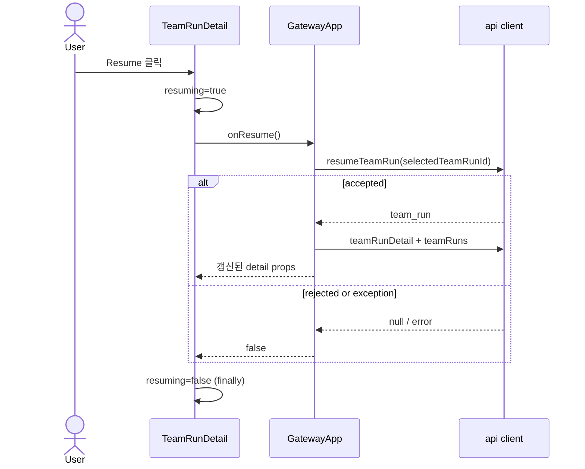

# TeamRunDetail Component Analysis

## 요약

- Root: `frontend/src/components/organisms/TeamRunDetail/index.jsx`
- Modes: `api-state`, `test`
- Verdict: 백엔드에 `interrupted` 상태와 명시적 `/resume` 계약을 먼저 추가한 뒤,
  `TeamRunDetail`은 API를 직접 호출하지 않는 organism 경계를 유지하면서 `onResume` callback과
  로컬 제출 상태만 추가하는 것이 최소 프런트엔드 변경이다.

## 범위

| Item | Path | Notes |
| --- | --- | --- |
| Root | `frontend/src/components/organisms/TeamRunDetail/index.jsx` | 상태별 상세 화면과 사용자 action callback 호출 |
| Parent | `frontend/src/components/containers/GatewayApp/index.jsx` | API 호출, 상세·목록 갱신, toast 소유 |
| API client | `frontend/src/api/client.js` | Team Run HTTP method 소유 |
| Status atom | `frontend/src/components/atoms/StatusBadge/index.jsx` | status label·tone fallback 소유 |
| Unit test | `frontend/src/components/organisms/TeamRunDetail/TeamRunDetail.test.jsx` | 로컬 상태와 callback 계약 검증 |
| Integration test | `frontend/src/components/containers/GatewayApp/GatewayApp.test.jsx` | 실제 fetch 경로와 갱신 검증 |
| API client test | `frontend/src/api/client.test.js` | request method/path 검증 |
| Status test | `frontend/src/components/atoms/StatusBadge/StatusBadge.test.jsx` | label·class·dot 정책 검증 |
| Backend state | `src/personal_agent_gateway/teams.py` | TeamRunStatus와 영속 상태 전환 소유 |
| Backend API | `src/personal_agent_gateway/api/team_runs.py` | start/add-work/cancel 및 신규 resume route 소유 |
| Backend runtime | `src/personal_agent_gateway/team_runtime.py` | pending Task 재실행과 synthesis 소유 |
| Backend tests | `tests/test_teams.py`, `tests/test_api_team_runs.py`, `tests/test_team_runtime.py` | 중단 정규화와 resume lifecycle RED 사례 |
| Shared leaves | `StatusBadge`, `Button`, `TeamTaskCard` | 공개 props만 확인 |

## API / State 흐름

현재 root는 `detail`과 `onAddWork`를 props로 받고 API를 직접 import하지 않는다
(`TeamRunDetail/index.jsx:156`). Add work 입력, dialog, 제출 여부, 선택 Task를 `useState`로
관리한다(`TeamRunDetail/index.jsx:157-160`). 제출 시 정리된 문자열을 `onAddWork`에 전달하고,
반환값이 `false`일 때 dialog와 입력을 유지한다(`TeamRunDetail/index.jsx:379-392`).

부모 `GatewayApp`은 `handleAddWork`에서 `api.addWork`를 호출하고 성공 시
`api.teamRunDetail`을 다시 조회하며 toast를 표시한다
(`GatewayApp/index.jsx:815-829`). 선택 Run의 SSE `team.*` 이벤트도 부모가 상세를 다시 조회한다
(`GatewayApp/index.jsx:252-263`). 따라서 Resume도 같은 경계를 따라야 한다.

### 상태별 파생값 영향

- `phaseIndex`는 알 수 없는 status를 `0`으로 반환하므로 새 `interrupted`를 Planning으로
  잘못 표시한다(`TeamRunDetail/index.jsx:16-19`). `interrupted`에서는 활성 phase를 없애는
  명시적 분기가 필요하다.
- `canAddWork`는 `draft`만 제외하므로 현재 식에 `interrupted`가 들어오면 Add work가 노출된다
  (`TeamRunDetail/index.jsx:176`). 수동 Resume 정책을 지키려면 중단 상태를 제외해야 한다.
- Resume 제출 상태는 Add work dialog의 `submitting`과 다른 action이다. 한 boolean을 공유하면
  dialog submit과 toolbar Resume이 불필요하게 결합되므로 별도 `resuming` 상태가 더 명확하다.

## 외부 의존성과 소유권

| Dependency | 현재 역할 | Resume 변경 원칙 |
| --- | --- | --- |
| React `useState` | dialog/입력/선택/제출 transient state | `resuming`만 root에 추가 |
| `StatusBadge` | `run.status` 표시 | atom label에 `interrupted` 추가 |
| `Button` | toolbar 및 dialog command | Resume에도 재사용 |
| `GatewayApp` | API, toast, 상세 및 목록 state 소유 | `handleResumeTeamRun` 추가 |
| `api` client | fetch contract 소유 | `POST /resume` method 추가 |

새 component나 data hook은 필요하지 않다. 기존 organism → container callback 방향이 API 의존성을
이미 격리하고 있다. 이는 `frontend/src/components/references/organisms.md`의 TeamRunDetail 경계와
일치한다.

다만 프런트 계약의 선행 조건은 백엔드 변경이다. 현재 `TeamRunStatus`에는 `interrupted`가 없고
(`teams.py:12-21`), Team Runs router에는 `/resume` route가 없다
(`api/team_runs.py:65-134`). 현재 `TeamRuntime.resume`은 Add work가 terminal Run을 다시 여는 내부
경로에서만 호출된다(`team_runtime.py:256-281`, `api/team_runs.py:104-118`). 구현은 먼저 stale 활성
Run의 정규화와 `interrupted`에서만 허용되는 `/resume` route, registry 등록·정리를 테스트한 다음
프런트 callback을 연결해야 한다.

## 테스트 / Stories

관련 story 파일은 `rg --files frontend/src` 검색에서 확인되지 않았다. 현재 검증은 세 계층이다.

- `TeamRunDetail.test.jsx`: Add work 열기/제출/진행 중 비활성화, phase 표시, task document dialog,
  지원하지 않는 mode와 draft에서 Add work 숨김을 검증한다. `onAddWork`가 `false`를 반환할 때
  dialog/input을 유지하는 unit 사례는 없다.
- `GatewayApp.test.jsx`: Add work의 fetch 경로, 성공 후 상세 갱신, API 실패 시 dialog 유지를
  integration 수준에서 검증한다.
- `client.test.js`: `addWork`와 `teamRunDetail`의 request/response contract를 검증한다.
- `StatusBadge.test.jsx`: planning/completed/running 및 여러 공용 상태 label/class, unknown status의
  `IDLE` fallback을 검증하지만 `interrupted`는 없다.
- 백엔드 테스트에는 background start, user cancel, terminal Add work resume, runtime의 pending Task
  resume는 있으나 stale 활성 Run 정규화와 공개 `/resume` route 사례는 없다.

구현 전에 추가할 RED 사례:

1. `interrupted` detail에서 `Resume`만 보이고 `Add work`는 보이지 않는다.
2. Resume 클릭 중 버튼이 비활성화되고 `onResume`이 한 번 호출된다.
3. `interrupted`일 때 어느 phase에도 `aria-current="step"`이 없다.
4. `StatusBadge`가 `INTERRUPTED` label, warning class, dot 정책을 명시적으로 표시한다.
5. API client가 `POST /api/team-runs/{id}/resume`을 호출한다.
6. `GatewayApp`이 성공 후 detail과 list를 모두 갱신하고 실패 toast를 표시한다.
7. `onAddWork`가 `false`를 반환할 때 organism dialog와 입력값이 유지된다.
8. 백엔드가 stale 활성 Run을 `interrupted`로 정규화하고 `in_progress` Task만 재대기한다.
9. `/resume`은 `interrupted`에서만 registry background Task를 등록하고 중복 요청을 `409`로 막는다.

## 권장 후속 작업

1. 백엔드 `TeamRunStatus`, interruption 정규화, `/resume` route와 registry lifecycle RED 사례를
   먼저 추가한다.
2. `TeamRunDetail`에 optional `onResume` prop과 `resuming` 로컬 상태를 추가한다.
3. `run.status === "interrupted"`일 때만 Resume 안내/버튼을 렌더하고 Add work를 숨긴다.
4. 부모 `GatewayApp`에 API 호출과 detail/list 갱신을 유지해 organism의 API 비의존 경계를 보존한다.
5. 새 component를 만들지 말고 기존 `Button`과 `StatusBadge`를 확장한다.
6. 위 아홉 RED 사례를 구현 전 추가한다.

## 스킬 핸드오프

- `component-pattern`: 기존 organism/container 경계와 카탈로그 props 설명을 갱신한다.
- `vercel-react-best-practices`: API 호출은 event handler에서 수행하고 Resume 관련 파생 상태를
  effect로 복제하지 않는다.

## 리뷰

- Verdict: `PASS`
- Rounds: 2
- Fixed: backend resume 계약과 RED 범위 추가, Add work 실패 coverage 위치 교정,
  `StatusBadge` source/test 추가, diagram을 `resuming` 및 실패/finally 흐름으로 교정.
  root `package.json`과 `docs:registry` script가 없어 registry 갱신은 건너뜀.

## 근거

- `rg -n "TeamRunDetail|onAddWork|handleAddWork|addWork|teamRunDetail" frontend/src`
- `rg -n "TeamRunDetail|Add work|phase|status" frontend/src/components/organisms/TeamRunDetail/TeamRunDetail.test.jsx frontend/src/components/containers/GatewayApp/GatewayApp.test.jsx frontend/src/api/client.test.js`
- `frontend/src/components/references/atoms.md`
- `frontend/src/components/references/organisms.md`
- `frontend/src/components/atoms/StatusBadge/index.jsx`
- `frontend/src/components/atoms/StatusBadge/StatusBadge.test.jsx`
- `src/personal_agent_gateway/teams.py`
- `src/personal_agent_gateway/api/team_runs.py`
- `src/personal_agent_gateway/team_runtime.py`
- `tests/test_teams.py`
- `tests/test_api_team_runs.py`
- `tests/test_team_runtime.py`
