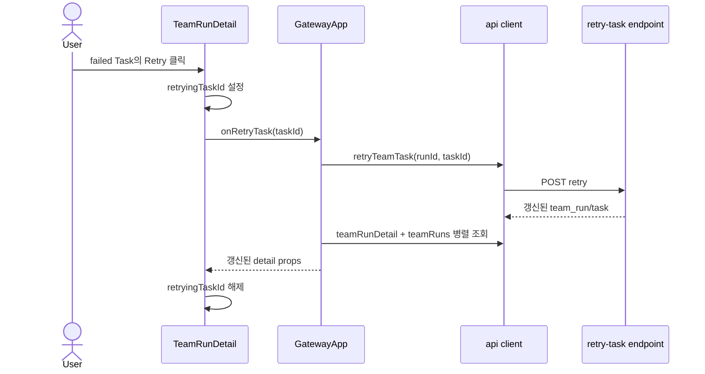

# TeamRunDetail Retry Component Analysis

## 요약

- Root: `frontend/src/components/organisms/TeamRunDetail/index.jsx`
- Modes: `api-state`, `test`
- Verdict: API 호출은 `GatewayApp`이 소유하고 `TeamRunDetail`은 비동기 callback의 진행 상태만 소유하는 기존 경계가 명확하다. 실패 Task 재시도도 `onRetryTask(taskId)`를 추가해 같은 패턴으로 구현하는 것이 안전하다.

## 범위

| Item | Path | Notes |
|---|---|---|
| Root | `frontend/src/components/organisms/TeamRunDetail/index.jsx` | task board, task dialog, Resume/Add work UI |
| Parent | `frontend/src/components/containers/GatewayApp/index.jsx` | 선택된 run ID와 API 호출·상세 재조회 소유 |
| API client | `frontend/src/api/client.js` | team-run HTTP adapter |
| Component tests | `frontend/src/components/organisms/TeamRunDetail/TeamRunDetail.test.jsx` | Resume/Add work/task dialog 상태 검증 |
| Container tests | `frontend/src/components/containers/GatewayApp/GatewayApp.test.jsx` | API 호출과 상세·목록 갱신 검증 |
| Client tests | `frontend/src/api/client.test.js` | 요청 method/path와 응답 unwrap 검증 |
| Team service/API tests | `tests/test_teams.py`, `tests/test_api_team_runs.py` | 원자적 상태 전이와 HTTP/registry 경합 검증 위치; 현재 task retry coverage와 endpoint는 없음 |
| Runtime tests | `tests/test_team_runtime.py` | pending Task 실행과 worker round-robin, Resume 흐름 검증 |

## API와 상태 흐름

### 현재 흐름

`onAddWork`는 dialog의 `submitting`을 설정하고 callback 반환값이 `false`가 아니면 입력/dialog를 닫는다. 부모 `handleAddWork`는 `api.addWork` 후 `api.teamRunDetail`을 재조회하고 toast와 boolean을 반환한다 (`TeamRunDetail/index.jsx:398-425`, `GatewayApp/index.jsx:815-830`).

`onResume`은 `resuming` 동안 버튼을 비활성화한다. 부모 `handleResumeTeamRun`은 confirm 승인 후 `api.resumeTeamRun`을 호출하고 detail/runs를 `Promise.all`로 갱신한 뒤 toast와 boolean을 반환한다. client는 응답의 `team_run`을 unwrap한다 (`TeamRunDetail/index.jsx:248-267`, `GatewayApp/index.jsx:832-858`, `api/client.js:222-225`). 현재 GatewayApp 테스트는 확인 후 성공·재조회만 검증하며 취소·409·API 실패 coverage는 없다.

`detail` prop은 목록에서 run을 선택하면 `selectedTeamRunId` effect가 `api.teamRunDetail`을 호출해 유입된다. 선택된 run에 대한 `team.*` SSE도 같은 detail을 재조회한다 (`GatewayApp/index.jsx:260-264,359-371`). Proposed retry endpoint는 `team.task.updated`를 발행해 다른 열린 클라이언트를 갱신하되, 요청한 화면은 응답 직후 detail/runs를 명시적으로 갱신한다. 같은 화면에서 SSE 재조회가 한 번 더 발생할 수 있지만 둘 다 동일 서버 상태의 idempotent GET이며, API 성공 직후 UI 전환을 보장하기 위해 명시적 refresh를 유지한다.

### 제안 Retry 흐름

아래는 현재 배선이 아니라 구현할 proposed flow다.

현재 `TeamRunDetail`은 `workInput`, `submitting`, `resuming`, `workDialogOpen`, `selectedTaskId`만 로컬로 보유한다. Retry도 API나 toast를 organism에 넣지 않고 `retryingTaskId`만 추가해야 동일한 소유권을 유지한다.

Retry 노출 조건은 `run.status`가 `completed_with_failures` 또는 `failed`이고 선택 Task가 `failed`이며 `onRetryTask`가 있을 때다. 사용자 의도로 중단한 `canceled`, 실패 Task가 없는 `completed`, active/interrupted run은 제외한다. 실행 중 run에서 실패 Task를 pending으로 바꾸면 registry 작업과 경합하므로 UI와 API 양쪽에서 차단해야 한다. 클릭 후 해당 Task만 disabled/`Retrying...` 처리하며 다른 Task UI는 유지한다.

서버 성공 후 run은 `interrupted`, Task는 `pending`이 되고 사용자가 기존 `Resume` 버튼으로 실행을 시작하는 2단계 흐름을 사용한다. 현재 계획/추가 Task는 `owner_agent_id` 없이 생성될 수 있고 `_execute`가 pending Task에 worker를 round-robin으로 선택하므로, UI는 담당 agent를 가정하지 않는다 (`team_runtime.py:123-143`, `teams.py:296`). Retry service는 한 DB transaction에서 Task의 `result`, `error_message`, `started_at`, `finished_at`을 비우고 run의 stale `summary`, `error_message`, `finished_at`을 비워 `interrupted`로 만든다. 개별 `set_*_status`는 retry reset을 완전히 수행하지 않으므로 새 service method가 필요하다. agent 상태는 retry 단계에서 임의 변경하지 않고 Resume 실행 시 runtime이 실제 선택한 worker를 `running`으로 설정한다.

## 테스트와 누락 시나리오

기존 component 테스트는 Add work submit/비활성화, terminal label, task 문서 dialog, interrupted Resume callback을 검증한다. `GatewayApp`은 Resume의 confirm 승인 후 성공·재조회만 검증하고, API client는 resume path/method를 검증한다. Backend에는 retry endpoint/service/test가 없다. Story 파일도 없다.

추가할 RED/회귀 테스트:

1. terminal run의 failed Task dialog에만 Retry가 노출된다.
2. Retry 클릭은 정확한 task ID를 callback에 전달하고 처리 중 버튼을 비활성화한다.
3. callback이 `false`를 반환하거나 예외가 발생해도 진행 상태가 해제된다.
4. active/interrupted run, completed Task에는 Retry가 노출되지 않는다.
5. `GatewayApp`은 사용자 확인 후 retry endpoint를 호출하고 detail/runs를 병렬 갱신한다.
6. confirm 취소 시 API·refresh·toast가 발생하지 않는다. 409/API 실패 시에는 상태를 바꾸지 않고 오류 toast를 표시한다.
7. API client가 `POST /api/team-runs/{runId}/tasks/{taskId}/retry`를 호출한다.
8. service는 failed Task와 run을 한 transaction에서 완전히 reset하고 다른 Task를 보존한다.
9. active/interrupted/completed/canceled run, non-failed Task, registry 실행 중, 중복 요청은 409로 거부한다.
10. retry 성공 후 기존 Resume endpoint가 pending Task 하나만 실행한다.

## 권장 후속 작업

1. `TeamRunDetail`에 optional `onRetryTask(taskId)`와 `retryingTaskId`를 추가하고 기존 task dialog에 `Button`을 재사용한다.
2. `GatewayApp`에 confirm/API/refresh/toast handler를 추가한다. 독립 조회인 detail/runs는 `Promise.all`로 유지한다.
3. API는 `completed_with_failures`/`failed` run의 failed Task만 service-level transaction으로 원복하고 run을 `interrupted`로 바꾸며 자동 실행하지 않는다. 응답은 `{ team_run, task }`로 고정한다.
4. 위 component/container/client 및 backend service/API 테스트를 먼저 실패시키고 최소 구현으로 통과시킨다.

## 스킬 핸드오프

- React 변경은 기존 callback 경계를 유지하고 새 추상화를 만들지 않으며 `vercel-react-best-practices`의 병렬 독립 fetch 원칙을 적용한다.
- timeout·프로세스 수명주기 변경은 이 컴포넌트 분석 범위 밖이며 backend model-client 테스트로 별도 검증한다.

## 리뷰

- Verdict: PASS
- Rounds: 3
- Fixed: 1차에서 현재/proposed 흐름, 실제 state·API, owner 없는 Task, 원자적 reset과 backend 테스트를 보완했다. 2차에서 detail effect/SSE 재조회와 retry event 관계, confirm 취소의 무부수효과를 보완했으며 3차 검토에서 통과했다.

## 근거

- `rg -n "onAddWork|onResume|handleResumeTeamRun|teamRunDetail|resumeTeamRun" frontend/src`
- `frontend/src/components/organisms/TeamRunDetail/index.jsx:119-425`
- `frontend/src/components/containers/GatewayApp/index.jsx:815-858,961-965`
- `frontend/src/api/client.js:219-244`
- `frontend/src/components/organisms/TeamRunDetail/TeamRunDetail.test.jsx`
- `frontend/src/components/containers/GatewayApp/GatewayApp.test.jsx`
- `frontend/src/api/client.test.js`
- `src/personal_agent_gateway/team_runtime.py:123-143`
- `src/personal_agent_gateway/teams.py:155-244,252-364`
- `src/personal_agent_gateway/api/team_runs.py`
- `tests/test_teams.py`, `tests/test_api_team_runs.py`, `tests/test_team_runtime.py`
