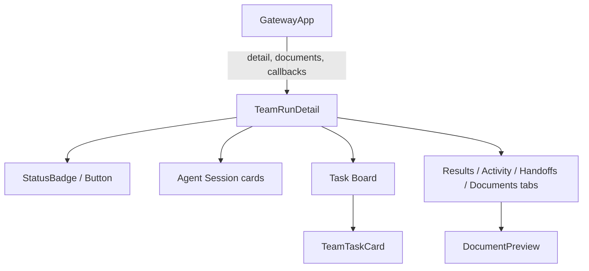
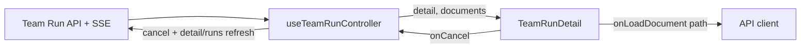
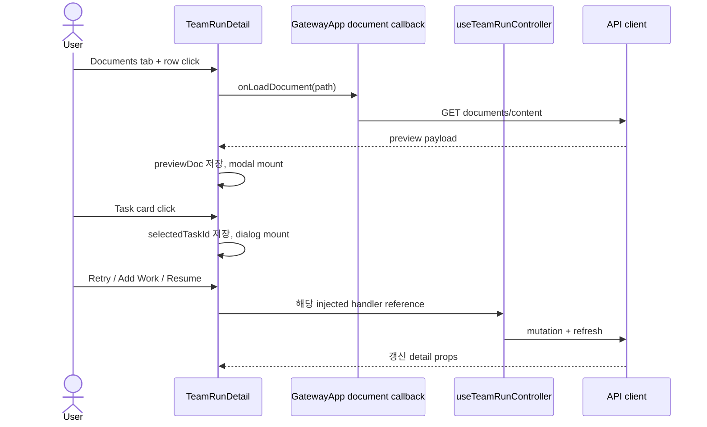
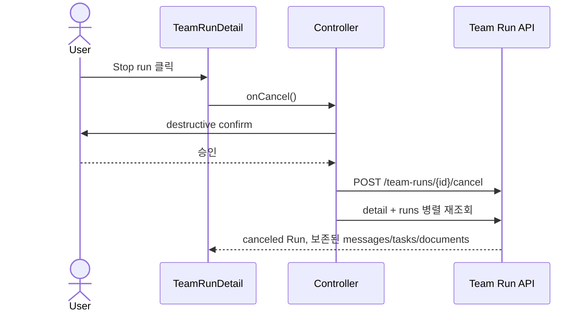

# TeamRunDetail PG-1 Component Analysis

## 요약

- Root: `frontend/src/components/organisms/TeamRunDetail/index.jsx`
- Modes: `understand`, `api-state`, `style`, `test`
- Proposed verdict: 기존 `detail`/callback 경계를 유지하면서 파생 목록 정렬, Task 담당자 이름, Agent 현재 업무 fallback, 문서 미리보기, `onCancel`을 추가하는 것이 가장 작은 변경이다.
- 성능 판단: 메시지·Task·문서 배열은 한 Run의 화면 데이터이므로 render 중 복사 정렬로 충분하다. 새 전역 store, memoization, 개별 Persona 조회는 필요하지 않다.

## 범위

| 항목 | 경로 | 비고 |
| --- | --- | --- |
| Root | `frontend/src/components/organisms/TeamRunDetail/index.jsx` | Agent Sessions, Task Board, Results/Activity/Handoffs/Documents |
| Child | `frontend/src/components/molecules/TeamTaskCard/index.jsx` | Task 담당 Persona 표시 |
| Child | `frontend/src/components/organisms/DocumentPreview/index.jsx` | md/json/text/html/image preview |
| Parent/controller | `frontend/src/components/containers/GatewayApp/index.jsx`, `frontend/src/hooks/useTeamRunController.js` | 선택 Run, API mutation, SSE delta 소유 |
| API adapter | `frontend/src/api/client.js` | document content(current), cancel(proposed) |
| Backend API | `src/personal_agent_gateway/api/team_runs.py:287-307` | existing cancel route와 registry cancellation |
| Style | `src/personal_agent_gateway/static/styles.css` | `.team-*`, `.doc-preview*` 전역 feature style |
| Tests | `TeamRunDetail.test.jsx`, `DocumentPreview.test.jsx`, `GatewayApp.test.jsx`, `api/client.test.js` | component/API wiring 회귀 gate |

## 컴포넌트 트리

Agent lane, tab panel, handoff group은 별도 React 컴포넌트가 아니라 root 내부 DOM 영역이다. `TeamTaskCard`와 `DocumentPreview`는 PG-1에서 public prop/data shape가 바뀌므로 범위에 포함한다.

## Props와 상태 흐름

| 입력/상태 | 소유자 | UI 영향 |
| --- | --- | --- |
| `detail.run/agents/tasks/messages` | controller/server | phase, session, board, tab content |
| `documents` | controller/server | Documents list와 badge |
| `onLoadDocument` | parent callback | 선택 문서의 content/preview metadata 로드 |
| proposed `onCancel` | parent callback | active Run 강제 종료 |
| `activeTab`, `previewDoc`, dialog/progress state | TeamRunDetail | 화면 전용 임시 상태 |

현재 `applyTeamRunDelta`는 run/task만 merge한다. backend가 Task 시작·종료와 함께 agent의 `current_task_id`를 발행하면 controller가 `event.agent`도 id 기준 merge해야 Agent Session이 재조회 없이 현재 업무를 표시한다. HTTP, confirm, toast는 기존 Resume/Retry처럼 controller가 소유하고 organism은 `canceling` 버튼 상태만 소유한다.

### 외부 primitive와 주입 동작

| primitive/action | 여기서 하는 일 | 사용하는 이유 / 유입 경로 |
| --- | --- | --- |
| React `useState` | dialog, tab, preview, mutation pending 상태를 Run 상세 인스턴스에 한정 | 서버 read model과 화면 임시 상태를 섞지 않기 위함 |
| `StatusBadge` | Run/Agent status 문자열을 공통 badge로 표시 | atom의 기존 status 표현 재사용 |
| `Button` | Resume, Add work, Retry와 proposed Stop action | pending/variant 계약을 공통 적용 |
| `TeamTaskCard` | board의 Task title, owner, document count를 click target으로 표시 | Task column 안 반복되는 molecule |
| `DocumentPreview` | 선택 document payload의 modal preview | preview kind별 표현 경계 분리 |
| `fmtDateTime` | run/message timestamp를 공통 축약 형식으로 표시 | 앱 전체 날짜 표시 규칙 재사용 |
| native `<button role="tab">` | detail panel 전환과 `aria-selected` 제공 | keyboard 가능한 기본 control semantics 유지 |

Custom hook, context selector, store dispatch는 root 안에서 직접 사용하지 않는다. 외부 주입 callback은 다음과 같다.

| callback | 호출 trigger | 실제 소유자 |
| --- | --- | --- |
| `onLoadDocument(path)` | Documents row click | `GatewayApp` inline callback → `api.teamDocumentContent(selectedTeamRunId, path)` |
| `onAddWork(instruction)` | Add Work dialog submit | `useTeamRunController.handleAddWork` |
| `onResume()` | interrupted banner toolbar Resume | `useTeamRunController.handleResumeTeamRun` |
| `onRetryTask(taskId)` | failed Task dialog Retry | `useTeamRunController.handleRetryTeamTask` |
| proposed `onCancel()` | active Run toolbar Stop | `useTeamRunController.handleCancelTeamRun` |

### 로컬 state / effects

| state | 변경 trigger | 영향 |
| --- | --- | --- |
| `workInput` | textarea change / 성공 submit | Add Work payload |
| `submitting` | Add Work submit promise | dialog close 차단과 button disabled |
| `resuming` | Resume callback promise | Resume disabled/label |
| `retryingTaskId` | Retry callback promise | 선택 Task Retry disabled/label |
| `workDialogOpen` | Add Work/close/success | AddWorkDialog mount |
| `selectedTaskId` | Task card/close | TaskDetailDialog mount와 reports lookup |
| `previewDoc` | document load/close | DocumentPreview mount |
| `activeTab` | tab click | panel mount |
| proposed `canceling` | Stop callback promise | Stop disabled/label |

Effect, memo, reducer는 없다. `agents/tasks/messages`에서 owner, current task, reports를 render 중 파생한다.

## 파생 데이터와 상호작용

- Results: `agent_output`을 고른 뒤 `(created_at, id)` 내림차순으로 복사 정렬한다.
- Live Activity: 전체 message를 같은 규칙으로 내림차순 정렬한다.
- Shared/Handoffs: 원본 오름차순 message에서 query/answer를 먼저 짝지은 뒤 `answer.created_at || query.created_at`과 id 기준으로 pair group만 내림차순 정렬한다. 먼저 message를 뒤집으면 query-answer index pairing이 깨진다.
- Documents: 서버가 지원 문서만 안정적인 최신순으로 반환하므로 UI는 응답 순서를 보존한다.
- Task owner: `owner_agent_id`로 Run snapshot agent를 찾고 avatar/initials와 실제 이름을 함께 표시한다. null이면 `UNASSIGNED`를 표시한다.
- Agent current work: member는 `current_task_id`의 Task title, leader는 current task가 없고 active일 때 Run phase별 `Planning tasks`, `Coordinating agents`, `Summarizing results` fallback을 표시한다. terminal/idle은 기존 `No active task`를 유지한다.

기존 주요 상호작용은 다음과 같다.

1. tab button click은 `activeTab`을 바꾸고 선택 panel만 mount한다. 서버 mutation은 없다.
2. Documents row click은 `onLoadDocument(doc.path)`를 await한 뒤 반환 payload를 `previewDoc`에 저장하여 `DocumentPreview`를 mount한다. callback은 parent의 선택 Run id를 함께 사용해 current content endpoint를 호출한다.
3. Task card click은 `selectedTaskId`를 저장해 Task dialog를 열고, 실패 Task Retry는 `onRetryTask(task.id)`를 await하는 동안 `retryingTaskId`로 해당 action을 비활성화한다.
4. Add Work는 dialog input을 `onAddWork(trimmed)`에 전달하고 성공 시 input/dialog를 정리한다. Resume은 `onResume()` promise 동안 toolbar button을 비활성화한다.

Stop은 `planning`, `running`, `summarizing`에서만 노출한다. 확인 문구는 산출물은 보존되고 실행 중 프로세스만 종료됨을 명시하며, pending 동안 버튼을 비활성화한다.

## API / state 경계

| 흐름 | 현재 동작 | PG-1 영향 |
| --- | --- | --- |
| Run 선택 | `selectedTeamRunId` effect가 detail과 documents를 독립 GET하고 각각 state에 저장 | 유지; 두 요청은 서로 의존하지 않음 |
| SSE | 선택 Run의 `event.run`/`event.task` delta는 local merge, delta가 없거나 terminal event면 detail/documents full refresh | `event.agent`도 id merge하고 start/finish를 즉시 반영 |
| Add Work | `POST add-work` 후 detail refresh, success/error toast | 유지 |
| Resume | confirm → `POST resume` → detail/runs `Promise.all` → toast | Stop과 동일한 controller mutation pattern의 근거 |
| Retry | confirm → `POST tasks/{task}/retry` → detail/runs `Promise.all` → toast | 유지 |
| Cancel backend | `POST /api/team-runs/{id}/cancel` route와 runtime registry cancellation이 이미 존재 | client/controller/organism wiring만 추가; 성공 후 detail/runs 병렬 refresh |

`teamRunDetail`, `teamRunDocuments`, `selectedTeamRunId`는 `useTeamRunController`가 소유한다. `GatewayApp`은 반환된 state/handler를 `TeamRunDetail`에 주입한다. selection effect 오류는 `setScreenError`, mutation 오류는 toast로 처리하는 기존 정책을 유지한다. Stop confirm 취소는 API/state 변경 없이 `false`를 반환해야 한다.

## 문서 미리보기와 보안

`DocumentPreview`는 서버 kind를 기준으로 분기한다.

| kind | 표현 | 제약 |
| --- | --- | --- |
| `md` | 기존 MarkdownContent | 기존 sanitization 경계 유지 |
| `json`, text/code | 기존 `<pre>` | UTF-8 content만 서버가 허용 |
| `image` | `` | 인증된 image-only endpoint, server MIME, `nosniff` |
| `html` | `<iframe sandbox="">` + `srcDoc` | CSP `default-src 'none'`; script/form/network/navigation 차단 |

HTML은 raw code 대신 렌더링하되 `allow-scripts`, `allow-same-origin`, popup/form 권한을 주지 않는다. 외부 URL을 직접 iframe `src`로 사용하지 않는다. Image는 임의 파일 endpoint가 아니라 서버가 허용한 raster 확장자만 제공한다.

## 스타일 / 레이아웃

- `.team-task-meta` 안 owner 표현을 avatar + visible name chip으로 확장하되 카드의 click target과 문서 count를 유지한다.
- `.team-lane-task`는 한두 줄에서 긴 Task title이 카드 밖으로 넘지 않도록 wrap한다.
- `.doc-preview-body` 안 image와 iframe은 modal 너비를 넘지 않게 하고 iframe에는 명시적 높이/배경을 둔다.
- Agent Sessions toolbar의 Stop은 기존 shared `Button` destructive variant를 사용한다.
- 기존 전역 style 구조를 유지하고 새 class는 `.team-*`/`.doc-preview-*` 범위에만 추가한다.

## 테스트

추가할 RED/회귀 시나리오:

1. Results와 Activity가 created_at/id 최신순으로 표시된다.
2. Handoff query-answer pairing은 유지되고 pair group만 최신순이다.
3. Task owner는 avatar/initials와 이름을 표시하고 null이면 `UNASSIGNED`다.
4. Agent는 current Task title을 표시하며 leader는 phase fallback을 표시한다.
5. image는 ``, html은 sandbox/CSP iframe으로 미리보기되고 raw `<pre>`가 아니다.
6. active Run에만 Stop이 보이고 callback pending 동안 disabled다.
7. controller cancel은 confirm 후 API를 한 번 호출하고 detail/runs를 병렬 갱신한다. 취소 시 mutation이 없다.
8. SSE agent delta가 기존 agent를 id 기준 merge한다.

Storybook은 없으므로 Vitest DOM/API tests를 gate로 사용한다. backend 통합 테스트는 별도 임시 workspace와 임시 DB를 생성하며 실제 Team Run/workspace는 사용하지 않는다.

기존 `TeamRunDetail.test.jsx`는 빈 상태, header/session/board/activity, Add Work의 submit/pending/terminal label, phase stepper, handoff/task document dialog, Resume, Retry, Documents markdown preview, tab 전환을 보호한다. `DocumentPreview.test.jsx`는 JSON pretty print, preview 불가, closed 상태를 보호한다. `GatewayApp.test.jsx`는 현재 run/task SSE delta를 보호하고 `api/client.test.js`는 documents content path를 보호한다. PG-1 항목은 이 기존 테스트를 유지한 채 위 RED case로 확장한다.

## 권장 구현 순서

1. component/client/controller RED tests를 추가한다.
2. 작은 정렬 helper와 leader fallback을 root 파일 안에 두고 파생값을 render에서 계산한다.
3. `TeamTaskCard`, `DocumentPreview`, style을 필요한 범위만 수정한다.
4. controller/client에 cancel과 agent delta merge를 추가한다.
5. component 전체 test와 production build를 실행한다.

## 스킬 핸드오프

- `vercel-react-best-practices`: 독립 refresh는 `Promise.all`, 단순 파생 배열은 render 중 계산, API mutation은 event handler에서 수행한다.
- 별도 컴포넌트 승격이나 상태 라이브러리는 요청 범위를 넘으므로 추가하지 않는다.

## 리뷰

- Verdict: PASS
- Rounds: 4
- Fixed: 기존 interaction과 API/state 흐름, current/proposed cancel 구분, GatewayApp document callback과 controller handler 경계, backend 근거를 보완한 뒤 독립 검토 통과

## 근거

- `frontend/src/components/organisms/TeamRunDetail/index.jsx:49,173-489`
- `frontend/src/components/molecules/TeamTaskCard/index.jsx`
- `frontend/src/components/organisms/DocumentPreview/index.jsx`
- `frontend/src/hooks/useTeamRunController.js:4-214`
- `frontend/src/components/containers/GatewayApp/index.jsx:700-708`
- `frontend/src/api/client.js:413-419`
- `src/personal_agent_gateway/static/styles.css:2651,2725-2726,3888-3896`
- `frontend/src/components/organisms/TeamRunDetail/TeamRunDetail.test.jsx`
- `frontend/src/components/organisms/DocumentPreview/DocumentPreview.test.jsx`
- `frontend/src/components/containers/GatewayApp/GatewayApp.test.jsx`
- `src/personal_agent_gateway/api/team_runs.py:287-307`
