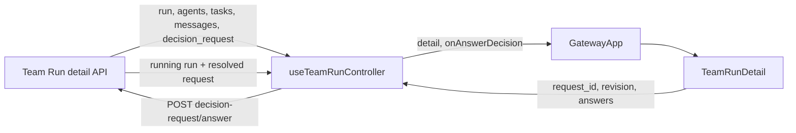
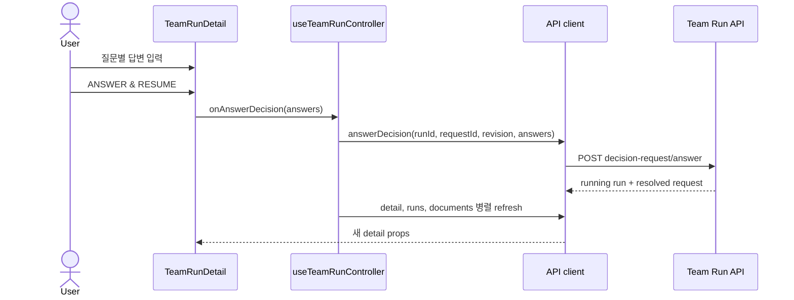

# TeamRunDetail User Decision Component Analysis

## 요약

- Root: `frontend/src/components/organisms/TeamRunDetail/index.jsx`
- Modes: `api-state`, `test`
- Verdict: 기존 `detail` read model과 injected callback 경계를 유지하며 `decision_request`와 `onAnswerDecision`만 추가하는 것이 가장 작은 변경이다. 새 전역 store나 독립 fetch effect는 필요하지 않다.

## 범위

| 항목 | 경로 | 비고 |
| --- | --- | --- |
| Root | `frontend/src/components/organisms/TeamRunDetail/index.jsx` | Run 상태별 action과 local pending state 소유 |
| Local children | `StatusBadge`, `Button`, `TeamTaskCard`, `DocumentPreview` | status/action/task/document 표현 leaf; public API 변경 없음 |
| Utility | `frontend/src/lib/time.js` | message와 Run timestamp의 `fmtDateTime` 표현 |
| Parent | `frontend/src/components/containers/GatewayApp/index.jsx` | controller state/handler를 component props로 전달 |
| Controller | `frontend/src/hooks/useTeamRunController.js` | 선택 Run detail, SSE delta, mutation toast/refresh 소유 |
| API adapter | `frontend/src/api/client.js` | Team Run detail과 mutation endpoint 호출 |
| Backend detail/API | `src/personal_agent_gateway/api/team_runs.py` | detail payload와 answer route 추가 지점 |
| Component tests | `frontend/src/components/organisms/TeamRunDetail/TeamRunDetail.test.jsx` | 상태별 action과 local submit behavior |
| Controller/container tests | `frontend/src/components/containers/GatewayApp/GatewayApp.test.jsx` | handler wiring과 SSE 갱신 회귀 |
| API tests | `frontend/src/api/client.test.js`, `tests/test_api_team_runs.py` | request body, stale revision, resume registry 계약 |

## API / state 추적

### 현재 경계

| 경계 | 실제 동작 | 근거 |
| --- | --- | --- |
| Run 선택 | controller effect가 detail과 documents를 각각 조회해 state에 저장 | `useTeamRunController.js:35-56` |
| Detail mapping | API adapter가 `team_run`, `agents`, `tasks`, `messages`, `document_summary`를 camelCase detail object로 만든다 | `api/client.js:355-378` |
| SSE | `event.run`, `event.task`, `event.agent` delta를 id 기준 merge하고 terminal/no-delta event는 detail/documents를 재조회한다 | `useTeamRunController.js:4-21,59-74` |
| Mutation | Resume, Cancel, Retry는 controller에서 API 호출 후 detail/runs를 `Promise.all`로 갱신한다 | `useTeamRunController.js:114-201` |
| UI | organism은 HTTP를 직접 호출하지 않고 callback promise 동안 local pending state만 소유한다 | `TeamRunDetail/index.jsx:203-243,298-343,547-583` |

현재 주입 callback은 모두 `GatewayApp` 또는 `useTeamRunController`가 실제 I/O를 소유한다.

| callback | trigger | 실제 I/O/상태 소유자 |
| --- | --- | --- |
| `onLoadDocument(path)` | Documents row click | `GatewayApp` inline callback → `api.teamDocumentContent` |
| `onAddWork(instruction)` | Add Work dialog submit | `useTeamRunController.handleAddWork` → add-work API, detail refresh |
| `onResume()` | interrupted Run의 Resume | controller confirm → resume API → detail/runs refresh |
| `onRetryTask(taskId)` | failed terminal Task dialog의 Retry | controller confirm → retry API → detail/runs refresh |
| `onCancel()` | active Run의 Stop run | controller confirm → cancel API → detail/runs refresh |

### 제안 변경

- backend detail payload에 active `decision_request`를 nullable field로 포함하고 API adapter가 `detail.decisionRequest`로 매핑한다.
- controller에 `handleAnswerDecision(answers)`를 추가한다. 현재 detail의 `request_id`와 `revision`을 함께 전송하고 성공 후 detail/runs/documents를 병렬 갱신한다.
- `TeamRunDetail`에는 `onAnswerDecision` prop만 추가한다. `run.status === "waiting_for_user"`와 `detail.decisionRequest.status === "awaiting_user"`가 모두 맞을 때 `INPUT NEEDED` panel을 렌더한다.
- question별 입력값과 `answering`은 panel 내부 local state로 둔다. 서버에서 파생 가능한 open item 수, submit 가능 여부, 추천 option은 별도 effect/state로 복제하지 않고 render 중 계산한다.
- `waiting_for_user`에서는 기존 `Add work`와 `Resume`을 숨기고 `Stop run`은 허용한다. Answer 성공이 resume 의사이므로 일반 Resume callback을 호출하지 않는다.
- `team.run.input_requested`는 run delta로 panel을 열고 full detail 재조회가 필요하다. 현재 `handleTeamEvent`의 terminal-only refresh 조건에 input event를 추가한다.

### component-pattern 판단

새 공유 component를 만들지 않는다. 이 panel은 Team Run decision request에만 의미가 있고 기존 `TeamRunDetail` 내부의 interrupted banner/action과 같은 상태 전용 UI다. 현재 repo는 catalog가 설명하는 Next.js/vanilla-extract 구조가 아니라 Vite JSX와 전역 `.team-*` style을 사용하므로 기존 로컬 패턴을 유지한다. 기존 `Button` atom을 재사용하고 native radio/textarea에는 label과 fieldset semantics를 제공한다.

## 테스트

### 기존 보호 범위

- `TeamRunDetail.test.jsx`는 empty detail, phase, Add work, interrupted Resume, failed Task Retry, Cancel, Documents, Results/Activity/Handoffs를 검증한다.
- `GatewayApp.test.jsx`는 Team Run event delta와 화면 wiring을 검증한다.
- `api/client.test.js`는 API adapter의 request/response mapping을 검증하는 위치다.
- `tests/test_api_team_runs.py`는 detail payload, mutation status gate, runtime registry registration을 검증한다.

### 추가할 RED 사례

1. `waiting_for_user`와 awaiting request에서 `INPUT NEEDED`, 질문 이유, 선택지 영향, 추천 표시가 보인다.
2. 모든 open question에 답하기 전에는 `ANSWER & RESUME`이 disabled다.
3. option answer와 free-text answer를 question ID map으로 한 번 전달하고 pending 동안 button이 disabled다.
4. waiting 상태에서는 Add work와 일반 Resume이 보이지 않고 Stop run은 보인다.
5. status는 waiting인데 active request가 없으면 깨진 form 대신 recoverable 안내를 표시한다.
6. API client가 request ID, revision, answers를 정확한 JSON body로 보낸다.
7. controller 성공 경로는 detail/runs/documents를 병렬 갱신하고 toast를 한 번 표시한다.
8. `team.run.input_requested` 수신 시 선택 Run detail을 다시 조회한다.
9. backend는 stale revision, 누락 답변, 중복 제출, non-waiting Run을 `409`로 거부한다.
10. 유효한 답변은 관련 blocked Task만 pending으로 바꾸고 registry resume을 하나만 등록한다.

Storybook은 없으므로 Vitest와 pytest를 회귀 gate로 사용한다. local input state는 서버 request가 바뀔 때 stale answer가 남을 수 있으므로 panel을 `request.id + revision` key로 remount하는 사례도 component test에 포함한다.

## 권장 후속 작업

1. backend persistence/API/runtime RED test를 먼저 추가해 `waiting_for_user` 상태와 CAS answer 계약을 고정한다.
2. detail payload와 API adapter를 연결한 뒤 controller mutation/SSE refresh를 추가한다.
3. `TeamRunDetail`에 decision panel을 로컬 함수 component로 추가하고 기존 action visibility를 좁힌다.
4. component/API/backend test와 frontend production build를 실행한다.

## 스킬 핸드오프

- `component-pattern`: 새 global component를 만들지 않고 기존 organism 내부의 feature-specific panel로 유지하며 `Button`을 재사용한다.
- `vercel-react-best-practices`: 독립 refresh는 `Promise.all`, submit 가능 여부는 render 중 파생하고 mutation은 click handler에서 수행한다.
- 추가 refactor나 component promotion은 이번 기능에 필요하지 않다.

## 리뷰

- Verdict: PASS
- Rounds: 2
- Fixed: 1차 독립 코드 재검증에서 누락된 local child/utility와 기존 callback별 I/O 소유권을 보완했고, 2차에서 root import, callback trigger, controller/API mapping, 기존 test inventory와 제안 흐름을 다시 대조해 blocker가 없음을 확인했다.

## 근거

- `frontend/src/components/organisms/TeamRunDetail/index.jsx:1-583`
- `frontend/src/components/organisms/TeamRunDetail/TeamRunDetail.test.jsx:1-333`
- `frontend/src/components/atoms/StatusBadge/index.jsx`
- `frontend/src/components/atoms/Button/index.jsx`
- `frontend/src/components/molecules/TeamTaskCard/index.jsx`
- `frontend/src/components/organisms/DocumentPreview/index.jsx`
- `frontend/src/components/containers/GatewayApp/index.jsx:22,739-749`
- `frontend/src/hooks/useTeamRunController.js:4-21,35-74,114-201,235-254`
- `frontend/src/api/client.js:312-426`
- `src/personal_agent_gateway/api/team_runs.py:94-120,163-199,242-315,651-719`
- `tests/test_api_team_runs.py`
