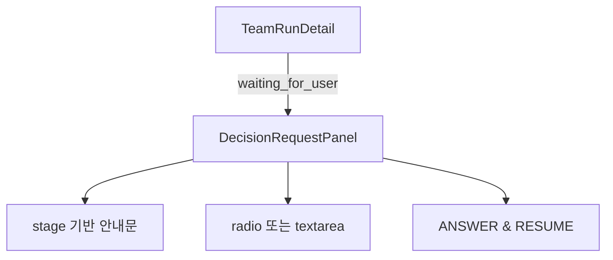

# TeamRunDetail Leader Decision Stage Analysis

## 요약

- Root: `frontend/src/components/organisms/TeamRunDetail/index.jsx`
- Modes: `api-state`, `test`
- Verdict: backend decision item의 `stage`를 별도 state나 API mapping 없이 읽어 `DecisionRequestPanel` 안내문만 단계별로 파생하는 것이 가장 작은 변경이다.

## 범위

| Item | Path | Notes |
|---|---|---|
| Root | `frontend/src/components/organisms/TeamRunDetail/index.jsx` | `DecisionRequestPanel`과 waiting 상태 렌더링 |
| Component test | `frontend/src/components/organisms/TeamRunDetail/TeamRunDetail.test.jsx` | decision batch 입력·제출·복구 안내 |
| API adapter | `frontend/src/api/client.js` | backend `decision_request`를 `decisionRequest`로 전달 |
| Controller | `frontend/src/hooks/useTeamRunController.js` | request ID/revision/answers 제출과 detail 재조회 |
| Container | `frontend/src/components/containers/GatewayApp/index.jsx` | `onAnswerDecision` callback 연결 |
| Backend payload | `src/personal_agent_gateway/api/team_runs.py` | decision item을 포함한 request payload |

## 컴포넌트 트리



## API / state 추적

```mermaid
flowchart LR
  Backend[decision_request.items[].stage] --> Client[api.teamRunDetail]
  Client --> Controller[useTeamRunController detail]
  Controller --> Container[GatewayApp]
  Container --> Detail[TeamRunDetail]
  Detail --> Panel[DecisionRequestPanel]
  Panel -->|answers| Controller
  Controller -->|request id + revision + answers| Backend
```

- `api.teamRunDetail`은 `body.decision_request`를 필드별 변환 없이 `decisionRequest`로 전달하므로 `items[].stage`는 보존된다.
- `TeamRunDetail`은 `run.status === "waiting_for_user"`이고 request status가 `awaiting_user`일 때만 panel을 렌더한다.
- `DecisionRequestPanel`은 `answers`와 `submitting`만 local state로 소유한다. `stage` 안내문은 `request.items`에서 render 중 파생할 수 있어 새 state/effect가 필요 없다.
- submit은 기존처럼 `onAnswerDecision(answers)`를 호출하고, controller가 현재 request의 ID/revision을 API에 전달한 뒤 detail/runs/documents를 재조회한다. 안내문 변경은 mutation 계약에 영향을 주지 않는다.
- 신규 `planning`과 `synthesis` item은 `blocking_task_ids`가 비어 있을 수 있으므로 기존 문구의 “blocked tasks resume”는 정확하지 않다.

## 테스트

### 기존 보호 범위

- `collects every pending user decision...`는 Worker/task 질문에서 추천, 전체 답변 필수, batch submit, Add work/Resume 숨김, Stop run 유지를 검증한다.
- `shows a recoverable message...`는 waiting 상태에서 active request가 없을 때 복구 안내를 검증한다.
- API client/controller/backend 테스트는 request ID/revision과 답변 후 자동 재개를 검증한다.

### 추가할 회귀 사례

1. `items[].stage === "planning"`이면 작업 시작 전 계획 결정을 요청한다는 안내가 보인다.
2. `items[].stage === "synthesis"`이면 작업은 완료됐고 최종 응답을 위한 결정이라는 안내가 보인다.
3. stage가 없는 기존 Worker/task 질문은 기존 blocked Task 재개 안내를 유지한다.

## 권장 후속 작업

1. `DecisionRequestPanel`에서 item stage 집합을 render 중 계산한다.
2. planning, synthesis, 기존 task 순서로 정확한 안내문을 선택한다.
3. 기존 component test에 단계별 문구 사례를 추가하고 전체 frontend 회귀를 실행한다.

## 스킬 핸드오프

- 추가 스킬은 필요하지 않다. API와 state 소유권은 유지되고 feature-local 안내문만 변경한다.

## 리뷰

- Verdict: PASS
- Rounds: 1
- Fixed: 없음. waiting gate, local state, API passthrough, controller CAS 인자와 기존 batch test를 원본에서 다시 대조했다.

## 근거

- `frontend/src/components/organisms/TeamRunDetail/index.jsx:215-313,315-360,459-471`
- `frontend/src/components/organisms/TeamRunDetail/TeamRunDetail.test.jsx:396-462`
- `frontend/src/api/client.js:370-390`
- `frontend/src/hooks/useTeamRunController.js:189-217`
- `frontend/src/components/containers/GatewayApp/index.jsx:762`
- `src/personal_agent_gateway/api/team_runs.py:828-845`
- 검색: `rg -n "DecisionRequestPanel|decisionRequest|onAnswerDecision|waiting_for_user" frontend/src tests`
