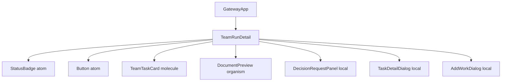
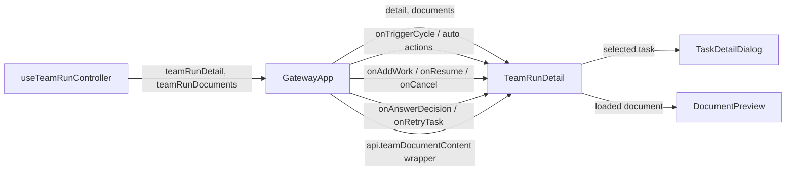
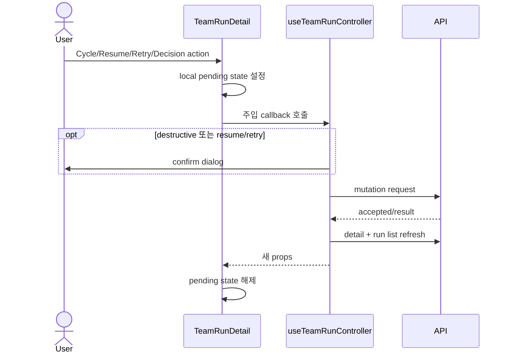
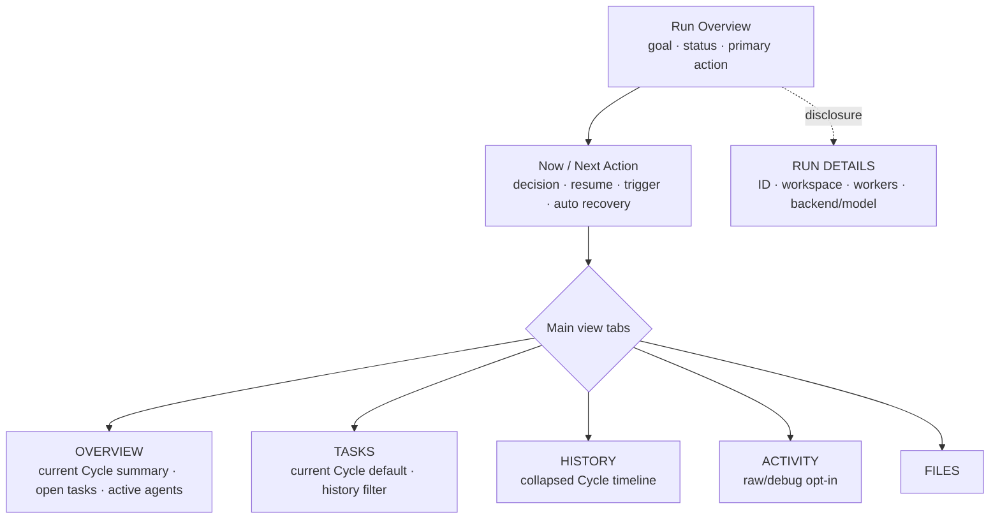

# TeamRunDetail Information Hierarchy Analysis

## 요약

- Root: `frontend/src/components/organisms/TeamRunDetail/index.jsx`
- Modes: `understand`, `refactor`, `style`
- Verdict: `TeamRunDetail`의 feature ownership과 부모 callback API는 유지한다. 다만 930줄 안에 개요, 상태별 조치, Cycle 전체 이력, Agent 전체 상태, 모든 Cycle의 Task, 원문 로그가 모두 펼쳐져 있어 `내부 분리`, `프레젠테이션 분해`, 정보 계층 재구성이 필요하다.
- 핵심 원칙: 첫 화면은 **현재 상태와 다음 조치**만 보여주고, 과거 Cycle·원문 Activity·runtime 세부값은 탭 또는 disclosure 뒤로 내린다.

## 범위

| 항목 | 경로 | 비고 |
|---|---|---|
| Root | `frontend/src/components/organisms/TeamRunDetail/index.jsx` | 화면 구성, 파생 데이터, local interaction state |
| Parent usage | `frontend/src/components/containers/GatewayApp/index.jsx` | 유일한 production 사용처와 callback 주입 |
| Controller | `frontend/src/hooks/useTeamRunController.js` | detail/documents 로드, SSE 반영, mutation 후 refresh |
| API adapter | `frontend/src/api/client.js` | aggregate detail과 document/action API |
| Styles | `src/personal_agent_gateway/static/styles.css` | meta grid, lanes, task board, tabs, policy/Cycle 스타일 |
| Existing tests | `frontend/src/components/organisms/TeamRunDetail/TeamRunDetail.test.jsx` | 현재 표시·액션 회귀 경계 확인에만 사용 |
| Integration usage test | `frontend/src/components/containers/GatewayApp/GatewayApp.test.jsx` | 실제 organism wrapper와 continuous callback 연결 회귀 경계 |
| Usage search | `frontend/src/**`의 `TeamRunDetail` 검색 | production caller는 `GatewayApp` 한 곳 |

## 처음 보는 사람을 위한 구조 설명

`TeamRunDetail`은 하나의 Team Run을 운영하고 결과를 읽는 feature organism이다. 서버에서 직접 fetch하지 않고, `GatewayApp`이 `useTeamRunController`에서 얻은 aggregate detail과 mutation callback을 props로 전달한다. 컴포넌트는 이 데이터로 현재 단계, lifecycle policy, Cycle 이력, Agent session, Task board, 보고서·Activity·handoff·문서를 한 페이지에 렌더링한다.

따라서 이 컴포넌트의 문제는 데이터 소유권이 잘못된 것이 아니라, 서로 다른 사용 목적이 한 스크롤 계층에 놓인 것이다. 사용자는 보통 “지금 멈췄는가?”, “내가 무엇을 해야 하는가?”, “최종 결과가 무엇인가?”를 먼저 찾지만 현재 JSX는 ID/phase/meta, policy, 모든 Cycle, 상태 banner, Agent, Task, raw detail tabs 순서로 동일한 시각적 무게를 준다 (`index.jsx:401-888`).

## 컴포넌트 트리

- `StatusBadge`, `Button`, `TeamTaskCard`, `DocumentPreview`는 공용 leaf로 취급한다.
- `DecisionRequestPanel`, `TaskDetailDialog`, `AddWorkDialog`는 Team Run에 종속된 local UI이므로 같은 feature 폴더 안에 두는 소유권이 맞다 (`index.jsx:108-318`).

## Props 흐름

`GatewayApp`이 모든 production prop을 `TeamRunDetail`에 주입한다 (`GatewayApp/index.jsx:760-772`). public prop contract를 변경하지 않아도 내부 화면 계층을 재구성할 수 있다.

### 주입 callback / controller action

| `TeamRunDetail` prop | 실제 소유자 | 이 화면에서의 역할 |
|---|---|---|
| `onTriggerCycle` | `useTeamRunController.handleTriggerTeamCycle` | instruction과 `previous_cycle_id`를 queue에 넣고 detail/list를 refresh |
| `onRetryAuto` | `handleRetryAuto` | paused AUTO series의 실패 슬롯 재시도 |
| `onContinueAuto` | `handleContinueAuto` | 실패를 건너뛰고 AUTO series 계속 진행 |
| `onRestartAuto` | `handleRestartAuto` | 완료된 AUTO series를 새로 시작 |
| `onAddWork` | `handleAddWork` | non-continuous plan-and-execute Run에 추가 업무 전달 |
| `onResume` | `handleResumeTeamRun` | interrupted Run 재개 전 confirm 후 refresh |
| `onAnswerDecision` | `handleAnswerTeamDecision` | 열린 질문 전체를 한 번에 답하고 Run 재개 |
| `onCancel` | `handleCancelTeamRun` | active process 중지 전 destructive confirm |
| `onRetryTask` | `handleRetryTeamTask` | terminal failed task의 retry task를 생성하고, continuous Run이면 `task_retry` Cycle도 생성 |
| `onLoadDocument` | `GatewayApp`의 `api.teamDocumentContent` wrapper | 선택 문서 content를 지연 로드 |

Controller는 최초 선택 시 detail/documents를 병렬 로드하고 (`useTeamRunController.js:52-72`), SSE delta는 run/task/agent를 부분 반영하거나 Cycle·decision·series 이벤트에서 aggregate를 다시 조회한다 (`useTeamRunController.js:74-115`). mutation은 대부분 controller에서 API 호출 후 선택 Run 소유권을 확인하고 detail/list를 갱신한다 (`useTeamRunController.js:139-361`).

## State / Effects

| 상태 | 역할 | 재구성 시 주의점 |
|---|---|---|
| `activeTab` | 현재 detail tab, 기본값은 `activity` | raw Activity가 첫 화면이 되는 직접 원인; 기본 overview/results로 변경 필요 |
| `cycleInstruction`, `triggeringCycle` | TRIGGERED Cycle 입력과 중복 제출 방지 | “다음 조치” 영역으로 이동하되 성공 시에만 입력을 비우는 동작 유지 |
| `autoAction` | Continue/Retry/Restart 중 하나의 pending 상태 | 상태별 primary action 영역으로 이동 가능 |
| `workDialogOpen`, `workInput`, `submitting` | 추가 업무 dialog 상태 | dialog ownership 유지 |
| `selectedTaskId`, `retryingTaskId` | Task detail과 retry pending | 현재 Cycle filter를 도입해도 선택 Task lineage는 유지 |
| `previewDoc` | 문서 preview overlay | Documents/Files tab 아래 유지 |
| `resuming`, `canceling` | Resume/Stop 중복 클릭 방지 | 흩어진 action을 상단 action bar로 모아도 상태는 그대로 사용 가능 |
| `countdownNow` | AUTO next-run 초 단위 표시 | `nextRunAt`이 미래일 때 1초 interval을 만들고 unmount/deadline에서 정리 (`index.jsx:340-358`) |
| `DecisionRequestPanel.answers/submitting` | 열린 질문 batch와 제출 pending | `waiting_for_user`에서 최우선 attention panel로 계속 노출 |

Render 전에는 cycles 정렬, latest settled Cycle, report/activity/handoff 정렬·결합, task-report map, action eligibility를 계산한다 (`index.jsx:364-399`). 이 파생값은 props/state에서 즉시 계산되므로 별도 effect state로 복제할 이유는 없다.

## 외부 라이브러리 프리미티브

| primitive | 하는 일 | 여기서 쓰는 이유 |
|---|---|---|
| React `useState` | 사용자 interaction에 따라 바뀌는 local UI 상태 보관 | 탭, 입력 초안, dialog/preview, 각 async action의 pending 상태가 서버 aggregate와 별개이기 때문 |
| React `useEffect` | 렌더 외부의 timer lifecycle 동기화와 cleanup | AUTO `next_run_at` countdown은 시간이 흐르며 갱신되어야 하고 interval 해제가 필요하기 때문 |

Router, context, external store selector, 별도의 custom hook은 `TeamRunDetail` 내부에서 직접 사용하지 않는다. 서버 상태와 API side effect는 부모가 주입한다.

## 주요 상호작용 흐름

1. Task card click은 `selectedTaskId`를 설정하고 `TaskDetailDialog`를 연다. failed terminal task만 Retry가 보이며 callback 완료 후 pending을 해제한다 (`index.jsx:721-753, 892-907`).
2. Documents tab에서 row를 누르면 `onLoadDocument(path)`를 호출하고 성공/실패 결과를 `previewDoc`에 저장해 `DocumentPreview`를 연다 (`index.jsx:856-890`).
3. SSE event는 이 컴포넌트를 직접 건드리지 않고 controller detail을 갱신해 새 props로 다시 렌더한다 (`useTeamRunController.js:74-115`).
4. detail tab button은 `activeTab`만 바꾸며 fetch를 일으키지 않는다. Documents content만 실제 row 선택 시 지연 로드된다 (`index.jsx:755-888`).
5. Add work는 toolbar button → `AddWorkDialog` → textarea state → `onAddWork` 순서이고, callback이 `false`가 아닐 때만 입력을 비우고 dialog를 닫는다 (`index.jsx:685-687, 908-927`). Decision panel은 모든 문항이 채워진 뒤 answer map 하나를 `onAnswerDecision`에 전달한다 (`index.jsx:215-316`).
6. AUTO의 `paused_failure`이면서 `activeAutoSeries`가 있을 때 Continue/Retry가 보이고 각각 `onContinueAuto(activeAutoSeries.id)`, `onRetryAuto(activeAutoSeries.id)`를 호출한다. `completed | auto_completed`에서는 인자 없는 `onRestartAuto()`만 보인다. 세 action은 공통 `autoAction`으로 동시에 잠기고 `finally`에서 해제된다 (`index.jsx:516-583`).
7. Stop run은 `planning | running | summarizing | waiting_for_user`에서만 보인다. click은 `canceling`을 켜고 `onCancel()`을 호출하며, controller가 destructive confirm을 받은 뒤 API mutation과 refresh를 수행한다 (`index.jsx:397-399, 668-683`; `useTeamRunController.js:270-297`).

## 현재 정보 계층 문제

| 현재 영역 | 문제 | 근거 |
|---|---|---|
| Header + phase + 6칸 meta | run ID와 workspace path 같은 운영 세부값이 goal/status와 같은 첫 계층 | `index.jsx:403-456`; 6개 cell을 5개 desktop track에 배치해 workspace가 다음 행으로 밀림 (`styles.css:2512-2542`) |
| Policy panel | latest settled summary 전체와 action, queue, active request ID를 모두 노출 | `index.jsx:458-591` |
| Cycle list | 모든 Cycle의 lineage, rounds, 전체 summary, error가 항상 펼쳐짐 | `index.jsx:594-625`; card summary에 높이 제한 없음 (`styles.css:4096-4101`) |
| Agent Sessions | terminal Run에서도 전 Agent card와 backend/model snapshot을 전부 표시 | `index.jsx:648-719` |
| Task Board | 5개 status column을 항상 렌더하고 모든 Cycle task를 한 보드에 혼합 | `index.jsx:721-753`; task payload에는 `cycle_id`가 이미 존재 (`api/team_runs.py:1025-1031`) |
| Detail tabs | `activity`가 기본이고 모든 message content를 그대로 표시 | `index.jsx:334, 755-825` |
| Results | 모든 agent report 본문 뒤에 final summary가 있어 핵심 결과가 가장 아래 | `index.jsx:773-805` |

확실한 중복은 latest settled `previousCycle.summary`가 policy preview (`index.jsx:471-475`)와 해당 Cycle card (`603-617`)에 동시에 전체 노출되는 부분이다. Results의 `run.summary`는 별도 필드이지만 역시 full-length summary surface이며 (`800-804`), Activity에는 synthesis/agent output 원문이 추가된다. 따라서 데이터가 늘수록 서로 다른 레벨의 요약과 원문이 함께 누적되고 스크롤 길이가 선형으로 커진다.

## 권장 표현 구성

1. **Run Overview**: goal, status, lifecycle/policy, leader, 현재 Cycle 번호만 남긴다. Resume/Stop/Trigger/Retry 중 현재 유효한 primary action 하나를 같은 헤더 또는 바로 아래에 둔다. ID, workspace, workers, backend/model은 `RUN DETAILS` disclosure로 내린다.
2. **Now / Next Action**: `waiting_for_user`면 decision panel, `interrupted`면 resume context, TRIGGERED ready면 Cycle instruction, AUTO failure면 Retry/Continue를 보여주는 단일 상태 기반 영역으로 합친다. 현재처럼 policy panel, interrupted banner, Agent toolbar에 action이 분산되지 않게 한다.
3. **OVERVIEW 탭**: 현재 Cycle의 짧은 summary, 진행 중/blocked Task, active Agent만 compact하게 보인다. terminal Run이면 final summary가 가장 먼저 온다.
4. **TASKS 탭**: `cycle_id`로 최신/선택 Cycle만 기본 표시한다. “All cycles”를 명시적으로 선택할 때만 전체를 보이며 retry lineage는 Task detail에서 `retry_of_task_id`로 보여준다.
5. **HISTORY 탭**: 한 줄은 `#2 · TASK RETRY · INTERRUPTED · 0/8 · 시간` 정도로 제한한다. current Cycle만 기본 펼침, 과거 Cycle summary/source ID/error는 accordion으로 연다.
6. **ACTIVITY 탭**: 운영·디버깅용 원문 로그로 명확히 낮춘다. 기본 탭으로 두지 않는다. Handoff는 독립 top-level tab보다 Activity filter 또는 Overview의 unresolved item으로 합치는 편이 목적에 맞다.
7. **FILES 탭**: 기존 document list/preview 동작을 유지한다.

가장 작은 1차 변경은 새 기능 없이 **기본 탭 변경 + Cycle 접기 + 현재 Cycle task filter + 세부정보 disclosure + action 위치 통합**이다.

## Style / Layout

- 현재 meta는 6개 cell을 `repeat(4, ...) minmax(260px, 2fr)`의 5개 track에 자동 배치하므로 workspace가 desktop의 다음 행 첫 track으로 밀리고, 1100px에서는 2열과 workspace full-row로 바뀐다 (`styles.css:2512-2542, 3082-3088`). compact chip row + details disclosure가 정보 우선순위와 레이아웃 예측 가능성에 더 맞다.
- Agent는 `auto-fill minmax(200px, 1fr)` card grid이고 (`styles.css:2700-2704`), Task는 5열 고정 후 1100px에서 2열이 된다 (`2790-2816, 3089-3091`). 내용이 많아진 원인은 responsive 실패가 아니라 모든 card/column이 항상 펼쳐지는 구조다.
- tab은 3px 테두리와 동일한 버튼 무게를 사용한다 (`styles.css:4054-4060`). 탭 수를 5개로 재정의할 경우 작은 화면에서는 horizontal overflow 또는 2행 wrap을 의도적으로 결정해야 한다.
- Cycle summary와 report body에는 clamp/collapse가 없고, Activity의 `.tl-detail`도 일반 timeline grid cell로 전체 content를 표시한다 (`styles.css:1160-1165, 4062-4068, 4096-4101`). 정보 손실 없는 `
`/accordion을 사용하고 collapsed row에서만 1~2줄 preview를 적용하는 것이 안전하다.
- 기존 brutalist black border, mono label, `StatusBadge` 시각 언어는 유지할 수 있다. 요구사항은 재디자인보다 계층·접힘·기본 상태의 변경이다.

## 리팩터링 판단

| Label | 판단 | 압력과 근거 | 안전한 다음 단계 | Effort / Risk |
|---|---|---|---|---|
| `유지` | feature ownership과 public props | production caller가 `GatewayApp` 한 곳이고 모든 side effect가 controller callback으로 격리됨 | callback contract를 유지한 채 내부만 변경 | 낮음 / 낮음 |
| `프레젠테이션 분해` | 강하게 권장 | root render가 `index.jsx:401-928`에서 10개 이상 시각 영역과 overlay를 혼합 | `RunOverviewHeader`, `RunAttentionPanel`, `CycleHistory`, `AgentSessionSummary`, `TaskBoard`, `RunDetailTabs`로 같은 폴더 내부 분리 | 중간 / 중간 |
| `내부 분리` | 권장 | local dialog 3개와 각 tab body가 동일 파일에 누적 | feature-owned 파일로만 이동하고 shared 승격은 하지 않음 | 낮음 / 낮음 |
| `pure helper 추출` | 권장 | `newestFirst`, `buildHandoffs`, `currentWork`, `groupReportsByTask`와 cycle/task view 파생이 render 의도를 가림 (`index.jsx:49-105, 364-399`) | `teamRunDetailModel.js` 같은 local pure module에서 view model 생성 | 낮음 / 낮음 |
| `반복 제거(DRY)` | 선택적 | avatar/fallback JSX가 Task dialog, Agent lane, Results에 3회 반복 (`index.jsx:147-151, 697-701, 787-791`) | local `AgentAvatar` presentational component만 추출 | 낮음 / 낮음 |
| `리팩터링 계획 필요` | 필요 | tab taxonomy, default view, current Cycle filtering이 여러 기존 test expectation과 CSS를 함께 바꿈 | 구현 전 화면 상태별 acceptance criteria와 migration 순서를 짧은 계획으로 고정 | 중간 / 중간 |

`shared 승격` 근거는 없다. 새 subcomponent들은 Team Run aggregate shape에 강하게 결합되며 다른 feature consumer가 확인되지 않았다. async pending handler 반복은 보이지만 현재 callback마다 인자와 성공 후 동작이 달라 범용 hook을 새로 만드는 것은 이 작업 범위를 넘는다.

## 권장 후속 작업

1. 정보 구조 acceptance criteria를 “active / waiting_for_user / interrupted / terminal / continuous-triggered / continuous-auto” 상태별로 확정한다.
2. 동작을 바꾸지 않는 내부 분리부터 수행하고 기존 test를 유지한다.
3. `OVERVIEW`, `TASKS`, `HISTORY`, `ACTIVITY`, `FILES` 구조를 추가하고 raw details를 disclosure로 이동한다.
4. latest Cycle 기준 task filter를 기본으로 적용하고 All cycles 선택을 제공한다.
5. Cycle/history와 agent reports는 collapsed 기본값, final/current summary는 우선 노출로 바꾼다.
6. 기존 test의 `activity default` expectation을 새 기본 view로 변경하고 상태별 primary action, cycle filter, disclosure 회귀를 추가한다.

## 스킬 핸드오프

- 다음 단계는 먼저 이 보고서를 기반으로 실제 구현 계획 문서를 만들고, 그 계획에 대해 `developing-plans-with-solid`로 컴포넌트 경계·dependency direction·테스트 순서를 검토하는 것이 적합하다. tab taxonomy와 상태별 action owner가 함께 바뀌어 바로 코드를 자르면 회귀 범위가 불명확하기 때문이다.
- 실제 React 구현 시에는 `vercel-react-best-practices`로 불필요한 derived state/effect 추가를 피한다.

## 리뷰

- Verdict: PASS
- Rounds: 2
- Fixed: meta grid 실제 배치, Activity style, continuous task retry Cycle 조건, AUTO/Stop 흐름, GatewayApp integration test 경계, summary 중복 표현을 코드 근거에 맞게 정정

## Evidence

- `frontend/src/components/organisms/TeamRunDetail/index.jsx:1-930`
- `frontend/src/components/containers/GatewayApp/index.jsx:748-773`
- `frontend/src/components/containers/GatewayApp/GatewayApp.test.jsx:9-17, 1363-1398`
- `frontend/src/hooks/useTeamRunController.js:24-115, 139-361, 398-424`
- `frontend/src/api/client.js:360-435`
- `frontend/src/components/organisms/TeamRunDetail/TeamRunDetail.test.jsx:7-669`
- `src/personal_agent_gateway/api/team_runs.py:1025-1051`
- `src/personal_agent_gateway/teams.py:844-963`
- `src/personal_agent_gateway/static/styles.css:2495-3104, 3848-3903, 4038-4101`
- Search: `rg -n "TeamRunDetail" frontend/src --glob '!**/TeamRunDetail/**'`
- Search: `rg -n "cycle_id|retry_of_task_id" frontend/src src/personal_agent_gateway`
