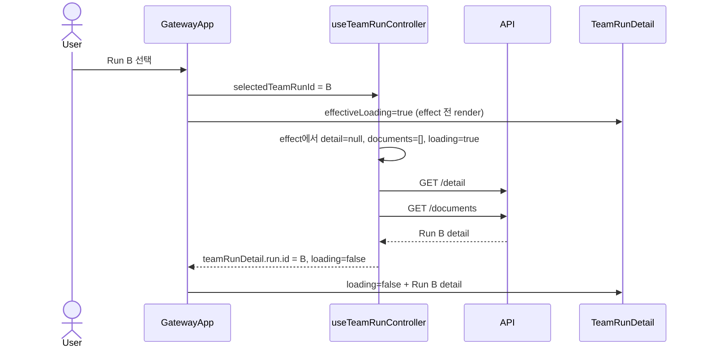

# TeamRunDetail Loading Boundary Analysis

## 요약

- Root: `frontend/src/components/organisms/TeamRunDetail/index.jsx`
- Modes: `api-state`, `test`
- Verdict: controller가 실제 detail 요청의 `loading/error` lifecycle을 소유하고 선택 effect 시작 시 detail/documents를 비운다. effect 전 첫 render는 `GatewayApp`이 선택 ID와 응답 detail ID의 일치 guard로 loading을 파생한다. 기존 `LoaderCube`를 재사용하고 전역 Retry가 detail effect도 다시 실행하게 한다.

## 범위

| 항목 | 경로 | 비고 |
|---|---|---|
| Root | `frontend/src/components/organisms/TeamRunDetail/index.jsx` | loading/empty 표시 경계 |
| Parent | `frontend/src/components/containers/GatewayApp/index.jsx` | 선택 ID와 loaded detail을 동시에 소유 |
| Controller | `frontend/src/hooks/useTeamRunController.js` | detail/documents 병렬 요청과 선택 전환 |
| API adapter | `frontend/src/api/client.js` | aggregate detail mapper/fallback과 documents normalization |
| Existing loader | `frontend/src/components/molecules/LoaderCube/index.jsx` | 프로젝트 기존 inline loading 표현 |
| Component tests | `frontend/src/components/organisms/TeamRunDetail/TeamRunDetail.test.jsx` | empty/detail/action 회귀 |
| Integration tests | `frontend/src/components/containers/GatewayApp/GatewayApp.test.jsx` | 실제 Run 선택과 detail callback wiring |
| Controller tests | `frontend/src/hooks/useTeamRunController.test.jsx` | late response ownership과 신규 loading/error lifecycle |
| Runtime/build | `frontend/vite.config.js`, `README.md` | Vite proxy/build output과 gateway 정적 build 경계 |

## API / 상태 추적

- `useTeamRunController`는 `selectedTeamRunId` 변경 시 detail과 documents를 독립 Promise로 동시에 시작한다 (`useTeamRunController.js:52-68`). 네트워크 waterfall은 없다. 변경 시 두 기존 결과를 먼저 비워 B detail이 B documents보다 먼저 끝나더라도 A documents가 전달되지 않게 해야 한다.
- 현재 `GatewayApp`은 선택 ID가 있으면 즉시 `TeamRunDetail`을 렌더하고 `teamRunDetail`을 그대로 전달한다 (`GatewayApp/index.jsx:748-773`). 최초 로드에는 `detail`이 `null`이라 “No team run selected.”가 보이고, A→B 전환에는 effect가 새 detail을 받을 때까지 A detail이 남을 수 있다.
- controller의 `teamRunDetailLoading`은 detail request 시작/종료를, `teamRunDetailLoadError`는 detail request 실패를 나타낸다. 이는 ID로는 표현할 수 없는 pending/failed 구분이므로 필요한 request state다. Documents 실패는 기존처럼 `screenError`를 올리되 성공한 detail 본문은 유지할 수 있다.
- `GatewayApp`은 `teamRunDetailReady = teamRunDetail?.run?.id === selectedTeamRunId`로 stale detail을 차단하고, `effectiveLoading = teamRunDetailLoading || (!teamRunDetailReady && !teamRunDetailLoadError)`를 전달한다. 이 식은 선택 click 직후 controller effect가 실행되기 전 render에서도 empty 문구 대신 loader를 보장한다. ready 전에는 `detail={null}`, `documents={[]}`를 전달하고, loading이 종료됐지만 detail이 실패했다면 `loadError` UI를 보여 loader가 영구 유지되지 않게 한다.
- 전역 “Retry request”는 `screenReloadKey`를 증가시키지만 현재 controller detail effect dependency에는 포함되지 않는다 (`GatewayApp/index.jsx:248-286, 678-706`). `reloadKey`를 hook dependency로 전달해 retry가 detail/documents를 실제 재요청하게 해야 한다.
- `api.teamRunDetail`은 `/api/team-runs/:id/detail` aggregate를 `run/agents/tasks/messages/cycles/decisionRequest/policyStatus/...` shape으로 mapping한다. status `0/404`에서는 run/agents/tasks/messages legacy endpoint를 병렬 fallback하고 Cycle/policy 필드는 안전 기본값을 사용한다 (`client.js:400-438`). `api.teamDocuments`는 `/api/team-runs/:id/documents`의 `documents` list를 정규화한다 (`client.js:480-482`). loading readiness는 이 중 detail request lifecycle을 사용하고 documents는 선택 시 초기화된 독립 결과로 둔다.
- `TeamRunDetail`은 `loading`일 때 `role="status"`, `aria-live="polite"` wrapper 안에 `LoaderCube label="LOADING TEAM RUN"`을 렌더하고 조기 반환한다. `loadError`이면 재시도 안내를 표시하고, 둘 다 false인데 run이 없을 때만 기존 empty 문구를 유지한다.

## 테스트 / Stories

Story 파일은 `frontend/src` 검색에서 발견되지 않았다.

기존 `TeamRunDetail.test.jsx`는 정상 detail 렌더 (`:8`), run이 없는 empty placeholder (`:26`), tab/action/Cycle 흐름 (`:31-669`)을 다룬다. 기존 empty 의미를 깨지 않으려면 loading은 명시 prop으로 분리해야 한다.

기존 `useTeamRunController.test.jsx:52-132`는 late SSE/decision refresh가 A에서 B로 전환한 뒤 B detail/documents를 덮지 못하게 하는 ownership을 검증한다. 이는 refresh race 경계이고, 최초 선택 effect에서 B detail만 먼저 해결되고 B documents가 pending인 partial-resolution은 아직 별도 검증이 없다.

추가 RED/회귀 경계:

1. `loading`이 true면 `LOADING TEAM RUN...` status가 보이고 empty placeholder와 Run 본문은 보이지 않는다.
2. `loading`이 false이고 detail이 없으면 기존 empty placeholder가 유지된다.
3. GatewayApp에서 A→B click 직후 effect 실행 전 render부터 `effectiveLoading=true`, `detail=null`, `documents=[]`이다. Controller effect가 실행되면 저장된 detail/documents도 비고 loading이 true가 된다. B detail만 먼저 해결되면 loading은 종료되고 B detail + 빈 documents이며, B documents가 나중에 도착하면 그때 B documents만 채워진다.
4. A detail을 가진 상태에서 B 선택 시 A detail/documents를 B 화면에 전달하지 않는다. late A 응답 ownership test는 기존 회귀를 유지한다.
5. detail 실패 시 loading=false/error=true와 전역 alert가 표시되고, “Retry request” 후 effect가 재실행되어 matching detail을 표시한다.

`GatewayApp.test.jsx:1360-1398`의 기존 integration test는 matching detail이 도착한 뒤 continuous callback이 계속 연결되는지를 이미 확인한다. 여기에 deferred detail 응답을 사용한 loading transition만 추가하면 public callback 회귀를 과도하게 재검증할 필요가 없다.

## 권장 후속 작업

1. Controller에 detail request loading/error를 추가하고 선택/retry effect 시작 시 detail/documents를 비운다.
2. `screenReloadKey`를 controller의 `reloadKey`로 전달해 전역 Retry가 detail effect도 재실행하게 한다.
3. `GatewayApp`에 matching detail guard와 effect 이전 frame까지 포함하는 `effectiveLoading`을 파생하고, `TeamRunDetail`에 `loading=false`, `loadError=false` props와 `LoaderCube` 조기 반환을 추가한다.
4. component loading/error test와 controller partial-resolution/failure-retry test를 추가한다.
5. root `frontend`의 focused tests/build 후, 현재 worktree에서 떠 있는 Vite를 root frontend 기준으로 재시작한다.

## 스킬 핸드오프

- 구현에는 `vercel-react-best-practices`의 `rerender-derived-state-no-effect`와 기존 `LoaderCube` 재사용 원칙을 적용한다. 추가 architecture/refactor skill은 필요하지 않다.

## 리뷰

- Verdict: PASS
- Rounds: 4
- Fixed: documents partial-resolution ownership, API mapper/fallback, controller test inventory, failure retry, effect 전 loading frame, sequence timing을 실제 코드 경계에 맞게 보완

## Evidence

- `frontend/src/components/organisms/TeamRunDetail/index.jsx:1-6, 320-362`
- `frontend/src/components/containers/GatewayApp/index.jsx:102-128, 748-773`
- `frontend/src/hooks/useTeamRunController.js:24-72`
- `frontend/src/api/client.js:400-438, 480-486`
- `frontend/src/components/molecules/LoaderCube/index.jsx:1-12`
- `frontend/src/components/organisms/TeamRunDetail/TeamRunDetail.test.jsx:7-669`
- `frontend/src/components/containers/GatewayApp/GatewayApp.test.jsx:9-17, 1360-1398`
- `frontend/src/hooks/useTeamRunController.test.jsx:1-132`
- `frontend/vite.config.js:1-29`
- `README.md:271-281, 430-441`
- Process/config check: ports `5173`, `8787`; `C:\Users\Administrator\.cloudflared\config.yml`
