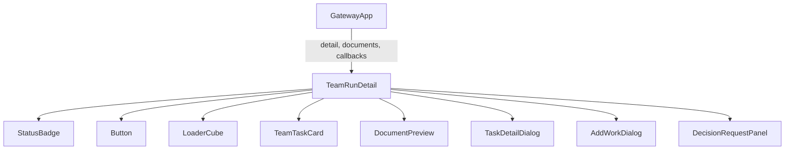
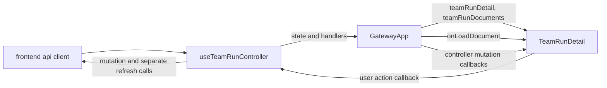
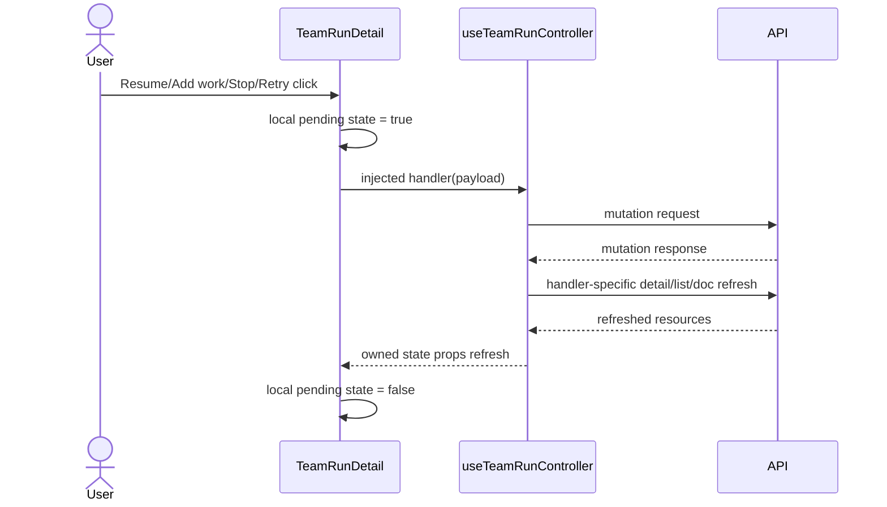

# TeamRunDetail Worktree Delivery Analysis

## 요약

- Root: `frontend/src/components/organisms/TeamRunDetail/index.jsx`
- Modes: `understand`, `api-state`, `test`
- Verdict: `TeamRunDetail`은 실행 상태의 표현과 로컬 상호작용을 맡고, API 상태와 mutation은 `useTeamRunController` handler로 위임한다. Worktree 전달 기능도 같은 경계를 유지해 `delivery` read model과 `onRefreshDelivery`, `onCommitDelivery`, `onApplyDelivery` callback을 받는 구성이 현재 구조와 일치한다.

## 범위

| 항목 | 경로 | 비고 |
|---|---|---|
| Root organism | `frontend/src/components/organisms/TeamRunDetail/index.jsx` | Run 상세, 탭, 대화상자와 사용자 동작 상태 소유 |
| Parent container | `frontend/src/components/containers/GatewayApp/index.jsx` | controller 결과를 organism props로 연결 |
| State controller | `frontend/src/hooks/useTeamRunController.js` | 선택 Run read state, ownership guard, mutation/refresh/confirm/toast 소유 |
| API client | `frontend/src/api/client.js` | `/api/team-runs/**` 요청 캡슐화 |
| Component tests | `frontend/src/components/organisms/TeamRunDetail/TeamRunDetail.test.jsx` | 상세 화면 사용자 흐름 검증 |
| Container tests | `frontend/src/components/containers/GatewayApp/GatewayApp.test.jsx` | callback/API 연결 검증 |
| Controller tests | `frontend/src/hooks/useTeamRunController.test.jsx` | stale response ownership, loading/error, decision/Cycle mutation 검증 |
| Shared styles | `src/personal_agent_gateway/static/styles.css` | `team-run-*` 클래스 기반 레이아웃 |
| SPACE contract | `src/personal_agent_gateway/space_policies.py` | frozen policy가 가리키는 worktree source/target과 cleanup 정의 |
| Run snapshot | `src/personal_agent_gateway/teams.py` | Run 생성 시 working/artifact root와 SPACE snapshot 저장 |

## 컴포넌트 트리

`TaskDetailDialog`, `AddWorkDialog`, `DecisionRequestPanel`은 같은 파일의 로컬 컴포넌트다. 나머지는 공유 atom/molecule/organism이며 공개 props만 분석 경계에 포함했다.

## Props 흐름

`TeamRunDetail`은 `fetch`나 `api`를 import하지 않는다. `useTeamRunController`가 `selectedTeamRunId`와 version ref를 닫아 가진 handler를 반환하고, `GatewayApp`은 이를 props로 전달한다. 이 패턴을 delivery 기능에서도 유지해야 한다.

## 상태와 Effects

| 상태/effect | 역할 |
|---|---|
| `workInput`, `submitting`, `workDialogOpen` | Add work 입력과 요청 중 잠금 |
| `cycleInstruction`, `triggeringCycle` | TRIGGERED Cycle 입력과 요청 중 잠금 |
| `autoAction` | AUTO continue/retry/restart 중복 실행 방지 |
| `resuming`, `canceling`, `retryingTaskId` | 각 mutation 버튼의 독립적인 진행 상태 |
| `selectedTaskId`, `previewDoc` | Task 및 문서 preview modal 선택 |
| `activeTab`, `showAllTasks` | 상세 탭과 current/all Cycle task 표시 |
| `countdownNow` + `useEffect` | `activeAutoSeries.next_run_at`까지 1초 countdown, deadline/unmount 시 interval 정리 |

새 delivery mutation은 기존 버튼들과 동일하게 로컬 pending 상태만 `TeamRunDetail`에 두고, delivery read state와 stale-result ownership은 `useTeamRunController`가 관리해 prop으로 내려주는 편이 일관된다. 전역 store나 새 polling은 필요하지 않다.

## 외부 라이브러리와 로컬 의존성

| 의존성 | 이 컴포넌트에서 하는 일 |
|---|---|
| React `useState` | dialog, tab, 입력, mutation pending처럼 화면에 국한된 상태 관리 |
| React `useEffect` | AUTO 다음 Cycle countdown interval 수명주기 관리 |
| `Button` | 실행 가능/진행 중/파괴적 명령의 공통 버튼 표현 |
| `StatusBadge` | Run, Cycle, Agent 상태를 동일한 visual vocabulary로 표시 |
| `LoaderCube` | 선택 Run 상세 로딩 경계 표시 |
| `TeamTaskCard` | task board의 task 표현과 detail-open callback 위임 |
| `DocumentPreview` | 인증된 Team Run 문서 preview 결과 표시 |
| `fmtDateTime` | Run/Cycle/message 시각 포맷 통일 |

라우터, query library, 전역 store는 사용하지 않는다. 데이터 로드와 mutation은 `useTeamRunController`가 소유하고 `GatewayApp`을 거쳐 callback/props로 주입된다.

## 주요 상호작용 흐름

### Run mutation

### Tab 및 preview

1. 사용자가 tab을 누르면 `activeTab`만 변경하고 추가 API 요청은 하지 않는다.
2. Files에서 previewable 문서를 누르면 `onLoadDocument(path)`를 호출한다.
3. 성공/실패 결과를 `previewDoc`에 저장하고 `DocumentPreview`를 연다.

### Worktree delivery가 따라야 할 흐름

1. `useTeamRunController`가 선택 Run 변경 시 detail/documents와 함께 delivery preview를 로드하고 stale-result ownership을 검사한다.
2. 사용자는 source/target/changed files/blocked reasons를 먼저 확인한다.
3. Commit 또는 Apply를 명시적으로 누른다.
4. `TeamRunDetail`은 해당 callback 실행 중 버튼만 잠근다.
5. `useTeamRunController`는 mutation 성공 후 delivery preview를 다시 읽되, Run detail/list는 delivery가 Run 실행 상태를 바꾸지 않으므로 불필요하게 재조회하지 않는다.

## API / 상태 의존 추적

| UI callback | Controller/API 경계 | 현재 동작 |
|---|---|---|
| `onLoadDocument` | `GatewayApp`에서 직접 `api.teamDocumentContent` 연결 | 선택 문서 내용 로드; controller state 변경 없음 |
| `onTriggerCycle` | `handleTriggerTeamCycle` → `api.triggerTeamCycle` | detail/list를 병렬 refresh하고 성공 toast; idempotency client id 유지 |
| `onRetryAuto`, `onContinueAuto`, `onRestartAuto` | 각 controller handler → AUTO API | detail/list를 병렬 refresh; 실패만 toast |
| `onAddWork` | `handleAddWork` → `api.addWork` | 성공 후 detail만 별도 refresh하고 성공 toast |
| `onResume`, `onCancel`, `onRetryTask` | controller confirm → mutation API | 사용자 confirm 후 detail/list 병렬 refresh와 toast |
| `onAnswerDecision` | `handleAnswerTeamDecision` → decision API | detail/list/documents 병렬 refresh와 toast |

모든 비동기 refresh는 `captureSelectedRun`/`ownsSelectedRun`으로 선택 Run version을 검사한다. 늦게 끝난 이전 Run 응답은 현재 상세를 덮어쓰지 않는다. Delivery preview도 동일 ownership guard를 사용해야 한다.

Delivery는 `GET preview`, `POST commit`, `POST apply` 세 endpoint만 추가하는 것이 최소 계약이다. UI가 임의 target path를 POST하지 않고 서버가 Run의 frozen SPACE snapshot에서 target을 결정해야 경로 변조를 막을 수 있다.

## 테스트 현황과 필요한 RED 사례

기존 `TeamRunDetail.test.jsx`는 loading/error/empty, tab, task/doc preview, Add work, Resume, Retry, Cycle policy, AUTO timer/actions, handoff ordering, Stop, user decision을 검증한다. `GatewayApp.test.jsx`는 실제 organism을 render하면서 callback prop을 capture해 연결을 검증한다. `useTeamRunController.test.jsx`는 늦은 SSE/decision 응답의 Run ownership, 독립 detail/documents loading, load error retry, Cycle request id 재사용/회전을 직접 검증한다.

Delivery 추가 시 필요한 회귀 사례는 다음 세 가지다.

1. worktree Run에서 preview의 source/target/changed files와 blocked reason을 표시한다.
2. uncommitted source는 Commit 버튼을 제공하고 pending 동안 중복 클릭을 막는다.
3. clean source + clean target + pending commit일 때 Apply callback을 호출하고, dirty target이면 Apply를 비활성화한다.

Controller 테스트는 commit/apply 성공 후 preview 재조회, 선택 Run 전환 중 stale preview 차단, mutation 오류 toast를 맡는다. Organism 테스트는 표시·disabled·callback payload를, backend API 테스트는 경로 고정·dirty/conflict 차단과 실제 Git 결과를 맡는다. `GatewayApp`에는 새 prop 연결 외 별도 상태가 없으므로 기존 capture test 확장만 필요하다.

## 권장 후속 작업

1. `TeamRunDetail`에 local `DeliveryPanel`을 추가하되 API import 없이 read model과 callback만 받는다.
2. `useTeamRunController`가 선택 Run 변경 시 detail/documents/delivery preview를 로드·소유하고, `GatewayApp`은 결과 state와 handler를 `TeamRunDetail`에 전달만 한다.
3. backend 요구사항으로 frozen SPACE snapshot의 `workspace_path`만 target으로 사용하고 `worktree` 모드 외에는 unavailable을 반환한다. 현재 snapshot 저장 근거는 `teams.py:221-263`, worktree target/working root 계약은 `space_policies.py:222-239`다.
4. backend 요구사항으로 source commit 전에는 Apply를 금지하고, target dirty/conflict는 자동 stash/reset 없이 차단한다. 이는 현재 구현에 이미 있는 기능이라는 주장이 아니라 이번 기능이 추가해야 할 안전 조건이다.

## 스킬 핸드오프

- `component-pattern`: 기존 organism 내부의 local composition으로 유지하고 새 공유 컴포넌트를 불필요하게 만들지 않는지 확인한다.
- `vercel-react-best-practices`: `useTeamRunController`에서 선택 Run의 독립적인 initial read를 병렬 시작하고, delivery mutation 후에는 preview만 갱신해 불필요한 요청과 새 polling을 만들지 않는다.

## 리뷰

- Verdict: `PASS`
- Rounds: 3
- Fixed: `useTeamRunController` 소유권과 테스트를 범위에 추가하고, handler별 mutation/refresh/toast 차이와 backend 요구사항의 근거/상태를 명시했다. Delivery initial read와 stale-result ownership도 controller로 일관되게 정정했다.

## 근거

- `frontend/src/components/organisms/TeamRunDetail/index.jsx:322-1005`
- `frontend/src/components/organisms/TeamRunDetail/TeamRunDetail.test.jsx`
- `frontend/src/components/containers/GatewayApp/index.jsx:810-838`
- `frontend/src/hooks/useTeamRunController.js:24-379`
- `frontend/src/hooks/useTeamRunController.test.jsx:49-260`
- `frontend/src/api/client.js:338-464`
- `frontend/src/components/containers/GatewayApp/GatewayApp.test.jsx`
- `src/personal_agent_gateway/static/styles.css:2512-2583`
- `src/personal_agent_gateway/teams.py:221-263`
- `src/personal_agent_gateway/space_policies.py:100-111,222-259`
