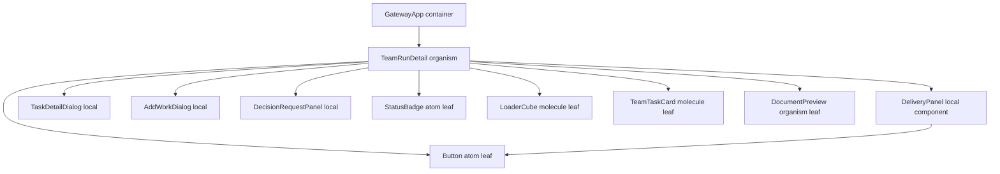
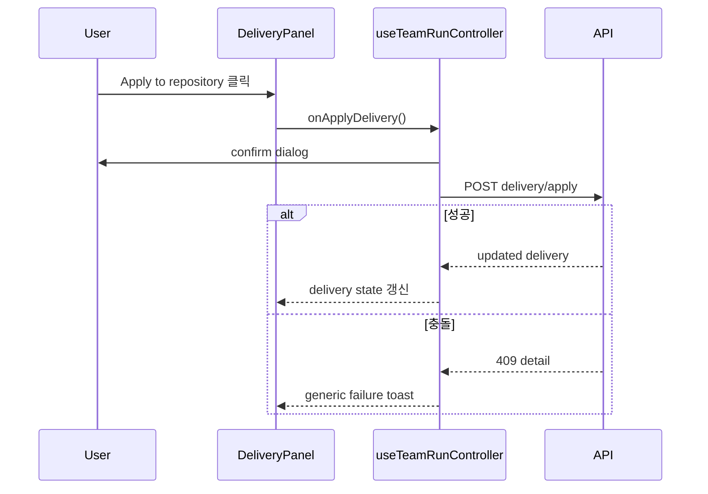

# TeamRunDetail Delivery Conflict Component Analysis

## 요약

- Root: `frontend/src/components/organisms/TeamRunDetail/index.jsx`
- Modes: `understand`, `api-state`, `style`, `test`
- Verdict: 기존 `DeliveryPanel`이 worktree 검토·커밋·적용의 표현 경계다. 충돌 해결 UI도 이 로컬 경계에 두되, 장기 상태와 Git 명령은 `useTeamRunController` 및 백엔드 delivery service가 소유해야 한다.

## 범위

| 항목 | 경로 | 비고 |
|---|---|---|
| Root organism | `frontend/src/components/organisms/TeamRunDetail/index.jsx` | `DeliveryPanel` 로컬 컴포넌트와 Team Run 상세 합성 |
| Component test | `frontend/src/components/organisms/TeamRunDetail/TeamRunDetail.test.jsx` | commit/apply callback UI 계약 |
| Container test | `frontend/src/components/containers/GatewayApp/GatewayApp.test.jsx` | delivery props/handler 배선 계약 |
| State owner | `frontend/src/hooks/useTeamRunController.js` | delivery fetch·mutation·toast·선택 Run 보호 |
| API adapter | `frontend/src/api/client.js` | delivery preview/commit/apply 응답 매핑 |
| Parent container | `frontend/src/components/containers/GatewayApp/index.jsx` | controller 결과를 `TeamRunDetail` props로 전달 |
| Styles | `src/personal_agent_gateway/static/styles.css` | `team-delivery-*` 전역 클래스 |
| Backend API | `src/personal_agent_gateway/api/team_runs.py` | delivery HTTP 경계 |
| Git service | `src/personal_agent_gateway/team_delivery.py` | preview, commit, preflight, apply |

## 컴포넌트 트리



`DeliveryPanel`은 `TeamRunDetail/index.jsx:217`에 로컬로 선언되고 `index.jsx:654`에서 한 번만 렌더링된다. Repository Delivery 외 다른 화면의 사용처는 없으므로 새 전역 organism/molecule로 승격할 근거는 없다.

## Props 흐름

```mermaid
flowchart LR
  Controller[useTeamRunController]
  Gateway[GatewayApp]
  Detail[TeamRunDetail]
  Panel[DeliveryPanel]
  Api[frontend api client]
  Backend[/api/team-runs/:id/delivery]

  Controller -->|delivery, loading, handlers| Gateway
  Gateway -->|delivery props| Detail
  Detail -->|onRefresh/onCommit/onApply| Panel
  Panel -->|user command| Controller
  Controller --> Api
  Api --> Backend
```

현재 공개 props는 `delivery`, `deliveryLoading`, `onRefreshDelivery`, `onCommitDelivery`, `onApplyDelivery`이며 `GatewayApp/index.jsx:828-847`에서 주입된다. 충돌 해결은 같은 방향을 유지해 `onResolveDeliveryConflict`, `onContinueDelivery`, `onCancelDelivery`을 추가하는 것이 기존 소유권과 일치한다.

## 상태와 Effects

| 상태/동작 | 소유자 | 역할 |
|---|---|---|
| `message` | `DeliveryPanel` | Team Run worktree 커밋 메시지 입력 |
| `action` | `DeliveryPanel` | refresh/commit/apply 중복 클릭 방지 및 버튼 문구 |
| `teamRunDelivery` | `useTeamRunController` | 선택 Run의 서버 delivery snapshot |
| `teamRunDeliveryLoading` | `useTeamRunController` | preview 초기/수동 갱신 상태 |
| 선택 Run 버전 가드 | `useTeamRunController` | 비동기 응답이 다른 Run 화면을 덮지 않도록 보호 |
| `useEffect` timer | `TeamRunDetail` | AUTO Cycle countdown 전용이며 Delivery와 무관 |

충돌 파일의 선택과 수동 병합 초안은 화면 상호작용 상태이므로 `DeliveryPanel` 로컬 state가 적합하다. 반면 어떤 파일이 해결됐는지, 임시 worktree가 살아 있는지, target HEAD가 유효한지는 새로고침과 서버 재시작 뒤에도 유지되어야 하므로 백엔드 session snapshot이 원본이어야 한다.

## 외부 라이브러리와 주입 동작

| 항목 | 이 컴포넌트에서 하는 일 | 사용하는 이유 |
|---|---|---|
| React `useState` | commit 메시지, 진행 중 action 및 상세 화면의 일시 상태 관리 | 입력과 버튼 pending 상태를 렌더와 동기화한다. |
| React `useEffect` | AUTO Cycle의 `next_run_at` countdown timer 정리 | 시간 기반 표시가 Run 데이터와 함께 갱신되어야 한다. Delivery에는 effect가 없다. |
| `Button` atom | Refresh, Commit, Apply 등 명령 버튼 | 기존 크기·variant·disabled 표현을 재사용한다. |
| `fmtDateTime` | Team Run 메시지 및 문서 시각 표시 | Delivery 충돌 흐름에는 직접 사용되지 않는다. |

공유 atom/molecule/organism은 공개 API만 확인하는 leaf로 취급했다.

| 컴포넌트 | 종류 | `TeamRunDetail`에서의 역할 |
|---|---|---|
| `StatusBadge` | shared atom leaf | Run의 현재 status 표시 |
| `Button` | shared atom leaf | Run, Cycle, Delivery, dialog 명령의 공통 버튼 표현 |
| `LoaderCube` | shared molecule leaf | 상세 데이터 초기 loading 상태 표시 |
| `TeamTaskCard` | shared molecule leaf | task board의 task 요약과 선택 trigger |
| `DocumentPreview` | shared organism leaf | 선택한 Run 문서의 preview dialog |
| `TaskDetailDialog` | local child | task 결과·보고서와 retry 명령 표시 |
| `AddWorkDialog` | local child | non-continuous Run의 추가 instruction 입력 |
| `DeliveryPanel` | local child | worktree preview, commit, apply 및 새 conflict resolution 경계 |
| `DecisionRequestPanel` | local child | leader가 요청한 사용자 결정 입력과 resume |

`TeamRunDetail` 안에는 store selector나 API hook이 없다. API 호출은 모두 부모가 주입한 callback으로 실행된다. 이 분리는 충돌 해결에서도 유지해야 하며, 컴포넌트가 직접 `fetch`하거나 Git 상태를 추측하면 안 된다.

## 주요 상호작용 흐름

### 현재 Apply



`useTeamRunController.js:443-444`가 오류 객체를 버려 충돌 원문이 사라지고, 백엔드 `team_delivery.py:176-193`은 preflight worktree를 `finally`에서 제거하므로 사용자가 이어서 해결할 세션도 남지 않는다.

### 현재 DeliveryPanel 전체 흐름

1. `delivery`가 없고 loading도 아니면 영역을 렌더하지 않는다. loading 중 snapshot이 없으면 검사 중 문구를, `available: false`면 서버의 reason을 표시한다.
2. preview snapshot이 있으면 source/target 경로, uncommitted/pending/dirty count, 파일·commit 목록과 `blocked_reasons`를 표현한다.
3. Refresh는 `perform("refresh")`를 통해 `action` lock을 잡고 부모 `onRefresh`를 호출한다. loading 또는 다른 action 중에는 모든 command가 disabled된다.
4. 사용자가 commit message input을 편집하면 로컬 `message`만 변경된다. uncommitted 파일이 있고 `can_commit`일 때 Commit이 부모 `onCommit(message)`를 호출하며, controller는 API 응답 전체로 delivery snapshot을 교체한다.
5. `can_apply`일 때 Apply가 부모 callback을 호출한다. controller는 global confirm을 받은 뒤 API를 호출하고 성공 snapshot을 저장한다.
6. Refresh/Commit/Apply 오류는 controller가 각각 generic toast로 소비한다. 특히 Apply는 `ApiError.message`를 버리므로 충돌 detail이 UI에 남지 않는다.
7. `perform`의 `finally`가 성공/실패 모두 `action`을 해제해 중복 클릭 lock을 복구한다.

### 필요한 충돌 해결 흐름

1. Apply가 충돌하면 API는 실패 대신 `delivery.conflict_session`과 충돌 파일 snapshot을 반환한다.
2. `DeliveryPanel`은 파일별 target/team/manual 결과를 선택해 주입 callback을 호출한다.
3. controller는 resolve API 응답으로 `teamRunDelivery`를 교체한다.
4. 모든 파일이 해결되면 Continue가 임시 통합 worktree의 cherry-pick을 완료한다.
5. backend가 target HEAD와 clean 상태를 재검증한 뒤 결과 commit으로 target을 fast-forward한다.
6. Cancel은 임시 integration worktree와 manifest만 제거하고 target/source는 바꾸지 않는다.

## API와 상태 의존성

| 계층 | 현재 계약 | 필요한 확장 |
|---|---|---|
| `team_delivery.py` | conflict 시 임시 worktree 삭제 후 예외 | conflict session 보존, resolve/continue/cancel, final fast-forward |
| `api/team_runs.py` | preview/commit/apply | conflict resolve/continue/cancel endpoint와 audit |
| `api/client.js` | delivery object 반환 | 새 endpoint도 동일하게 `delivery` 반환 |
| `useTeamRunController.js` | mutation 후 delivery 교체 | conflict mutation handler 및 구체 오류 toast |
| `TeamRunDetail` | delivery snapshot을 표현 | `conflict_session`을 서버 원본으로 렌더 |

백엔드는 payload가 임의 경로를 선택하지 못하게 conflict id를 session manifest의 파일 id와 대조해야 한다. 최종 반영 직전에는 session의 `target_head`가 현재 HEAD와 같은지 확인해야 한다.

## 스타일과 레이아웃

`src/personal_agent_gateway/static/styles.css:2587-2591`의 `.team-delivery-panel`은 자체 `padding: 14px`을 가지지만 내부 `.team-section-head`가 공용 규칙 `styles.css:2822-2827`의 `margin: 22px 0 12px`까지 적용받는다. 이 중복이 스크린샷에서 Repository Delivery 제목 위 여백이 커진 직접 원인이다. `.team-policy-panel > .team-section-head`에는 이미 `margin: 0` 예외가 있지만 Delivery에는 없다.

Repository Delivery와 Cycle policy는 `RUN DETAILS`가 사용하는 native `<details>/<summary>` 패턴(`styles.css:2567-2585`)으로 통일할 수 있다. 각 영역의 기존 `aria-label`은 `<details>`에 유지하고, summary 안에 제목·상태·Refresh를 배치한다. 접힌 상태에서도 summary의 버튼이 별도 동작해야 하므로 Refresh 클릭은 `event.preventDefault()`와 `event.stopPropagation()`으로 toggle과 분리한다. 본문 padding은 summary 바깥의 전용 body wrapper에만 적용해 상단 중복 여백을 제거한다.

## 테스트와 Stories

Story 파일은 없다. 기존 delivery 테스트 인벤토리는 다음과 같다.

| 파일 | 현재 검증 범위 |
|---|---|
| `TeamRunDetail.test.jsx:703-753` | uncommitted 파일 표시, commit 메시지 전달, Apply disabled/enabled, callback 호출 |
| `useTeamRunController.test.jsx:264-307` | preview 소유, commit/apply 응답으로 snapshot 교체, Apply confirm과 API 인자 |
| `GatewayApp.test.jsx:1381-1384` | controller의 delivery state와 handler가 `TeamRunDetail` props로 전달됨 |
| `tests/test_api_team_runs.py:90-153` | 실제 임시 Git repo에서 preview/commit, dirty target 409 차단, 비충돌 apply 및 파일 반영 |

현재 테스트에는 conflict detail 보존, 중단 세션, 파일별 해결, target HEAD stale, session 취소가 없다. 아래 사례가 이 공백을 채운다.

추가할 RED 사례:

- Apply conflict 응답에서 충돌 파일 목록과 target/team/manual 제어가 보인다.
- target/team 선택 및 manual content가 올바른 conflict id와 함께 callback에 전달된다.
- 모든 파일 해결 전 Continue가 disabled이고, 해결 후 활성화된다.
- Cancel callback이 호출되고 action pending 동안 중복 명령이 막힌다.
- Repository Delivery와 Cycle policy가 기본 펼침 상태이며 summary로 접기/펼치기 된다.
- Repository Delivery의 Refresh가 details toggle과 독립적으로 동작한다.
- controller가 conflict 응답을 성공 snapshot으로 보존하며 성공 toast를 잘못 띄우지 않는다.
- backend가 충돌 session을 보존하고 resolve 후 target을 fast-forward한다.
- target HEAD 변경 또는 dirty target이면 finalize가 거절되고 target은 부분 변경되지 않는다.
- cancel 및 성공 뒤 임시 worktree/manifest가 제거된다.

## 권장 후속 작업

1. `TeamRunDeliveryService`의 throw-away `_preflight`를 persistent integration session으로 교체한다. 현재 실패 뒤 재개 불가능한 원인이다.
2. `DeliveryPanel` 내부에 feature-local conflict resolver를 추가한다. 단일 사용처라 새 shared component는 만들지 않는다.
3. controller와 API client에 resolve/continue/cancel handler를 추가하고 오류 객체의 `message`를 toast에 표시한다.
4. 현재의 비충돌 Apply와 commit 흐름을 회귀 테스트로 유지하면서 충돌·취소·stale target 사례를 추가한다.
5. Delivery와 Cycle policy를 native `<details>`로 맞추고 body wrapper에만 padding을 적용해 제목 위 중복 여백을 제거한다.

## 스킬 핸드오프

- `component-pattern`: 기존 organism 내부의 feature-local UI로 유지하고 `Button` atom을 재사용하는 경계를 확인한다.
- `vercel-react-best-practices`: 서버 snapshot을 단일 상태로 유지하고, 충돌 파일 로컬 초안만 화면 state로 제한해 불필요한 중복 상태/effect를 피한다.

## 리뷰

- Verdict: PASS
- Rounds: 2
- Fixed: 1차 리뷰에서 지적된 실제 local/shared child 누락, DeliveryPanel 현재 interaction 누락, container/controller/backend 테스트 인벤토리 누락을 보완했다. 2차 독립 리뷰에서 추가 finding 없이 PASS했다.

## 근거

- `rg -n "<TeamRunDetail|onApplyDelivery|teamRunDelivery" frontend/src`
- `frontend/src/components/organisms/TeamRunDetail/index.jsx:217-333,437-662`
- `frontend/src/components/organisms/TeamRunDetail/TeamRunDetail.test.jsx:703-753`
- `frontend/src/hooks/useTeamRunController.js:398-447`
- `frontend/src/api/client.js:1-64,423-445`
- `frontend/src/components/containers/GatewayApp/index.jsx:104-137,828-847`
- `frontend/src/components/containers/GatewayApp/GatewayApp.test.jsx:1381-1384`
- `src/personal_agent_gateway/api/team_runs.py:373-443`
- `src/personal_agent_gateway/team_delivery.py:15-205`
- `src/personal_agent_gateway/static/styles.css:2567-2661,2822-2827,4335-4342`
