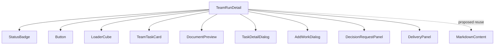
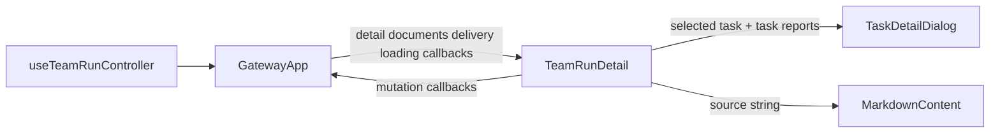
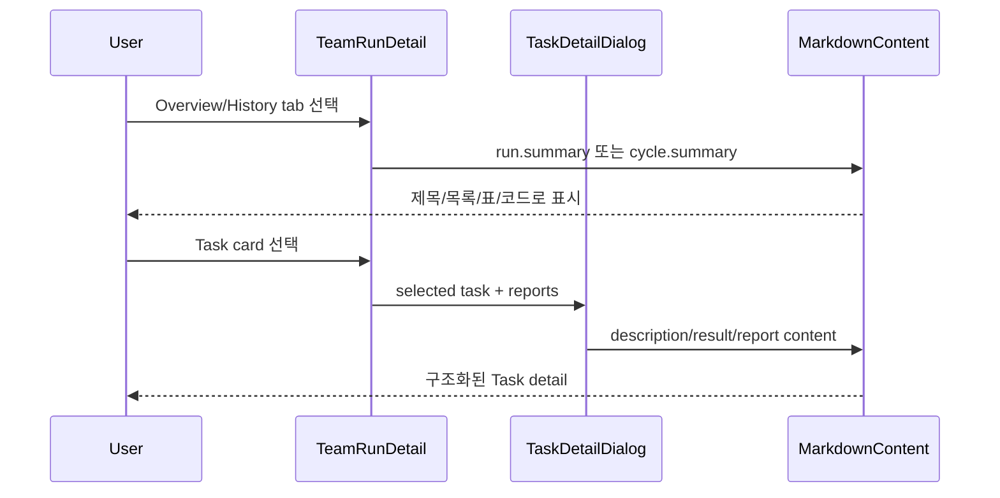

# TeamRunDetail Structured Content Analysis

## 요약

- Root: `frontend/src/components/organisms/TeamRunDetail/index.jsx`
- Modes: `understand`, `refactor`
- Verdict: Team Run의 summary·task description/result·agent report는 Markdown 형태의 구조화된 문자열인데 현재 일반 `
`/`
`로 출력한다. 이미 Chat에서 검증된 `MarkdownContent`를 같은 organism 내부에서 재사용하는 것이 최소 변경이다.

## 범위

| 항목 | 경로 | 비고 |
|---|---|---|
| Root organism | `frontend/src/components/organisms/TeamRunDetail/index.jsx` | Team Run 상세와 로컬 dialog/tab 상태 |
| Existing renderer | `frontend/src/components/organisms/MarkdownContent/index.jsx` | heading/list/table/code/link Markdown 렌더링 |
| Renderer tests | `frontend/src/components/organisms/MarkdownContent/MarkdownContent.test.jsx` | 구조화 block 계약 |
| Parent/controller | `frontend/src/components/containers/GatewayApp/index.jsx`, `frontend/src/hooks/useTeamRunController.js` | detail read model과 mutation callback 주입 |
| Component tests | `frontend/src/components/organisms/TeamRunDetail/TeamRunDetail.test.jsx` | summary, Cycle, Task dialog와 action 회귀 |
| Styles | `src/personal_agent_gateway/static/styles.css` | `.md`, Team summary/Cycle/dialog layout |

## 컴포넌트 트리

`TaskDetailDialog`, `AddWorkDialog`, `DecisionRequestPanel`, `DeliveryPanel`은 같은 파일의 local child다. 서버 호출은 하지 않고 parent callback만 실행한다.

## Props 흐름

주요 read props는 `detail`, `documents`, `delivery`, loading/error 상태다. action props는 document load, add/resume/decision/retry/cancel, Cycle policy, delivery refresh/commit/apply/conflict 해결이다. 화면은 이 callback을 호출할 뿐 API 계약을 해석하지 않는다.

## 상태와 Effects

- `activeTab`, `selectedTaskId`, `previewDoc`, `workDialogOpen`: tab과 local disclosure/modal 상태다.
- `cycleInstruction`, `workInput` 및 pending flags: form 입력과 중복 submit 방지 상태다.
- `countdownNow` effect: AUTO next run이 있을 때만 1초 timer를 만들고 deadline 또는 unmount에서 해제한다.
- `reportsByTask`: `agent_output` message의 `metadata.task_id`로 Task dialog의 공유 문서를 파생한다.
- `currentCycle`, `previousCycle`, `currentCycleTasks`: 정렬된 Cycle과 Task cycle_id에서 표시 범위를 파생한다.

## 외부 및 로컬 의존성

| 의존성 | 이 컴포넌트에서의 역할 |
|---|---|
| React `useState` | dialog/tab/form/pending UI를 관리한다. |
| React `useEffect` | AUTO countdown timer lifecycle을 관리한다. |
| `StatusBadge` | Run, Cycle, Task 상태를 공통 표현한다. |
| `Button` | action 버튼의 크기/variant/disabled 계약을 통일한다. |
| `LoaderCube` | detail aggregate가 준비되기 전 loading boundary다. |
| `TeamTaskCard` | Task board card와 modal open action을 제공한다. |
| `DocumentPreview` | workspace 문서 preview modal을 맡는다. |
| `MarkdownContent` | heading, list, table, code, link를 React node로 안전하게 변환한다. 외부 markdown package를 추가하지 않는다. |

## Custom hooks / selectors / actions

| 항목 | 역할 |
|---|---|
| Custom hook/store | 없음. 서버 상태는 parent가 props로 주입한다. |
| `onTriggerCycle` | instruction과 previous cycle id를 controller에 전달한다. |
| `onRetryTask` | 선택된 실패 Task를 재시도한다. |
| `onLoadDocument` | 선택한 workspace document content를 읽는다. |
| delivery callbacks | preview 갱신, commit/apply, conflict resolve/continue/cancel을 parent에 위임한다. |

## 주요 상호작용 흐름

1. Overview는 `run.summary`를 우선하고 없으면 current Cycle summary를 표시한다.
2. History는 각 Cycle disclosure 내부에서 summary를 표시한다.
3. Task card click은 `selectedTaskId`만 바꾸며, dialog는 Task 본문과 해당 Task의 agent outputs를 표시한다.
4. Markdown renderer는 source가 plain text면 한 paragraph로 유지하므로 기존 비-Markdown 내용도 손실 없이 표시된다.

## 리팩터링 판단

- `유지`: Team Run content presentation은 `TeamRunDetail`의 책임이다. API/model 변경은 필요 없다.
- `shared 승격` 불필요: `MarkdownContent`가 이미 organism으로 존재하고 Chat에서 사용된다. 새 renderer나 wrapper를 만들지 않고 직접 재사용한다. 노력/위험: 낮음.
- `반복 제거(DRY)`: summary 출력이 previous Cycle, history, overview 세 곳에 반복되지만 각 container layout이 다르다. 공용 renderer만 삽입하고 새 Summary 컴포넌트 추출은 하지 않는다. 노력/위험: 낮음.
- `프레젠테이션 분해`: 파일과 render body가 크지만 이미 local child로 dialog/delivery가 분리되어 있다. 이번 표시 변경과 무관한 추가 분해는 범위를 넘는다. 노력/위험: 중간, 보류.
- inline pure derivation: `currentCycle`/`reportsByTask` 등은 이름 있는 helper 또는 짧은 파생식이다. 추가 helper 추출 대상 없음.

## 권장 후속 작업

1. `MarkdownContent`를 import하고 previous Cycle, Cycle History, Latest/Current Summary에 적용한다.
2. Task dialog의 description, result/error, shared report content에도 같은 renderer를 적용한다.
3. Markdown heading/list를 포함한 component test로 semantic rendering을 검증한다.
4. 기존 `.md` 스타일을 사용하고 container별 간격만 필요한 만큼 좁게 조정한다.

## 스킬 핸드오프

- `vercel-react-best-practices`: 새 parser/dependency나 별도 state를 만들지 않고 기존 renderer를 직접 import해 bundle 중복과 re-render state를 피한다.

## 리뷰

- Verdict: PASS
- Rounds: 1
- Fixed: 독립 재검토에서 local child imports, 모든 props group, local state/effect, summary 4개 출력 지점, Task dialog 3개 출력 지점, `MarkdownContent`의 plain-text fallback과 기존 tests를 다시 대조했다. 불일치 없음.

## 근거

- `frontend/src/components/organisms/TeamRunDetail/index.jsx:1-190,593-705,826-842,1007-1055,1101-1170,1256-1273`
- `frontend/src/components/organisms/MarkdownContent/index.jsx`
- `frontend/src/components/organisms/MarkdownContent/MarkdownContent.test.jsx`
- `src/personal_agent_gateway/static/styles.css:837-949,3231-3378,4463-4477`
- Search: `rg -n "summary|task.description|task.result|message.content|selectedTaskId|reportsByTask" frontend/src/components/organisms/TeamRunDetail/index.jsx`
