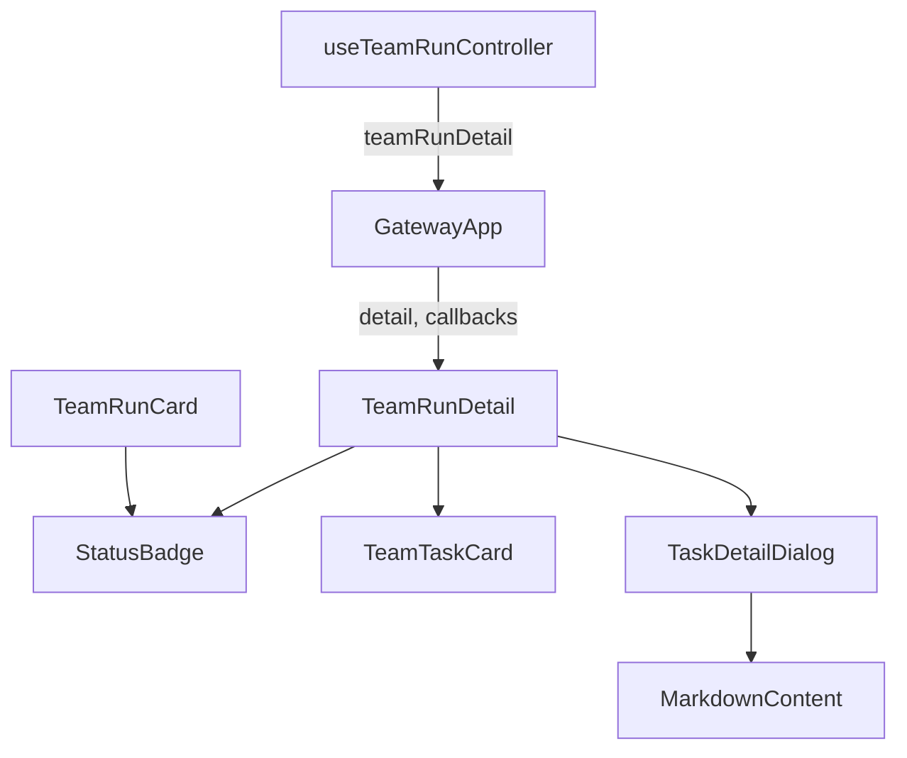
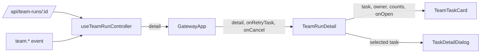
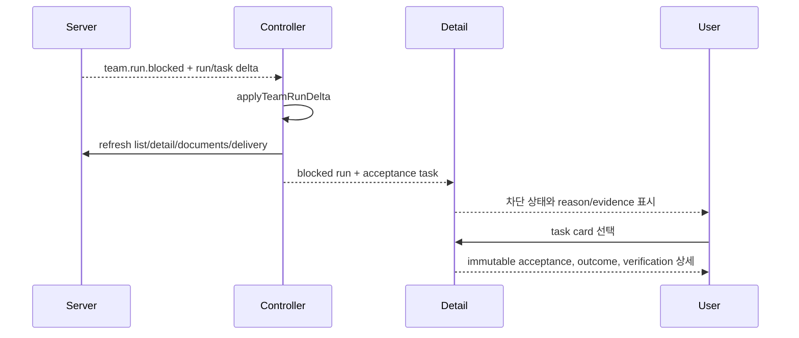

# TeamRunDetail Blocked Acceptance Analysis

## 요약

- Root: `frontend/src/components/organisms/TeamRunDetail/index.jsx`
- Modes: `understand`, `api-state`, `test`
- Verdict: 기존 UI에는 task `blocked` 열과 영문 상태 표시는 있으나, run의 terminal/phase 판단과 SSE refresh 목록에는 `blocked`가 빠져 있다. task acceptance 계약과 stable reason code도 상세 화면에 노출되지 않는다.

## 범위

| 항목 | 경로 | 비고 |
|---|---|---|
| 상세 합성 | `frontend/src/components/organisms/TeamRunDetail/index.jsx` | run/cycle/task 상태, task dialog |
| task 카드 | `frontend/src/components/molecules/TeamTaskCard/index.jsx` | task 상태와 오류 요약 |
| run 카드 | `frontend/src/components/molecules/TeamRunCard/index.jsx` | run badge와 task segment |
| 상태 atom | `frontend/src/components/atoms/StatusBadge/index.jsx` | `blocked` label 보유 |
| controller | `frontend/src/hooks/useTeamRunController.js` | REST load, SSE delta/refresh |
| tests | 각 컴포넌트의 `*.test.jsx`, `useTeamRunController.test.jsx` | blocked acceptance 회귀 추가 대상 |

## 컴포넌트 트리

`TeamRunDetail`은 로컬 dialog/tab/action state를 소유하고, task 목록은
`TeamTaskCard`에 위임한다. 선택된 task의 상세 계약은 같은 파일의
`TaskDetailDialog`가 렌더링하므로 acceptance 표시는 새 컴포넌트 없이 이 경계에
추가하는 것이 가장 작다.

## Props 흐름

`TeamTaskCard`와 `TeamRunCard`는 전달받은 객체만 표시하는 presentational
component다. `TeamRunDetail`의 파생값(`selectedTask`, `currentCycleTasks`,
`canRetrySelectedTask`)도 render 중 계산되며 별도 effect로 복제되지 않는다.

## State / Effects와 외부 동작

| hook/callback | 이 화면에서의 역할 |
|---|---|
| `useTeamRunController` load effect | 선택 run이 바뀌면 detail/documents/delivery를 병렬 요청하고 stale 응답을 폐기한다. |
| `handleTeamEvent` | SSE delta를 `applyTeamRunDelta`로 병합하고 terminal 성격 이벤트는 목록/detail을 재조회한다. |
| `TeamRunDetail` local `useState` | tab, 선택 task, dialog, action pending 상태만 소유한다. 서버 outcome을 복제하지 않는다. |
| `onRetryTask` | 선택 task가 재시도 가능한 실패 상태일 때 부모가 주입한 API 동작을 호출한다. |

외부 primitive는 React `useState`/`useEffect`/`useCallback`/`useRef`,
Testing Library, 그리고 로컬 `StatusBadge`/`Button`이다. `StatusBadge`는 이미
`blocked`를 `BLOCKED`로 표현하므로 새 상태 atom은 필요 없다. 서버 데이터는
`api.teamRunDetail`, `api.teamRuns`, `api.teamDocuments`,
`api.teamRunDelivery`에서 오며 controller가 request ownership을 검사한다.

## 상호작용 흐름

## API / 상태 경계

- `src/personal_agent_gateway/api/team_runs.py`의 `_TERMINAL`에는 `blocked`가
  없어 terminal retry/guard 판단이 잘못될 수 있다.
- `_task_payload`가 현재 저장된 acceptance 필드를 직렬화하는지 확인하고,
  `required`, `acceptance`, `outcome`, `acceptance_result`를 객체로 보장해야 한다.
- `useTeamRunController.handleTeamEvent`의 refresh event 목록에
  `team.run.blocked`가 없어 카드 목록이 stale해질 수 있다.
- `TeamRunDetail`의 `TERMINAL_STATUSES`, `RUN_PHASES.done`,
  previous-cycle 선택에서 `blocked`가 누락되어 완료 단계와 terminal action이
  일관되지 않다.

## 테스트

기존 테스트는 completed/failed 및 task blocked 열을 일부 다루지만 다음 RED
case가 필요하다.

1. API detail task가 acceptance 네 필드를 객체로 반환한다.
2. backend terminal collection과 controller terminal-event refresh가 `blocked`를 처리한다.
3. `TeamTaskCard`가 `차단됨`, stable reason code, 안전한 진단을 표시한다.
4. `TeamRunCard`와 `TeamRunDetail`이 run `blocked`를 완료로 표시하지 않는다.
5. task dialog가 required output과 verification 결과를 표시한다.

## 권장 후속 작업

1. 새 workflow control 없이 기존 badge/card/dialog만 확장한다.
2. status label helper를 모듈 상수로 두고 단순 문자열 파생을 유지한다.
3. acceptance의 서버 객체를 local state로 복제하지 않고 render 시 직접 읽는다.
4. `team.run.blocked`를 기존 terminal refresh 흐름에 포함한다.

## 스킬 핸드오프

- `superpowers:test-driven-development`: 위 RED case를 먼저 추가한 뒤 최소 구현한다.
- `superpowers:verification-before-completion`: backend, focused Vitest, frontend build를 검증한다.

## 리뷰

- Verdict: PASS
- Rounds: 1
- Fixed: `GatewayApp` usage, REST 호출, `StatusBadge.blocked`, terminal/phase 목록,
  task retry 조건을 코드에서 재대조했다. controller에는 polling collection이 없으므로
  테스트 설명을 실제 구조인 terminal-event refresh로 정정했다.

## 근거

- `frontend/src/components/organisms/TeamRunDetail/index.jsx:11`
- `frontend/src/components/organisms/TeamRunDetail/index.jsx:21`
- `frontend/src/components/organisms/TeamRunDetail/index.jsx:123`
- `frontend/src/components/organisms/TeamRunDetail/index.jsx:614`
- `frontend/src/components/organisms/TeamRunDetail/index.jsx:704`
- `frontend/src/components/organisms/TeamRunDetail/index.jsx:1163`
- `frontend/src/components/molecules/TeamTaskCard/index.jsx:16`
- `frontend/src/components/molecules/TeamRunCard/index.jsx:32`
- `frontend/src/hooks/useTeamRunController.js:4`
- `frontend/src/hooks/useTeamRunController.js:101`
- `src/personal_agent_gateway/api/team_runs.py:34`
- `src/personal_agent_gateway/api/team_runs.py:1244`
