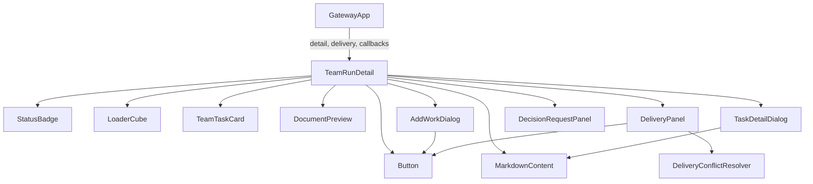
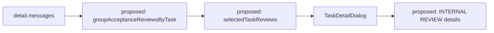
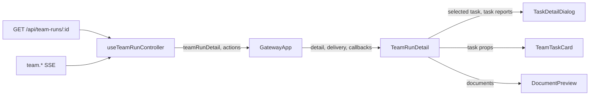
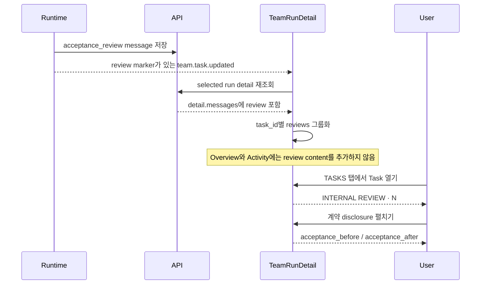

# TeamRunDetail Internal Acceptance Review Analysis

## 요약

- Root: `frontend/src/components/organisms/TeamRunDetail/index.jsx`
- Modes: `understand`, `test`, `style`
- Verdict: `acceptance_review` 메시지는 Team Run 상세 payload의 `messages`로 전달된다. 별도 endpoint나 화면 state 없이 `metadata.task_id`로 그룹화하고, 선택한 Task의 `TaskDetailDialog` 안에만 감사 이력을 표시하는 것이 가장 작은 UI 변경이다. 다만 현재 `team.task.updated` SSE delta는 `messages`를 갱신하지 않으므로 review 저장 직후 상세 payload를 다시 읽는 명시적 refresh 경로가 필요하다.
- Task의 누적 복구 횟수는 `_task_payload`에 `acceptance_recovery_attempts`를 한 필드 추가해 전달하면 된다.

## 범위

| 항목 | 경로 | 책임 |
|---|---|---|
| 상세 화면 | `frontend/src/components/organisms/TeamRunDetail/index.jsx` | message 파생값, Task 선택, Task 상세 dialog |
| 상세 화면 테스트 | `frontend/src/components/organisms/TeamRunDetail/TeamRunDetail.test.jsx` | Task별 이력 격리와 dialog 한정 노출 |
| 부모 합성 | `frontend/src/components/containers/GatewayApp/index.jsx` | controller의 상세 payload와 callbacks 전달 |
| 상세 데이터 | `frontend/src/hooks/useTeamRunController.js` | REST 상세 조회, SSE delta/refresh |
| 상세 데이터 테스트 | `frontend/src/hooks/useTeamRunController.test.jsx` | review event가 detail messages를 갱신하는지 검증 |
| runtime event | `src/personal_agent_gateway/team_runtime.py` | review 직후의 task update를 명시적으로 식별 |
| API payload | `src/personal_agent_gateway/api/team_runs.py` | Task와 message 직렬화 |
| 전역 스타일 | `src/personal_agent_gateway/static/styles.css` | Task dialog 내부 review disclosure 스타일 |

분석 대상은 내부 acceptance 검토 이력 표시에 직접 필요한 경계로 한정했다. Team Run
Overview 카드, runtime 실행 흐름, acceptance 판정기는 이 UI 변경의 대상이 아니다.

## 컴포넌트 트리

현재 component tree:

`TaskDetailDialog`는 별도 파일이 아니라 `TeamRunDetail/index.jsx`의 로컬
component다. 현재 acceptance 계약, outcome, result, shared documents를 모두 이
dialog가 소유하므로 내부 검토 감사 이력도 같은 경계에 두는 것이 자연스럽다.
`StatusBadge`, `Button`, `LoaderCube`, `TeamTaskCard`, `DocumentPreview`,
`MarkdownContent`는 공유 leaf component로 내부 구현까지 확장하지 않는다.

제안 변경:

## Props 흐름

`_message_payload`는 `kind`, `content`, `metadata`, `created_at`을 이미 그대로
직렬화한다. 따라서 frontend에서 `kind === "acceptance_review"`와
`metadata.task_id`만 확인하면 된다. Task 누적 횟수만 `_task_payload`에 누락되어
있다.

## State / Effects

| 위치 | 현재 상태/효과 | 변경 영향 |
|---|---|---|
| `TeamRunDetail` | `workInput`, `submitting`, `workDialogOpen`으로 추가 작업 dialog 제어 | 변경 없음 |
| `TeamRunDetail` | `cycleInstruction`, `triggeringCycle`, `autoAction`, `resuming`, `canceling`으로 run actions pending 상태 제어 | 변경 없음 |
| `TeamRunDetail` | `retryingTaskId`로 수동 Task retry pending 상태 제어 | 변경 없음 |
| `TeamRunDetail` | `selectedTaskId`로 열린 Task를 식별 | 그대로 사용 |
| `TeamRunDetail` | `previewDoc`, `activeTab`, `showAllTasks`로 문서 preview와 화면 탐색 제어 | Activity에서 review 제외 |
| `TeamRunDetail` | `countdownNow`와 timer effect로 auto-series countdown 갱신 | 변경 없음 |
| `TeamRunDetail` | `messages`에서 reports/activity/handoffs를 render 중 파생 | reviews map 추가, activity에서는 reviews 제외 |
| `TaskDetailDialog` | 전달받은 task/reports를 직접 렌더링 | `reviews` prop만 추가 |
| `DeliveryPanel` | commit message와 delivery action pending state | 변경 없음 |
| `DecisionRequestPanel` | answers와 submit pending state | 변경 없음 |
| `ConflictEditor` | conflict draft state | 변경 없음 |
| `useTeamRunController` load effect | run 선택 시 detail/documents/delivery 병렬 조회, stale 응답 폐기 | 변경 없음 |
| `useTeamRunController.handleTeamEvent` | run/cycle event는 상세 재조회, 일반 task delta는 객체만 병합 | review 표시 event에 한해 detail 재조회 추가 |

내부 검토 이력은 서버 payload에서 결정되는 파생 데이터다. 별도 `useState`,
`useEffect`, `useMemo`를 추가할 이유가 없다. 현재 message 규모와 단순 선형 그룹화
비용에서는 render 중 `Map` 생성이 가장 명확하다.

중요한 현재 제약은 `_publish`가 `team.task.updated`에 task/agent delta만 붙이고,
`applyTeamRunDelta`도 `messages`를 병합하지 않는다는 점이다. review 직후 event에
명시적 marker를 포함하고 controller가 그 event에만 `teamRunDetail`을 재조회해야
새 감사 기록이 실시간으로 보인다. documents/delivery/run list까지 재조회할 필요는
없다.

## 외부 의존성

| 의존성 | 무엇을 제공하는가 | 왜 필요한가 |
|---|---|---|
| React `useState`, `useEffect` | 기존 local interaction/countdown state | 새 review 기능은 hook을 추가하지 않음 |
| `MarkdownContent` | task 설명, 결과, agent 문서의 markdown 표시 | review reason/instruction은 짧은 감사 텍스트이므로 기본 text 렌더링으로 충분 |
| `fmtDateTime` | message 생성 시각 표시 | 각 review 시점을 기존 날짜 형식으로 표현 |
| native `
/
` | 접고 펼치는 disclosure | 새 상태와 이벤트 handler 없이 계약 전후를 선택적으로 노출 |
| global `styles.css` | dialog layout/typography | 이 화면은 `.css.ts`/vanilla-extract가 아니라 전역 CSS를 사용하며, 기존 `team-task-dialog-*` 규칙에 최소 review 스타일 추가 |

새 패키지나 재사용 component는 필요하지 않다.

## 주입 callbacks / hooks

| 이름 | 제공자 | 역할 | review 변경 여부 |
|---|---|---|---|
| `onLoadDocument` | `GatewayApp` | document content 조회 | 변경 없음 |
| `onAddWork`, `onResume`, `onAnswerDecision` | `GatewayApp` / controller | 추가 작업, 중단 run 재개, 사용자 결정 제출 | 변경 없음 |
| `onRetryTask`, `onCancel` | `GatewayApp` / controller | terminal failed Task retry, active run 취소 | 변경 없음 |
| `onTriggerCycle`, `onRetryAuto`, `onContinueAuto`, `onRestartAuto` | `GatewayApp` / controller | 수동/자동 cycle 제어 | 변경 없음 |
| `onRefreshDelivery`, `onCommitDelivery`, `onApplyDelivery` | `GatewayApp` / controller | repository delivery 제어 | 변경 없음 |
| `onResolveDeliveryConflict`, `onContinueDelivery`, `onCancelDeliveryConflicts` | `GatewayApp` / controller | delivery conflict 해소 | 변경 없음 |
| `onClose` | `TeamRunDetail` local callback | Task dialog 닫기 | 변경 없음 |
| `useTeamRunController` | `GatewayApp` | 상세 데이터 load와 SSE refresh | review marker에 대한 detail refresh 추가 |

내부 복구는 runtime에서 자동으로 이루어지므로 UI에 retry/revise action callback을
새로 만들지 않는다. 이 화면은 감사 이력을 읽기 전용으로 보여준다.

## 상호작용 흐름

Task를 열기 전에는 `INTERNAL REVIEW`, rejection reason, instruction이 화면에
나타나지 않아야 한다. 현재 Activity 탭은 모든 message content를 표시하므로
`acceptance_review`를 `activity` 파생 목록에서 제외해야 한다. 다른 Task의 review도
선택 Task dialog에 섞이면 안 된다.

## Style / Layout

- 기존 `.team-task-dialog-body`의 column gap 안에 review section 하나를 추가한다.
- header는 기존 `.team-task-dialog-label` typography를 재사용하고 카운트를 붙인다.
- 각 review는 얇은 border와 내부 spacing으로 구분한다.
- action은 `retry_worker`를 `RETRY WORKER`처럼 읽기 쉬운 uppercase label로 표시한다.
- `reason_code`, reason/instruction, timestamp를 우선 표시한다.
- `acceptance_before`/`acceptance_after`는 native `
` 안에서 `<pre>` 또는
  동등한 mono block으로 보여 주어 기본 화면 밀도를 낮춘다.
- dialog 폭과 Overview/Task 카드 레이아웃은 변경하지 않는다.

## Tests / Stories

기존 `TeamRunDetail.test.jsx`는 Task 상세 dialog의 acceptance 계약과 verification
표시를 검증한다. `tests/test_teams.py`는 review/counter의 원자 저장과 action별
counter 동작을, `tests/test_team_runtime.py`는 review/resubmit/limit/state 유지
흐름을 이미 검증한다. frontend story 파일은 `rg --files frontend` 검색 결과 없다.
이번 UI/API 경계에는 다음 focused case를 추가한다.

1. running Team Run, in-progress Task, `acceptance_review` 한 건을 렌더링한다.
2. Task를 열기 전 Overview와 Activity 모두에서 review content가 보이지 않는지 확인한다.
3. Task를 연 뒤 `INTERNAL REVIEW · 1`, reason code, `RETRY WORKER`, instruction을 확인한다.
4. 다른 `task_id`의 review 내용이 dialog에 없는지 확인한다.
5. review marker가 있는 task SSE 후 controller가 selected run detail을 다시 읽고 새 message를 반영하는지 확인한다.
6. API payload focused test에서 counter가 0에서 review 기록 후 1로 변하는지 확인한다.
7. existing service/runtime tests는 Task 1~3에서 이미 검증했으며, Task 4에서는 변경된 경계의 exact tests와 frontend build만 실행한다.

전체 frontend test suite나 전체 Python suite는 이 변경의 기본 검증 범위가 아니다.

## 권장 후속 작업

1. `groupReportsByTask`와 같은 모듈 helper로
   `groupAcceptanceReviewsByTask(messages)`를 추가한다.
2. render 중 `reviewsByTask`와 `selectedTaskReviews`를 파생한다.
3. `activity`에서는 `acceptance_review`를 제외해 선택 Task 외부 노출을 막는다.
4. `TaskDetailDialog`에 `reviews` prop을 전달하고, review가 있을 때만 읽기 전용
   section을 렌더링한다.
5. `_task_payload`에 `acceptance_recovery_attempts` 한 필드만 추가한다.
6. runtime의 review 직후 task event에 marker를 추가하고, controller가 marker event에
   대해 detail만 재조회하도록 한다.

## 스킬 핸드오프

- `superpowers:test-driven-development`: API payload와 dialog visibility RED test를 먼저 추가한다.
- `vercel-react-best-practices`: server-derived review 목록을 local state/effect로 복제하지 않는다.
- `superpowers:verification-before-completion`: focused API test, exact Vitest file, frontend build 결과를 확인한다.

## 리뷰

- Verdict: PASS
- Rounds: 2
- Fixed: 현재/제안 diagram을 분리하고 material children, state, callbacks를 보완했다.
  review 직후 message freshness 결함을 확인해 명시적 SSE marker/detail refresh와
  controller test를 제안했다. Activity에서 review를 제외해 Task 상세 전용 노출
  조건을 맞췄고 기존 service/runtime test와 story 부재를 기록했다.

## 근거

- `frontend/src/components/organisms/TeamRunDetail/index.jsx:110`
- `frontend/src/components/organisms/TeamRunDetail/index.jsx:133`
- `frontend/src/components/organisms/TeamRunDetail/index.jsx:163`
- `frontend/src/components/organisms/TeamRunDetail/index.jsx:183`
- `frontend/src/components/organisms/TeamRunDetail/index.jsx:222`
- `frontend/src/components/organisms/TeamRunDetail/index.jsx:677`
- `frontend/src/components/organisms/TeamRunDetail/index.jsx:742`
- `frontend/src/components/organisms/TeamRunDetail/index.jsx:765`
- `frontend/src/components/organisms/TeamRunDetail/index.jsx:771`
- `frontend/src/components/organisms/TeamRunDetail/index.jsx:1368`
- `frontend/src/components/containers/GatewayApp/index.jsx:843`
- `frontend/src/hooks/useTeamRunController.js:56`
- `frontend/src/hooks/useTeamRunController.js:101`
- `frontend/src/hooks/useTeamRunController.test.jsx:141`
- `frontend/src/components/organisms/TeamRunDetail/TeamRunDetail.test.jsx:673`
- `src/personal_agent_gateway/team_runtime.py:750`
- `src/personal_agent_gateway/team_runtime.py:1363`
- `src/personal_agent_gateway/teams.py:1254`
- `src/personal_agent_gateway/api/team_runs.py:1250`
- `src/personal_agent_gateway/api/team_runs.py:1278`
- `src/personal_agent_gateway/static/styles.css:3384`
- `docs/superpowers/plans/2026-07-30-team-acceptance-internal-recovery.md:650`

문서 registry script는 root `package.json`에 `docs:registry`가 없어 실행하지 않았다.
