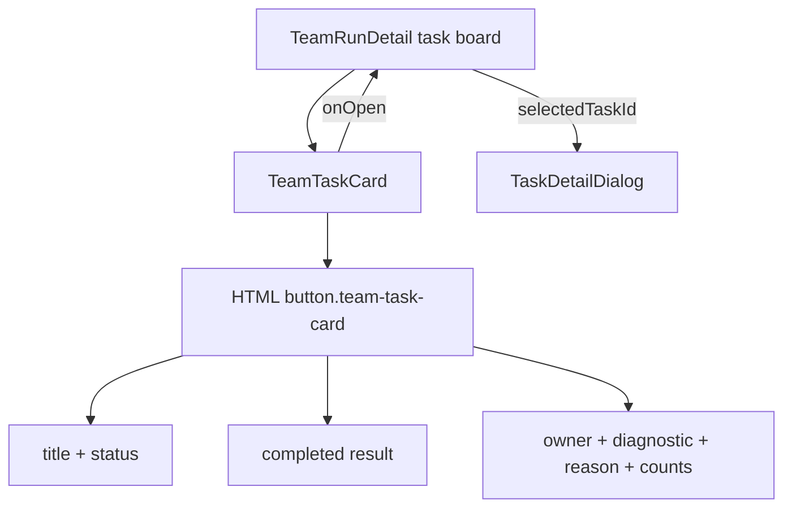
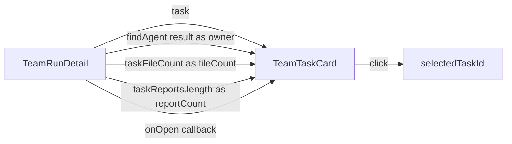
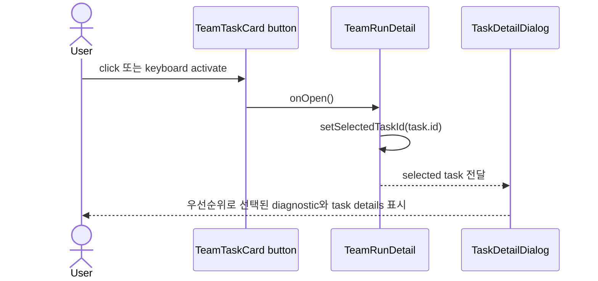

# TeamTaskCard 컴포넌트 분석

## 요약

- Root: `frontend/src/components/molecules/TeamTaskCard/index.jsx`
- Modes: `understand`, `style`, `test`
- Verdict: 긴 실패 진단이 metadata flex row의 intrinsic width를 키우는 구조가 화면 깨짐의 직접 원인이다. 진단을 별도 clamp 영역으로 옮기고 grid/card의 최소 너비를 0으로 제한하는 국소 변경이 적합하다.

## 범위

| 항목 | 경로 | 비고 |
|---|---|---|
| Root component | `frontend/src/components/molecules/TeamTaskCard/index.jsx` | props 파생과 전체 카드 markup |
| Parent usage | `frontend/src/components/organisms/TeamRunDetail/index.jsx:1309` | 5열 board, task 매핑, 상세 dialog 선택 |
| Style | `src/personal_agent_gateway/static/styles.css:3088` | board, column, card, result, metadata 규칙 |
| Unit test | `frontend/src/components/molecules/TeamTaskCard/TeamTaskCard.test.jsx` | avatar, unassigned, result/count, blocked 진단 |
| Catalog | `frontend/src/components/references/molecules.md:23` | props 표기가 현재 `fileCount/reportCount`와 다름; 이번 버그 범위 밖 |

## 컴포넌트 트리

`TeamTaskCard`는 local child component를 import하지 않는다. avatar는 조건에 따라 `` 또는 initials ``으로 직접 렌더링하며, card 전체가 하나의 native `<button>`이다.

## Props 흐름

| Prop | 공급자 | 이 컴포넌트에서의 역할 |
|---|---|---|
| `task` | `TeamRunDetail`의 `visibleTasks.map` | title/status/result/error/outcome/acceptance reason을 표시한다. |
| `owner` | `findAgent(agents, task.owner_agent_id)` | avatar 또는 initials와 이름을 표시한다. |
| `fileCount` | `taskFileCount(taskReports)` | metadata의 `FILES N`을 표시한다. 기본값은 0이다. |
| `reportCount` | `taskReports.length` | metadata의 `REPORTS N`을 표시한다. 기본값은 0이다. |
| `onOpen` | `() => setSelectedTaskId(task.id)` | button click을 부모의 상세 dialog 상태로 연결한다. |

## 상태와 효과

`TeamTaskCard` 자체에는 `useState`, `useEffect`, memo, store selector가 없다. render 중 `avatar`, `noteText`, `reasonCode`, `statusLabel(task.status)`를 순수하게 파생한다. `note(task)`는 `failed/blocked`에만 진단을 만든다. `error_message`가 reason code와 다르면 error를 우선하고, 같으면 `outcome.summary`를 거친 뒤 같은 error로 fallback할 수 있다. 따라서 reason code와 진단의 중복 제거를 항상 보장하지는 않는다.

| Hook / selector / action | 역할 |
|---|---|
| 없음 | component 내부 구독이나 side effect가 없다. |
| parent-injected `onOpen` | `TeamRunDetail`의 `setSelectedTaskId`를 호출해 `TaskDetailDialog`를 연다. |

## 외부 primitive와 상호작용

- React automatic JSX runtime: 별도 React import 없이 조건부 JSX를 DOM으로 만든다. 이번 변경은 기존처럼 `condition ? element : null`을 유지해 숫자형 falsy 값이 노출되는 조건부 렌더 문제를 만들지 않는다.
- Native `<button>`: card 전체에 keyboard focus와 click semantics를 제공한다. markup 내부에서 진단 위치를 옮겨도 `onClick={onOpen}`과 `aria-label`은 그대로 유지된다.
- Native ``: persona avatar가 있을 때만 표시하고 `alt=""`로 장식 이미지로 취급한다. avatar가 없으면 initials 또는 `UNASSIGNED`가 남는다.

주요 상호작용은 하나다.

상세 dialog의 diagnostic은 card DOM에서 읽지 않고 원본 task에서 다시 파생하므로, card clamp와 markup 이동은 원본 task 데이터를 변경하지 않는다. 다만 표시 우선순위는 서로 다르다. dialog는 `task.result → error_message( reasonCode와 다를 때 ) → outcome.summary/error_message` 순서이고(`TeamRunDetail/index.jsx:157`), card는 completed `task.result`와 failed/blocked `note(task)`를 별도 영역으로 동시에 렌더할 수 있다. 따라서 dialog가 card와 항상 같은 진단 문자열 전체를 보여준다고 가정하면 안 된다.

## 스타일과 레이아웃

- `styles.css:3090`의 `repeat(5, 1fr)`는 grid track의 자동 최소 크기를 유지한다. 긴 hash/path를 가진 자식의 min-content width가 열 너비를 밀어낼 수 있다.
- `styles.css:3166`의 `.team-task-meta`는 owner, 긴 `.team-task-note`, reason code, FILES, REPORTS를 한 flex row에 둔다. screenshot의 붉은 실패 문단은 이 row의 flex item이며 별도 line clamp가 없다.
- `.team-task-result`에는 이미 3줄 clamp가 있지만 실패/차단 진단에는 적용되지 않는다.
- `.team-task-owner-profile`만 `min-width: 0`을 가진다. column, column body, card, title, metadata에는 shrink 경계를 보장하는 규칙이 없다.
- card 시각 token은 `--bd-sm`(card/status/avatar 경계), `--c-white`(card 배경), `--c-panel`(hover/focus 배경), `--c-danger`(failed 진단), `--c-warn`(blocked/reason 진단)을 사용한다. 이번 수정은 색상·경계 token을 바꾸지 않고 layout class만 분리해야 한다.
- 같은 stylesheet에는 `minmax(0, 1fr)` grid 패턴이 여러 곳(`styles.css:2493`, `2624`, `3490`, `4654`)에 있고, `.archive-entry-row > span`은 `display: -webkit-box` + hidden overflow + line clamp 패턴을 쓴다(`styles.css:4887`). 신규 helper abstraction 없이 이 로컬 패턴을 `.team-task-board`와 `.team-task-diagnostic`에 직접 적용하는 것이 현재 plain CSS 구성과 일치한다.

권장 최소 변경은 다음과 같다.

1. 진단을 metadata 밖의 `.team-task-diagnostic` block으로 옮긴다.
2. 해당 block을 3줄 clamp하고 `overflow-wrap: anywhere`를 준다.
3. board track을 `minmax(0, 1fr)`로 바꾸고 column/card 계층에 `min-width: 0`을 준다.
4. FILES/REPORTS는 `flex: none`으로 유지하고 reason code는 metadata 안에서 shrink/clip하도록 제한한다.

## 테스트와 story

현재 unit test 4개가 avatar, `UNASSIGNED`, 완료 result/count, blocked label/reason/diagnostic을 검증한다. story 파일은 없다. `TeamRunDetail` test는 task board와 dialog 통합을 넓게 검증하지만 긴 진단의 DOM 위치는 고정하지 않는다.

누락된 RED case는 “매우 긴 failed error가 `.team-task-meta` 밖의 `.team-task-diagnostic`에 렌더되고 metadata에는 FILES/REPORTS가 남는다”이다. jsdom은 실제 grid 폭을 계산하지 않으므로 DOM 책임 경계를 unit test로 잠그고, CSS 변경은 production build와 첨부 사례의 구조적 원인 제거로 검증하는 편이 안정적이다.

## 권장 후속 작업

1. `TeamTaskCard.test.jsx`에 긴 failed diagnostic의 metadata 외부 렌더 테스트를 먼저 추가한다.
2. `TeamTaskCard`에서 진단 markup만 metadata 앞쪽으로 이동하고 props/click contract는 유지한다.
3. `styles.css`에 zero-minimum grid와 clamp 규칙만 추가한다.
4. `TeamTaskCard`, `TeamRunDetail` tests와 Vite production build를 실행한다.

## 스킬 핸드오프

- `superpowers:test-driven-development`: DOM 책임 변경을 RED→GREEN으로 구현한다.
- `vercel-react-best-practices`: 기존 explicit ternary conditional rendering을 유지하고 불필요한 state/memo를 추가하지 않는다.
- 추가 refactor skill은 필요하지 않다. component 책임과 public props를 바꾸지 않는 국소 layout 수정이다.

## 리뷰

- Verdict: PASS
- Rounds: 3
- Fixed: `note()`의 실제 fallback과 `statusLabel` 파생을 명시했고, card와 dialog의 서로 다른 diagnostic 우선순위를 본문과 Mermaid에 반영했으며, style token과 기존 zero-minimum/clamp 패턴 근거를 추가했다.

## 근거

- `rg -n "TeamTaskCard" frontend/src`
- `frontend/src/components/molecules/TeamTaskCard/index.jsx:1-70`
- `frontend/src/components/molecules/TeamTaskCard/TeamTaskCard.test.jsx:1-65`
- `frontend/src/components/organisms/TeamRunDetail/index.jsx:144-220`
- `frontend/src/components/organisms/TeamRunDetail/index.jsx:1309-1340`
- `src/personal_agent_gateway/static/styles.css:3088-3220`
- baseline: `TeamTaskCard.test.jsx` 4 tests passed on 2026-08-07
- independent review: round 1/2 `CHANGES_REQUIRED`, round 3 `VERDICT: PASS`
