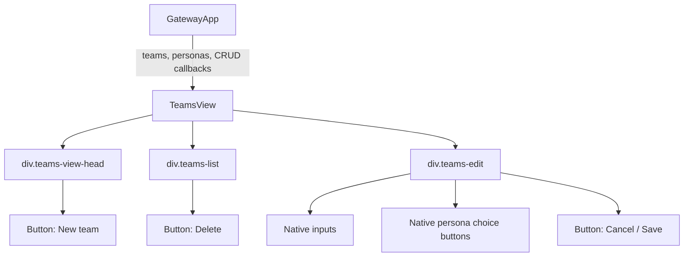
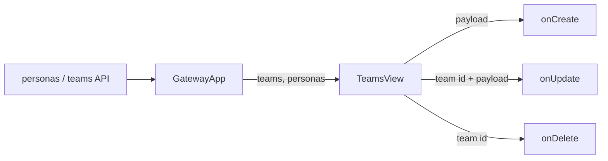
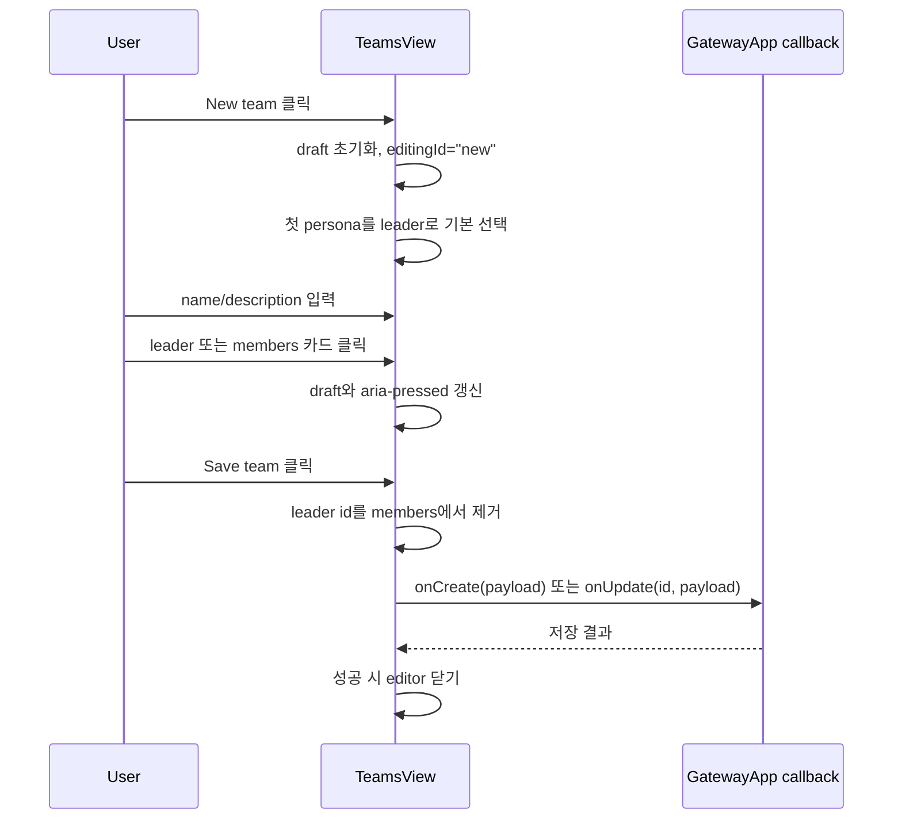

# TeamsView Persona Card Selection Component Analysis

## 요약

- Root: `frontend/src/components/organisms/TeamsView/index.jsx`
- Modes: `understand`, `style`, `test`
- Verdict: `personas` prop에 이미 `avatar`, `name`, `role`이 있으므로 API 변경 없이 현재 이름 버튼을 프로필 선택 카드로 바꾸는 것이 안전하다. 로컬 state와 저장 payload는 유지하고 표현과 테스트만 보강한다.

## 범위

| 항목 | 경로 | 비고 |
| --- | --- | --- |
| Root | `frontend/src/components/organisms/TeamsView/index.jsx` | Team CRUD와 leader/member draft 선택 |
| Parent usage | `frontend/src/components/containers/GatewayApp/index.jsx` | personas와 CRUD callback 주입 |
| Test | `frontend/src/components/organisms/TeamsView/TeamsView.test.jsx` | 생성, leader/member 정합성, 기존 Team 목록 |
| Global style | `src/personal_agent_gateway/static/styles.css` | `.teams-*`와 현재 `.teams-persona` 표현 |
| Avatar source contract | `frontend/src/components/organisms/PersonaLibrary/index.jsx` | `/static/avatars/{avatar}.png` 사용 |
| Similar roster UI | `frontend/src/components/organisms/TeamRunForm/index.jsx` | 이름·역할·avatar fallback 카드 패턴 |

Story 파일은 `frontend/src` 검색에서 확인되지 않았다.

## 컴포넌트 트리

`div.teams-view-head`, `div.teams-list`, `div.teams-edit`은 별도 React 컴포넌트가 아니라 `TeamsView` 내부 DOM 영역이다. 실제 import인 shared `Button`은 public API만 사용하므로 leaf로 취급한다. Persona 선택도 별도 child가 아니라 root 안의 native `<button>` 반복이다.

## Props 흐름

| prop | 역할 | 근거 |
| --- | --- | --- |
| `teams` | 왼쪽 목록과 edit draft 초기값 | `TeamsView/index.jsx`의 `teams.map`, `startEdit` |
| `personas` | leader/member 후보와 기본 leader | `personas.map`, leader 기본값 effect |
| `onCreate` | 새 Team payload 저장 | `save()`의 `editingId === "new"` 분기 |
| `onUpdate` | 기존 Team payload 저장 | `save()` update 분기 |
| `onDelete` | Team 삭제 요청 | 목록 Delete button |

## State / Effects

| state/effect | 읽기/변경 | UI 영향 |
| --- | --- | --- |
| `editingId` | 목록 edit 또는 `"new"` | editor 표시와 header 문구 결정 |
| `draft` | name, description, leader id, member ids | input과 `aria-pressed`, save payload의 source |
| leader default effect | 새 editor이고 leader가 비었을 때 첫 persona 선택 | Save 가능 상태와 기본 leader 결정 |
| `toggleMember` | member id 포함 여부를 functional update | 다중 선택 상태 변경 |
| `save` | leader를 member 목록에서 제거 후 callback | 기존 데이터 계약 보호 |

현재 `map`/`filter` 반복이 성능 병목이라는 근거가 없으므로 별도 `useMemo`를 추가하지 않는다. 선택 이벤트는 effect가 아니라 click handler에서 직접 draft를 갱신해 React re-render 범위를 root 한 곳으로 유지한다.

## 외부 primitive와 주입 동작

| primitive/action | 여기서 하는 일 | 사용하는 이유 |
| --- | --- | --- |
| React `useState` | edit target과 form draft 소유 | 저장 전 로컬 편집을 격리 |
| React `useEffect` | 새 Team의 첫 leader 기본값 동기화 | personas가 비동기로 들어오는 경우도 처리 |
| Native `<button aria-pressed>` | leader 단일 선택과 member 다중 선택 상태 제공 | keyboard 동작과 선택 semantics 유지 |
| Shared `Button` | create/delete/cancel/save action 표현 | 기존 variant와 disabled 스타일 재사용 |
| `onCreate`, `onUpdate`, `onDelete` | parent가 주입한 API mutation 경계 | TeamsView가 HTTP adapter를 직접 소유하지 않게 함 |

Custom hook, store selector, dispatch action은 없다. `GatewayApp`이 `api.personas()`와 `api.teams()`를 화면 진입 시 읽고 mutation callback을 주입한다.

## 주요 상호작용 흐름

기존 Team 행을 누르면 `startEdit`가 server read model을 draft로 복사한다. Cancel은 mutation 없이 editor만 닫고, Delete는 parent callback에 Team id를 전달한다.

## 스타일 / 레이아웃

현재 `.teams-persona-choices`는 `display:flex; flex-wrap:wrap`이고 `.teams-persona`는 이름 한 줄과 6px/11px padding만 가진 작은 버튼이다. 그 결과 다음 정보가 사용되지 않는다.

- `persona.avatar`: Persona Library와 Team Run 화면에서는 `/static/avatars/{avatar}.png`로 이미 표시한다.
- `persona.role`: 선택 후보를 구분하는 주요 정보지만 TeamsView에서는 렌더링하지 않는다.
- 선택 범위: member가 몇 명 선택됐는지 editor 안에서 즉시 확인할 수 없다.

전역 `:root`에는 `--c-black`, `--c-white`, `--c-panel`, `--c-grey` 색상 토큰과 `--bd`, `--bd-hero`, `--bd-sm`, `--bd-in` border 토큰이 정의되어 있다. 반면 현재 `.teams-*` 블록은 `#000`, `#fff`, `#808080`, `3px/5px/2px` 값을 직접 사용한다. 이번 변경은 `.teams-*` 내부의 기존 표현과 결과 색을 유지하되, 새 카드 규칙에서는 대응되는 전역 토큰을 사용해 신규 하드코딩을 늘리지 않는다. 기존 Teams 스타일 전체의 토큰 전환은 요청 범위를 벗어나므로 하지 않는다.

안전한 변경은 `.teams-*` 범위 안에서만 다음을 적용하는 것이다.

1. 후보 영역을 `auto-fill/minmax` grid로 바꿔 넓은 화면에서는 카드, 좁은 화면에서는 한 열로 흐르게 한다.
2. 카드에 48px avatar, 이름, role, 선택 state label을 표시한다.
3. avatar가 없으면 이름 이니셜을 같은 크기의 fallback으로 표시한다.
4. `aria-pressed`와 native button은 유지하고 active는 배경 반전으로 표현한다.
5. leader/member section header에 required/selected count를 표시한다. member count는 draft 배열 길이가 아니라 `draft.member_persona_ids.filter((id) => id !== draft.leader_persona_id).length`로 계산해, 기존 member를 leader로 승격한 직후에도 화면과 저장 payload가 일치하게 한다.

카드 안에 이름 외 role과 선택 상태를 추가하면 버튼의 accessible name이 합쳐질 수 있다. 기존 테스트와 assistive technology의 안정적인 식별을 위해 버튼에 `aria-label={persona.name}`을 명시하고 `aria-pressed`를 유지한다.

`TeamRunForm`의 전역 class를 재사용하면 화면 간 CSS coupling이 생기므로 TeamsView 전용 class를 추가하는 편이 안전하다.

## 테스트 / Story

기존 3개 Vitest는 다음을 보호한다.

- 새 Team 생성 callback
- member였던 persona를 leader로 저장할 때 member payload에서 제거
- 기존 Team 목록 표시

누락된 RED case:

- avatar가 있는 persona card가 `/static/avatars/{avatar}.png`를 렌더링한다.
- role과 선택 수가 표시된다.
- avatar가 없는 persona는 이니셜 fallback을 표시한다.
- 카드 변경 후에도 `aria-pressed`와 create payload가 기존대로 동작한다.
- 카드에 role/state 문구가 추가되어도 버튼의 accessible name이 정확한 persona 이름으로 유지된다.
- member를 선택한 뒤 같은 persona를 leader로 승격하면 화면의 member count가 leader를 제외해 `0 SELECTED`가 되고 저장 payload에도 해당 id가 포함되지 않는다.

Storybook 파일은 없으므로 Vitest DOM assertion을 회귀 Gate로 사용한다.

## 권장 후속 작업

1. `TeamsView.test.jsx`에 avatar, role, fallback, 안정적인 accessible name, selected count RED test를 추가한다. leader 승격 case는 표시 count와 저장 payload를 함께 검증한다.
2. root 안에 작은 presentational `PersonaChoice`와 `initials` helper를 두고 leader/member 반복에서 재사용한다.
3. `.teams-persona*` CSS만 교체·확장하고 Team CRUD callback과 payload는 바꾸지 않는다.
4. TeamsView test, GatewayApp test, 전체 frontend test와 production build를 실행한다.

## 스킬 핸드오프

- `vercel-react-best-practices`: 단순 파생값에 불필요한 memo를 넣지 않고 functional state update와 native button semantics를 유지한다.
- 별도 design-system 승격은 필요하지 않다. 이 선택 카드는 TeamsView draft 계약에 묶인 feature-owned UI다.

## 리뷰

- Verdict: PASS
- Rounds: 2
- Fixed: 실제 DOM 영역 표기, 근거 없는 persona 수 가정 제거, 전역 style token 분석, leader 제외 count 규칙, 카드 accessible name 회귀 조건을 보완한 뒤 독립 재검토 통과

## 근거

- `frontend/src/components/organisms/TeamsView/index.jsx`
- `frontend/src/components/organisms/TeamsView/TeamsView.test.jsx`
- `frontend/src/components/containers/GatewayApp/index.jsx:181`
- `frontend/src/components/containers/GatewayApp/index.jsx:698`
- `frontend/src/components/organisms/PersonaLibrary/index.jsx:227`
- `frontend/src/components/organisms/TeamRunForm/index.jsx`
- `src/personal_agent_gateway/static/styles.css:3818`
- `rg -n "TeamsView|teams-persona|avatar|role" frontend/src src/personal_agent_gateway/static/styles.css`
- `rg -n "TeamsView|Story" frontend/src -g "*.stories.*" -g "*.test.jsx"`
