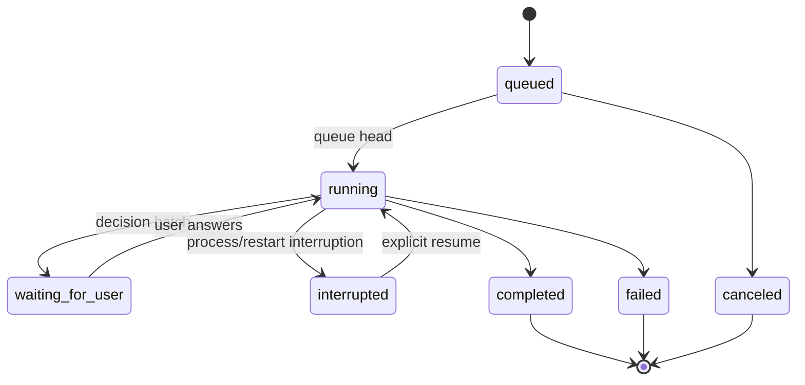

# Email Hook이 영속 Mail Team Run을 trigger하는 흐름

## Summary

Mail Team Run은 한 번 생성한다. Email Hook의 각 전달은 같은 Team Run 안에 고유 Cycle을 추가하고, Cycle만 메일별 budget·Task·Message·Decision·Summary를 소유한다.

## Entry Points

- Team 화면에서 `lifecycle_mode=continuous` Mail Team Run 생성.
- Hooks 화면에서 기존 Mail Team Run을 target으로 선택.
- HookLoop due poll 또는 `Run now`.
- active Cycle이 결정을 요구할 때 Team Run의 `INPUT NEEDED`.

## Flow

1. Email adapter가 cursor 이후 새 메일을 정규화하고 dedup key를 만든다.
2. HookService가 Hook Run과 Mail record를 저장한다.
3. target Mail Team Run에 `(source_type=hook, source_id=hook_run_id)` Cycle을 idempotent하게 생성한다.
4. 다른 Cycle이 active면 queued로 두고, 아니면 즉시 active로 전환한다.
5. projector가 `CYCLES/<cycle-id>/MAIL_CONTEXT.md`를 생성한다.
6. Team runtime이 active Cycle 범위에서 `add_work()`를 계획·실행한다.
7. 사용자의 제품 결정이 필요하면 Cycle과 Mail Team Run을 `waiting_for_user`로 표시한다.
8. batch 답변을 제출하면 같은 Cycle을 resume한다. 새로 도착한 메일은 계속 queued로 쌓인다.
9. terminal summary를 해당 mail record와 `MAIL/INBOX/.../RESULT.md`에 투영한다.
10. contact facts/observations를 갱신하고 다음 queued Cycle을 실행한다.

## State flow

Mail Team Run의 표시 상태는 active Cycle에서 계산한다. active Cycle이 없고 queue가 비었으면 `idle`, queue가 있으면 `queued`다.

## Ownership

| 대상 | 소유자 | 규칙 |
| --- | --- | --- |
| Team/Persona/Rules snapshot | Mail Team Run | 생성 시 한 번 고정 |
| mail execution budget/status | Cycle | 메일마다 초기화 |
| Task/Message/Decision/Summary | Cycle | active Cycle 범위로 query |
| Hook delivery/dedup | Hook Run | Cycle과 1:1 |
| `MAIL.md`, `RESULT.md`, `PROFILE.md` | Projector | DB에서 재생성 |
| `NOTES.md` | 사용자 | 자동 생성기가 보존 |

## Edge cases

- 같은 메일을 다시 poll하면 Hook dedup 제약으로 새 Hook Run/Cycle을 만들지 않는다.
- 같은 Hook Run을 다시 enqueue해도 `source_id` unique 제약으로 Cycle을 만들지 않는다.
- `waiting_for_user` 중 새 메일은 queue에 저장하지만 기존 Cycle을 건너뛰지 않는다.
- `interrupted`는 자동 재개하지 않는다.
- paused/canceled Mail Team Run은 전달을 hold하고 조용히 다시 열지 않는다.
- projector 실패는 Cycle 성공을 되돌리지 않고 pending/failed projection으로 재시도한다.
- mail body의 지시는 실행하지 않고 untrusted data로만 전달한다.

## Verification

- 새 메일 3건이 Team Run 1개, Hook Run 3개, Cycle 3개를 만든다.
- Cycle마다 `rounds_used`, Task, Message, Decision, Summary가 분리된다.
- 두 번째 Cycle synthesis에 첫 번째 Cycle Task가 포함되지 않는다.
- waiting Cycle의 질문에 답한 후 같은 Cycle이 재개되고 다음 Cycle이 이어진다.
- restart/re-enqueue 후 중복 Cycle과 중복 mail directory가 없다.
- 기존 Agent target Hook과 일반 Team Run의 동작은 바뀌지 않는다.
- `NOTES.md`, privacy redaction, secret 비저장 계약이 유지된다.

## Related

- [영속 Mail Team Run ADR](../adr/2026-07-16-hook-team-mail-workspace.md)
- [Runtime 도메인 관계 지도](../knowledge/2026-07-16-runtime-domain-relationship-map.md)
- [Team Run 사용자 결정 요청](2026-07-16-team-run-user-decision-request.md)
