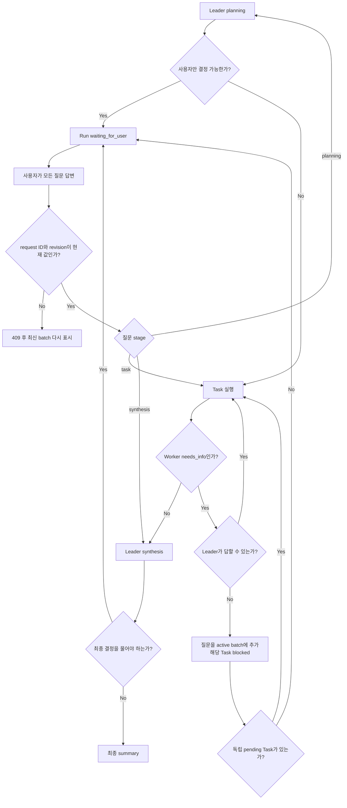

# Team Run 사용자 결정 요청과 재개 흐름

## Summary

Leader는 초기 planning, Worker 질문 중재, 최종 synthesis에서 사용자만 결정할 수 있는 선택을 확인한다. Worker 질문은 먼저 Leader가 처리하고, 해결할 수 없는 질문은 batch로 모은다. 사용자는 Team Run의 `INPUT NEEDED` panel에서 모든 질문에 답하고 `ANSWER & RESUME`으로 해당 단계를 재개한다.

## User-visible flow

1. Leader가 planning에서 goal과 Team rules를 검토하고, 계획을 바꾸는 필수 선택이 있으면 실행 전에 질문한다.
2. Worker가 막히면 Leader가 goal, Team rules, 기존 답변과 작업 결과를 바탕으로 먼저 답한다.
3. 사용자 결정이 필요한 Task는 `blocked`가 되지만 다른 Task는 계속 진행된다.
4. 최종 synthesis에서도 정확한 최종 해석·표현에 필수인 선택이 있는지 확인한다.
5. 사용자 결정이 필요하면 Run status가 `waiting_for_user`로 바뀐다.
6. Team Run 상세 상단에 `INPUT NEEDED`와 질문 수가 표시된다. 알림을 켠 열린 탭은 내용 없는 generic browser notification도 받는다.
7. 각 질문에서 `Why now`, 선택지별 영향, Leader 추천을 확인한다.
8. 모든 질문에 선택 또는 자유 답변을 입력하고 `ANSWER & RESUME`을 누른다.
9. task 질문은 관련 blocked Task를 pending으로 바꾸고, planning/synthesis 질문은 해당 LEAD 단계를 다시 실행한다.
10. `USER_DECISIONS.md`에서 stage, 현재 질문과 resolved history를 확인할 수 있다.

## State and ownership

| 상태/자료 | 소유자 | 동작 |
| --- | --- | --- |
| Leader stage gate | Leader/Team Runtime | planning과 synthesis에서 선제적으로 사용자 결정 필요 여부 확인 |
| Worker `needs_info` | Worker → Leader | 내부 질문이며 곧바로 사용자에게 보이지 않음 |
| active decision batch | Leader/Team Runtime | 사용자에게 물어야 할 질문을 중복 제거해 누적 |
| `USER_DECISIONS.md` | Leader-owned projection | 질문과 답변 이력을 사람이 읽는 형태로 표시 |
| `waiting_for_user` | Team Run service | 실행 process 없이 사용자 입력을 기다림 |
| answer submission | User/API | batch 전체를 답하고 관련 Task와 Run을 재개 |

## Decision gate

`blocking_scope: run`인 결정은 남은 Task가 있어도 곧바로 batch를 공개할 수 있다. 단, shell/tool permission 같은 보안 승인은 이 경로로 처리하지 않는다.

## Answer rules

- 모든 open question에 답해야 제출할 수 있다.
- 선택지가 있으면 Leader 추천을 기본으로 표시하되 사용자가 명시적으로 확인한다.
- 선택지만으로 충분하지 않으면 `Other / context` 자유 입력을 허용한다.
- 답변에는 secret을 넣지 않는다. 필요한 경우 secure setting을 먼저 구성한 뒤 설정 완료 여부만 답한다.
- 제출 직전 request가 갱신되면 `409`를 받고 최신 질문을 다시 확인한다.
- 제출 성공 후 별도 Resume은 누르지 않는다.

## API and event flow

| 단계 | 계약 |
| --- | --- |
| detail load | active `decision_request`와 `revision`을 함께 조회 |
| input requested | `team.run.input_requested`; run delta는 `waiting_for_user` |
| answer | `POST .../decision-request/answer`에 request ID, revision, question별 answer 전달 |
| input resolved | `team.run.input_resolved`; blocked task와 run delta 반영 |
| resumed execution | registry에 background runtime 하나만 등록 |

## Edge cases

- 사용자가 답변을 제출하는 사이 새 질문이 추가됐다면 stale revision으로 거부하고 최신 batch를 다시 보여 준다.
- 같은 제출을 두 번 보내면 첫 요청만 성공하고 다음 요청은 `409`가 된다.
- `waiting_for_user`에서 Gateway를 재시작해도 상태는 그대로이며 모델 process를 자동 시작하지 않는다.
- waiting 중 Cancel은 가능하다. 취소하면 active request는 `canceled`, blocked Task는 `canceled`가 된다.
- waiting 중 Add work, Retry, 일반 Resume은 `409`다.
- 질문을 만든 Task가 취소되거나 질문이 더 이상 필요 없으면 Leader가 item을 withdrawn 처리하고 open item이 없으면 실행을 계속한다.
- `USER_DECISIONS.md`가 삭제되거나 손상돼도 DB record에서 다시 생성한다.
- file write가 실패하면 DB 상태는 유지하고 `document_projection_error` message를 남긴다. 답변 UI는 DB에서 계속 제공한다.

## Verification

### Runtime

- 내부 Leader 답변과 사용자 escalation을 구분한다.
- planning과 synthesis에서 선제 질문을 요청하고 답변 후 같은 단계부터 재개한다.
- 두 개 이상의 unresolved 질문이 하나의 request로 공개된다.
- 독립 Task가 모두 끝나기 전에는 task-scoped batch를 공개하지 않는다.
- waiting 전환 뒤 registry에 실행 중 task가 남지 않는다.

### Persistence and API

- active request는 Run당 하나이며 revision이 단조 증가한다.
- request 공개, answer 저장, task requeue, run 전환은 원자적이다.
- stale·중복·누락 답변을 거부한다.
- restart와 projection 재생성 뒤 질문/답변이 보존된다.

### UI and privacy

- `INPUT NEEDED`가 일반 interrupted Resume과 명확히 다르게 보인다.
- 이유, 영향, 추천, 질문별 answer control과 한 번의 submit action이 보인다.
- waiting 상태에서 Add work와 Resume action이 노출되지 않는다.
- generic notification과 audit metadata에 질문·답변·secret·path가 없다.

현재 회귀 gate는 backend 전체 pytest 516개와 Team Run 관련 94개, frontend Vitest 237개, Vite production build다. Gateway 재시작 보존, cancel 정리, stale revision, 중복 submit, stage별 재개를 자동 테스트한다.

## Related

- [Team Run Leader의 배치형 사용자 결정 요청](../adr/2026-07-16-team-run-batched-user-decisions.md)
- [Team Run interruption recovery design](../superpowers/specs/2026-07-14-team-run-interruption-recovery-design.md)
- [Team Run 완료 알림 사용과 확인](2026-07-16-team-run-completion-notification.md)
