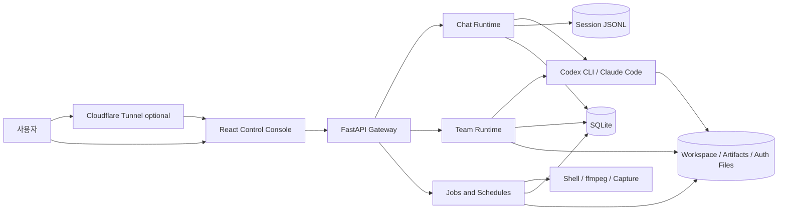
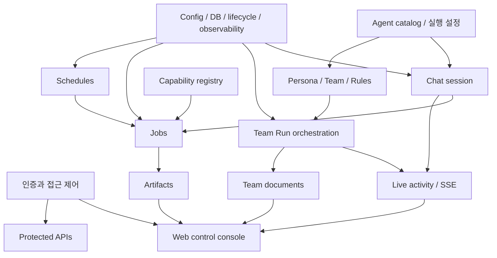
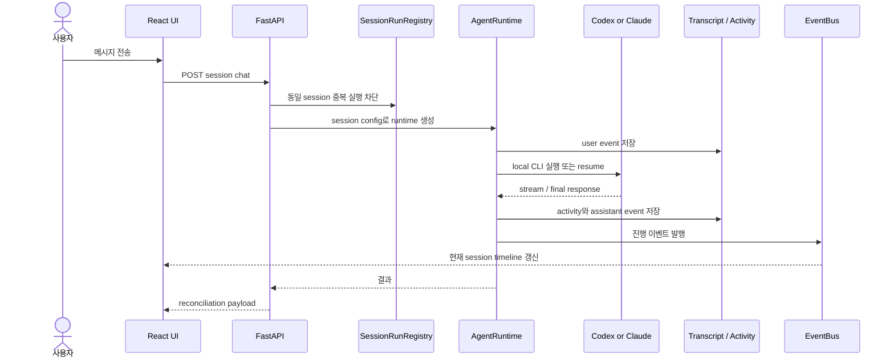
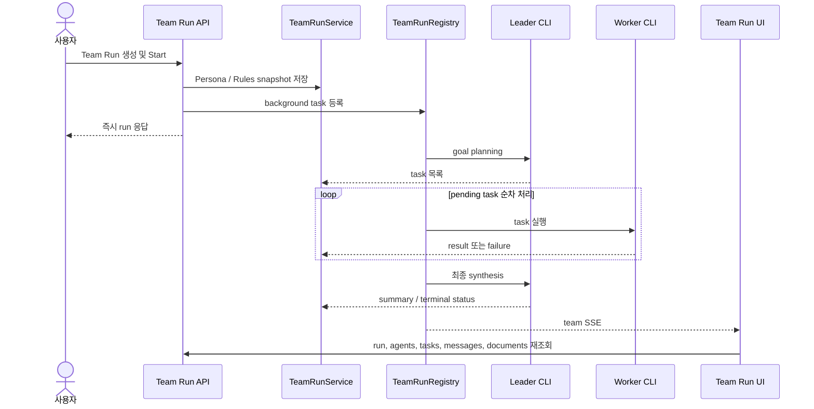
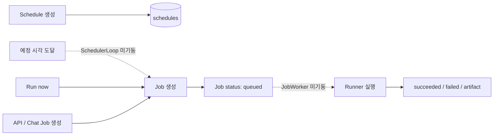

# Personal Agent Gateway 서비스 도메인 지도

## 한눈에 보기

Personal Agent Gateway는 **로컬 PC의 AI CLI와 자동화 도구를 원격 브라우저에서 제어하는 1인용 control console**이다. 제품은 세 실행 축으로 나뉜다.

1. **Chat**: 한 Agent와 세션 단위로 대화하고 로컬 작업을 실행한다.
2. **Team Run**: Persona, Team, Rules를 스냅샷으로 묶어 여러 Agent의 계획·실행·종합을 관리한다.
3. **Automation**: Capability를 Job으로 실행하고 Schedule과 Artifact로 자동화 결과를 관리한다.

현재 Chat과 Team Run은 실제 실행 경로가 연결돼 있다. Automation은 서비스와 UI가 존재하지만 Job worker와 Scheduler loop의 앱 수명주기 연결이 없어 실행 경로가 완성되지 않았다.

## 성숙도 표기

| 표기 | 의미 |
| --- | --- |
| 운영 가능 | UI → API → 실행/저장까지 연결되고 주요 테스트가 있다. |
| 부분 구현 | 핵심 흐름은 동작하지만 중요한 운영·사용성 계약이 빠져 있다. |
| 계약 불일치 | UI나 설정이 약속하는 동작과 실제 런타임이 다르다. |
| 설계 단계 | 문서나 클래스는 존재하지만 앱의 실제 경로에 연결되지 않았다. |

## 시스템 컨텍스트

## 도메인 인벤토리

| 도메인 | 사용자 가치 | 주요 코드 소유권 | 저장소 | 현재 성숙도 | 핵심 보완점 |
| --- | --- | --- | --- | --- | --- |
| 인증과 접근 제어 | OTP 로그인 후 로컬 실행 기능 보호 | `api/auth.py`, `auth_store.py`, 각 API의 session dependency | `data/auth/*.json`, browser cookie | 부분 구현 | 서버가 발급 session을 저장·검증·만료하지 않고 non-empty cookie만 신뢰한다. |
| Agent catalog와 실행 설정 | 설치된 Codex/Claude 모델·effort·권한 선택 | `agents.py`, `local_capabilities.py`, `session_config.py`, `runtime_factory.py`, `model_client.py` | transcript config event, 로컬 CLI 설정 | 운영 가능 | catalog 갱신은 재시작 의존이며 실행 실패 진단이 UI에서 일반 오류로 축약된다. |
| Chat session과 live activity | 여러 대화 세션, 중단, 승인, SSE 진행 표시 | `app.py`, `runtime.py`, `transcript.py`, `run_state.py`, `session_activity.py`, `events.py` | JSONL transcript, SQLite activity | 운영 가능 | 모든 세션/이벤트를 전량 읽는 API와 검색이 데이터 증가에 따라 느려진다. |
| Persona·Team·Rules | 재사용 가능한 역할과 팀 정책 구성 | `personas.py`, `team_directory.py`, `rule_sets.py`, 대응 API/UI | SQLite | 운영 가능 | Rules는 prompt 지시이며 기술적 권한 강제가 아니라는 설명이 더 필요하다. |
| Team Run orchestration | 목표를 계획·실행·종합하고 중단·재개 | `teams.py`, `team_runtime.py`, `api/team_runs.py`, `TeamRunDetail` | SQLite, run별 workspace | 계약 불일치 | `review_only`는 실제 review를 실행하지 않고 `max_workers`도 동시성에 사용되지 않는다. |
| Capability와 Job | shell/media/capture/agent 작업을 상태 기반 실행 | `capabilities.py`, `jobs.py`, `job_worker.py`, `runners/**` | SQLite, artifact files | 설계 단계 | `JobWorker.start()`가 app startup에 연결되지 않아 queued job이 소비되지 않는다. |
| Schedule | 반복 Agent instruction과 run-now | `schedules.py`, `scheduler_loop.py`, `api/schedules.py`, `SchedulesView` | SQLite | 설계 단계 | `SchedulerLoop`가 생성·시작되지 않아 due schedule이 자동 실행되지 않는다. |
| Artifact와 Team document | 결과 파일 탐색·미리보기·다운로드 | `artifacts.py`, `api/artifacts.py`, team document API, preview UI | artifact root, team workspace, SQLite metadata | 운영 가능 | 목록·workspace scan이 전량이며 source path 정책과 보관/정리 정책이 명시되지 않았다. |
| 운영·관측·복구 | 상태 진단, 사고 추적, 백업, 긴급 중단 | `config.py`, `db.py`, `app.py`, 실행 스크립트, 관련 spec | 로그 stdout, SQLite WAL | 부분 구현 | health, durable audit, structured error log, backup/restore, 전체 작업 emergency stop이 없다. |
| Web control console | 모든 도메인의 탐색과 상태 조작 | `GatewayApp`, `api/client.js`, 화면별 organisms | browser memory | 부분 구현 | 하나의 container에 상태·fetch·SSE·명령이 집중되고 API 오류 상세가 대부분 유실된다. |

## 도메인 의존성

## 데이터 소유권

| 데이터 | Source of truth | 수명 | 삭제/복구 특성 |
| --- | --- | --- | --- |
| Chat transcript | `session_dir/{session_id}.jsonl` | 사용자가 session 삭제할 때까지 | session 삭제 시 JSONL과 activity row를 함께 삭제한다. 별도 backup은 없다. |
| Active session pointer | `session_dir/active.json` | 마지막 활성 session | session 삭제 시 active pointer를 제거한다. |
| Session live state | `SessionRunRegistry`, `EventBus` memory | gateway process | 재시작 시 사라진다. transcript와 activity로 일부 복구한다. |
| Session activity | SQLite `session_activity_events` | session 삭제 시까지 | durable event지만 pagination/retention은 없다. |
| Persona/Team/Rules | SQLite | 명시 삭제까지 | Team Run 생성 시 snapshot을 고정한다. |
| Team Run/Agent/Task/Message | SQLite | run 삭제까지 | run 삭제 시 관계 row와 전용 workspace를 함께 삭제한다. |
| Team execution task | `TeamRunRegistry` memory | gateway process | 재시작 시 active DB 상태를 `interrupted`로 정규화한 뒤 사용자 Resume을 기다린다. |
| Jobs/Schedules | SQLite | 명시 삭제 또는 계속 보존 | 실행 lifecycle 시작 wiring이 현재 빠져 있다. |
| Artifact | artifact root 파일 + SQLite metadata | 명시 삭제까지 | metadata와 저장 파일을 함께 삭제한다. 원본 source file은 유지한다. |
| Auth secret/recovery code | `auth_dir` JSON | 재설정까지 | recovery code는 hash로 저장하지만 로그인 session registry는 없다. |

## 핵심 흐름

### Chat 실행

### Team Run 실행

현재 `max_workers` 값과 무관하게 위 task loop는 순차 실행이다. `review_only`도 worker review로 분기하지 않고 planning 후 종료한다.

### Automation의 현재 연결 상태

`JobWorker`와 `SchedulerLoop` 클래스 자체는 존재한다. 그러나 `create_app()`은 worker를 `app.state`에 저장만 하고 startup에서 `start()`를 호출하지 않으며, scheduler loop는 생성하지 않는다.

## 유지해야 할 핵심 계약

- 실행 중인 Chat session과 Team Run에는 동일 ID의 중복 실행을 허용하지 않는다.
- Team Run은 Persona와 Rules를 시작 시점 snapshot으로 고정한다.
- Team Run 재시작은 자동 수행하지 않고 `interrupted` 상태와 사용자 Resume으로 복구한다.
- workspace, artifact, team document의 경로 escape를 차단한다.
- CLI model/options는 설치된 로컬 capability를 기준으로 검증하고 탐지 실패 시 fallback을 제공한다.
- transcript는 대화 재현, activity는 session 진행 기록, 향후 audit는 보안·복구 근거로 목적을 분리한다.

## 현재 가장 큰 교차 도메인 위험

1. **인증 신뢰 경계**: 임의의 non-empty `agent_session` cookie가 protected API를 통과한다.
2. **Automation 실행 단절**: UI/API가 만든 Job과 Schedule이 실제 worker/scheduler로 이어지지 않는다.
3. **제품 계약 불일치**: Review mode와 concurrent workers 설명이 실제 실행 의미와 다르다.
4. **운영 근거 부족**: 예외 handler가 오류를 기록하지 않고 durable audit/health/emergency stop이 없다.
5. **증가 데이터 비용**: session, event, job, artifact, team detail API가 대부분 pagination 없이 전체 데이터를 읽는다.

## 이 지도를 사용하는 방법

- 기능 변경 전 해당 도메인의 source of truth와 인접 도메인을 확인한다.
- 사용자에게 노출한 설명이 런타임 상태 전이와 일치하는지 검토한다.
- 교차 도메인 작업은 [개발 PM 진단](../reports/2026-07-15-development-pm-maintainability-assessment.md)과 [기획 PM 진단](../reports/2026-07-15-product-pm-usability-opportunities.md)을 함께 확인한다.
- 실행 순서와 완료 기준은 [통합 개선 로드맵](../todo/2026-07-15-service-improvement-roadmap.md)을 따른다.

## 근거

- `README.md`
- `src/personal_agent_gateway/app.py`
- `src/personal_agent_gateway/db.py`
- `src/personal_agent_gateway/runtime.py`
- `src/personal_agent_gateway/runtime_factory.py`
- `src/personal_agent_gateway/transcript.py`
- `src/personal_agent_gateway/teams.py`
- `src/personal_agent_gateway/team_runtime.py`
- `src/personal_agent_gateway/jobs.py`
- `src/personal_agent_gateway/job_worker.py`
- `src/personal_agent_gateway/schedules.py`
- `src/personal_agent_gateway/scheduler_loop.py`
- `src/personal_agent_gateway/artifacts.py`
- `frontend/src/components/containers/GatewayApp/index.jsx`
- `frontend/src/api/client.js`
- `docs/knowledge/2026-07-08-full-access-security-operating-model.md`
- `docs/specs/2026-07-08-observability-audit-log-spec.md`
- `docs/knowledge/persona-team-usage-guide.md`
