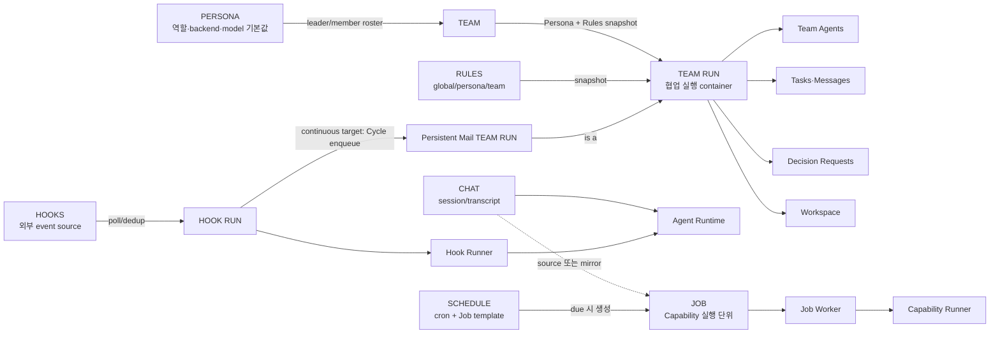
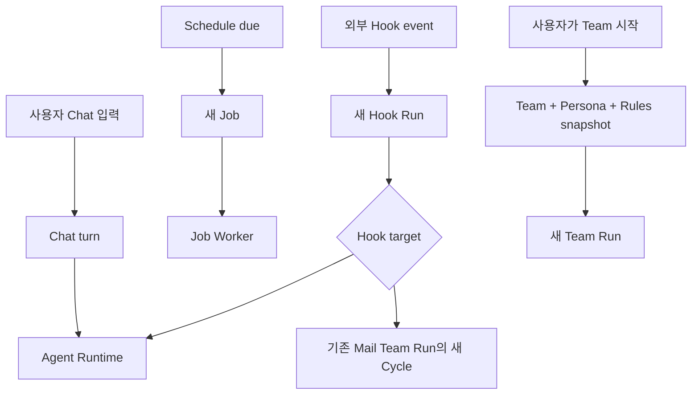
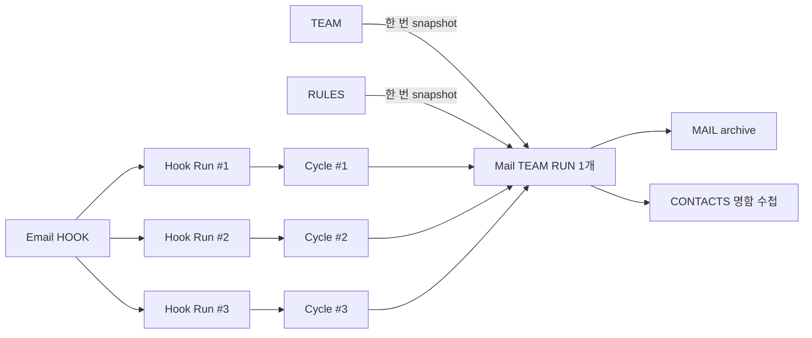

# Chat Persona Team Team Run Job Schedule Hooks Rules 관계 지도

## 한눈에 보기

아래 연결은 현재 구현된 런타임 관계다.

## 도메인별 책임

| 도메인 | 무엇을 보관하는가 | 무엇을 실행하는가 |
| --- | --- | --- |
| CHAT | session config, transcript | Agent Runtime의 대화 turn |
| PERSONA | 역할, prompt 성격, backend/model/options 기본값 | 직접 실행하지 않음 |
| TEAM | Leader/Member Persona roster | 직접 실행하지 않음 |
| TEAM RUN | Team/Persona/Rules snapshot, agents, tasks, messages, decisions, workspace | Team Runtime 협업 |
| JOB | capability, input, approval/status, artifacts | Job Worker가 실행 |
| SCHEDULE | cron과 Job template | due 시 Job 생성 |
| HOOKS | source config, cursor, target, Hook Runs | poll 후 headless Agent 또는 continuous Team Run Cycle 실행 |
| RULES | global/persona/team 정책 | Team Run 생성 시 snapshot |

## 실행 trigger의 차이

핵심적으로 Schedule과 Hook은 trigger이고, Job과 Hook Run은 전달 기록이다. Team은 정의이며 Team Run은 실행 snapshot이다. Chat은 독립 session/transcript이며 Persona를 직접 참조하는 구조가 아니다.

## 구현된 Mail Hook 흐름

메일이 세 건 와도 Team Run은 하나다. 각 Hook Run이 고유 Cycle을 만들고 Cycle이 메일별 budget, Task, Message, Decision, Summary를 분리한다.

## Runtime CLI prompt 전달 규칙

Windows에서 Claude CLI에 여러 줄 prompt를 명령행 positional argument로 넘기면 첫 줄만 전달될 수 있다. `ClaudeModelClient`는 prompt를 `stdin=PIPE`와 `communicate(prompt_bytes)`로 전달한다. Team Worker prompt에는 구체적인 할당이 완전한 사용자 요청임을 명시하며, 코드 작업 전용 문구를 비코드 작업에 강제하지 않는다.

## Composition root

`app._attach_local_services()`가 Database, Chat/Transcript, Agent Runtime, Job Worker, Scheduler, Hook Loop/Runner, Team Runtime을 조립한다. Database는 대부분의 서비스가 공유하는 persistence hub다. 따라서 새 Mail Cycle Queue도 composition root에서 조립하되 Team Runtime이 HookService를 역참조하지 않게 한다.

## Related

- [영속 Mail Team Run ADR](../adr/2026-07-16-hook-team-mail-workspace.md)
- [메일 Hook Team Run 흐름](../flows/2026-07-16-mail-hook-team-run.md)
- [구현 계획](../todo/2026-07-16-hook-team-mail-workspace-implementation.md)
