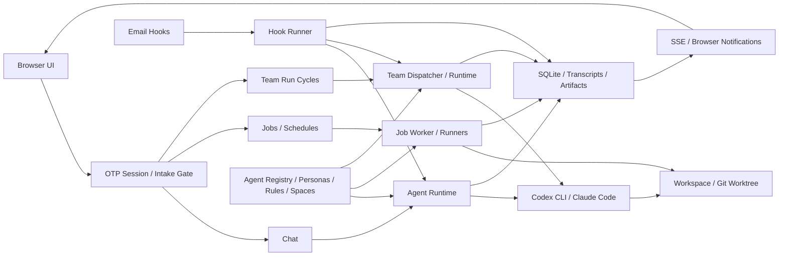

# Personal Agent Gateway 기능 가이드

이 문서는 각 화면에서 할 수 있는 일과 기능이 서로 연결되는 방식을 설명한다. 설치와 운영은 [설치·운영 가이드](gateway-setup-guide.md), 내부 설계는 [아키텍처 가이드](gateway-architecture-guide.md)를 참고한다.

## 화면별 기능

| 영역 | 할 수 있는 일 | 효율적인 구성 |
| --- | --- | --- |
| **Dashboard** | 로컬 Codex·Claude의 주간 사용량과 reset 시점 확인 | 각 CLI가 제공하는 사용량을 동일한 카드 형식으로 정규화한다. |
| **Chat** | Agent 또는 Persona를 선택해 대화하고 session별 기록 확인 | CLI session을 이어 사용하고 새 event만 실시간 반영한다. |
| **Jobs** | shell, media 분석·변환, 화면 캡처, agent 지시 같은 capability 실행 | 입력 검증, 승인, 상태와 event log는 공통 Job 모델이 맡고 runner만 기능별로 분리한다. |
| **Schedules** | capability를 cron과 timezone 기준으로 반복 실행 | 실행 시 Job을 생성해 수동 실행과 같은 상태·이력·재시도 흐름을 재사용한다. |
| **Hooks** | IMAP·POP3 메일을 polling하고 필터링해 Persona 또는 Team Run으로 전달 | cursor와 dedup key로 중복 처리를 막고 실행 결과는 Hook Run으로 분리한다. |
| **Artifacts** | 이미지, 영상, 음성, 문서, 로그, 보고서, 압축 파일 조회 | 실제 파일과 검색 metadata를 분리해 미리보기·필터·다운로드·삭제를 한 저장소에서 처리한다. |
| **Operations** | 실행 상태와 health 확인, 재개·취소, emergency stop, backup 검증 | 여러 실행 domain의 주의 필요 항목을 모으되 실제 실행 소유권은 각 domain에 유지한다. |
| **Settings** | workspace, CLI 가용성, worker, scheduler, 보안, browser session 확인 | 환경·보안 진단을 한 화면에 모으고 위험한 변경은 확인과 audit을 거친다. |
| **Personas** | 역할, 책임, 제약, 기본 agent·model, avatar 정의 | 같은 Persona를 Chat·Hook·Team에서 재사용하고 실행 시작 시 snapshot으로 동결한다. |
| **Teams** | Leader와 역할별 Member 조합을 실행 가능한 팀 템플릿으로 저장 | 검증된 역할 조합과 모델 선택을 반복 사용한다. |
| **Team Runs** | Leader가 계획하고 Member에게 Task를 배분하며 Cycle 단위로 계속 실행 | 장기 Run과 개별 Cycle 목표를 분리하고 AUTO·TRIGGERED 실행을 같은 queue로 처리한다. |
| **Spaces** | 읽기 범위와 쓰기 방식을 Global·Persona·Team별로 제어 | `TEAM > PERSONA > GLOBAL` 우선순위로 유효 정책을 계산하고 격리·worktree·직접 접근을 선택한다. |
| **Rules** | 공통 규칙, Team 규칙, Persona baseline을 REQUIRED·GUIDELINE으로 관리 | 실행 시 규칙을 snapshot으로 저장하고 강제 규칙과 권고를 구분해 prompt에 전달한다. |

## 실행 경로



### Chat

`AgentRuntime`이 session 연속성과 streaming 응답을 소유한다. Agent를 직접 선택하거나 Persona의 역할·제약과 기본 모델을 적용할 수 있다. transcript는 session별 JSONL로 남고 SSE가 새 event를 화면에 전달한다.

### Jobs와 Schedules

`JobWorker`가 승인된 capability의 queue, retry, cancel과 결과 저장을 소유한다. Schedule은 cron과 timezone에 맞춰 동일한 Job을 생성하므로 별도 실행 엔진이 필요하지 않다.

### Hooks

`HookRunner`가 메일 수집, 발신자·제목 필터, 중복 방지와 prompt 조립을 맡는다. 대상이 Persona면 headless Chat Runtime을 실행하고, 대상이 TRIGGERED Team Run이면 새 Cycle 요청을 queue에 넣는다.

### Team Runs

Team Run은 팀 구성을 유지하는 장기 컨테이너이고 Cycle은 한 번의 목표와 Task 묶음이다.

```text
Cycle 요청
  -> Dispatcher가 중복 요청과 실행 가능 상태 확인
  -> Leader가 목표를 역할별 Task로 분해·배분
  -> Member가 Persona·model·rules·space snapshot으로 순차 실행
  -> 필요한 사용자 질문은 Leader가 모아서 한 번에 요청
  -> 결과와 문서를 저장하고 Leader가 Cycle 요약 생성
  -> AUTO는 다음 Cycle 예약, TRIGGERED는 다음 입력 대기
```

- **AUTO**: 기준 목표, 반복 횟수와 간격을 정하고 자동으로 Cycle을 이어간다.
- **TRIGGERED**: 사용자가 화면에서 지시하거나 Hook이 event를 전달할 때 Cycle을 시작한다.
- **Human in the loop**: Leader가 직접 해결할 수 없는 결정만 묶어서 요청하고 독립 Task는 계속 진행한다.
- **Repository Delivery**: worktree 변경을 commit한 뒤 대상 repository에 적용하고 conflict를 화면에서 해결한다.

## 함께 볼 문서

- [Persona & Team Run 사용 가이드](persona-team-usage-guide.md)
- [Team Run Cycle 정책 구현](../reports/2026-07-20-continuous-team-run-cycle-policies-implementation.md)
- [Team Run 사용자 결정 흐름](../flows/2026-07-16-team-run-user-decision-request.md)
- [메일 Hook → Team Run 흐름](../flows/2026-07-16-mail-hook-team-run.md)
- [Operations 진단 가이드](2026-07-15-operations-diagnostics-guide.md)
