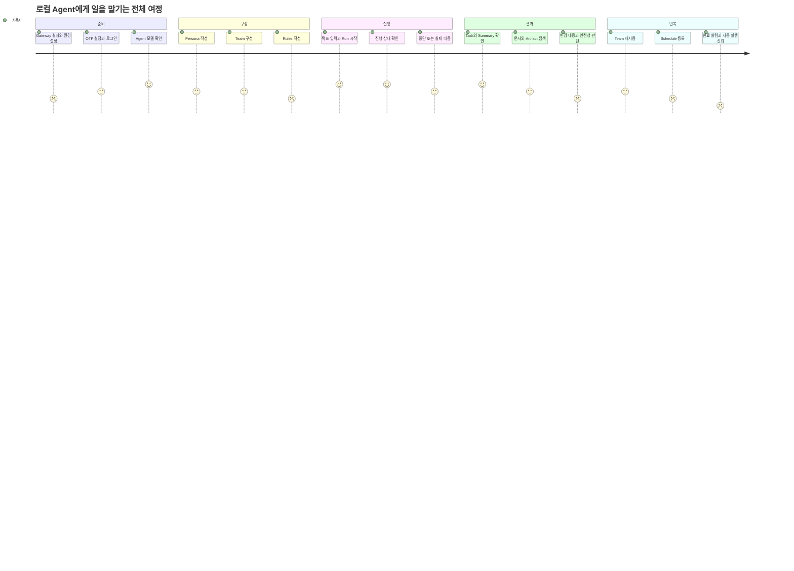

# Personal Agent Gateway 기획 PM 사용성·기능 기회 진단

## 결론

이 서비스의 차별점은 “AI와 채팅”이 아니라 **밖에서도 내 로컬 PC의 Agent에게 일을 맡기고, 진행·결과·복구를 한 화면에서 통제하는 것**이다.

현재는 기능별 화면이 빠르게 늘어 Chat, Team Runs, Teams, Personas, Rules, Jobs, Schedules, Artifacts가 각각 존재한다. 다음 제품 단계는 기능 수를 늘리는 것보다 사용자가 아래 질문에 즉시 답할 수 있게 만드는 것이다.

- 지금 무엇이 실행 중인가?
- 멈췄다면 왜 멈췄고 내가 무엇을 해야 하는가?
- 어떤 설정과 Agent가 이 일을 수행했는가?
- 무엇이 변경됐고 결과 파일은 어디 있는가?
- 이 일을 다시 실행하거나 반복하려면 어떻게 하는가?

## 핵심 사용자와 상황

### 주 사용자

- 자신의 개발 PC와 CLI 계정을 직접 관리하는 1인 소유자.
- 외부 노트북이나 휴대폰에서 작업을 지시하고 나중에 결과를 확인한다.
- Chat의 즉시성, Team Run의 역할 분담, Schedule의 무인 반복 실행을 필요에 따라 오간다.

### 핵심 사용 상황

| 상황 | 기대 결과 | 현재 지원 | 주요 마찰 |
| --- | --- | --- | --- |
| 빠른 단일 작업 | Agent 선택 후 메시지를 보내고 실시간 결과 확인 | 강함 | 실패 사유와 복구 방법이 generic toast로 축약된다. |
| 역할 기반 복합 작업 | 저장한 Team과 Rules로 목표를 실행하고 task별 결과 확인 | 부분적으로 강함 | Team 구성 화면과 Run 생성이 분리돼 있고 review/concurrency 설명이 실제와 다르다. |
| 장시간 실행 맡기기 | 화면을 닫아도 실행되고 완료·실패 알림 수신 | 부분 지원 | background 실행은 있으나 외부 알림과 통합 실행 현황이 없다. |
| 반복 작업 예약 | 정해진 시간에 Agent가 자동 실행 | UI만 존재 | Scheduler/worker가 실제 app lifecycle에 연결되지 않았다. |
| 결과 검토와 재사용 | 변경 파일·문서·artifact·summary를 한 곳에서 확인 | 부분 지원 | Team documents와 global Artifacts가 분리되고 before/after diff가 없다. |
| 문제 대응 | 중단·실패 원인 확인, 재개·재시도·전체 정지 | 부분 지원 | Team resume/retry는 있으나 전역 emergency stop과 durable audit가 없다. |

## 사용자 여정 지도



낮은 점수 구간은 기능이 전혀 없어서가 아니라 **설정·실행·결과가 서로 다른 화면과 저장 개념으로 분리돼 있기 때문**이다.

## 제품 약속과 실제 동작의 차이

| UI/제품 약속 | 실제 상태 | 제품 조치 |
| --- | --- | --- |
| `REVIEW ONLY`: members review existing work | planning 후 바로 completed이며 member review는 실행되지 않는다. | 구현 전까지 숨기거나 `PLAN REVIEW`처럼 실제 의미로 변경한다. |
| `Max workers`: concurrent agent sessions | TeamRuntime은 pending task를 한 개씩 순차 실행한다. | `Sequential`로 표시하거나 실제 bounded concurrency를 구현한다. |
| Schedule의 `NEXT`, `Auto-approve`, `Run now` | SchedulerLoop와 JobWorker가 시작되지 않아 자동/queued 실행이 진행되지 않는다. | 실행 연결 전까지 beta/disabled 표시하고, 연결 후 reliability 상태를 노출한다. |
| Settings의 `TUNNEL: LOCAL ONLY` | Cloudflare Tunnel로 외부 접속할 수 있는 제품이다. | 실제 bind/tunnel/access 상태를 진단해 표시한다. |
| Rules의 `REQUIRED` | 런타임 권한 강제가 아니라 prompt의 강한 지시다. | `Instruction priority`로 설명하고 security permission과 구분한다. |
| `AUTHENTICATED` | OTP login은 있으나 server-side session 검증·만료가 없다. | 세션 신뢰 기반을 먼저 완성한 뒤 로그인 상태와 만료 시간을 표시한다. |

제품 문구는 미래 설계가 아니라 **현재 실행 가능한 계약**을 설명해야 한다.

## 도메인별 사용성 개선

### 1. Chat

- 첫 메시지 전 Agent/model/effort 선택 결과를 “이 세션에 고정됨”으로 명확히 설명한다.
- 400/401/409/timeout/model exit를 구분해 다음 행동을 제시한다.
- 실행 중 다른 화면으로 이동해도 global running indicator와 Stop을 유지한다.
- 완료 응답에서 생성/변경 파일과 등록 가능한 artifact를 자동 요약한다.
- session 검색을 title/content/model/status/date filter로 확장한다.

### 2. Persona·Team·Rules

- 처음 사용하는 사람을 위해 `Persona → Team → Rules → 첫 Run` guided setup을 제공한다.
- Team 카드에서 leader/member/model/rules 요약과 “이 Team으로 Run”을 바로 제공한다.
- Persona에는 “어떤 Team에서 사용 중인지”와 최근 성공률을 연결한다.
- Rules는 REQUIRED/GUIDELINE의 실제 효력과 snapshot 시점을 인라인으로 설명한다.
- 개발·기획·QA·리뷰 같은 starter template을 제공하되 생성 후 사용자가 수정하도록 한다.

### 3. Team Run

- 목록에서 상태, 최근 단계, 진행 task 수, 실패 수, 경과 시간, 마지막 이벤트를 한 줄로 비교한다.
- 상세 상단에 현재 사용 가능한 명령만 보여준다: Stop, Resume, Retry, Add work.
- Team/Persona/Rules/model snapshot을 접을 수 있는 “Run configuration”으로 제공한다.
- Task 결과, workspace document, global artifact를 같은 task 문맥으로 연결한다.
- 최종 summary에 `완료`, `부분 실패`, `미검증`, `사용자 확인 필요`를 분리한다.
- 장기적으로 review mode는 diff나 target artifact를 명시적으로 선택하는 별도 flow로 만든다.

### 4. Jobs·Schedules

- worker/scheduler health가 준비되지 않으면 생성 UI를 비활성화하고 이유를 표시한다.
- Schedule 생성 전에 다음 3회 실행 시각, timezone, 권한/승인 정책을 preview한다.
- 실행 이력을 schedule detail에 묶고 성공률과 마지막 실패 원인을 표시한다.
- `Run now`는 Job detail로 바로 이동하고 queued/running/terminal 전이를 live로 보여준다.
- 실패한 Job은 원본 input을 보존한 Retry를 제공한다.

### 5. Artifacts·Documents

- `Artifacts`와 Team Run `Documents`의 차이를 설명한다: 등록된 결과 자산 vs workspace 파일.
- Team task에서 생성한 문서를 자동 연결하거나 한 번에 artifact로 등록한다.
- 파일명뿐 아니라 source run/session/task, 생성 Agent, 변경 시각으로 검색한다.
- code/markdown 결과에는 before/after diff와 검증 결과를 함께 표시한다.
- 보관 기간, 원본 유지, Run 삭제 시 workspace 삭제 영향을 삭제 dialog에서 설명한다.

### 6. Settings·운영

- 읽기 전용 경로 나열에서 “현재 사용할 수 있는가”를 보여주는 diagnostics 화면으로 전환한다.
- Codex/Claude/ffmpeg/capture, DB, worker, scheduler, workspace write, tunnel/cookie security를 점검한다.
- 실패 항목마다 복사 가능한 해결 명령 또는 설정 키를 제시한다.
- data backup/export, session revoke, emergency stop을 소유자 도구로 제공한다.

## 기능 기회 백로그

| ID | 기회 | 사용자 문제 | 최소 제품 | 성공 신호 | 우선순위 |
| --- | --- | --- | --- | --- | --- |
| PM-01 | Operations Center | 화면을 돌아다녀야 전체 실행 상태를 안다. | Chat/Team/Job/Schedule의 running, waiting, failed를 한 화면에 통합하고 관련 화면으로 이동 | 실패 발견 시간과 복구 클릭 수 감소 | P1 |
| PM-02 | Guided first-run | Persona/Team/Rules의 관계를 먼저 배워야 한다. | 환경 진단 → starter Team → 첫 planning run wizard | 첫 유효 Run 완료율 증가 | P1 |
| PM-03 | Actionable errors | “Failed”만 보고 다음 행동을 알 수 없다. | 오류 유형, 원인 요약, Retry/Resume/설정 열기 CTA | 동일 오류 반복률 감소 | P0 |
| PM-04 | Completion notification | 외부에서 장시간 실행 결과를 계속 확인해야 한다. | browser notification 또는 사용자 선택 webhook, 민감 내용 제외 | 완료 후 확인까지 걸린 시간 감소 | P1 |
| PM-05 | Run result package | summary, task result, 문서, 변경 파일이 흩어져 있다. | run별 result index와 changed files/verification/artifacts 묶음 | 결과 확인 시간 감소 | P1 |
| PM-06 | Reusable work template | 비슷한 목표와 팀 구성을 매번 입력한다. | Team + run mode + goal prompt + output checklist template | 반복 Run 생성 시간 감소 | P2 |
| PM-07 | Review workflow | Review mode 이름은 있으나 검토 대상과 기준을 지정할 수 없다. | target path/artifact/diff + reviewer personas + finding severity | review 결과의 재현성과 수용률 증가 | P2 |
| PM-08 | Automation history | Schedule이 실제로 믿을 만한지 알 수 없다. | schedule별 execution history, success rate, next runs, retry | scheduled execution success rate 증가 | P1 |
| PM-09 | Local activity metrics | 개선 우선순위를 판단할 사용 근거가 없다. | 외부 전송 없는 local-only 실행·성공·복구 통계 | 데이터 기반 backlog review 가능 | P1 |
| PM-10 | Global search | session, run, task, document, artifact를 따로 찾아야 한다. | source/type/status/date를 포함한 통합 검색 | 원하는 결과 도달 시간 감소 | P2 |

P0는 신뢰 기반을 회복하는 항목, P1은 핵심 여정을 완결하는 항목, P2는 재사용과 확장 항목이다.

## 제품 정보 구조 제안

기능 이름 중심 sidebar를 “일을 맡기고 확인하는 흐름”에 맞춘다.

```text
WORK
- Chat
- Team Runs
- Automations
- Operations

LIBRARY
- Teams
- Personas
- Rules
- Artifacts

SYSTEM
- Settings & Diagnostics
```

- `Automations` 안에서 Schedules와 Jobs history를 연결한다.
- `Operations`는 실행 중·승인 대기·실패·중단 상태만 모은다.
- Team/Persona/Rules는 실행 화면이 아니라 재사용 설정 자산으로 묶는다.
- 현재 기능별 deep link가 없으므로 URL route 도입을 함께 검토한다. 새로고침·공유·뒤로가기가 가능해야 한다.

## 제품 지표

외부 analytics가 아니라 local-only event 집계로 시작한다.

### North-star 후보

**사용자 수동 복구 없이 검증 가능한 결과로 끝난 작업 비율**

### 핵심 보조 지표

| 지표 | 정의 | 개선 목적 |
| --- | --- | --- |
| Work success rate | Chat/Team/Job 중 terminal success 또는 accepted partial success 비율 | 실행 신뢰성 |
| Time to first useful result | 시작부터 첫 assistant/task result까지 | 체감 속도 |
| Recovery success rate | interrupted/failed 후 Resume/Retry로 성공한 비율 | 복구 UX |
| Schedule reliability | 예정된 실행 중 허용 지연 안에 시작·완료한 비율 | 무인 자동화 신뢰 |
| Result inspection time | terminal event부터 artifact/document 확인까지 | 결과 탐색성 |
| Configuration correction rate | Run 시작 직후 취소·재생성하거나 model/team 설정을 바꾼 비율 | 설정 이해도 |
| Error recurrence | 같은 분류의 오류가 같은 환경에서 반복된 비율 | 안내 품질 |

Prompt 원문, 파일 내용, command output은 지표에 넣지 않는다. ID, 상태, duration, 분류, count만 local 집계한다.

## 검증이 필요한 제품 가설

- 사용자는 Team/Persona/Rules를 각각 관리하기보다 “저장된 Team으로 바로 Run”을 더 자주 원한다.
- remote 사용에서는 완료 알림이 실시간 상세 화면보다 가치가 높다.
- Agent/Model 선택은 매 session보다 Persona 또는 Team default에서 더 자주 결정된다.
- Artifact보다 “이 Run이 바꾼 파일과 검증 결과”가 결과 판단에 더 직접적이다.
- 실제 concurrency보다 예측 가능한 순차 실행과 명확한 비용 상한을 선호할 수 있다.

기능 구현 전에 local event와 5~10회 실제 사용 기록으로 위 가설을 확인한다.

## 출시 원칙

- UI에 표시된 기능은 실제 app lifecycle과 end-to-end test에서 동작해야 한다.
- 자동 실행 기능은 health, history, retry, stop이 함께 있어야 한다.
- 위험한 실행 권한과 Persona/Rules의 행동 지시는 같은 개념처럼 표시하지 않는다.
- 실패 상태에는 원인, 다음 행동, 데이터 보존 여부를 같이 보여준다.
- 새 화면을 추가하기 전에 기존 여정에서 접근·복구·결과 확인이 가능한지 검토한다.
- 외부 접속 제품이므로 보안 기반이 기능 출시보다 우선한다.

## 관련 문서

- [서비스 도메인 지도](../knowledge/2026-07-15-service-domain-map.md)
- [개발 PM 유지보수성 진단](2026-07-15-development-pm-maintainability-assessment.md)
- [통합 개선 로드맵](../todo/2026-07-15-service-improvement-roadmap.md)
- [Persona & Team Run 사용 가이드](../knowledge/persona-team-usage-guide.md)

## 근거

- `frontend/src/components/organisms/Sidebar/index.jsx`
- `frontend/src/components/containers/GatewayApp/index.jsx`
- `frontend/src/components/organisms/TeamRunForm/index.jsx`
- `frontend/src/components/organisms/TeamRunDetail/index.jsx`
- `frontend/src/components/organisms/JobsView/index.jsx`
- `frontend/src/components/organisms/SchedulesView/index.jsx`
- `frontend/src/components/organisms/SettingsView/index.jsx`
- `frontend/src/components/organisms/ArtifactsView/index.jsx`
- `src/personal_agent_gateway/team_runtime.py`
- `src/personal_agent_gateway/job_worker.py`
- `src/personal_agent_gateway/scheduler_loop.py`
- `src/personal_agent_gateway/api/team_runs.py`
