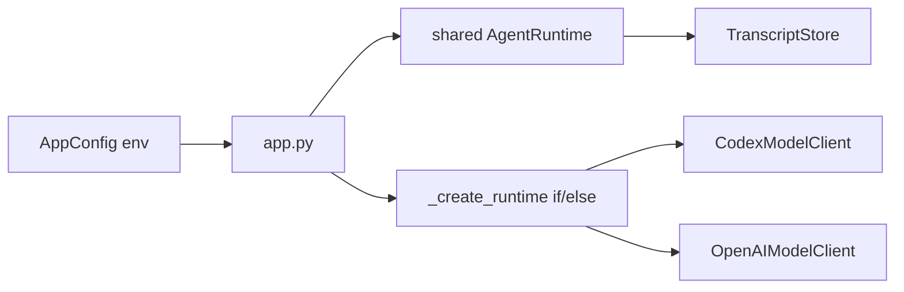

# Local Agent Registry Refactor Design

**Date:** 2026-07-08
**Status:** Draft for review
**Track:** Backend architecture first, then frontend selection UI

## Goal

Support local agent selection for **Codex CLI** and **Claude Code CLI** without hard-coding each new agent into the FastAPI app. The implementation must refactor the backend first so the later feature work can add agent discovery, model selection, effort/reasoning options, and session-level configuration without growing `app.py` into a provider switchboard.

The first usable feature should let a logged-in user:

- see available local agents: Codex and Claude;
- see whether each CLI is installed and runnable;
- choose agent, model, effort/reasoning, and permission/sandbox-style options while the active session is still empty;
- lock that choice once the first conversation turn has started;
- send chat through the selected local CLI with the selected options reflected in the actual CLI invocation.

Future local providers such as Ollama or LM Studio should fit by adding registry entries and adapters, not by rewriting session or app routing code.

## Decisions Already Made

- Claude means **Claude Code CLI**, not direct Anthropic API.
- Codex and Claude are both local CLI agents.
- Session option policy is: options can be changed only while the active session has no assistant/tool/runtime output yet.
- Discovery policy is mixed: probe local CLI availability automatically, but allow model/option lists to come from a built-in registry with optional local override later.
- Refactor comes before feature UI. The first implementation plan must not start with frontend controls.

## Current Backend Architecture Evidence

- `src/personal_agent_gateway/config.py` stores `model_provider`, `model`, `codex_binary`, `codex_sandbox`, and `codex_approval_policy` as app-wide environment-derived fields.
- `src/personal_agent_gateway/app.py` creates one `shared_runtime` during `create_app()`.
- `src/personal_agent_gateway/app.py` routes `/api/chat`, approval, deny, and reset through that shared runtime.
- `src/personal_agent_gateway/app.py::_create_runtime()` switches directly on `config.model_provider` and instantiates `CodexModelClient` or `OpenAIModelClient`.
- `src/personal_agent_gateway/runtime.py` already depends only on the `ModelClient` protocol, which is the strongest existing extension point.
- `src/personal_agent_gateway/transcript.py` has `session_rename` but no session configuration event or metadata model.
- `src/personal_agent_gateway/api/settings.py` returns a safe app-level settings snapshot, not a selectable agent catalog.

## Architecture Review

### Current Structural Risks

#### Finding: Runtime selection is global, but the feature is session-scoped

**Evidence**
- `create_app()` creates `shared_runtime` once from `AppConfig`.
- `/api/status` reports `app_config.model_provider` and `app_config.model`, not active-session config.
- `/api/chat` does not receive or resolve session-level agent options.

**Principle**
- DIP and SRP. Request handling should not depend on a global provider choice when the domain requirement is per-session agent configuration.

**Recommendation**
- Add a session configuration boundary before adding Claude support. Runtime creation should resolve the active session's `SessionAgentConfig`, not only `AppConfig`.

**Plan Impact**
- Refactor `app.py` runtime wiring before adding `/api/agents` or frontend picker behavior.

#### Finding: Provider creation is an if/else factory inside `app.py`

**Evidence**
- `_create_runtime()` contains concrete branches for Codex and OpenAI.
- Adding Claude naively would add a third concrete branch in the same function.

**Principle**
- OCP. A real second local CLI provider is now required, so direct provider branching should move behind a registry/factory boundary.

**Recommendation**
- Introduce `AgentRegistry` and `AgentRuntimeFactory`.
- `app.py` should depend on these boundaries instead of constructing provider clients directly.

**Plan Impact**
- New backend modules should own registry descriptors, CLI probes, CLI adapters, and runtime assembly.

#### Finding: CLI execution concerns are mixed inside `CodexModelClient`

**Evidence**
- `CodexModelClient` builds the command, launches subprocesses, streams stdout, parses JSONL events, handles timeout, and parses final output.
- Claude has a different command shape: `claude -p --output-format ... --model ... --effort ... --permission-mode ...`.

**Principle**
- SRP and Adapter. Codex and Claude expose different CLI protocols and should be normalized behind `ModelClient`.

**Recommendation**
- Keep `ModelClient` as the runtime-facing protocol.
- Split local CLI agent code into provider-specific adapters with command builder and output parser responsibilities isolated per CLI.

**Plan Impact**
- Add Claude by implementing a new adapter, not by changing `AgentRuntime`.

#### Finding: Session transcripts do not preserve agent configuration

**Evidence**
- `TranscriptKind` has no `session_config_set` or equivalent.
- `SessionSummary` has no agent/model fields.
- Existing session restore uses JSONL events as the source of conversation history.

**Principle**
- Traceability and LSP. Existing session APIs should keep working, but session summaries and restored histories must not lose the agent/model used for a conversation.

**Recommendation**
- Store session agent configuration as explicit session metadata.
- Use either a transcript event (`session_config_set`) or a sidecar metadata file. The preferred first version is a transcript event because it keeps the audit trail in the existing JSONL stream.

**Plan Impact**
- Extend transcript models before adding UI and runtime selection.

### Dependency Direction

Current shape:



Target shape:

```mermaid
flowchart LR
    App[app.py routes] --> SessionConfig[SessionAgentConfigService]
    App --> RuntimeFactory[AgentRuntimeFactory]
    App --> AgentsAPI[/api/agents router]
    AgentsAPI --> Registry[AgentRegistry]
    Registry --> Probe[CLI availability probe]
    Registry --> Descriptors[Built-in descriptors]
    SessionConfig --> Transcript[TranscriptStore]
    RuntimeFactory --> SessionConfig
    RuntimeFactory --> Registry
    RuntimeFactory --> Runtime[AgentRuntime]
    Runtime --> ModelClient[ModelClient protocol]
    ModelClient --> CodexAdapter[Codex CLI adapter]
    ModelClient --> ClaudeAdapter[Claude CLI adapter]
```

## Target Backend Design

### Agent Descriptor

An agent descriptor is safe, serializable metadata for the UI and backend:

- `id`: `codex` or `claude`
- `label`: display name
- `kind`: `local_cli`
- `binary`: configured or default command
- `available`: whether the CLI probe succeeds
- `availability_error`: safe error text when unavailable
- `models`: known model choices
- `default_model`
- `options_schema`: supported options exposed to the UI
- `defaults`: default option values

Codex first-version options:

- `model`
- `sandbox`: `read-only`, `workspace-write`, `danger-full-access`
- `approval_policy`: `untrusted`, `on-request`, `never`
- `config_overrides`: constrained key/value list for known safe Codex `-c` options
- `profile`: optional Codex profile

Claude first-version options:

- `model`
- `effort`: `low`, `medium`, `high`, `xhigh`, `max`
- `permission_mode`: `acceptEdits`, `auto`, `bypassPermissions`, `manual`, `dontAsk`, `plan`
- `agent`: optional Claude agent name
- `tools` or `allowed_tools`: optional constrained list

### Agent Registry

`AgentRegistry` owns built-in descriptors and CLI availability checks.

Responsibilities:

- return agent catalog for `/api/agents`;
- probe binaries without leaking secrets;
- validate requested session config against the selected descriptor;
- expose the adapter factory key for runtime assembly.

Non-responsibilities:

- no transcript writes;
- no FastAPI request handling;
- no direct chat execution.

### Session Agent Config

`SessionAgentConfig` represents the selected agent options for one transcript:

```text
session_id
agent_id
model
options
created_at
updated_at
locked
```

Locking rule:

- A session is editable only while it has no conversation/runtime events other than `session_config_set` and `session_rename`.
- A session becomes locked as soon as the first user message is accepted for chat processing.
- If a user tries to change config after lock, the API returns `409 Conflict`.

Defaulting rule:

- A new or empty session uses registry defaults if it has no explicit config.
- Existing sessions without config are treated as legacy sessions using app-level `AGENT_MODEL_PROVIDER` and `AGENT_MODEL` defaults.

### Runtime Factory

`AgentRuntimeFactory` resolves:

1. active transcript id;
2. effective `SessionAgentConfig`;
3. selected registry descriptor;
4. provider-specific `ModelClient`;
5. `AgentRuntime`.

The factory should preserve current runtime behavior:

- workspace access still uses `WorkspaceTools(config.workspace_root, ApprovalStore())`;
- job creation still uses the existing `JobService`;
- SSE still receives provider events where supported;
- OpenAI API direct provider is not part of this feature and should not shape the first registry model.

### CLI Adapters

Codex adapter:

- command base: `codex exec --json`
- workspace: `-C <workspace_root>`
- model: `-m <model>` when not default
- sandbox: `--sandbox <value>`
- approval: `-c approval_policy=<value>`
- prompt: stdin
- parse: existing JSONL final `agent_message`

Claude adapter:

- command base: `claude -p`
- output: prefer `--output-format stream-json` if event parsing is stable; otherwise use `json` for first implementation and add streaming later
- workspace: process cwd or `--add-dir <workspace_root>` depending on verified behavior
- model: `--model <model>` when set
- effort: `--effort <value>`
- permission: `--permission-mode <value>`
- prompt: argument or stdin, decided during implementation spike
- parse: adapter-owned parser producing `ModelResponse`

The implementation plan must include a small local spike/test for Claude output parsing before committing to `stream-json` UI events.

## API Design

### `GET /api/agents`

Returns the safe local agent catalog.

```json
{
  "agents": [
    {
      "id": "codex",
      "label": "Codex CLI",
      "available": true,
      "models": ["default"],
      "default_model": "default",
      "options_schema": {}
    }
  ]
}
```

### `GET /api/sessions/active/config`

Returns the effective config for the active session plus whether it can be edited.

### `PUT /api/sessions/active/config`

Sets config for the active session only if unlocked. Validates agent id, model, and options against the registry.

### `POST /api/reset`

Keeps current behavior of starting a new active transcript, but response should include effective default session config in the feature phase.

## Frontend Design Boundary

Frontend work starts only after backend refactor and API tests pass.

Atomic placement:

- atom: option controls that already exist should be reused before adding new primitives
- molecule: `AgentOptionField`, `AgentAvailabilityBadge`
- organism: `AgentPicker` or `SessionConfigPanel`
- container: `GatewayApp` owns API loading, empty-session editability, and submit behavior

UI behavior:

- show current agent/model in the status bar;
- show picker in chat/session area while session is editable;
- disable picker after first assistant/runtime output;
- show unavailable agents with reason but do not allow selection;
- changing selection in an empty session updates backend session config before sending chat.

## Refactor-First Delivery Sequence

### Phase 1: Backend extraction without behavior change

Purpose: create seams before adding Claude or UI.

- Extract runtime assembly from `app.py` into a factory module.
- Preserve existing Codex/OpenAI behavior.
- Keep `/api/status`, `/api/chat`, `/api/reset`, approvals, and SSE contracts unchanged.
- Add tests proving existing behavior still passes through the new factory.

### Phase 2: Agent registry and descriptor API

Purpose: expose available agents safely.

- Add built-in Codex and Claude descriptors.
- Add CLI availability probe with injectable command runner for tests.
- Add `/api/agents`.
- Do not make chat use Claude yet.

### Phase 3: Session config storage and locking

Purpose: persist per-session agent choice before runtime switching.

- Add session config model and transcript event or metadata persistence.
- Add active session config API.
- Enforce empty-session-only edit policy.
- Add legacy default behavior for sessions with no config.

### Phase 4: Runtime selection by session config

Purpose: make chat use selected agent.

- Resolve effective session config on chat/approval/deny/reset paths.
- Instantiate selected adapter through `AgentRuntimeFactory`.
- Add Claude adapter after command/output behavior is covered by tests.

### Phase 5: Frontend agent picker

Purpose: expose the feature to users.

- Add API client methods.
- Add atomic/molecular/organism components for agent selection.
- Wire picker into empty-session chat flow.
- Preserve existing chat, session rail, approval, and status behavior.

## Verification Strategy

Backend:

- `pytest -q`
- unit tests for `AgentRegistry` descriptor validation and CLI probe
- unit tests for Codex command builder regression
- unit tests for Claude command builder and parser using fake CLI output
- API tests for `/api/agents`
- API tests for session config set/get/lock
- regression tests for `/api/status`, `/api/chat`, `/api/reset`, approvals

Frontend:

- `cd frontend && npm test`
- API client tests for `/api/agents` and active config endpoints
- component/container tests for:
  - editable picker in empty session;
  - disabled picker after transcript output;
  - unavailable Claude shown but not selectable;
  - status bar reflects active session agent/model.

Build:

- `cd frontend && npm run build`

## Out of Scope

- Direct Anthropic API support.
- Full provider marketplace.
- Editing app `.env` from the browser.
- Arbitrary user-defined CLI commands.
- Streaming parity for Claude if first verified Claude mode only supports stable final JSON/text output.
- Ollama/LM Studio implementation. The registry should not block them, but they are not first-slice deliverables.

## Open Implementation Questions

- Whether Claude first implementation should use `--output-format json` or `--output-format stream-json`.
- Whether Claude should receive workspace via process cwd, `--add-dir`, or both.
- Which model defaults should be listed for Codex and Claude without requiring network calls.
- Whether session config should be stored only as JSONL events or with a small sidecar index for faster session summaries.

## Approval Criteria

This spec is ready for implementation planning when:

- the refactor-first phase order is accepted;
- Codex and Claude local CLI scope is accepted;
- empty-session-only config editing is accepted;
- `/api/agents` and active session config API boundaries are accepted;
- the open Claude CLI parsing question is assigned to the first backend spike.
