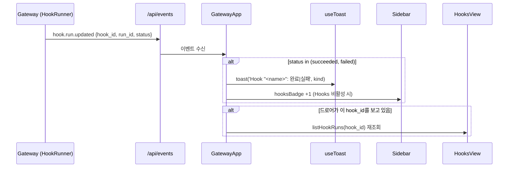

# Event Hooks 프론트엔드 UI 설계

- 작성일: 2026-07-15
- 상태: 구현 완료
- 선행: `2026-07-15-event-hooks-design.md`(백엔드, main에 머지 완료 — HEAD 09aa771)
- 관련 화면: Sidebar NAV(Automation 그룹), GatewayApp 컨테이너

## 1. 배경과 목적

백엔드 Event Hooks 프레임워크(이메일 폴링 → 새 메일 감지 → headless Agent 자동 처리 → hook_run 기록 + `hook.run.updated` SSE)가 이미 구현·머지됐다. 이 문서는 그 기능을 사용자가 다룰 **프론트엔드 UI**를 설계한다: hook을 만들고(연결·필터·타깃 Agent·프롬프트), 목록에서 관리하고(enable/pause·삭제·즉시 실행), 실행 결과(hook_run)를 보고, 새 결과를 **토스트 + 사이드바 배지**로 알림받는다.

### 확정된 결정 (브레인스토밍 결과)

| 질문 | 결정 |
| --- | --- |
| 새 hook_run 알림 방식 | 토스트 + 사이드바 배지 (기존 `useToast`/`nav-badge` 인프라 재사용) |
| 타깃 Agent 선택 UI | 기존 `AgentPicker` 컴포넌트 재사용 |
| IMAP 연결 검증 | 저장 전 "Test connection" 버튼 (미저장 연결 검증용 백엔드 엔드포인트 추가) |
| 화면 원형 | `SchedulesView`(목록 + 우측 생성 폼 + 상세 드로어) 미러 |

### 범위 밖 (후속)

- hook_run `rerun` (백엔드 설계서에서 이미 후속으로 지정)
- 이메일 외 소스(Slack/RSS/파일 감시)의 생성 UI
- I3(이메일 hook의 Agent 기본 보안 posture) — 별도 논의. 단 AgentPicker 재사용으로 hook별 sandbox/approval 조정은 가능해진다.

## 2. 구성요소

기존 프론트엔드 규약을 따른다: 뷰는 props(데이터+콜백)만 받는 organism, 상태·fetch·SSE는 `GatewayApp` 컨테이너가 소유, React 앱 스타일시트는 `src/personal_agent_gateway/static/styles.css`.

```
organisms/HooksView/index.jsx            신규 — 목록 + 생성 폼 + hook_run 드로어 (SchedulesView 원형)
organisms/HooksView/HooksView.test.jsx   신규
organisms/Sidebar/index.jsx              수정 — NAV에 { key:"hooks", label:"Hooks" } 추가, hooksBadge prop
containers/GatewayApp/index.jsx          수정 — hooks 상태·fetch·SSE·배지·토스트·콜백 배선
api/client.js                            수정 — hook API 메서드 8개
static/styles.css                        수정 — hook-* 클래스 (schedule-*/jobs-drawer-* 최대 재사용)
```

백엔드 소규모 추가:

```
sources/email.py   수정 — ImapEmailAdapter.verify(connection, secret, folder)
api/hooks.py       수정 — POST /api/hooks/test-connection
tests/test_api_hooks.py 수정 — test-connection 테스트
```

## 3. 화면 레이아웃

`SchedulesView`를 미러한다: 좌측(main) 목록 + 하단 hook_run 드로어, 우측 생성 폼.

- **hook 행**: 이름 · `StatusBadge`(enabled/paused) · 필터·폴더·타깃 요약(`from∋… · INBOX · codex/gpt-5`) · 프롬프트 미리보기 · `last_error`(있으면 강조 표시) · `LAST · <last_polled_at>`. 액션 버튼: **Runs**(드로어 열기), **Pause/Resume**, **Run now**, **Delete**(`useConfirm`).
- **hook_run 드로어**: `ScheduleDetail`/`jobs-drawer-*` 스타일. 각 run의 `trigger_summary` · `StatusBadge`(queued/running/succeeded/failed) · 성공 시 `result_text` · 실패 시 `error_message` · 시각. 드로어가 열려 있는 동안 SSE로 실시간 갱신.
- **생성 폼(NEW HOOK)** 필드 순서:
  1. Name
  2. Connection: Host, Port(기본 993), Username, App password + **Test connection** 버튼 & 인라인 결과(✓/✕ + 오류 메시지)
  3. Filter: From contains, Subject contains, Folder(기본 INBOX)
  4. Agent: **AgentPicker**(backend·model·옵션)
  5. Prompt template: textarea + 플레이스홀더 힌트(`{{from}} {{subject}} {{body}} {{date}}`)
  6. Poll interval(분 단위 입력; 저장 시 `poll_interval_seconds = 분 × 60`)
  - 제출 → `api.createHook(body)` → 목록 재조회, 폼 초기화.

## 4. 상태 · 데이터 흐름 (GatewayApp)

- `hooks` 목록: Hooks 화면 진입 시 `api.listHooks()`. 생성/삭제/enable·pause/run-now 후 재조회.
- `hookRuns`: 드로어 열 때 `api.listHookRuns(hookId)`.
- **SSE**: 기존 `/api/events` 구독에 `hook.run.updated` 핸들러를 추가한다(새 연결 아님).
  - 이벤트 payload: `{type:"hook.run.updated", hook_id, run_id, status}`.
  - 열려 있는 드로어의 `hook_id`와 일치 → 해당 hook의 hook_run 목록 재조회(실시간 갱신).
  - `status`가 `succeeded`/`failed` → **토스트**(`useToast()`): `Hook "<name>": 완료|실패`(kind=success/error). 이름은 GatewayApp의 `hooks`에서 `hook_id`로 해석(없으면 hook_id로 대체).
  - Hooks 화면이 활성 상태가 아니면 → **hooksBadge +1**(미확인 완료 수). Hooks 화면 진입 시 배지 0으로 리셋. (`teamRunBadge`와 동일 패턴.)
- **Sidebar**: `hooksBadge` prop 추가, 기존 `nav-badge` 마크업 재사용.



## 5. 백엔드 추가 (test-connection)

- `ImapEmailAdapter.verify(connection, secret, folder)`: `client_factory`로 클라이언트 생성 → `login` → `select(folder)` → `logout`(가져오기·필터 없음). 실패 시 예외 전파. 테스트는 fake client로 검증.
- `POST /api/hooks/test-connection` (body `{connection, secret, filter?}`): 해당 `source_type`(기본 "email")의 어댑터를 찾아 `verify`를 호출한다. 성공 → `{"ok": true}`; 실패 → `{"ok": false, "error": "<메시지>"}`. 어댑터에 `verify`가 없으면 400. 비밀은 요청 바디로만 받고 저장/로그/응답에 남기지 않는다. `session_dependency`로 보호.
  - 참고: 이 엔드포인트는 미저장 연결을 검증하므로 hook 생성 전에 호출 가능하다.

## 6. API client 메서드 (api/client.js)

기존 client 규약(경로 prefix, 응답 언랩, 세션 쿠키)을 그대로 따른다.

| 메서드 | HTTP |
| --- | --- |
| `listHooks()` | GET /api/hooks → hooks |
| `createHook(body)` | POST /api/hooks → hook |
| `getHook(id)` | GET /api/hooks/{id} → hook |
| `updateHook(id, {enabled})` | PATCH /api/hooks/{id} → hook |
| `deleteHook(id)` | DELETE /api/hooks/{id} |
| `runHookNow(id)` | POST /api/hooks/{id}/run-now → {created} |
| `listHookRuns(id)` | GET /api/hooks/{id}/runs → runs |
| `testHookConnection({connection, secret, filter})` | POST /api/hooks/test-connection → {ok, error?} |

## 7. 테스트 전략

- **HooksView.test.jsx**: 목록 렌더·빈 상태; 생성 폼 제출 페이로드(분→초 변환, 필터, 프롬프트, AgentPicker 선택 반영); Test connection 성공/실패 인라인 표시; Pause/Run now/Delete(useConfirm) 콜백 호출; 드로어 hook_run 렌더(성공 시 result_text, 실패 시 error_message).
- **Sidebar.test.jsx**: hooks nav 항목 존재 + `hooksBadge` 표시.
- **GatewayApp.test.jsx**: `hook.run.updated` SSE 수신 → 토스트 + 배지 증가; Hooks 진입 시 배지 리셋; 열린 드로어 hook 재조회.
- **client.test.js**: 8개 메서드 경로·언랩.
- **tests/test_api_hooks.py**(백엔드): test-connection 성공(fake adapter verify)·실패·비밀 미노출·미인증 401.

## 8. 근거 파일

- `frontend/src/components/organisms/SchedulesView/index.jsx` — 화면 원형(목록+폼+드로어)
- `frontend/src/components/organisms/Sidebar/index.jsx` — NAV·배지 패턴
- `frontend/src/components/providers/UiProvider/index.jsx` — `useToast`/`useConfirm` 인프라
- `frontend/src/components/organisms/AgentPicker/index.jsx` — 타깃 Agent 선택 재사용
- `frontend/src/components/containers/GatewayApp/index.jsx` — 상태·fetch·SSE·배지 소유
- `frontend/src/api/client.js` — API 메서드 규약
- `src/personal_agent_gateway/api/hooks.py`, `src/personal_agent_gateway/sources/email.py` — test-connection 추가 지점
</content>
