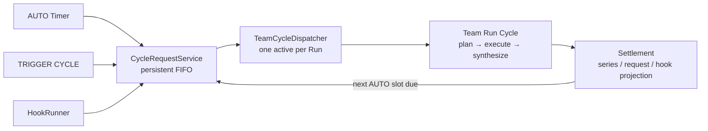
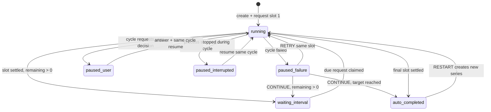

# Continuous Team Run Cycle Policies 설계

- 작성일: 2026-07-20
- 상태: 설계 승인, 구현 계획 대기
- 관련 도메인: Team Run, Hooks, Scheduler, Operations

## 1. 배경

현재 Team Run은 `standard | continuous` lifecycle을 선택한다. Continuous Run은 Hook
이벤트마다 `team_run_cycles`를 생성하고, HookRunner가 같은 Run에서 Cycle을 직렬
실행한다. Cycle별 Task, Message, Decision, Summary 격리는 이미 구현되어 있다.

새 요구사항은 신규 Team Run의 lifecycle을 CONTINUOUS로 고정하고, 실행 시점만 두 정책
중 하나로 제어하는 것이다.

- **AUTO**: 생성 즉시 첫 Cycle을 실행하고, 완료 후 설정된 interval만큼 기다린 뒤 총
  N개의 slot을 실행한다.
- **TRIGGERED**: 사용자의 `TRIGGER CYCLE` 또는 Hook 이벤트가 있을 때만 Cycle 요청을
  FIFO로 추가한다.

현재 HookRunner가 Cycle을 직접 만들고 실행하는 구조에 AUTO 경로를 별도로 추가하면
두 큐와 두 복구 정책이 생긴다. 이를 피하기 위해 AUTO Timer, Manual, Hook을 하나의
`CycleRequest` 큐로 정규화한다.

## 2. 목표와 범위

### 목표

1. 신규 Team Run 생성 UI에서 lifecycle 선택을 제거하고 CONTINUOUS로 고정한다.
2. Run마다 `auto | triggered` 실행 정책 하나만 선택한다.
3. 모든 실행 원인을 하나의 영속 FIFO 요청 큐로 정규화한다.
4. 한 Run에서는 항상 Cycle 하나만 실행한다.
5. AUTO의 반복, interval, 실패 일시정지, 사용자 결정 대기, 재시작 복구를 명시적 상태로
   관리한다.
6. TRIGGERED 수동 실행 UI에서 마지막 정산 Cycle 요약을 보여준다.
7. 이전 Cycle 요약은 다음 Cycle의 리더에게만 명시적으로 전달한다.
8. 기존 STANDARD 기록과 기존 Continuous/Hook 데이터를 읽을 수 있게 유지한다.

### 범위 밖

- 여러 Cycle의 동시 실행
- AUTO와 TRIGGERED를 한 Run에서 동시에 활성화
- Cron 표현식 또는 달력 기반 AUTO 일정
- 실행 중인 Run의 execution policy 변경
- Worker 전체에게 이전 Cycle transcript를 직접 주입
- 기존 STANDARD 기록을 Continuous로 변환
- Cycle 결과를 자동으로 외부 시스템에 전송하는 기능

## 3. 확정된 결정

| 항목 | 결정 |
| --- | --- |
| 신규 lifecycle | 항상 `continuous` |
| 정책 | `auto` 또는 `triggered`, 상호 배타적 |
| AUTO 첫 실행 | Run 생성 직후 즉시 |
| AUTO interval 기준 | 이전 slot 정산 시각부터 계산 |
| AUTO 컨텍스트 | Goal + Trigger instruction + 이전 정산 Cycle summary |
| TRIGGERED 입력 | Manual 버튼과 Hook 모두 허용 |
| 동시 Trigger | Run 소유 FIFO에 추가하고 직렬 실행 |
| 실패 | AUTO Series를 일시정지하고 `RETRY / CONTINUE` 제공 |
| CONTINUE | 실패한 slot을 N에 포함하여 소진 |
| RETRY | 같은 slot의 사용자 승인 추가 시도, lineage 유지 |
| 사용자 결정 대기 | 같은 Cycle을 일시정지하고 답변 후 resume |
| AUTO 종료 | `AUTO_COMPLETED`로 기록을 유지 |
| AUTO 재시작 | 같은 설정으로 새 Series를 생성하며 이전 history 보존 |
| 부분 실패 완료 | `completed_with_failures`도 정산된 slot으로 계산 |
| 이전 요약 UI | Trigger 시점의 마지막 정산 Cycle 요약 표시 |
| 이전 요약 전달 | 리더 planning/add-work 프롬프트에만 전달 |
| 레거시 STANDARD | 조회·기존 작업 호환 유지, 신규 생성 UI에서는 제거 |

AUTO의 N은 자동으로 진행할 **논리적 slot 수**다. 실패한 slot에서 사용자가 RETRY를
명시적으로 선택하면 같은 slot에 추가 실행이 발생할 수 있다. 자동 실행 자체는 N개의
slot을 넘기지 않으며, 추가 비용은 사용자 action으로만 발생한다.

## 4. 아키텍처



### 책임 경계

- **Team Run**: Goal, Team/Persona snapshot, execution policy, 큐의 소유권을 가진다.
- **AUTO Series**: 한 번의 N-slot 반복 시도와 그 제어 상태를 가진다.
- **CycleRequest**: AUTO/Manual/Hook/Retry가 요청한 실행 의도, idempotency, FIFO 순서,
  이전 요약 snapshot을 가진다.
- **TeamRunCycle**: 실제 Team 실행 결과와 Task/Message/Decision lineage를 가진다.
- **TeamCycleDispatcher**: Run별 요청을 하나씩 claim하고 Cycle을 만들어 실행한다.
- **HookRunner**: Team Run 대상 Hook을 직접 실행하지 않고 CycleRequest를 enqueue하며,
  HookRun 결과는 연결된 Cycle의 settlement로 투영한다.

## 5. 상태 모델

Cycle 실행 상태와 AUTO 제어 상태는 서로 다른 수명주기이므로 분리한다.

### 5.1 Cycle 실행 상태

기존 `team_run_cycles.status`를 source of truth로 유지한다.

```text
queued → running → waiting_for_user → running
                 ↘ interrupted
                 ↘ completed
                 ↘ completed_with_failures
                 ↘ failed
                 ↘ canceled
```

`team_runs.status`는 레거시 UI/API 호환을 위한 최신 Cycle mirror로만 유지한다. AUTO
다음 실행 시각, pause reason, series 완료 여부를 판단하는 source of truth로 사용하지
않는다.

### 5.2 AUTO Series 제어 상태



Series 상태 값:

- `running`
- `waiting_interval`
- `paused_failure`
- `paused_user`
- `paused_interrupted`
- `auto_completed`
- `canceled`

`completed`와 `completed_with_failures`는 slot을 즉시 정산한다. `failed`는 사용자가
CONTINUE를 선택할 때까지 slot을 정산하지 않는다. RETRY는 같은 `slot_ordinal`을
사용하고 `retry_of_request_id`로 이전 시도와 연결한다.

### 5.3 TRIGGERED 제어 상태

별도 mutable state를 저장하지 않고 요청·Cycle에서 파생한다.

- active Cycle 있음: `RUNNING`, 필요하면 `WAITING_FOR_USER`
- active 없음 + queued 있음: `QUEUED`
- active 없음 + queue 비어 있음: `READY`

Manual과 Hook이 실행 중 도착하면 FIFO 끝에 추가한다. 현재 Cycle이 terminal로
정산된 뒤 다음 요청을 claim한다.

## 6. 데이터 모델

### 6.1 `team_runs` 확장

```sql
alter table team_runs add column execution_policy text;
```

- 새 Run은 `execution_policy in ('auto', 'triggered')`를 반드시 가진다.
- 기존 `continuous` Run은 `triggered`로 backfill한다. 기존 Hook 동작과 일치한다.
- 기존 `standard` Run은 `null`을 유지하며 레거시 경로에서만 사용한다.

### 6.2 `team_run_auto_series`

```sql
create table team_run_auto_series (
    id text primary key,
    team_run_id text not null,
    series_number integer not null,
    status text not null,
    target_slots integer not null,
    settled_slots integer not null default 0,
    interval_seconds integer not null,
    next_run_at text,
    pause_reason text,
    paused_cycle_id text,
    created_at text not null,
    started_at text not null,
    completed_at text,
    updated_at text not null,
    foreign key (team_run_id) references team_runs(id) on delete cascade,
    foreign key (paused_cycle_id) references team_run_cycles(id) on delete set null,
    unique(team_run_id, series_number)
);
```

한 Run에 `running | waiting_interval | paused_failure | paused_user |
paused_interrupted` Series는 최대 하나만 존재하도록 partial unique index를 둔다.

### 6.3 `team_cycle_requests`

```sql
create table team_cycle_requests (
    id text primary key,
    team_run_id text not null,
    auto_series_id text,
    slot_ordinal integer,
    source_type text not null,
    source_id text not null,
    status text not null,
    instruction text not null,
    previous_cycle_id text,
    previous_summary_text text,
    retry_of_request_id text,
    created_at text not null,
    claimed_at text,
    settled_at text,
    updated_at text not null,
    foreign key (team_run_id) references team_runs(id) on delete cascade,
    foreign key (auto_series_id) references team_run_auto_series(id) on delete cascade,
    foreign key (previous_cycle_id) references team_run_cycles(id) on delete set null,
    foreign key (retry_of_request_id) references team_cycle_requests(id) on delete set null,
    unique(team_run_id, source_type, source_id)
);
```

Request 상태:

- `queued`
- `dispatching`
- `settled`
- `canceled`

Run당 `dispatching` Request가 최대 하나가 되도록 partial unique index를 둔다. AUTO
idempotency source ID는 `{series_id}:{slot_ordinal}:{attempt}` 형태, Manual은 client
request ID, Hook은 HookRun ID를 사용한다.

`previous_cycle_id`와 `previous_summary_text`는 enqueue 시점에 함께 snapshot한다. 요청이
대기하는 동안 다른 Cycle이 정산되어도 사용자가 Trigger 화면에서 확인한 컨텍스트가
바뀌지 않는다.

### 6.4 `team_run_cycles` 연결

기존 테이블에 nullable `request_id`를 추가하고 unique index를 둔다. 신규 Cycle에는
반드시 채우고 기존 Cycle은 `null`을 허용한다. Request와 Cycle의 연결은
`team_run_cycles.request_id` 한 곳만 source of truth로 사용한다. 기존
`source_type/source_id`는 API 호환과 lineage 표시를 위해 유지한다.

## 7. 실행 흐름

### 7.1 AUTO 생성 및 반복

1. `POST /api/team-runs`가 Continuous Run과 AUTO Series를 한 트랜잭션으로 생성한다.
2. 같은 트랜잭션에서 slot 1 CycleRequest를 `queued`로 생성한다.
3. Dispatcher가 요청을 claim하고 Cycle을 생성해 실행한다.
4. Cycle이 정산되면 Series의 slot을 정산한다.
5. 남은 slot이 있으면 `next_run_at = settled_at + interval_seconds`로 저장한다.
6. TeamCycleLoop가 due Series를 찾아 다음 slot 요청을 idempotent하게 enqueue한다.
7. N번째 slot이 정산되면 Series를 `auto_completed`로 전환한다.

AUTO 다음 Cycle의 리더 컨텍스트는 다음으로 구성한다.

```text
Base Goal
Current request instruction
Previous settled Cycle summary (있을 때만)
```

Worker 프롬프트에 이전 summary 블록을 직접 추가하지 않는다. 리더가 해당 Cycle의
Task description에 필요한 맥락만 반영한다.

### 7.2 실패와 사용자 결정

- **failed**: Series를 `paused_failure`로 전환한다. 다음 AUTO 요청을 만들지 않는다.
- **RETRY**: 같은 slot ordinal의 새 Request를 만들고 `retry_of_request_id`를 기록한다.
  기존 실패 Cycle과 결과는 수정하지 않는다.
- **CONTINUE**: 실패 slot을 정산한다. 남은 slot이 있으면 CONTINUE 시각부터 interval을
  계산하고, 마지막 slot이면 `auto_completed`로 전환한다.
- **waiting_for_user**: 같은 Cycle과 Request를 유지하고 Series를 `paused_user`로
  표시한다. 기존 decision answer API가 같은 Cycle을 resume한다. Cycle이 정산된 뒤
  정상 settlement 흐름으로 돌아간다.
- **interrupted**: Request를 `dispatching`으로 유지하고 Series를
  `paused_interrupted`로 표시한다. 기존 Resume action이 같은 Cycle을 재개하며, 새
  AUTO slot이나 다음 FIFO 요청은 먼저 실행하지 않는다.

### 7.3 TRIGGER CYCLE

1. UI는 마지막 `completed | completed_with_failures` Cycle의 번호, 완료 시각, summary를
   보여준다. 없으면 `NO PREVIOUS CYCLE`을 표시한다.
2. 사용자가 instruction을 입력하고 Trigger한다.
3. UI는 preview에 사용한 `previous_cycle_id`를 함께 보낸다. 서버는 해당 Cycle이 같은
   Run의 정산된 Cycle인지 검증하고 ID/summary를 Request에 snapshot한다.
4. Request가 FIFO 끝에 추가되고 응답은 queue position을 포함한다.
5. Dispatcher가 차례가 되었을 때 Cycle을 만들고 리더에게 instruction과 이전 summary를
   전달한다.

### 7.4 Hook Trigger

HookRunner는 Team Run Cycle을 직접 만들지 않는다. HookRun ID를 idempotency source로
사용해 같은 enqueue 서비스에 요청한다. Hook payload로 만든 instruction과 enqueue
시점의 이전 Cycle summary를 snapshot한다.

HookRun은 `team_cycle_request_id`와 `team_run_cycle_id` lineage를 가진다. Cycle
settlement observer가 성공, 실패, waiting 상태를 HookRun에 투영하고 다음 FIFO 요청을
Dispatcher가 처리한다.

## 8. 서비스와 프로세스 수명주기

### `TeamCycleRequestService`

- execution policy 검증
- idempotent enqueue
- previous Cycle summary snapshot
- FIFO 조회와 request 상태 전이
- Run별 단일 dispatching 제약 처리

### `TeamAutoSeriesService`

- Series 생성과 restart
- slot settlement
- failure/user pause
- RETRY/CONTINUE
- due Series 조회

### `TeamCycleDispatcher`

- Run별 다음 queued Request claim
- Cycle 생성 및 Request 연결
- 기존 `TeamRunOrchestrator.run_cycle()` 호출
- terminal settlement와 다음 Request wake-up

### `TeamCycleLoop`

- 짧은 주기로 due AUTO Series 조회
- 다음 slot Request를 idempotent하게 enqueue
- Dispatcher wake-up

앱 lifespan에서 기존 SchedulerLoop, HookLoop와 같은 방식으로 start/stop한다. 실제
interval 테스트는 wall-clock sleep 대신 주입 가능한 clock을 사용한다.

## 9. API

### 생성 및 조회

- `POST /api/team-runs`
  - 신규 필드: `execution_policy`
  - AUTO 필드: `auto_repeat_count`, `auto_interval_minutes`
  - 서버는 lifecycle을 `continuous`, run mode를 `plan_and_execute`로 고정한다.
  - TRIGGERED에는 AUTO 필드를 허용하지 않고, AUTO에는 두 필드를 필수로 요구한다.
- `GET /api/team-runs/{id}/detail`
  - `execution_policy`
  - 파생 `policy_status`
  - `active_auto_series`
  - `queue_count`, `active_request`
  - 기존 `cycles`

### TRIGGERED

- `POST /api/team-runs/{id}/cycle-requests`
  - Body: `instruction`, `client_request_id`, `previous_cycle_id`
  - TRIGGERED Run에서만 허용
  - 응답: Request, queue position, previous Cycle preview

### AUTO actions

- `POST /api/team-runs/{id}/auto-series/{series_id}/retry`
- `POST /api/team-runs/{id}/auto-series/{series_id}/continue`
- `POST /api/team-runs/{id}/auto-series/restart`

기존 `POST /decision-request/answer`는 동일 Cycle resume 계약을 유지한다.

### 오류 계약

- 잘못된 policy/action 조합: `409 Conflict`
- AUTO 반복 횟수 또는 interval 검증 실패: `422 Unprocessable Entity`
- previous Cycle이 다른 Run 소속이거나 미정산 상태: `409 Conflict`
- 중복 idempotency key: 기존 Request를 성공 응답으로 반환
- 이미 정산된 실패에 RETRY/CONTINUE: `409 Conflict`
- 활성 Series가 있는데 restart: `409 Conflict`
- AUTO Run을 Hook target으로 지정: 생성·수정 시 `400 Bad Request`

## 10. UI

### TeamPicker

- `STANDARD / CONTINUOUS` selector를 제거한다.
- `LIFECYCLE · CONTINUOUS · FIXED`를 표시한다.
- `AUTO / TRIGGERED` segmented selector를 추가한다.
- AUTO 선택 시 Repeat Count와 Interval Minutes를 표시한다.
- TRIGGERED 선택 시 Manual과 Hook이 요청을 만들 때만 실행된다는 설명을 표시한다.

### TeamRunDetail

공통:

- Lifecycle과 execution policy badge
- 현재 Cycle status
- queued Request 수와 source
- 기존 Cycle history와 lineage

AUTO:

- `settled / target` progress
- `next_run_at` countdown
- `PAUSED_FAILURE`의 RETRY/CONTINUE
- `PAUSED_USER`의 기존 decision UI
- `PAUSED_INTERRUPTED`의 기존 RESUME
- `AUTO_COMPLETED`의 RESTART SERIES

TRIGGERED:

- 마지막 정산 Cycle 번호, 상태, 완료 시각, summary
- 이전 Cycle이 없을 때 empty state
- Cycle instruction textarea
- `TRIGGER CYCLE` 버튼
- enqueue 후 queue position feedback

### Hooks

- Team Run target selector에는 `execution_policy === "triggered"`인 Run만 표시한다.
- 기존 Hook이 AUTO target을 가리키는 비정상 상태는 경고로 표시하고 실행을 막는다.

## 11. 재시작 복구

startup reconciliation은 다음 순서로 실행한다.

1. `dispatching` Request와 연결 Cycle을 확인한다.
2. Cycle이 terminal이면 Request/Series/HookRun settlement를 완료한다.
3. Cycle이 실행 중 남아 있으면 기존 정책에 따라 `interrupted`로 표시한다. AUTO
   Series는 `paused_interrupted`로 두고 기존 Resume action 전에는 자동 재실행하거나
   다음 요청으로 넘어가지 않는다.
4. `queued` Request를 Dispatcher에 재등록한다.
5. `waiting_interval`이고 `next_run_at <= now`인 Series의 다음 slot을 idempotent하게
   enqueue한다.
6. `paused_failure | paused_user` Series는 사용자 action 없이 변경하지 않는다.

DB unique 제약과 source ID가 복구 과정의 중복 Cycle 생성을 막는다. 복구는 여러 번
실행해도 같은 결과가 되는 idempotent operation이어야 한다.

## 12. 이벤트, Audit, Operations

신규 SSE 이벤트:

- `team.cycle_request.queued`
  - `team_run_id`, `request_id`, `source_type`, `queue_position`
- `team.cycle.started`
  - `team_run_id`, `request_id`, `cycle_id`, `series_id`, `slot_ordinal`
- `team.cycle.settled`
  - `status`, `duration`, lineage
- `team.auto_series.paused`
  - `reason`, `available_actions`
- `team.auto_series.completed`
  - `settled_slots`, `target_slots`

Operations 화면은 queued 수, active Cycle, next run time, pause reason을 표시한다.
Manual Trigger, RETRY, CONTINUE, RESTART는 기존 Audit Log에 actor와 resource lineage를
기록한다.

## 13. 테스트 전략

### Domain / Store

- AUTO 생성 시 Series와 slot 1 Request가 원자적으로 생성된다.
- next run time은 이전 settlement 시각 + interval이다.
- completed와 completed_with_failures는 slot을 정산한다.
- failed는 pause하고 CONTINUE가 slot을 정산한다.
- RETRY는 같은 slot과 retry lineage를 유지한다.
- interrupted는 같은 Cycle의 resume 전까지 queue를 막는다.
- N slot 후 auto_completed가 된다.
- restart가 같은 설정의 새 Series와 새로운 history를 만든다.
- source별 idempotency와 Run별 단일 dispatching 제약이 동작한다.

### Queue / Runtime

- Manual → Hook → Manual 요청이 FIFO 순서로 직렬 실행된다.
- 실행 중 추가 요청이 active Cycle과 병렬 실행되지 않는다.
- waiting_for_user는 같은 Cycle을 resume한다.
- 이전 summary가 leader planning/add-work 프롬프트에는 포함된다.
- 이전 summary가 Worker 프롬프트에 직접 포함되지 않는다.
- Trigger 시점의 summary snapshot이 대기 중 변경되지 않는다.
- interrupted Cycle resume 후 기존 Request가 정산되고 FIFO가 계속된다.

### API

- policy별 생성 payload 검증
- AUTO Run의 Manual Trigger와 Hook target 거부
- TRIGGERED Run의 AUTO action 거부
- 중복 client request와 HookRun이 Cycle 하나만 만든다.
- RETRY/CONTINUE/restart 상태 충돌 응답
- Detail read model의 policy/series/queue 필드

### UI

- CONTINUOUS fixed 및 AUTO/TRIGGERED form 전환
- AUTO progress, countdown, pause action, completed restart
- TRIGGERED previous Cycle summary와 empty state
- queue position feedback
- Hook target selector의 TRIGGERED 필터
- Cycle history source와 retry lineage

### Recovery

주입 가능한 fake clock과 재생성한 app/service instance로 다음을 검증한다.

- queued Request 재등록
- due AUTO slot 1회 enqueue
- dispatching + terminal Cycle settlement 복구
- running Cycle interrupted 처리
- interrupted AUTO Series의 resume과 queue 차단
- paused Series 보존
- reconciliation 반복 실행 시 중복 없음

## 14. 완료 조건

다음 조건을 모두 자동 테스트로 증명해야 구현 완료로 본다.

1. 한 Run에서 동시에 두 Cycle이 실행되지 않는다.
2. AUTO가 즉시 시작하고 interval 기준으로 N slot을 정산한다.
3. 실패·사용자 결정 대기에서 다음 AUTO slot이 실행되지 않는다.
4. CONTINUE, RETRY, decision answer가 정확한 Series/Cycle에서 재개된다.
5. Manual과 Hook 요청이 하나의 FIFO에서 순서대로 실행된다.
6. 재시작 후 누락이나 이중 실행 없이 상태가 복구된다.
7. Trigger UI가 이전 정산 Cycle summary를 표시한다.
8. 동일 summary가 리더에게만 명시적으로 전달된다.
9. 기존 STANDARD 기록과 기존 Continuous/Hook 데이터가 조회 가능하다.

## 15. 근거 파일

- `src/personal_agent_gateway/teams.py`
  - TeamRun/Cycle 상태, Cycle idempotency, Task/Message/Decision cycle 격리
- `src/personal_agent_gateway/team_runtime.py`
  - planning, worker execution, synthesis, waiting_for_user, upstream session 저장
- `src/personal_agent_gateway/team_run_orchestrator.py`
  - Run registry와 Cycle 실행 scheduling
- `src/personal_agent_gateway/hook_runner.py`
  - 기존 Team Run Hook 직렬화와 startup reconciliation
- `src/personal_agent_gateway/scheduler_loop.py`
  - background loop 수명주기 패턴
- `src/personal_agent_gateway/api/team_runs.py`
  - 생성, detail, resume, decision answer API
- `src/personal_agent_gateway/api/hooks.py`
  - Hook target 검증 및 HookRun API
- `frontend/src/components/organisms/TeamPicker/index.jsx`
  - 현재 lifecycle/run-mode 생성 UI
- `frontend/src/components/organisms/TeamRunDetail/index.jsx`
  - 현재 Cycle history와 decision UI
- `frontend/src/components/organisms/HooksView/index.jsx`
  - 현재 Hook target 선택 UI
- `tests/test_teams.py`
- `tests/test_team_runtime.py`
- `tests/test_hook_runner.py`
- `tests/test_api_team_runs.py`
- `frontend/src/components/organisms/TeamPicker/TeamPicker.test.jsx`
- `frontend/src/components/organisms/TeamRunDetail/TeamRunDetail.test.jsx`
