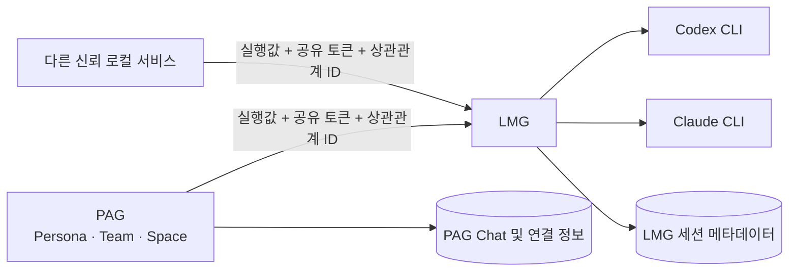
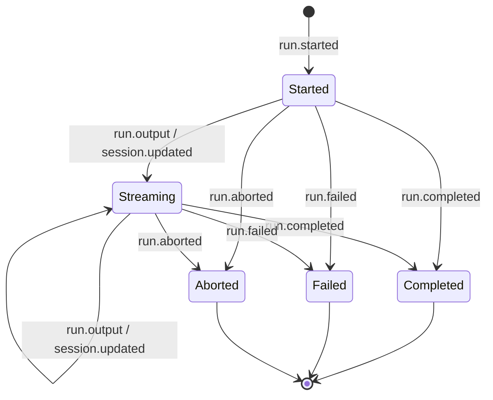

# PAG-LMG 로컬 통합 안정화 설계

## 1. 배경

`personal-agent-gateway`(이하 PAG)는 Persona, Team, Space, Chat을 관리하고,
`local-model-gateway`(이하 LMG)는 Codex와 Claude CLI를 실행하는 범용 로컬 서비스다.

두 서비스를 병행할 때 다음 문제가 확인되었다.

1. LMG API가 로컬 브라우저나 의도하지 않은 프로세스의 요청을 구분하지 않는다.
2. CLI가 일부 출력을 만든 뒤 실패하거나 연결이 끊기면 성공으로 오인할 수 있다.
3. PAG Chat 삭제와 LMG 및 CLI 세션 삭제가 원자적으로 연동되지 않는다.
4. 재개 요청의 실행 환경이 최초 요청과 달라질 수 있다.
5. 여러 Chat과 Team Run이 동시에 실행되면 CLI 과부하와 동일 세션 충돌이 발생할 수 있다.
6. LMG 세션 조회와 삭제가 파일 전체 탐색에 의존하고, Claude 공용 홈의 소유권 경계가 불명확하다.

이 문서는 두 저장소의 책임 경계와 수정 순서를 확정한다.

## 2. 전제와 제외 범위

### 2.1 전제

- LMG를 호출하는 주체는 동일 PC에서 실행되는 소유자 관리 서비스다.
- LMG는 외부 네트워크에 공개하지 않고 loopback 주소에서만 수신한다.
- PAG 외 다른 로컬 서비스도 LMG를 호출할 수 있어야 한다.
- 각 소비 서비스가 자신의 도메인 정책을 소유한다.
- PAG는 Persona, Team, Space 정책의 소유자다.
- LMG는 공급자 중립적인 실행 요청 검증, CLI 실행, 스트림, 세션 메타데이터를 소유한다.
- Claude 로그인 상태와 CLI 설정은 사용자의 공용 Claude 홈을 사용한다.

### 2.2 제외 범위

- 원격 호스트에서 LMG에 접속하는 기능
- TLS 종료와 외부 네트워크 인증
- 사용자 또는 소비 서비스별 권한 모델
- 클라이언트별 관리자 API와 세밀한 ACL
- PAG의 Space 정책을 LMG로 이전하는 작업
- LMG가 알지 못하는 Claude 세션의 검색 또는 삭제

## 3. 설계 원칙

1. **도메인 정책은 소비 서비스가 결정한다.**
   PAG가 Space를 해석하고 LMG에는 최종 실행값만 전달한다.
2. **LMG는 실행 경계를 강제한다.**
   요청 형식, 경로, 동시성, 세션 충돌, 종료 상태를 검증한다.
3. **성공은 명시적인 성공 종료로만 판정한다.**
   출력이 존재한다는 사실은 성공의 근거가 아니다.
4. **삭제는 멱등적이어야 한다.**
   이미 없는 세션을 다시 삭제해도 목표 상태는 성공이다.
5. **소유권이 확인된 로컬 세션만 정리한다.**
   LMG가 기록하지 않은 Claude 세션에는 관여하지 않는다.
6. **계약 변경은 소비자 우선으로 배포한다.**
   PAG가 새 응답을 이해한 뒤 LMG가 새 응답을 발생시킨다.

## 4. 책임 경계

| 관심사 | PAG | LMG |
|---|---|---|
| Persona, Team, Chat | 소유 | 모름 |
| Global/Persona/Team Space | 소유 및 우선순위 계산 | 모름 |
| 최종 작업 디렉터리와 읽기 경로 | 계산 | 기본 경로 검증 |
| Codex sandbox와 Claude permission mode | 정책에 따라 결정 | 허용된 실행 옵션으로 변환 및 적용 |
| 로컬 호출자 보호 | 공유 토큰 설정 및 전달 | 공유 토큰 검증 |
| 실행 스트림 해석 | 엄격한 상태 머신으로 소비 | 정확히 하나의 종료 이벤트 발행 |
| 소비 서비스와 실행의 상관관계 | 도메인 ID 제공 | 중립 메타데이터 저장 |
| CLI 세션 수명주기 | Chat과의 연결 관리 | 자신이 기록한 upstream session 관리 |
| 동시 실행 정책 | 사용자 상태 표시 및 재시도 | 전역/공급자/세션 단위 제한 |



## 5. 계획 1: 로컬 인터페이스와 실행 요청 강화

### 5.1 네트워크 경계

- LMG 수신 주소는 `127.0.0.1` 또는 `::1`만 허용한다.
- 설정값이 비-loopback 주소이면 서버 시작을 거부한다.
- 원격 사용을 위한 예외 플래그는 추가하지 않는다.

### 5.2 공유 로컬 토큰

- LMG는 시작 시 `LMG_LOCAL_TOKEN`을 필수로 읽는다.
- 모든 소비 서비스는 동일 토큰을 사용한다.
- `/livez`만 토큰 없이 접근할 수 있다.
- 실행, 세션, capability, readiness API는
  `Authorization: Bearer <token>`을 요구한다.
- 비교는 timing-safe 방식으로 수행한다.
- 로그와 오류 응답에 토큰을 출력하지 않는다.

토큰의 목적은 멀티 테넌트 격리가 아니라 브라우저의 localhost 요청,
우발적으로 실행된 로컬 프로세스, 잘못 연결된 개발 도구의 호출을 차단하는 것이다.

### 5.3 HTTP 요청 검증

- 엔드포인트별 HTTP method를 명시하고 다른 method는 `405`로 거부한다.
- JSON 요청은 `Content-Type: application/json`만 허용한다.
- request body 크기 상한을 설정하고 초과 시 `413`을 반환한다.
- 알 수 없는 JSON 필드는 거부한다.
- 필수 문자열은 공백 문자열을 허용하지 않는다.
- 서버의 read header, read body, idle timeout을 유한한 값으로 설정한다.

### 5.4 경로 검증과 Space 경계

PAG는 기존과 같이 다음 우선순위로 유효 Space를 결정한다.

```text
Team Space > Persona Space > Global Space
```

PAG는 선택된 Space를 공급자 중립 실행값으로 변환한다.

- `workdir`
- `read_roots`
- `sandbox` 또는 `permission_mode`
- 필요한 환경 변수

LMG는 Space ID나 우선순위를 해석하지 않는다. 대신 모든 소비 서비스에 동일한
기본 경로 검증을 적용한다.

- `workdir`와 `read_roots`는 절대 경로여야 한다.
- 심볼릭 링크를 해소한 canonical path를 검증한다.
- 경로는 존재하는 디렉터리여야 한다.
- 선택적 `LMG_ALLOWED_ROOTS`가 설정되면 canonical path가 그 하위인지 확인한다.
- `LMG_ALLOWED_ROOTS`가 없으면 로컬 신뢰 서비스 전제에 따라 존재하는 절대 경로를 허용한다.

`consumer`는 로그와 추적에 사용하는 문자열이며 보안 주체로 취급하지 않는다.

### 5.5 호환 배포

1. PAG에 토큰 전송과 새 요청 형식을 먼저 추가한다.
2. 운영 환경에 동일한 `LMG_LOCAL_TOKEN`을 설정한다.
3. 다른 로컬 소비 서비스도 토큰을 전송하도록 수정한다.
4. 마지막에 LMG의 토큰 및 loopback 강제를 활성화한다.

## 6. 계획 2: 정직한 종료 스트림 계약

### 6.1 이벤트 상태 머신

한 실행은 다음 흐름만 허용한다.



- 연결이 쓰기 가능한 동안 정확히 하나의 terminal event를 발행한다.
- terminal event는 `run.completed`, `run.failed`, `run.aborted` 중 하나다.
- CLI exit code가 0이고 프로토콜 파싱까지 성공한 경우에만 `run.completed`를 발행한다.
- CLI 비정상 종료와 파싱 실패는 `run.failed`다.
- 사용자 취소, 서버 종료, deadline 초과는 `run.aborted`다.
- 일부 출력이 존재해도 실패나 중단을 성공으로 바꾸지 않는다.
- terminal event 이후의 출력과 session update는 무시한다.

### 6.2 부분 출력

실패와 중단 이벤트는 보존 가능한 일부 출력이 있을 때만
`partial_content`를 포함할 수 있다. `partial_content`는 결과물이 아니라
진단 및 복구 보조 정보다.

PAG는 다음 규칙으로 Chat과 Team task를 갱신한다.

| LMG 종료 | PAG 실행 상태 | 부분 출력 처리 |
|---|---|---|
| `run.completed` | completed | 최종 응답으로 저장 |
| `run.failed` | failed | 진단 정보로 분리 저장 |
| `run.aborted` | cancelled 또는 timed_out | 진단 정보로 분리 저장 |
| terminal event 없이 EOF | failed | `upstream_stream_incomplete` 기록 |

### 6.3 오류 분류

LMG는 최소한 다음 오류 코드를 안정적으로 제공한다.

- `invalid_request`
- `unauthorized_local_client`
- `invalid_execution_path`
- `provider_unavailable`
- `provider_protocol_error`
- `provider_process_failed`
- `run_timeout`
- `run_cancelled`
- `session_busy`
- `capacity_exceeded`
- `upstream_stream_incomplete`

PAG는 표시 문구와 재시도 가능 여부를 오류 코드에서 결정한다.

### 6.4 호환 배포

1. PAG가 `run.aborted`와 terminal 없는 EOF를 먼저 처리한다.
2. LMG에 새 terminal 계약을 적용한다.
3. Chat과 Team Run 상태 매핑을 동일한 공통 파서로 통합한다.

## 7. 계획 3: 세션 수명주기 일관성

### 7.1 상관관계 ID

모든 실행 요청은 다음 선택 메타데이터를 전달할 수 있다.

- `consumer`
- `consumer_session_id`
- `consumer_run_id`

LMG는 이 값을 실행과 세션 레코드에 저장하지만 인가 판단에는 사용하지 않는다.

### 7.2 즉시 연결 기록

PAG는 `session.updated`에서 upstream session ID를 처음 받는 즉시
Chat session과 연결한다. 실행이 이후 실패하거나 중단되어도 연결을 유지한다.
이 규칙은 “실패한 첫 요청에서 로컬 세션만 고아로 남는 문제”를 막는다.

### 7.3 실행 컨텍스트 지문

PAG가 저장하는 세션 연결 지문에는 최소한 다음 항목을 포함한다.

- provider와 model
- canonical `workdir`
- 정렬된 canonical `read_roots`
- Codex sandbox 또는 Claude permission mode
- Persona ID와 Persona rules 버전
- system prompt 버전

재개 요청의 지문이 기존 지문과 다르면 기존 upstream session을 묵시적으로 재사용하지 않는다.
PAG는 새 upstream session을 만들거나 사용자에게 명시적인 불일치 오류를 보여준다.

LMG는 resume 시 공급자가 지원하는 실행 제약을 다시 적용한다.
공급자가 특정 제약의 재적용을 지원하지 않으면 조용히 무시하지 않고
capability 오류를 반환한다.

### 7.4 멱등 삭제

LMG의 세션 삭제는 목표 상태 기반으로 동작한다.

- 레코드와 파일이 모두 없으면 성공
- 레코드만 있고 파일이 없으면 레코드를 정리하고 성공
- 파일 삭제가 성공하면 레코드를 정리하고 성공
- 실제 I/O 오류가 발생한 경우에만 실패

PAG는 한 Chat에 연결된 모든 upstream session 삭제를 시도한다.
한 건의 실패 때문에 나머지 삭제를 중단하지 않는다.

1. 전체 삭제 결과를 수집한다.
2. 모두 성공하거나 이미 없으면 PAG Chat과 연결 정보를 삭제한다.
3. 일부가 실패하면 Chat은 유지하고 실패한 대상과 재시도 가능 오류를 반환한다.
4. 사용자가 다시 삭제하면 전체 대상을 안전하게 재시도한다.

별도의 삭제 outbox는 이번 범위에 추가하지 않는다. LMG 삭제 멱등성과 PAG의 전체 재시도로
요구사항을 충족한다.

### 7.5 정합성 점검

관리용 read-only 정합성 보고서는 다음 항목을 보여준다.

- PAG에는 연결됐지만 LMG에 없는 세션
- LMG에는 있지만 PAG에 연결되지 않은 `consumer=personal-agent-gateway` 세션
- 실행 컨텍스트 지문이 현재 Chat 설정과 다른 세션

보고서는 자동 삭제하지 않는다.

## 8. 계획 4: 운영 안정성과 소유권

### 8.1 동시성 제어

LMG에 다음 순서의 제한을 둔다.

1. 전역 실행 semaphore
2. provider별 semaphore
3. upstream session별 단일 실행 lock

대기열은 크기가 제한되어야 한다. 대기열이 가득 차면 무한 대기 대신
`429 capacity_exceeded`를 반환한다. 같은 upstream session이 이미 실행 중이면
`409 session_busy`를 반환한다.

제한값은 운영 설정으로 제공하되 provider 구현 내부에 별도 정책을 중복하지 않는다.

### 8.2 세션 메타데이터 저장소

LMG 세션 레코드에는 다음 필드를 저장한다.

- upstream session ID
- provider와 model
- `consumer`, `consumer_session_id`, `consumer_run_id`
- canonical storage path
- 생성 및 최근 사용 시각
- 확인 가능한 경우 파일 크기

조회와 삭제는 매 요청마다 전체 파일을 탐색하지 않고 인덱스된 메타데이터를 사용한다.
파일 시스템과 메타데이터 불일치는 명시적인 stale 상태로 보고한다.

### 8.3 Claude 공용 홈 소유권

- LMG는 사용자의 공용 Claude 홈과 로그인 상태를 그대로 사용한다.
- LMG가 실행 중 관찰하고 레코드에 저장한 session ID와 canonical path만 소유 대상으로 간주한다.
- Claude 홈 전체를 스캔해 알 수 없는 세션을 LMG 소유로 추정하지 않는다.
- 삭제 시 레코드의 canonical path가 Claude 세션 루트 하위인지 다시 확인한다.
- 사용자가 Claude CLI에서 직접 만든 세션은 삭제 대상이 아니다.

### 8.4 상태 API

- `/livez`: 프로세스가 요청을 받을 수 있는지만 반환하며 토큰이 필요 없다.
- `/readyz`: 토큰 검증 후 provider 실행 가능 여부, 저장소 상태, 대기열 수용 가능 여부를 반환한다.
- capability 응답에는 provider별 resume, sandbox, permission mode 지원 여부와 프로토콜 버전을 포함한다.
- “세션 없음”, “저장소 stale”, “provider 확인 실패”를 같은 빈 목록으로 반환하지 않는다.

## 9. HTTP 및 스트림 계약 요약

| 상황 | HTTP 또는 이벤트 |
|---|---|
| 토큰 누락/불일치 | `401` |
| 잘못된 method | `405` |
| 잘못된 content type | `415` |
| body 크기 초과 | `413` |
| 요청 또는 경로 검증 실패 | `422` |
| 같은 session 동시 실행 | `409 session_busy` |
| 대기열 포화 | `429 capacity_exceeded` |
| 실행 시작 전 provider 장애 | `503 provider_unavailable` |
| 실행 시작 후 provider 장애 | `run.failed` |
| 취소 또는 timeout | `run.aborted` |
| 정상 종료 | `run.completed` |

## 10. 배포 순서

네 계획은 별도 문서와 별도 변경 단위로 실행한다.

1. **로컬 인터페이스와 실행 요청 강화**
   - 소비자 호환 코드를 먼저 배포하고 LMG 강제를 마지막에 활성화한다.
2. **정직한 종료 스트림 계약**
   - PAG 파서를 먼저 배포한 뒤 LMG 이벤트를 변경한다.
3. **세션 수명주기 일관성**
   - LMG 멱등 삭제와 상관관계를 먼저 제공한 뒤 PAG 연결 및 삭제 흐름을 변경한다.
4. **운영 안정성과 소유권**
   - LMG 저장소와 동시성 제어를 먼저 배포한 뒤 PAG 상태 표시를 연결한다.

각 계획은 앞 계획의 계약과 테스트가 통과한 뒤 시작한다. 네 계획을 한 번에 배포하지 않는다.

## 11. 검증 전략

### 11.1 PAG

```bash
.venv/bin/python -m pytest
.venv/bin/python -m ruff check src tests
cd frontend && npm test
cd frontend && npm run build
```

필수 테스트 사례:

- `run.aborted` 상태 매핑
- terminal event 없는 EOF 실패 처리
- 실패한 최초 실행에서도 upstream session 연결 보존
- 컨텍스트 지문 불일치 시 resume 차단
- 여러 upstream session 중 일부가 이미 없는 삭제
- 일부 삭제 실패 후 재시도
- capability 실패와 빈 session 목록 구분

### 11.2 LMG

LMG `go.mod`에 맞는 Go 1.26.5 환경을 먼저 준비한다.

```bash
go test ./...
go test -race ./...
```

필수 테스트 사례:

- 비-loopback bind 거부
- 토큰 누락, 불일치, 정상 요청
- method, content type, body limit, unknown field 검증
- canonical path 및 선택적 allowed roots 검증
- 정상, 비정상 종료, timeout, cancel, protocol error별 terminal event
- terminal event 정확히 한 번 보장
- 동일 session 동시 실행 거부
- 전역 및 provider 대기열 포화
- 멱등 삭제와 실제 I/O 실패 구분
- Claude 공용 홈의 비소유 세션 보호

### 11.3 교차 저장소 E2E

가짜 Codex/Claude 실행 파일로 다음 시나리오를 자동화한다.

1. 정상 실행과 session 연결
2. 첫 실행에서 session ID를 만든 뒤 실패
3. 부분 출력 후 timeout
4. 사용자 취소
5. 삭제 도중 일부 대상이 이미 없음
6. 삭제 I/O 실패 후 재시도
7. 같은 session 동시 실행
8. Space 또는 Persona 변경 후 resume 시도

## 12. 완료 조건

- LMG가 loopback 외 주소에서 시작되지 않는다.
- `/livez` 외 API는 공유 로컬 토큰 없이는 호출할 수 없다.
- 실패, 중단, 불완전한 스트림이 성공으로 기록되지 않는다.
- 모든 실행은 연결이 유지되는 동안 정확히 하나의 terminal event를 갖는다.
- 실패한 최초 실행이 만든 upstream session도 PAG에 연결된다.
- Chat 삭제 시 연결된 LMG 및 CLI 세션이 함께 삭제되며 재시도 가능하다.
- 실행 컨텍스트가 달라진 session을 묵시적으로 resume하지 않는다.
- 동일 session 동시 실행과 전체 CLI 과부하가 제한된다.
- LMG는 자신이 기록하지 않은 Claude 세션을 삭제하지 않는다.
- capability, 빈 결과, stale 저장소, provider 장애가 서로 구분된다.

## 13. 구현 계획 문서

승인 후 다음 네 구현 계획을 별도로 작성한다.

1. `docs/superpowers/plans/2026-07-26-pag-lmg-local-interface-hardening.md`
2. `docs/superpowers/plans/2026-07-26-pag-lmg-terminal-stream-contract.md`
3. `docs/superpowers/plans/2026-07-26-pag-lmg-session-lifecycle-consistency.md`
4. `docs/superpowers/plans/2026-07-26-pag-lmg-operational-stability.md`

계획 문서는 통합 소유자인 PAG 저장소에 두되, 각 작업마다 PAG와 LMG의 수정 파일,
테스트, 호환 배포 순서를 명시한다.
