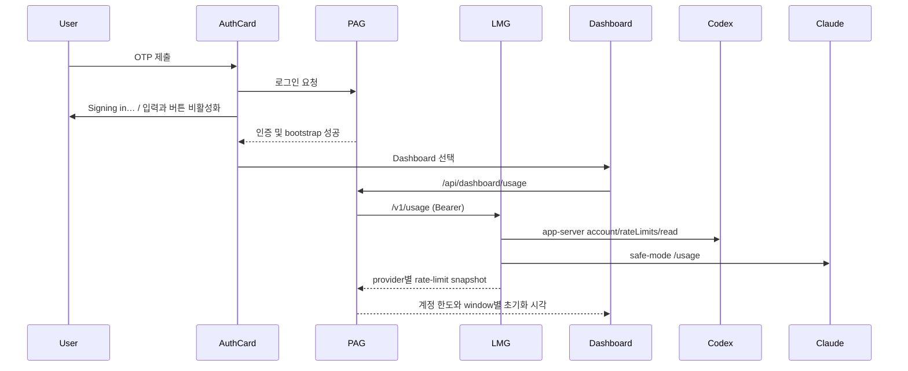

# 로그인 흐름 및 로컬 실행 기록 대시보드 설계

## 목표

- OTP 로그인 요청 중에는 진행 상태를 보이고 중복 제출을 막는다.
- 인증과 초기 데이터 로드가 모두 성공하면 화면을 Dashboard로 명시적으로 전환한다.
- Codex와 Claude CLI가 공식적으로 제공하는 계정 한도·리셋 시각을 수집해 Dashboard에 표시한다.
- LMG의 성공 완료 실행 기록은 계정 한도와 별개의 운영 지표로만 유지한다.

## 범위와 비범위

포함:

- `personal-agent-gateway`의 OTP 로그인 UX와 Dashboard 표시.
- `local-model-gateway`의 provider 계정 한도 수집과 읽기 전용 집계 API.
- PAG의 LMG 한도 조회·검증과 Dashboard 표시.

제외:

- Codex/Claude 웹 계정 페이지 스크래핑, 쿠키 사용, 비공식 계정 한도 API 연동.
- 수집하지 못한 한도 값의 추정 또는 임의 보정.
- 사용자가 실행하지 않은 provider 계정 변경·결제·한도 초기화 동작.

## 선택한 접근

LMG가 provider CLI와 인증 컨텍스트의 소유자이므로, LMG의 보호된 `GET /v1/usage`가 각 CLI를 조회하고 표준화한 rate-limit snapshot을 반환한다. PAG는 기존 provider 가용성 보고서에 이 snapshot을 병합한다. LMG가 연결되지 않았거나 응답 형식이 다르면 해당 provider의 한도만 `미수집`으로 표시한다.

Codex는 `codex app-server --stdio`의 공식 JSON-RPC 절차(`initialize` 후 `account/rateLimits/read`)를 사용한다. 응답의 primary/secondary window에 있는 `usedPercent`, `windowDurationMins`, `resetsAt`를 그대로 표준화한다.

Claude는 `claude --safe-mode -p --output-format json --max-turns 1 /usage`의 공식 로컬 slash command를 사용한다. 이 명령은 실제 모델 turn을 만들지 않고 현재 subscription limit을 반환한다. `--safe-mode`는 사용자 hook·plugin을 실행하지 않으며, 결과의 `Current session`과 `Current week (all models)` 행만 수집한다. 형식이 바뀌거나 값이 누락되면 해당 window를 `미수집` 처리한다.

PAG 이벤트를 실행 횟수로 집계하는 방식은 실제 계정 한도가 아니므로 대체하지 않는다. 제공사 계정 화면을 읽는 방식은 인증 정보 의존성과 계약 없는 API 문제 때문에 채택하지 않는다.

## 데이터 계약

LMG의 `GET /v1/usage` 응답은 아래 의미를 갖는다.

```json
{
  "collected_at": "2026-07-27T00:00:00Z",
  "providers": [
    {
      "provider": "codex",
      "status": "ok",
      "rate_limits": [
        {
          "window_minutes": 300,
          "used_percent": 25,
          "resets_at": "2026-07-27T04:00:00Z"
        },
        {
          "window_minutes": 10080,
          "used_percent": 41,
          "resets_at": "2026-08-02T09:00:00Z"
        }
      ]
    }
  ]
}
```

`used_percent`는 해당 이동 한도 구간에서 사용된 백분율이다. `window_minutes`와 `resets_at`은 provider가 반환한 구간 길이와 다음 초기화 시각이다. provider가 보내지 않는 필드는 없다고 가정하지 않으며, `rate_limits`를 비워 `미수집`으로 표시한다. 오류의 원문·인증 정보·CLI 표준 오류는 API에 노출하지 않는다.

PAG는 provider별 `rate_limits`만 추가한다. 한도 카드마다 5시간, 7일 등 실제 window를 구분해 사용률과 초기화 시각을 표시하며, 각각은 계정 전체 usage임을 명시한다.

## 화면 흐름



Dashboard 문구는 한도가 provider 계정 전체에서 공유될 수 있음을 명시하고, 각 provider 카드에 window별 `사용률`과 `초기화 시각`을 표기한다. LMG 조회 실패는 provider 가용성 정보를 바꾸지 않으며, 한도만 `미수집`으로 표시한다.

## 오류 처리

- 로그인 API 또는 bootstrap이 실패하면 제출 상태를 해제하고 기존 오류 메시지를 표시한다.
- 로그인 성공 뒤 bootstrap이 실패하면 Dashboard로 전환하지 않는다.
- LMG의 인증/연결/응답 검증 실패는 PAG의 기존 상태 코드 규약으로 변환한다.
- Codex app-server 또는 Claude `/usage`의 수집 실패는 모델 실행을 실패로 바꾸지 않는다. 민감한 stderr는 로그·API·UI에 노출하지 않는다.

## 검증

- Frontend: 로그인 중 버튼이 비활성화되고, 성공 후 Dashboard가 렌더링되는 통합 테스트.
- LMG: Codex JSON-RPC 및 Claude `/usage` 결과를 window별 snapshot으로 표준화하고, malformed/실패 응답을 안전하게 비우는 단위/HTTP 테스트.
- PAG: LMG 한도 응답 검증, LMG 실패 시 한도 미수집, Dashboard 문구와 window별 게이지 렌더링 테스트.
- 두 저장소의 관련 테스트, PAG frontend build, 실행 중인 PAG/LMG의 보호된 API smoke test.

## 결정 확인

이 설계에서 수집 시점은 Dashboard 진입 또는 Dashboard의 수동 새로고침이다. 백그라운드 스케줄러나 provider 계정 화면 접근은 사용하지 않는다. Codex와 Claude CLI가 현재 설치된 버전에서 공식 응답을 제공하지 않으면 해당 provider는 `미수집`으로 남긴다.
