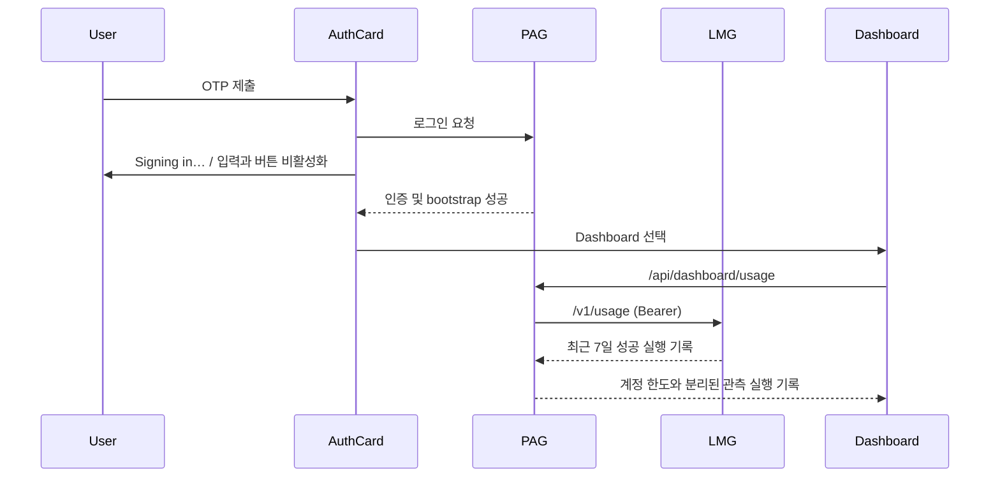

# 로그인 흐름 및 로컬 실행 기록 대시보드 설계

## 목표

- OTP 로그인 요청 중에는 진행 상태를 보이고 중복 제출을 막는다.
- 인증과 초기 데이터 로드가 모두 성공하면 화면을 Dashboard로 명시적으로 전환한다.
- Codex와 Claude의 계정 한도·리셋 시각은 검증된 소스가 없으므로 추정하지 않는다.
- 대신 LMG가 성공 완료한 로컬 실행의 최근 7일 횟수와 마지막 완료 시각을 PAG Dashboard에 별도 표시한다.

## 범위와 비범위

포함:

- `personal-agent-gateway`의 OTP 로그인 UX와 Dashboard 표시.
- `local-model-gateway`의 성공 완료 실행 기록과 읽기 전용 집계 API.
- PAG의 LMG 집계 조회·검증과 Dashboard 표시.

제외:

- Codex/Claude 웹 계정 페이지 스크래핑, 쿠키 사용, 비공식 계정 한도 API 연동.
- 토큰 수·실제 사용 가능 한도·리셋 시각의 추정.
- 실패·취소·중단된 실행의 사용량 집계.

## 선택한 접근

LMG가 실행의 소유자이므로, LMG SQLite에 `run.Execute`가 성공으로 끝난 시점만 provider별로 기록한다. LMG의 보호된 `GET /v1/usage`는 최근 7일의 완료 실행 횟수와 마지막 완료 시각을 반환한다. PAG는 기존 provider 가용성 보고서에 이 관측값을 병합하고, LMG가 연결되지 않았거나 응답 형식이 다르면 계정 한도처럼 대체하지 않고 `미수집`으로 표시한다.

대안으로 PAG 이벤트를 집계하는 방식은 Team/Hook 등의 LMG 실행을 빠뜨릴 수 있어 채택하지 않는다. 제공사 계정 화면을 읽는 방식은 인증 정보 의존성과 계약 없는 API 문제 때문에 채택하지 않는다.

## 데이터 계약

LMG의 `GET /v1/usage` 응답은 아래 의미를 갖는다.

```json
{
  "observed_at": "2026-07-27T00:00:00Z",
  "window_days": 7,
  "providers": [
    {
      "provider": "codex",
      "completed_runs": 12,
      "last_completed_at": "2026-07-26T15:20:00Z"
    }
  ]
}
```

`completed_runs`는 LMG가 응답 스트림에서 `run.completed`까지 성공한 실행의 수다. 이 값은 계정 한도·토큰 수·잔여량이 아니다. `last_completed_at`은 같은 범위의 마지막 성공 완료 시각이며, 데이터가 없으면 `null`이다.

PAG는 provider별 `observed_runs_7d`와 `last_observed_at`만 추가한다. 기존 `weekly_limit`, `used`, `remaining`, `reset_at`은 검증된 제공사 데이터가 생길 때까지 비워 둔다.

## 화면 흐름



Dashboard 문구는 계정 한도가 확인되지 않았음을 명시하고, 각 provider 카드에 `로컬 완료 실행 (최근 7일)`과 `마지막 완료`를 별도 표기한다. LMG 조회 실패는 가용성 정보와 계정 한도 정보를 바꾸지 않으며, 관측 기록만 `미수집`으로 표시한다.

## 오류 처리

- 로그인 API 또는 bootstrap이 실패하면 제출 상태를 해제하고 기존 오류 메시지를 표시한다.
- 로그인 성공 뒤 bootstrap이 실패하면 Dashboard로 전환하지 않는다.
- LMG의 인증/연결/응답 검증 실패는 PAG의 기존 상태 코드 규약으로 변환한다.
- 사용량 기록 저장 실패는 모델 응답이나 SSE 완료를 실패로 바꾸지 않는다. 로그로만 남긴다.

## 검증

- Frontend: 로그인 중 버튼이 비활성화되고, 성공 후 Dashboard가 렌더링되는 통합 테스트.
- LMG: 성공 완료만 기록하며 실패·중단 실행은 집계하지 않는 단위/HTTP 테스트.
- PAG: LMG 사용 기록 응답 검증, LMG 실패 시 관측값 미수집, Dashboard 문구와 관측값 렌더링 테스트.
- 두 저장소의 관련 테스트, PAG frontend build, 실행 중인 PAG/LMG의 보호된 API smoke test.

## 결정 확인

이 설계에서 `최근 7일`은 최근 7개의 달력 날짜가 아니라 요청 시점부터 7일 전까지의 이동 구간이다. 관측 실행 수는 로컬 모델 게이트웨이를 통과한 성공 완료 실행만 의미한다.
