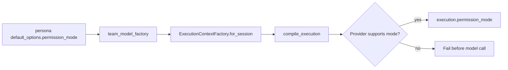

# Persona Permission Inheritance Design

## Goal

Team Run 실행은 페르소나의 `default_options.permission_mode`를 유효 권한의 단일 원천으로 사용한다. 실행 계약은 이 값을 다른 권한으로 낮추거나 바꾸지 않는다.

## Current Problem

현재 `compile_execution()`은 workspace mode를 기준으로 권한을 다시 정한다. 따라서 기술 PM 페르소나에 저장된 `bypassPermissions`가 격리 workspace 실행에서 `acceptEdits`로 바뀐다. 외부 도구 권한을 요구하는 실행은 페르소나 설정과 다른 유효 권한으로 시작한다.

## Decision

1. `ExecutionRequirements`와 `ExecutionContextFactory.for_session()`에 `permission_mode`를 명시적으로 전달한다.
2. `compile_execution()`은 전달받은 권한을 그대로 `CompiledExecution.permission_mode`에 기록한다.
3. Provider가 `permission_modes` capability를 제공하면, 전달받은 권한이 목록에 있는지 검증한다. 없으면 모델 호출 전에 `unsupported_execution_capability` 오류로 실행을 중단한다.
4. Provider가 `permission_modes` capability를 제공하지 않으면, 현재처럼 빈 문자열을 전송한다. 이 provider에는 원격 권한 모드 전달 채널이 없기 때문이다.
5. 페르소나가 권한을 지정하지 않으면 빈 값을 유지한다. Provider에 존재하지 않는 가짜 기본 권한을 보내지 않는다.

## Data Flow

## Error Handling

- `permission_mode`가 비어 있으면 capability 검증과 provider 전송을 생략한다.
- Provider가 권한 capability를 광고하지만 해당 값을 지원하지 않으면 실행하지 않는다.
- 오류 코드는 기존 `unsupported_execution_capability`를 사용해 기존 provider-recovery 흐름과 호환한다.
- workspace mode는 workspace/sandbox/read scope를 계속 결정하지만 permission mode를 변경하지 않는다.

## Testing

- Claude capability가 `acceptEdits`만 지원할 때 `bypassPermissions` 페르소나는 모델 호출 전에 실패한다.
- Claude capability가 `bypassPermissions`를 지원할 때 같은 값이 LMG execution payload에 그대로 전달된다.
- 권한을 설정하지 않은 페르소나는 `manual`을 사용한다.
- 기존 Codex 실행 payload와 workspace/sandbox/network 동작은 회귀하지 않는다.

## Scope

포함: Team Run 모델 실행의 permission mode 상속과 capability 검증.

제외: WebSearch 승인 UI, provider capability 자체의 변경, 페르소나 편집 UI 변경, 기존 실행 원장의 수정.
