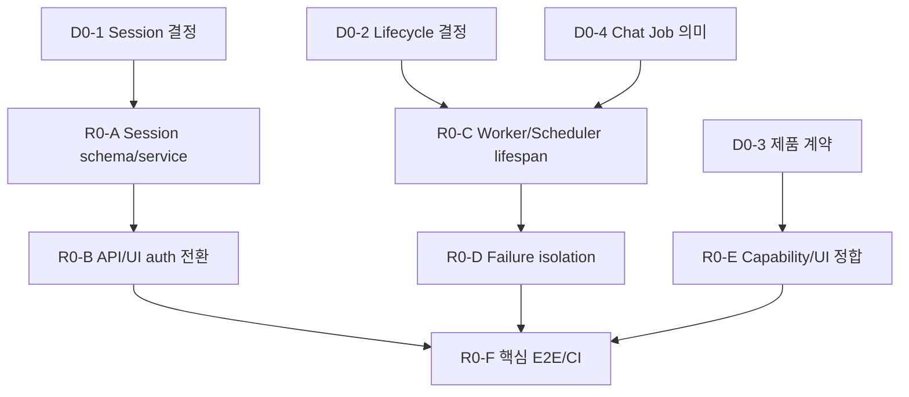

# Personal Agent Gateway R0 신뢰 기반 실행 플랜

작성일: 2026-07-15
상태: SUCCESS

## 배경

[통합 서비스 개선 로드맵](2026-07-15-service-improvement-roadmap.md)의 NOW 단계는 다음 세 계약을 복구해야 한다.

1. 발급·만료·폐기가 확인된 session만 protected API를 통과한다.
2. JobWorker와 SchedulerLoop가 app lifecycle 안에서 실제 실행된다.
3. UI가 표시하는 Review, concurrency, Schedule, Tunnel 상태가 runtime과 일치한다.

현재 service/unit test는 많지만 이 세 계약을 하나의 실제 app에서 검증하는 composition test가 부족하다.

## 목표

- forged, expired, revoked session을 모든 protected API에서 거부한다.
- Gateway startup과 shutdown이 Worker/Scheduler의 수명주기를 소유한다.
- 한 Job 실패가 queue consumer를 종료하지 않는다.
- 미구현 Review/Concurrency와 unhealthy Automation을 실행 가능한 기능처럼 표시하지 않는다.
- Chat, Team Run, Schedule/Job 핵심 여정을 fake CLI/runner E2E로 고정한다.

범위 외:

- Operations Center 전체 UI
- 대규모 pagination/index 작업
- 실제 Team Review mode와 Team task concurrency
- ORM, 외부 queue, hosted telemetry, global frontend state library

## RULES

상태는 `TODO`, `LOCK`, `FAIL`, `SUCCESS`만 사용한다.

- `TODO`: 선행 조건이 충족돼 시작할 수 있다.
- `LOCK`: 결정 또는 앞 작업이 끝나지 않아 실행할 수 없다.
- `FAIL`: 시도했지만 검증에 실패했다. 실패 근거와 다음 조치를 남긴다.
- `SUCCESS`: 구현과 해당 검증 명령이 모두 통과했다.

추가 규칙:

- `LOCK -> SUCCESS` 직접 전환은 금지한다.
- 각 변경 묶음은 failing test → 최소 구현 → targeted test → full gate 순서로 진행한다.
- R0-E가 끝나기 전 대형 router/container 리팩터링을 시작하지 않는다.
- 실제 실행에 사용 중인 Team Run을 fixture로 삼지 않고 항상 임시 data root를 사용한다.

## 실행 전 결정

| ID | 상태 | 결정 | 권고안 | 산출물/해제 조건 |
| --- | --- | --- | --- | --- |
| D0-1 | SUCCESS | Auth session source of truth | SQLite에 raw token hash와 발급·최근 사용·만료·폐기 시각 저장 | `docs/adr/2026-07-15-auth-session-storage.md` 승인 |
| D0-2 | SUCCESS | Job/Schedule restart 정책 | single-process, running은 failed 처리, queued는 startup 재enqueue, Scheduler는 단일 loop | `docs/adr/2026-07-15-automation-lifecycle.md` 승인 |
| D0-3 | SUCCESS | Review/Concurrency 단기 정책 | Review Only 숨김, Team task는 Sequential 표시, Job worker effective concurrency는 1로 정직하게 노출 | Backend capability와 UI contract test 통과 |
| D0-4 | SUCCESS | Chat Job의 의미 | R0에서는 Chat runtime이 실행 주체이고 Job row는 이력 mirror로 유지; Job API가 Chat Job을 별도 승인·실행하지 않음 | Chat Job approve 409와 startup 제외 test 통과 |

### D0-1 권고 근거

- Signed cookie만 사용하면 absolute expiry는 처리할 수 있지만 idle expiry와 revoke all에는 server state가 다시 필요하다.
- Application state가 이미 SQLite를 사용하므로 `auth_sessions` table이 가장 작은 단일 source of truth다.
- Raw token은 cookie에만 두고 DB에는 hash만 저장한다.

### D0-4 안전 경계

AgentRuntime은 shell 승인 후 `WorkspaceTools`로 직접 명령을 실행한다. 별도 Job row도 만들지만 Job API의 승인/worker 경로와 연결돼 있지 않다. R0에서 두 경로를 성급히 합치면 같은 shell command가 두 번 실행될 수 있으므로, 자동화 lifecycle 활성화와 Chat approval 통합을 별도 문제로 취급한다.

## Architecture Review

### Current Structural Risks

- `app.py`와 다섯 API module이 session cookie 존재 검사를 중복한다.
- Worker는 `app.state`에 있지만 startup 호출이 없고 SchedulerLoop는 app에 없다.
- Worker loop는 runner 예외를 job 단위로 격리하지 않는다.
- `review_only`와 `max_workers` 값은 저장·노출되지만 실제 실행 의미가 없다.

### SOLID Review

#### Finding: TOTP credential과 login session은 수명이 다른 책임이다

**Evidence**
- 기존 `AuthStore`는 TOTP secret과 recovery code JSON을 소유한다.
- Login session에는 hash lookup, expiry, last seen, revoke query가 추가로 필요하다.

**Principle**
- SRP: 장기 credential과 단기 access session을 같은 JSON store에 섞지 않는다.

**Recommendation**
- `AuthStore`는 그대로 두고 새 `AuthSessionService`가 SQLite session row만 소유한다.
- 공통 FastAPI dependency는 service에서 `SessionPrincipal`을 얻는다.

**Plan Impact**
- R0-A에서 schema/service를 만들고 R0-B에서 모든 router를 전환한다.

#### Finding: Worker/Scheduler에는 새 추상화보다 lifecycle 연결이 필요하다

**Evidence**
- 두 class 모두 start/stop API와 주입 가능한 service를 이미 가진다.

**Principle**
- SRP와 단순성: app composition root가 수명주기를 소유하고 loop class는 실행만 담당한다.

**Recommendation**
- FastAPI lifespan을 사용하며 별도 manager/facade는 만들지 않는다.

**Plan Impact**
- R0-C는 `app.py`, Worker, Scheduler, app lifecycle test만 수정한다.

### Design Pattern Candidates

| 후보 | 결정 | 이유 |
| --- | --- | --- |
| Repository | 도입하지 않음 | Service-owned SQL이 이미 격리돼 있고 저장 교체 요구가 없다. |
| Adapter | 공통 auth dependency에서만 사용 | HTTP cookie를 `SessionPrincipal`로 바꾸는 경계가 실제로 반복된다. |
| Strategy | R0에서는 도입하지 않음 | Team 실행 variant가 아직 실제로 둘 이상 구현되지 않았다. |
| Factory | 기존 runtime/model factory 유지 | 새 factory를 만들 압력이 없다. |

### Dependency Direction



### Test Strategy Alignment

- Domain/unit: `tests/test_auth_store.py`, `test_jobs.py`, `test_job_worker.py`, `test_schedules.py`, `test_team_runtime.py`
- API: `tests/test_api_auth.py`, `test_api_jobs.py`, `test_api_schedules.py`, `test_api_team_runs.py`, `test_api_settings.py`
- Composition: 새 `tests/test_app_lifecycle.py`, 기존 `tests/test_app.py`
- Frontend: `client.test.js`, `GatewayApp.test.jsx`, `TeamRunForm.test.jsx`, `SchedulesView.test.jsx`, `SettingsView.test.jsx`
- E2E 성격의 app test는 `with TestClient(app)`를 사용해 lifespan을 실제로 연다.

## 변경 묶음

| 순서 | ID | 상태 | 변경 묶음 | 선행 조건 | 종료 검증 |
| --- | --- | --- | --- | --- | --- |
| 1 | R0-A | SUCCESS | Session schema와 service | D0-1 | Service/unit test |
| 2 | R0-B | SUCCESS | Login/status/logout/protected API 전환 | R0-A | Auth/API/frontend test |
| 3 | R0-C | SUCCESS | Worker/Scheduler app lifecycle | D0-2, D0-4 | App lifecycle/API test |
| 4 | R0-D | SUCCESS | Background exception/cancel/restart 격리 | R0-C | Worker/Scheduler resilience test |
| 5 | R0-E | SUCCESS | Runtime capability와 UI 문구 정합 | D0-3, R0-C | Backend/frontend contract test |
| 6 | R0-F | SUCCESS | 핵심 여정 E2E와 CI | R0-B, R0-D, R0-E | Full release gate |

## R0-A. Session schema와 service

### 수정 범위

- `src/personal_agent_gateway/db.py`
- 새 `src/personal_agent_gateway/auth_sessions.py`
- `src/personal_agent_gateway/config.py`
- `.env.example`
- 새 `tests/test_auth_sessions.py`
- `tests/test_db.py`

### 수정 계획

1. 먼저 forged, expired, revoked, idle-expired session의 기대 결과를 failing test로 작성한다.
2. `auth_sessions`에 최소 필드만 추가한다.
   - `id` 또는 token hash primary lookup
   - `created_at`, `last_seen_at`, `absolute_expires_at`, `idle_expires_at`
   - `revoked_at`
3. Raw token을 저장하지 않고 constant-time hash comparison이 가능한 형태를 사용한다.
4. `AuthSessionService.issue/validate/revoke/revoke_all`과 `SessionPrincipal`을 구현한다.
5. 만료 시간 config validation과 `.env.example` 설명을 추가한다.

### 완료 기준

- 같은 raw token은 하나의 active principal로 검증된다.
- 임의·만료·폐기 token은 principal을 반환하지 않는다.
- DB에는 raw token이 남지 않는다.
- 기존 TOTP/recovery code test가 그대로 통과한다.

### 검증

```powershell
python -m pytest tests/test_auth_sessions.py tests/test_auth_store.py tests/test_db.py -q
python -m ruff check src/personal_agent_gateway/auth_sessions.py src/personal_agent_gateway/db.py tests/test_auth_sessions.py
```

### 롤백 기준

- 기존 DB upgrade가 실패하거나 valid login을 무효화하면 배포를 되돌린다.
- Migration은 additive로 유지해 rollback 시 미사용 table만 남기고 기존 credential JSON을 손상시키지 않는다.

## R0-B. Auth API와 protected dependency 전환

### 수정 범위

- `src/personal_agent_gateway/api/auth.py`
- 새 `src/personal_agent_gateway/api/dependencies.py`
- `src/personal_agent_gateway/app.py`
- `src/personal_agent_gateway/api/jobs.py`
- `src/personal_agent_gateway/api/personas.py`
- `src/personal_agent_gateway/api/team_runs.py`
- `src/personal_agent_gateway/api/teams.py`
- `src/personal_agent_gateway/api/rules.py`
- 인증 dependency를 재사용하는 나머지 protected router
- `frontend/src/api/client.js`
- `frontend/src/components/containers/GatewayApp/index.jsx`
- `tests/test_api_auth.py`, protected API test files

### 수정 계획

1. Login 성공 시 service가 session을 발급하고 raw token만 HttpOnly cookie로 전달한다.
2. `/api/auth/status`는 cookie 존재가 아니라 service validation 결과와 만료 정보를 반환한다.
3. Logout은 현재 session을 revoke한 뒤 cookie를 제거한다.
4. 모든 protected router가 공통 `SessionPrincipal` dependency를 사용하게 하고 local `require_session` 함수를 삭제한다.
5. Login rate limit과 state-changing API의 Origin 정책을 추가하되 setup token 흐름은 기존 계약을 보존한다.
6. Frontend는 protected API의 401을 login 화면 복귀로 처리하고 원래 화면으로 돌아갈 최소 상태만 유지한다.

### 완료 기준

- 임의 문자열 cookie를 넣는 기존 test fixture는 protected API에서 401을 받는다.
- 실제 login으로 얻은 cookie만 protected API test에서 사용한다.
- Logout/revoke all 뒤 같은 cookie 재사용이 불가능하다.
- 400/401/409/500 중 최소한 auth 401은 generic null로 사라지지 않는다.

### 검증

```powershell
python -m pytest tests/test_api_auth.py tests/test_api_settings.py tests/test_api_jobs.py tests/test_api_team_runs.py -q
npm --prefix frontend test -- client.test.js GatewayApp.test.jsx
```

### 롤백 기준

- 정상 OTP login이 반복적으로 401이 되거나 setup flow가 깨지면 R0-B만 되돌린다.
- R0-A table/service는 additive 상태로 남겨도 기존 AuthStore 동작에 영향을 주지 않아야 한다.

## R0-C. Worker/Scheduler app lifecycle

### 수정 범위

- `src/personal_agent_gateway/app.py`
- `src/personal_agent_gateway/job_worker.py`
- `src/personal_agent_gateway/scheduler_loop.py`
- `src/personal_agent_gateway/jobs.py`
- `src/personal_agent_gateway/api/jobs.py`
- `src/personal_agent_gateway/api/schedules.py`
- 새 `tests/test_app_lifecycle.py`
- `tests/test_api_jobs.py`, `tests/test_api_schedules.py`

### 수정 계획

1. `create_app()`의 service 조립은 유지하고 FastAPI lifespan을 추가한다.
2. Startup 순서를 고정한다.
   - 기존 Team Run interrupted recovery
   - `running` Job을 결정된 terminal 상태로 복구
   - Worker 시작
   - 기존 `queued` Job 재enqueue
   - Scheduler 시작
3. Shutdown은 Scheduler를 먼저 멈춰 새 enqueue를 차단한 뒤 Worker를 중단한다.
4. `SchedulerLoop`를 app state에 노출해 health와 test가 같은 instance를 관찰하게 한다.
5. Manual Job, 승인된 Job, Schedule Run now가 시작된 Worker queue에 들어가는지 검증한다.
6. Chat source Job은 D0-4 계약대로 worker 재enqueue 대상에서 제외한다.

### 완료 기준

- `with TestClient(app)` 안에서는 Worker/Scheduler task가 alive이고 context 밖에서는 stopped다.
- 기존 queued manual/schedule Job은 startup 후 terminal 상태에 도달한다.
- Running Job restart 정책과 due schedule single-claim이 test로 고정된다.
- Startup 두 번 또는 shutdown 두 번 호출이 duplicate loop나 예외를 만들지 않는다.

### 검증

```powershell
python -m pytest tests/test_app_lifecycle.py tests/test_api_jobs.py tests/test_api_schedules.py tests/test_jobs.py tests/test_schedules.py -q
```

### 롤백 기준

- Startup이 hang하거나 같은 Job/Schedule이 두 번 실행되면 lifecycle 활성화를 되돌린다.
- DB의 queued/failed row는 삭제하지 않고 원인 event를 보존한다.

## R0-D. Background failure isolation

### 수정 범위

- `src/personal_agent_gateway/job_worker.py`
- `src/personal_agent_gateway/scheduler_loop.py`
- `src/personal_agent_gateway/jobs.py`
- `tests/test_job_worker.py`
- `tests/test_app_lifecycle.py`

### 수정 계획

1. `CancelledError`는 shutdown으로 전파하고 일반 runner 예외만 job failure로 바꾼다.
2. Exception message를 redaction한 뒤 Job failed event와 local log에 남긴다.
3. Duplicate/stale queue id의 상태 전이 실패가 loop 전체를 끝내지 않게 한다.
4. Scheduler tick 한 번의 실패가 다음 tick을 영구 정지시키지 않도록 경계를 둔다.
5. Liveness를 Settings/capability payload에서 읽을 수 있는 최소 property로 노출한다.

### 완료 기준

- Exception을 던지는 첫 Job은 failed가 되고 두 번째 Job은 succeeded가 된다.
- Worker/Scheduler task가 실패 후에도 alive다.
- Shutdown cancel은 사용자-facing runner failure와 다른 event/message로 남는다.
- Error payload에 secret fixture가 포함되지 않는다.

### 검증

```powershell
python -m pytest tests/test_job_worker.py tests/test_app_lifecycle.py -q
```

### 롤백 기준

- 예외 격리가 실제 cancellation을 삼켜 shutdown이 끝나지 않으면 해당 catch 범위를 되돌린다.

## R0-E. Runtime capability와 UI 계약 정합

### 수정 범위

- `src/personal_agent_gateway/api/settings.py`
- `src/personal_agent_gateway/api/team_runs.py`
- `frontend/src/api/client.js`
- `frontend/src/components/organisms/TeamPicker/index.jsx`
- `frontend/src/components/organisms/SchedulesView/index.jsx`
- `frontend/src/components/organisms/SettingsView/index.jsx`
- 대응 Vitest와 API test

### 수정 계획

1. Protected runtime/settings payload에 Worker/Scheduler alive, Team review support, Team execution mode, effective Job concurrency, cookie/tunnel 상태를 추가한다.
2. `review_only`는 선택지에서 제거하거나 disabled 이유를 표시한다.
3. Team worker UI는 `Sequential`을 표시하고 `max_workers` 입력을 실제 지원 전까지 숨긴다.
4. Automation이 unhealthy면 Schedule 생성과 Run now를 비활성화하고 원인을 표시한다.
5. Settings의 `AUTHENTICATED`와 `TUNNEL: LOCAL ONLY` hard-code를 실제 payload 기반 문구로 교체한다.

### 완료 기준

- UI의 기능 label과 backend capability가 한 contract test로 연결된다.
- Worker/Scheduler unhealthy 상태에서 자동 실행이 가능한 것처럼 보이지 않는다.
- R2에서 구현할 Review/Concurrency를 위한 speculative Strategy는 만들지 않는다.

### 검증

```powershell
python -m pytest tests/test_api_settings.py tests/test_api_team_runs.py tests/test_app_lifecycle.py -q
npm --prefix frontend test -- TeamPicker.test.jsx SchedulesView.test.jsx SettingsView.test.jsx GatewayApp.test.jsx
```

### 롤백 기준

- Capability 조회 실패가 전체 console을 막으면 안전 기본값을 `unsupported/unhealthy`로 두고 해당 UI 변경만 되돌린다.

## R0-F. 핵심 E2E와 CI Gate

### 수정 범위

- `tests/`의 app-level fake CLI/runner fixture
- 필요 시 새 `tests/test_core_journeys.py`
- 기존 frontend integration/component tests
- 새 `.github/workflows/ci.yml`
- `README.md` 또는 실행 검증 문서

### 필수 시나리오

1. OTP login → Chat 실행 → SSE → terminal result.
2. Team 선택 → Run → task → summary → document 조회.
3. Schedule due/Run now → Job → runner → artifact.
4. Gateway restart → active Team interrupted → 사용자 Resume.
5. Forged/expired auth, model timeout, runner exception → 구분되는 복구 행동.

### 완료 기준

- 임시 workspace/data root와 fake CLI/runner만 사용한다.
- 실제 로컬 Codex/Claude 계정이나 기존 Team Run을 테스트 대상으로 사용하지 않는다.
- Full backend/frontend/lint/build가 CI 필수 check다.
- NOW Release Gate 여섯 항목이 모두 `SUCCESS`다.

### 검증

```powershell
python -m pytest -q
python -m ruff check src tests
npm --prefix frontend test
npm --prefix frontend run build
```

### 롤백 기준

- CI 자체 문제와 제품 회귀를 구분한다. Flaky test는 Gate에서 제거하지 않고 원인과 재현 seed를 `FAIL`로 기록한다.

## 실행 결과

각 항목은 선행 조건 해제 시 `LOCK → TODO`로 전환해 구현했고, targeted test와 full gate 통과 뒤 `SUCCESS`로 닫았다. 실제 사용자 Team Run은 fixture로 사용하지 않았으며 모든 backend test는 `tmp_path` 기반 격리 data root를 사용했다.

| 계약 | 회귀 근거 |
| --- | --- |
| Auth/Login/Chat/SSE | `tests/test_api_auth.py`, `tests/test_app.py`, `frontend/src/components/containers/GatewayApp/GatewayApp.test.jsx` |
| Team Run/task/document/resume | `tests/test_api_team_runs.py`, `tests/test_team_runtime.py`, `tests/test_team_documents.py`, GatewayApp/TeamRunDetail component test |
| Schedule/Job/runner/artifact | `tests/test_app_lifecycle.py`, `tests/test_job_worker.py`, `tests/test_api_schedules.py`, `tests/test_artifacts.py` |
| Restart/failure recovery | `tests/test_app_lifecycle.py`, `tests/test_job_worker.py`, `tests/test_model_client.py` |
| Release automation | `.github/workflows/ci.yml`에서 Ruff, pytest, Vitest, Vite build를 필수 실행 |

최종 검증: backend `365 passed`, frontend `177 passed`, Ruff 통과, Vite production build 통과.

## 통합 체크리스트

| 상태 | 작업 | 잠금/실패 사유 | 검증 |
| --- | --- | --- | --- |
| SUCCESS | 코드·테스트·문서 baseline 조사 |  | 도메인/개발/제품 진단 연결 |
| SUCCESS | D0-1 Auth session 결정 |  | ADR review |
| SUCCESS | D0-2 Automation lifecycle 결정 |  | ADR review |
| SUCCESS | D0-3 UI-runtime 단기 계약 |  | Product/API contract review |
| SUCCESS | D0-4 Chat Job 의미 |  | 중복 실행 시나리오 review |
| SUCCESS | R0-A Session schema/service |  | Targeted pytest |
| SUCCESS | R0-B Auth API 전환 |  | Auth/API/Vitest |
| SUCCESS | R0-C App lifecycle |  | Lifecycle/API pytest |
| SUCCESS | R0-D Failure isolation |  | Resilience pytest |
| SUCCESS | R0-E UI-runtime 정합 |  | API/Vitest contract |
| SUCCESS | R0-F E2E/CI |  | Full gate |

## Docs 승격

- [x] 장기 보존 가치 있음
- [x] ADR로 승격 필요
- [x] Flow로 승격 필요
- [x] Report로 승격 완료
- [ ] Knowledge로 승격 필요

승격 후보 경로:

- `docs/adr/2026-07-15-auth-session-storage.md`
- `docs/adr/2026-07-15-automation-lifecycle.md`
- `docs/flows/auth-session-lifecycle.md`
- `docs/flows/job-schedule-lifecycle.md`
- `docs/reports/<완료일>-r0-trust-foundation-implementation-report.md`

## 관련 문서

- [통합 서비스 개선 로드맵](2026-07-15-service-improvement-roadmap.md)
- [서비스 도메인 지도](../knowledge/2026-07-15-service-domain-map.md)
- [개발 PM 유지보수성 진단](../reports/2026-07-15-development-pm-maintainability-assessment.md)
- [기획 PM 사용성·기능 진단](../reports/2026-07-15-product-pm-usability-opportunities.md)
