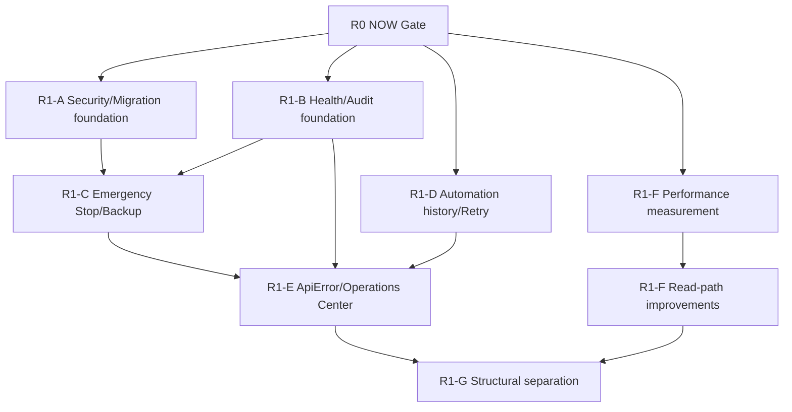

# Personal Agent Gateway R1 운영 가능성 실행 플랜

작성일: 2026-07-15
상태: SUCCESS

## 배경

[통합 서비스 개선 로드맵](2026-07-15-service-improvement-roadmap.md)의 NEXT 단계는 실행 기능을 더 만드는 단계가 아니다. 이미 시작된 Chat, Team Run, Job, Schedule을 운영자가 다음 질문에 답할 수 있게 만드는 단계다.

1. 지금 서비스와 실행 구성요소가 실제로 준비됐는가?
2. 실패했다면 원인과 영향을 추적할 수 있는가?
3. 위험하거나 꼬인 실행을 한 번에 멈출 수 있는가?
4. 데이터와 실행 이력을 복구할 수 있는가?
5. 사용자는 어느 화면에서 어떤 복구 행동을 해야 하는가?

R1은 R0에서 고정한 auth principal, app lifespan, runtime capability, E2E 계약을 확장한다. R0 구현과 검증이 끝나지 않은 상태에서 R1을 시작하면 잘못된 lifecycle 위에 운영 기능을 쌓게 되므로 전체 묶음을 잠근다.

## 목표

- Session, 접근 mode, 외부 파일 접근 정책을 소유자가 확인하고 폐기할 수 있다.
- DB, Worker, Scheduler, CLI의 준비 상태가 분리된 health 계약으로 보인다.
- Auth, Chat, Team, Job, Schedule, Artifact의 위험 상태 전이가 durable audit로 연결된다.
- Emergency Stop이 새 실행을 차단하고 이미 실행 중인 Chat, Team, Job을 종료한다.
- SQLite와 핵심 manifest를 일관되게 backup하고 restore dry-run으로 검증한다.
- Schedule 이력과 Job Retry가 원본 입력을 보존하며 중복 실행을 만들지 않는다.
- API 오류가 status, detail, retryability, correlation ID를 잃지 않는다.
- Operations 화면에서 실행 상태와 복구 action을 한 번에 찾는다.
- 측정값을 기준으로 pagination, metadata index, aggregate read를 도입한다.
- R0 회귀 테스트를 유지하면서 `app.py`와 `GatewayApp`의 책임을 단계적으로 분리한다.

범위 외:

- 실제 Team Review workflow와 task 병렬 실행
- Browser/Webhook 완료 알림
- Reusable template, global search, local product metrics
- ORM, 외부 queue, multi-instance worker, hosted telemetry
- application state 전역 교체 또는 frontend 전체 재작성

## RULES

작업 상태는 `TODO`, `LOCK`, `FAIL`, `SUCCESS`만 사용한다.

- `TODO`: 선행 Gate와 결정이 충족돼 실행할 수 있다.
- `LOCK`: 선행 작업이나 결정이 끝나지 않았다.
- `FAIL`: 구현 또는 검증에 실패했으며 근거와 다음 조치가 있다.
- `SUCCESS`: 완료 기준과 검증 명령을 모두 통과했다.

추가 규칙:

- R0 NOW Release Gate가 전부 `SUCCESS`가 되기 전 R1 항목은 `LOCK`이다.
- 한 묶음에서 schema, service, API, UI를 동시에 크게 바꾸지 않는다. contract test를 먼저 고정하고 작은 vertical slice로 이동한다.
- Audit에는 prompt 원문, raw stdout/stderr, secret, 전체 파일 내용을 기본 저장하지 않는다.
- 성능 변경은 fixture 측정값과 query plan 없이 시작하지 않는다.
- 구조 분리는 기존 R0 E2E와 component test를 통과하는 단위로만 수행한다.
- 검증은 임시 data/workspace root를 사용하고 현재 생성된 Team Run이나 실제 사용자 데이터를 사용하지 않는다.

## 진입 Gate와 실행 전 결정

### 진입 Gate

| ID | 상태 | 조건 | 해제 증거 |
| --- | --- | --- | --- |
| G1-0 | SUCCESS | R0 NOW Release Gate 전체 통과 | R0-F CI 결과와 구현 보고서 |

### 결정 항목

| ID | 상태 | 결정 | 권고안 | 산출물/해제 조건 |
| --- | --- | --- | --- | --- |
| D1-1 | SUCCESS | Restricted/Full Access의 파일·명령 경계 | 기본 Restricted, 사용자가 명시적으로 Full Access 선택, mode 변경과 외부 path 접근 audit | `docs/adr/2026-07-15-restricted-full-access-mode.md` 승인 |
| D1-2 | SUCCESS | Audit 보존·민감 정보 정책 | append-only SQLite, 90일 기본 보존, prompt/output 본문 제외, local export는 별도 action | `docs/adr/2026-07-15-audit-retention-and-redaction.md` 승인 |
| D1-3 | SUCCESS | Emergency Stop 의미 | 새 실행 차단 → Chat/Team cancel → Job queue drain/cancel → 종료 결과 audit; gateway process 자체는 유지 | `docs/flows/2026-07-15-emergency-stop-and-resume.md` 승인 |
| D1-4 | SUCCESS | Backup/Restore 범위 | SQLite consistent backup + auth/session/artifact manifest, 파일 본문은 옵션, restore는 dry-run 후 명시적 적용 | `docs/flows/2026-07-15-backup-restore.md` 승인 |
| D1-5 | SUCCESS | 성능 budget | 100/1,000개 fixture에서 list p95와 payload 상한 합의 | `docs/reports/2026-07-15-read-performance-baseline.md` 측정값과 budget 통과 |

모든 결정은 G1-0이 열린 뒤 `TODO`로 전환한다. R1 구현 전에 결정만 검토하는 것은 가능하지만 R0 코드를 우회해 선행 구현하지 않는다.

## Architecture Review

### Current Structural Risks

| 위험 | 근거 | R1 대응 |
| --- | --- | --- |
| 전역 500이 원인을 소실 | `app.py` exception handler가 기록 없이 응답만 반환한다. | R1-B에서 correlation ID, local structured log, safe error envelope을 먼저 고정한다. |
| 실행 상태가 도메인별로 흩어짐 | Chat은 `SessionRunRegistry`, Team은 `TeamRunRegistry`, Job은 Worker/DB가 소유한다. | R1-C는 각 소유자의 public stop API를 조합하는 작은 orchestrator만 둔다. |
| API client가 오류를 `null`/`[]`로 축약 | `frontend/src/api/client.js`의 helper가 non-2xx detail을 보존하지 않는다. | R1-E에서 단일 `ApiError` adapter와 status별 UI 규칙을 도입한다. |
| list/read 비용이 데이터에 비례 | transcript 목록·검색은 JSONL 전체를 읽고 Team SSE는 여러 detail API와 document scan을 반복한다. | R1-F에서 측정 → cursor/metadata → aggregate/delta 순서로 바꾼다. |
| 대형 container가 변경을 증폭 | `GatewayApp`이 bootstrap, session, Team, SSE, 화면 전환을 함께 소유한다. | R1-G에서 controller hook을 하나씩 추출하고 전면 재작성은 하지 않는다. |

### SOLID Review

#### Finding: Health는 domain service의 상태를 복제하지 않아야 한다

**Evidence**
- DB, Worker, Scheduler, Agent registry가 이미 각 상태와 기능을 소유한다.
- 별도 health state를 저장하면 실제 상태와 어긋날 수 있다.

**Principle**
- SRP와 DIP: health endpoint는 각 component의 좁은 probe 결과를 조합하고 새 source of truth가 되지 않는다.

**Recommendation**
- `HealthService` 또는 동등한 작은 probe 조합기가 `live`와 `ready` read model만 만든다.
- 새 plugin registry나 generic health framework는 만들지 않는다.

**Refutation**
- Probe registry는 확장성이 있지만 현재 component가 고정돼 있고 동적 등록 요구가 없다. 분기 몇 개보다 registry가 더 복잡하다.

**Plan Impact**
- R1-B의 component probe와 API contract를 좁게 유지한다.

#### Finding: Emergency Stop은 명령 bus보다 명시적 orchestrator가 적합하다

**Evidence**
- 각 실행 종류는 서로 다른 registry와 상태 전이를 갖고 있다.
- 현재 emergency stop consumer는 owner UI의 단일 action이다.

**Principle**
- SRP: stop service는 순서와 결과 집계만 소유하고 실제 cancel은 각 registry/service가 수행한다.

**Recommendation**
- `EmergencyStopService`가 intake gate, SessionRunRegistry, TeamRunRegistry, JobWorker/JobService를 순서대로 호출한다.
- 범용 command bus, event sourcing, 새 global state machine은 도입하지 않는다.

**Refutation**
- 비동기 command bus는 여러 instance에서 유용하지만 R1은 single-process 계약이며 호출 경로가 하나다.

**Plan Impact**
- R1-C의 구현과 rollback 경계를 명확히 한다.

#### Finding: 오류 보존은 frontend 공통 adapter로 수렴해야 한다

**Evidence**
- 여러 API method가 실패를 빈 collection 또는 null로 바꿔 401, 409, 500을 구분할 수 없다.

**Principle**
- OCP와 DIP: 화면은 fetch 구현이 아니라 `ApiError` 계약에 의존하고 새 오류 분류는 adapter에 추가한다.

**Recommendation**
- `ApiError(status, code, detail, retryable, correlationId)`와 단일 response parser를 둔다.
- 상태 관리 library나 query framework는 이 문제 해결에 필요하지 않다.

**Plan Impact**
- R1-E를 Operations 화면보다 먼저 구현한다.

#### Finding: 구조 분리는 안정된 계약을 따라야 한다

**Evidence**
- R0가 auth/lifecycle/capability E2E를 추가해야 비로소 큰 파일을 보호할 수 있다.

**Principle**
- SRP 개선은 행동 변경과 분리해 검증 가능해야 한다.

**Recommendation**
- Backend Chat router, frontend bootstrap/session/team controller를 한 묶음씩 이동한다.
- 이동 중 endpoint, payload, event 이름은 바꾸지 않는다.

**Plan Impact**
- R1-G를 마지막에 배치한다.

#### Finding: R1-G는 기능 추가와 controller 이동을 같은 변경으로 묶지 않아야 한다

**Evidence**
- `GatewayApp`는 현재 30개 component state, 6개 ref, 7개 root effect와 auth/session/Team/domain mutation을 소유한다.
- `GatewayApp.test.jsx`의 36개 integration test가 이 결합된 동작을 보호한다.
- `docs/component-inspector/GatewayApp/2026-07-15-1024.md`는 `ApiError`/Operations contract를 먼저 고정하고 bootstrap → session → Team 순서로 이동하도록 판정했다.

**Principle**
- SRP 개선은 필요하지만 LSP 관점에서 child callback, endpoint, SSE event 계약을 좁히면 기존 화면을 대체할 수 없다.

**Recommendation**
- R1-E 기능을 현재 container 경계에서 먼저 통과시킨다.
- R1-G는 `useGatewayBootstrap`, `useSessionController`, `useTeamRunController`를 한 단계씩 이동하며 각 단계에서 기존 36개 integration test를 전부 실행한다.

**Refutation**
- 기능과 추출을 함께 하면 중복 작업을 줄일 수 있으나, 현재 non-2xx가 `null`/`[]`로 소실돼 새 오류 계약 자체가 먼저 바뀐다. 두 변경을 섞으면 실패 원인을 API contract와 hook lifecycle 중 어디에서도 분리하기 어렵다.

**Plan Impact**
- R1-E와 R1-G 사이의 Gate를 유지하고 R1-G 단계별 검증에 `GatewayApp.test.jsx` 전체를 명시한다.

### Design Pattern Decisions

| 압력 | 선택 | 보류/기각 |
| --- | --- | --- |
| 여러 component readiness 조합 | 작은 health probe/aggregator | 동적 registry와 plugin system |
| 실행 종류별 전체 중단 | 명시적 Emergency Stop orchestrator | command bus, event sourcing |
| HTTP 실패 보존 | frontend `ApiError` adapter | 상태 관리/query framework 교체 |
| durable 보안 이력 | append-only Audit service | transcript/activity와 통합 |
| schedule과 job 연결 | service-owned relation/query | 범용 Repository/ORM |
| backup | manifest + SQLite backup service | 범용 backup platform |

### Dependency Direction



### Test Strategy Alignment

- Unit: audit redaction, backup manifest, stop ordering, retry input clone, cursor encode/decode.
- Service: append-only audit, session revoke, job retry 상태 전이, schedule history query, metadata index upgrade.
- API: live/ready, audit filter, emergency stop, backup dry-run, error envelope, operations aggregate.
- Composition: long-running fake Chat/Team/Job을 시작한 뒤 emergency stop과 shutdown 수렴 검증.
- Frontend: `ApiError` 분류, Operations action, Settings diagnostics, Automation history/retry.
- Performance: 고정 seed의 10/100/1,000개 fixture와 응답 크기를 저장하되 wall-clock 단독 assertion은 CI 환경 허용 오차를 둔다.
- Regression: 각 묶음 뒤 R0 핵심 E2E와 전체 backend/frontend gate를 유지한다.

### Plan Changes Applied

- G1-0을 R0 구현 보고서와 full gate 결과로 `SUCCESS` 처리하고 D1 결정 항목을 `TODO`로 해제했다.
- Audit 본문 저장을 권고한 2026-07-08 spec보다 이 계획의 상위 RULE인 prompt/output 제외를 우선한다. attribution ID와 sanitized metadata로 추적성을 확보하고 원문은 transcript/job artifact에 남긴다.
- Emergency Stop intake는 새 범용 command bus 없이 app state의 단일 gate를 모든 실행 시작 endpoint가 확인하는 좁은 계약으로 고정한다.
- R1-G는 component-inspector 결과에 따라 기능 추가와 분리 작업을 나누고 bootstrap → session → Team controller 순서와 단계별 root test Gate를 유지한다.
- `graphify-out`은 repository에 존재하지 않았지만 현재 import/call graph와 plan의 dependency diagram이 경계를 확인하기에 충분해 별도 graph 생성은 하지 않았다.

## 변경 묶음

| 순서 | ID | 상태 | 변경 묶음 | 선행 조건 | 종료 검증 |
| --- | --- | --- | --- | --- | --- |
| 1 | R1-A | SUCCESS | Versioned migration과 Security Operations | G1-0, D1-1 | migration/auth/path policy test |
| 2 | R1-B | SUCCESS | Health, correlation, logging, Audit | G1-0, D1-2 | health/audit/redaction test |
| 3 | R1-C | SUCCESS | Emergency Stop과 Backup/Restore | R1-A, R1-B, D1-3, D1-4 | composition/round-trip test |
| 4 | R1-D | SUCCESS | Automation history와 Retry | G1-0, R1-B | job/schedule API and UI test |
| 5 | R1-E | SUCCESS | ApiError와 Operations Center | R1-C, R1-D | action/error/deep-link test |
| 6 | R1-F | SUCCESS | Read 성능 baseline과 개선 | G1-0, D1-5 | benchmark/query-plan/API test |
| 7 | R1-G | SUCCESS | 점진적 구조 분리 | R1-E, R1-F | R0/R1 full regression gate |

## R1-A. Versioned migration과 Security Operations

### 수정 범위

- `src/personal_agent_gateway/db.py`
- 새 `src/personal_agent_gateway/migrations.py`와 순차 migration 파일 또는 동등한 최소 구조
- R0의 `src/personal_agent_gateway/auth_sessions.py`
- `src/personal_agent_gateway/config.py`
- `src/personal_agent_gateway/api/auth.py`
- `src/personal_agent_gateway/api/settings.py`
- `src/personal_agent_gateway/artifacts.py`
- `src/personal_agent_gateway/api/artifacts.py`
- `frontend/src/components/organisms/SettingsView/index.jsx`
- 대응 DB/Auth/Settings/Artifact test

### 수정 계획

1. Legacy DB fixture가 현재 schema에서 최신 version으로 한 번만 올라가는 failing test를 먼저 만든다.
2. `schema_migrations`와 순차 실행기만 추가하고 기존 column-existence migration을 첫 baseline 안으로 감싼다.
3. 현재 session 목록, 발급/최근 사용/만료 시각, 현재 session 표식, revoke/revoke-all API를 추가한다.
4. `Restricted`를 기본 mode로 하고 Full Access 전환 시 외부 path와 위험 권한을 명시적으로 보여준다.
5. Artifact 외부 path 등록은 mode에 따라 거부하거나 audit 대상 action으로 분기한다.
6. Settings는 cookie secure, tunnel/HTTPS, session, access mode, workspace write 상태를 실제 값으로 표시한다.

### 완료 기준

- 빈 DB, legacy DB, 이미 최신인 DB가 동일 최신 version으로 수렴한다.
- 현재 session과 다른 session을 구분해 개별 또는 전체 revoke할 수 있다.
- Restricted mode에서는 workspace 밖 파일 등록이 차단된다.
- Full Access 전환과 외부 path 등록에는 actor/session/correlation 정보가 후속 audit에 전달된다.
- UI가 TOTP 설정 여부를 인증 상태로 오인하지 않는다.

### 검증

```powershell
python -m pytest tests/test_db.py tests/test_api_auth.py tests/test_api_settings.py tests/test_artifacts.py tests/test_api_artifacts.py -q
python -m ruff check src tests
npm --prefix frontend test -- SettingsView.test.jsx
```

### 롤백 기준

- Legacy fixture upgrade에서 데이터 유실 또는 재실행 비멱등성이 발생하면 migration 적용을 중단한다.
- Migration은 additive하게 유지하고 기존 column/data를 rollback 과정에서 삭제하지 않는다.

## R1-B. Health, correlation, logging, Audit

### 수정 범위

- 새 `src/personal_agent_gateway/health.py`
- 새 `src/personal_agent_gateway/audit.py`
- 새 `src/personal_agent_gateway/api/health.py`
- 새 `src/personal_agent_gateway/api/audit.py`
- `src/personal_agent_gateway/app.py`
- `src/personal_agent_gateway/db.py`
- `src/personal_agent_gateway/events.py`
- Auth, Chat, Team, Job, Schedule, Artifact의 상태 변경 지점
- 새 `tests/test_health.py`, `tests/test_audit.py`, API/composition test

### 수정 계획

1. `/health/live`는 process 생존만, `/health/ready`는 DB read/write, Worker, Scheduler, 필수 CLI를 component별로 반환하도록 contract test를 쓴다.
2. Request middleware가 correlation ID를 받아들이거나 생성하고 response/error/audit로 전달한다.
3. 기존 global exception handler가 correlation ID를 포함한 안전한 500을 반환하면서 local stack trace를 structured log로 남기게 한다.
4. Audit table/service를 transcript와 activity에서 분리해 append-only로 구현한다.
5. 로그인 성공/실패, session revoke, access mode 변경, 위험 command, Team/Job/Schedule 상태 전이, artifact 외부 path action부터 audit를 연결한다.
6. command preview는 redaction·길이 제한을 거치고 raw stdout/stderr와 prompt/file content는 저장하지 않는다.
7. Audit API는 actor, action, resource, severity, correlation, 기간 cursor filter만 제공한다.

### 완료 기준

- live와 ready의 의미가 다르고 component 하나가 실패하면 ready만 실패한다.
- 모든 500 응답과 local log를 correlation ID로 연결할 수 있다.
- Audit event는 update/delete public API가 없는 append-only 계약이다.
- secret fixture와 raw output이 response/log/audit에 남지 않는다.
- unauthenticated health 응답은 로컬 path, command, secret 같은 진단 세부 정보를 노출하지 않는다.

### 검증

```powershell
python -m pytest tests/test_health.py tests/test_audit.py tests/test_app.py tests/test_app_lifecycle.py -q
python -m pytest tests/test_api_auth.py tests/test_api_jobs.py tests/test_api_schedules.py tests/test_api_team_runs.py tests/test_api_artifacts.py -q
```

### 롤백 기준

- Audit write 실패가 핵심 작업을 무조건 중단시키거나 secret이 기록되면 연결을 비활성화한다.
- 보안상 필수인 action의 audit write 실패 정책은 fail-closed로 둘지 D1-2에서 명시하고 임의로 삼키지 않는다.

## R1-C. Emergency Stop과 Backup/Restore

### 수정 범위

- 새 `src/personal_agent_gateway/emergency_stop.py`
- 새 `src/personal_agent_gateway/backup.py`
- 새 `src/personal_agent_gateway/api/operations.py`
- `src/personal_agent_gateway/run_state.py`
- `src/personal_agent_gateway/job_worker.py`
- `src/personal_agent_gateway/jobs.py`
- `src/personal_agent_gateway/app.py`
- `frontend/src/components/organisms/SettingsView/index.jsx`
- 새 Operations 화면의 최소 stop/backup control
- 새 service/API/composition/frontend test

### 수정 계획

1. Stop 실행 중에는 Chat, Team, Job, Schedule의 새 intake가 `409`로 거부되는 gate부터 만든다.
2. `EmergencyStopService`가 intake 차단 → session cancel → team cancel → queued/running job cancel → 결과 집계 순서로 호출한다.
3. 각 domain public cancel API를 사용하고 private task collection을 외부에서 직접 수정하지 않는다.
4. Stop 결과에 요청 actor, 시각, 대상 수, 성공/실패 수를 남기고 audit와 연결한다.
5. SQLite online backup과 auth/session/artifact/workspace manifest를 timestamped directory에 만든다.
6. Restore dry-run은 version, checksum, 대상 path, 누락/충돌을 검사하며 현재 DB를 바꾸지 않는다.
7. 실제 restore는 gateway가 새 실행을 받지 않는 maintenance 상태에서만 허용하고 자동 재시작은 범위 밖으로 둔다.

### 완료 기준

- 장기 실행 fake Chat, Team, Job이 Stop 후 정해진 시간 안에 terminal 상태로 수렴한다.
- Stop 중 새 실행은 시작되지 않고 Stop 완료 뒤 owner가 명시적으로 intake를 재개한다.
- Stop을 두 번 호출해도 duplicate cancel이나 500이 없다.
- Backup manifest와 DB checksum을 검증하고 임시 data root에 restore dry-run/round-trip이 성공한다.
- 기존 사용자 data root나 생성된 Team Run을 테스트에서 수정하지 않는다.

### 검증

```powershell
python -m pytest tests/test_run_state.py tests/test_job_worker.py tests/test_app_lifecycle.py -q
python -m pytest tests/test_api_team_runs.py tests/test_api_jobs.py tests/test_backup.py tests/test_emergency_stop.py -q
npm --prefix frontend test -- SettingsView.test.jsx
```

### 롤백 기준

- Stop이 새 실행만 막고 기존 child process를 남기거나 정상 실행을 success로 오기록하면 출시하지 않는다.
- Restore는 원본 backup을 절대 덮어쓰지 않으며 실패 시 maintenance 상태를 유지하고 사용자에게 수동 복구 경로를 보여준다.

## R1-D. Automation history와 Retry

### 수정 범위

- `src/personal_agent_gateway/jobs.py`
- `src/personal_agent_gateway/schedules.py`
- `src/personal_agent_gateway/api/jobs.py`
- `src/personal_agent_gateway/api/schedules.py`
- `src/personal_agent_gateway/db.py` 또는 versioned migration
- `frontend/src/api/client.js`
- `frontend/src/components/organisms/JobsView/index.jsx`
- `frontend/src/components/organisms/SchedulesView/index.jsx`
- 대응 service/API/frontend test

### 수정 계획

1. Schedule detail이 자신이 생성한 Job 이력, 마지막 실패, 성공률, 다음 3회 실행 시각과 timezone을 반환한다.
2. Job에 `source_job_id` 또는 동등한 retry lineage를 추가하고 terminal failed/canceled Job만 원본 input snapshot으로 retry할 수 있게 한다.
3. Retry는 기존 row를 되살리지 않고 새 Job을 만들며 approval과 위험도 정책을 다시 평가한다.
4. R0 D0-4의 Chat Job mirror는 실행 queue와 분리된 source로 명시하고 실제 Chat terminal 결과와 이력 status를 동기화한다.
5. Duplicate schedule claim, delayed start, retry 결과를 audit/correlation과 연결한다.
6. Run now는 생성 Job detail로 이동하고 queued/running/terminal 상태를 갱신한다.

### 완료 기준

- Schedule과 Job lineage를 양방향으로 추적할 수 있다.
- Retry가 원본 input을 보존하면서 같은 Job id를 재사용하지 않는다.
- Chat mirror Job은 Worker가 실행하지 않으며 Chat command 중복 실행 test가 통과한다.
- 다음 실행 preview가 DST/timezone fixture와 일치한다.
- 실패 원인과 Retry 가능 여부가 Jobs/Schedules UI에서 구분된다.

### 검증

```powershell
python -m pytest tests/test_jobs.py tests/test_schedules.py tests/test_job_worker.py -q
python -m pytest tests/test_api_jobs.py tests/test_api_schedules.py tests/test_runtime.py -q
npm --prefix frontend test -- JobsView.test.jsx SchedulesView.test.jsx client.test.js
```

### 롤백 기준

- Retry가 위험 approval을 우회하거나 동일 command를 중복 실행하면 endpoint와 UI action을 비활성화한다.
- 기존 Job/Schedule row는 삭제하지 않고 새 lineage column은 nullable/additive로 유지한다.

## R1-E. ApiError와 Operations Center

### 수정 범위

- `frontend/src/api/client.js`
- 새 `frontend/src/api/ApiError.js` 또는 client 내부의 동등한 단일 경계
- 새 `src/personal_agent_gateway/api/operations.py`의 read endpoint
- `src/personal_agent_gateway/app.py`의 safe error envelope
- 새 `frontend/src/components/organisms/OperationsView/index.jsx`
- `frontend/src/components/organisms/Sidebar/index.jsx`
- `frontend/src/components/containers/GatewayApp/index.jsx`
- 관련 화면과 frontend/backend test

### 수정 계획

1. Response parser가 `status`, 안정된 `code`, `detail`, `retryable`, `correlation_id`를 보존하는 `ApiError`를 던지도록 failing test를 만든다.
2. 401은 재로그인, 400은 입력 수정, 409는 최신 상태 다시 읽기, 5xx/timeout은 Retry와 correlation 복사를 기본 규칙으로 둔다.
3. Operations read endpoint가 running, waiting approval, interrupted, failed인 Chat/Team/Job/Schedule의 최소 공통 projection을 반환한다.
4. 각 row는 domain id와 deep-link target을 유지하고 Stop, Resume, Retry는 기존 domain endpoint만 호출한다.
5. 새 screen은 자체 상태 전이 로직을 만들지 않고 domain 결과를 다시 조회한다.
6. URL routing 전체 도입은 별도 결정으로 남기되 최소한 화면 이동에 안정된 target descriptor를 사용한다.

### 완료 기준

- 400/401/409/500/timeout이 서로 다른 UI action을 제공한다.
- 빈 목록과 API 실패를 같은 상태로 표시하지 않는다.
- Operations row에서 원래 Team Run/Job/Schedule/Session으로 이동할 수 있다.
- action 후 상태가 domain source of truth와 일치하며 stale optimistic 상태가 남지 않는다.
- correlation ID를 오류 화면에서 복사해 local log/audit 조회에 사용할 수 있다.

### 검증

```powershell
python -m pytest tests/test_app.py tests/test_api_team_runs.py tests/test_api_jobs.py tests/test_api_schedules.py -q
npm --prefix frontend test -- client.test.js GatewayApp.test.jsx Sidebar.test.jsx
npm --prefix frontend run build
```

### 롤백 기준

- 공통 parser 전환이 정상 empty response를 예외로 만들면 endpoint별 전환을 중단하고 adapter contract를 수정한다.
- Operations 화면은 기존 domain 화면을 대체하지 않으므로 비활성화해도 원래 복구 경로는 유지돼야 한다.

## R1-F. Read 성능 baseline과 개선

### 수정 범위

- `src/personal_agent_gateway/transcript.py`
- `src/personal_agent_gateway/session_activity.py`
- `src/personal_agent_gateway/jobs.py`
- `src/personal_agent_gateway/artifacts.py`
- `src/personal_agent_gateway/teams.py`
- `src/personal_agent_gateway/api/team_runs.py`
- 관련 list/history/activity API
- `frontend/src/api/client.js`
- `frontend/src/components/containers/GatewayApp/index.jsx`
- fixture/benchmark/query-plan test와 migration

### 수정 계획

1. session 10/100/1,000개, event 100/1,000/10,000개, Team task 10/100개, document 100/1,000개 fixture로 현재 p50/p95, payload, query count를 기록한다.
2. List/history/activity/jobs/artifacts/team-runs에 기본 limit과 안정된 cursor를 추가하고 기존 unbounded 호출을 UI에서 제거한다.
3. Transcript title, updated_at, count, status를 metadata index에 유지해 session list/search가 JSONL 전체를 읽지 않게 한다.
4. 실제 `EXPLAIN QUERY PLAN`을 기준으로 `team_run_id`, `status`, `created_at`, `next_run_at` index만 추가한다.
5. Team detail aggregate read endpoint로 run/agents/tasks/messages/document summary를 묶는다.
6. Team SSE는 변경된 entity delta를 적용하고 full refetch는 reconnect/terminal 때로 제한한다.
7. Activity/Job event retention 또는 archive 기준을 D1-2와 함께 적용한다.

### 완료 기준

- 합의된 fixture에서 D1-5 budget을 통과하고 변경 전후 측정표가 남는다.
- Cursor pagination에서 누락·중복이 없고 정렬 기준이 안정적이다.
- Team SSE 한 건당 full detail API 호출 수가 합의된 상한 이하가 된다.
- Index는 실제 query plan에서 사용되며 write 성능 회귀가 허용 범위 안이다.
- 데이터 본문을 외부 telemetry로 보내지 않는다.

### 검증

```powershell
python -m pytest tests/test_transcript.py tests/test_session_activity.py tests/test_jobs.py tests/test_artifacts.py tests/test_team_runtime.py -q
python -m pytest tests/test_api_team_runs.py tests/test_app.py -q
npm --prefix frontend test -- GatewayApp.test.jsx TeamRunDetail.test.jsx
```

### 롤백 기준

- Metadata index가 transcript source와 불일치하면 JSONL fallback을 유지하고 index 재구축 action을 제공한다.
- Aggregate/delta가 event 유실을 만들면 terminal/reconnect full refetch 안전 경로로 되돌린다.

## R1-G. 점진적 구조 분리

### 수정 범위

- `src/personal_agent_gateway/app.py`
- 새 `src/personal_agent_gateway/api/chat_sessions.py`
- `frontend/src/components/containers/GatewayApp/index.jsx`
- 새 `frontend/src/hooks/useGatewayBootstrap.js`
- 새 `frontend/src/hooks/useSessionController.js`
- 새 `frontend/src/hooks/useTeamRunController.js`
- 화면별 query hook은 실제 반복이 확인된 범위만
- 기존 backend/frontend regression test

### 수정 계획

1. Backend는 Chat/session route를 payload와 endpoint 변경 없이 별도 router로 이동하고 composition은 `app.py`에 남긴다.
2. Frontend는 auth/status/agent 초기화만 `useGatewayBootstrap`으로 이동하고 test를 통과시킨다.
3. Session history/activity/SSE/chat command를 `useSessionController`로 이동한다.
4. Team 목록/detail/document/SSE/resume/retry를 `useTeamRunController`로 이동한다.
5. 실제 중복된 fetch/error/cancel 규칙만 화면별 query hook으로 추출한다.
6. 각 단계에서 dead import/state만 제거하고 CSS, copy, 다른 화면 구조는 함께 정리하지 않는다.

### 완료 기준

- Endpoint, payload, event 이름과 사용자-visible 동작이 분리 전후 동일하다.
- `app.py`는 composition/lifespan과 router 등록을 주로 소유한다.
- `GatewayApp`은 화면 조합과 active view routing을 주로 소유한다.
- R0/R1 E2E, API, component test가 각 추출 commit에서 통과한다.
- 새 generic framework, global store, repository abstraction을 만들지 않는다.

### 검증

```powershell
python -m pytest -q
python -m ruff check src tests
npm --prefix frontend test
npm --prefix frontend run build
```

### 롤백 기준

- 추출 단계가 행동 변경과 섞여 회귀 원인을 분리할 수 없으면 해당 단계만 되돌리고 더 작은 경계로 나눈다.

## NEXT Release Gate

- [x] DB, Worker, Scheduler, CLI, cookie/tunnel 상태를 한 화면에서 확인한다.
- [x] Session과 access mode를 확인·폐기하고 외부 path 정책이 강제된다.
- [x] 위험 실행이 actor/session/run/task/correlation audit와 연결된다.
- [x] Emergency Stop이 Chat, Team, Job을 종료하고 새 intake를 차단한다.
- [x] Backup과 restore dry-run/round-trip이 임시 data root에서 통과한다.
- [x] Schedule 실행 이력, Job Retry, 다음 실행 preview가 동작한다.
- [x] 모든 실패 화면에 원인, 다음 action, 데이터 보존 여부가 있다.
- [x] 합의된 fixture에서 list/detail 성능 budget을 통과한다.
- [x] 구조 분리 전후 R0/R1 회귀 test가 통과한다.

## 통합 체크리스트

| 상태 | 작업 | 잠금/실패 사유 | 검증 |
| --- | --- | --- | --- |
| SUCCESS | G1-0 R0 NOW Release Gate |  | R0-F full gate |
| SUCCESS | D1-1 Access mode 정책 |  | ADR review |
| SUCCESS | D1-2 Audit 보존/민감 정보 |  | Data contract review |
| SUCCESS | D1-3 Emergency Stop 의미 |  | State transition review |
| SUCCESS | D1-4 Backup/Restore 범위 |  | Manifest contract review |
| SUCCESS | D1-5 성능 budget |  | Baseline report |
| SUCCESS | R1-A Security/Migration foundation |  | Targeted pytest/Vitest |
| SUCCESS | R1-B Health/Audit |  | Health/audit/redaction tests |
| SUCCESS | R1-C Stop/Backup |  | Composition/round-trip |
| SUCCESS | R1-D Automation history/Retry |  | Service/API/Vitest |
| SUCCESS | R1-E ApiError/Operations |  | API/frontend integration |
| SUCCESS | R1-F Read performance |  | Baseline/query plan/budget |
| SUCCESS | R1-G Structural separation |  | Full regression gate: backend 407, frontend 190, Ruff, build |

## Docs 승격

- [x] 장기 보존 가치 있음
- [x] ADR로 승격 필요
- [x] Flow로 승격 필요
- [x] Report로 승격 필요
- [x] Knowledge로 승격 필요

승격 후보 경로:

- `docs/adr/<결정일>-restricted-full-access-mode.md`
- `docs/adr/<결정일>-audit-retention-and-redaction.md`
- `docs/flows/emergency-stop-and-resume.md`
- `docs/flows/backup-restore.md`
- `docs/knowledge/2026-07-15-operations-diagnostics-guide.md`
- `docs/reports/2026-07-15-r1-operability-implementation.md`
- `docs/reports/2026-07-15-read-performance-baseline.md`

## 관련 문서

- [통합 서비스 개선 로드맵](2026-07-15-service-improvement-roadmap.md)
- [R0 신뢰 기반 실행 플랜](2026-07-15-r0-trust-foundation-execution-plan.md)
- [서비스 도메인 지도](../knowledge/2026-07-15-service-domain-map.md)
- [개발 PM 유지보수성 진단](../reports/2026-07-15-development-pm-maintainability-assessment.md)
- [기획 PM 사용성·기능 진단](../reports/2026-07-15-product-pm-usability-opportunities.md)
- [Full Access Mode Security Operating Model](../knowledge/2026-07-08-full-access-security-operating-model.md)
- [Observability and Audit Log Spec](../specs/2026-07-08-observability-audit-log-spec.md)
- [R1 구현 보고서](../reports/2026-07-15-r1-operability-implementation.md)
- [Operations 진단 가이드](../knowledge/2026-07-15-operations-diagnostics-guide.md)
