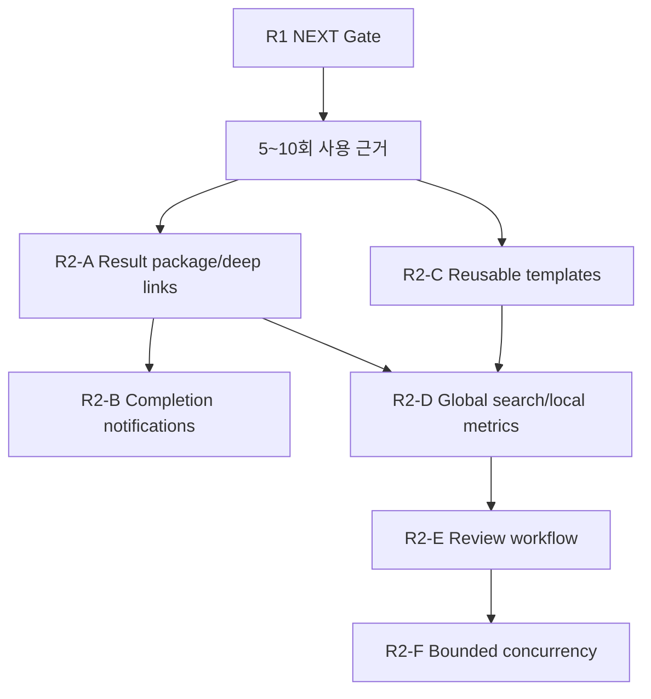

# Personal Agent Gateway R2 제품 확장 실행 플랜

작성일: 2026-07-15
상태: paused — R1 NEXT Release Gate 통과, 실제 사용 근거 확보 전 실행 금지

## 배경

[통합 서비스 개선 로드맵](2026-07-15-service-improvement-roadmap.md)의 LATER 단계는 사용자가 안정된 실행을 반복하고 결과를 더 빨리 판단하게 만드는 단계다. R0는 실행 신뢰를, R1은 운영·복구 가능성을 만든다. R2는 그 위에서만 다음 제품 약속을 추가한다.

- 한 Run의 결과를 한 곳에서 판단한다.
- 장시간 실행을 계속 보고 있지 않아도 완료를 안다.
- 성공한 구성을 다시 사용할 수 있다.
- Session, Run, Task, Document, Artifact를 함께 찾는다.
- 실제 검토 대상을 선택해 Review 결과를 재현한다.
- 필요한 경우에만 비용과 충돌을 통제하며 병렬 실행한다.

구현 순서는 기술 난이도가 아니라 사용자 가치와 실패 반경을 기준으로 한다. Result package와 알림은 기존 terminal event를 읽는 낮은 위험 변경이고, Review와 concurrency는 runtime 의미와 workspace write 충돌을 바꾸는 높은 위험 변경이므로 마지막에 둔다.

## 목표

- Run별 summary, task 결과, changed files, verification, document/artifact를 하나의 result index로 제공한다.
- terminal 상태별 민감 정보 없는 완료 알림과 action link를 제공한다.
- Team, run mode, goal prompt, output checklist를 versioned template으로 저장·복제한다.
- 여러 도메인의 metadata를 source/type/status/date/agent 기준으로 검색한다.
- content 없이 local-only 성공·복구·신뢰성 지표를 계산한다.
- Review target과 finding/verification 계약을 명시해 실제 review-only flow를 구현한다.
- `max_workers`를 bounded concurrency에 연결하되 workspace 충돌·취소·비용 상한을 지킨다.

범위 외:

- Hosted analytics와 prompt/command/file content 외부 전송
- Multi-tenant, 조직 권한, cloud sync
- 외부 distributed queue와 multi-instance scheduling
- Template DSL, marketplace, plugin framework
- 자유로운 임의 webhook payload 또는 secret 자동 포함
- 검증되지 않은 자동 merge/commit/push

## RULES

상태는 `TODO`, `LOCK`, `FAIL`, `SUCCESS`만 사용한다.

- `TODO`: Gate와 결정이 충족돼 실행 가능하다.
- `LOCK`: 제품 근거, 정책 결정, 선행 구현이 부족하다.
- `FAIL`: 검증에 실패했고 재현·다음 조치가 기록됐다.
- `SUCCESS`: 사용자 완료 기준과 기술 Gate가 모두 통과했다.

추가 규칙:

- R1 NEXT Release Gate와 G2-1 실제 사용 근거가 없으면 R2를 시작하지 않는다.
- 한 기능은 source of truth, lifecycle, error surface, delete/retention, test를 함께 정의한다.
- Result package는 원본 파일을 복제하는 저장소가 아니라 기존 source를 연결하는 read model로 시작한다.
- 알림 payload에는 prompt, command, raw output, local absolute path, secret을 넣지 않는다.
- Template은 현재 Team/Persona/Rules를 강제로 덮어쓰지 않고 새 snapshot을 만든다.
- 병렬 실행은 Review flow가 순차 실행으로 먼저 검증된 뒤에만 활성화한다.
- 현재 생성된 Team Run과 실제 사용자 workspace는 자동화 test fixture로 사용하지 않는다.

## 진입 Gate와 실행 전 결정

### 진입 Gate

| ID | 상태 | 조건 | 해제 증거 |
| --- | --- | --- | --- |
| G2-0 | SUCCESS | R1 NEXT Release Gate 전체 통과 | R1 구현 보고서와 full gate |
| G2-1 | LOCK | 5~10회 실제 사용 기록으로 제품 가설 검토 | 사용 기록표: 결과 확인 시간, 알림 필요, 반복 구성, 검색 대상, concurrency 필요 |

G2-1은 수동 기록으로 시작할 수 있다. R2 Local Metrics를 먼저 구현하기 위해 Gate를 우회하지 않는다.

### 결정 항목

| ID | 상태 | 결정 | 권고안 | 산출물/해제 조건 |
| --- | --- | --- | --- | --- |
| D2-1 | LOCK | Result package source와 삭제 의미 | 기존 Team/Task/Document/Artifact를 참조하는 read model, Run 삭제 전 workspace/result 영향 preview | Result/delete contract 승인 |
| D2-2 | LOCK | 알림 provider와 privacy | Browser notification 우선, opt-in webhook 후속, opaque id/status/deep link만 기본 payload | Notification/privacy contract 승인 |
| D2-3 | LOCK | Template snapshot/version | 사용 시 새 Run config snapshot 생성, 원본 Team 변경과 독립, schema version 포함 | Template data contract 승인 |
| D2-4 | LOCK | Search index/retention | SQLite metadata index 우선, content indexing은 명시적 opt-in과 rebuild 가능 구조 | Search/privacy ADR 승인 |
| D2-5 | LOCK | Review target/result 계약 | target path/artifact/diff 중 하나 필수, severity와 evidence/verification 포함 | Review UX/API contract 승인 |
| D2-6 | LOCK | Workspace concurrency 정책 | 기본 1, 독립 read-only 또는 격리 workspace만 병렬; 같은 workspace writer는 serialize | Concurrency safety ADR 승인 |

## Architecture Review

### Current Structural Risks

| 위험 | 근거 | R2 대응 |
| --- | --- | --- |
| 결과가 여러 source에 흩어짐 | Team summary, task result, workspace documents, global artifacts가 별도 API/UI에 있다. | R2-A는 원본을 복제하지 않는 result read model과 source link를 만든다. |
| 화면 상태 기반 navigation | frontend가 단일 active view 중심이라 알림/deep link 복귀 계약이 약하다. | R2-A에서 안정된 target descriptor와 최소 URL route를 먼저 고정한다. |
| 실행 mode 의미가 불완전 | `review_only`가 planning 후 종료되고 `max_workers`가 실행에 쓰이지 않는다. | R2-E에서 실제 Review Strategy를, R2-F에서 semaphore와 충돌 정책을 별도로 도입한다. |
| 검색 대상의 저장 방식이 다름 | Transcript JSONL, Team/Job SQLite, Document/Artifact file metadata가 분산돼 있다. | R2-D는 원본을 직접 매번 scan하지 않는 rebuild 가능한 metadata projection을 사용한다. |
| 알림이 로컬 민감 정보를 노출할 수 있음 | 실행에는 prompt, command, path, output이 포함된다. | R2-B adapter 앞에서 provider 공통 safe payload를 만든다. |

### SOLID Review

#### Finding: Result package는 새 저장소가 아니라 read model이어야 한다

**Evidence**
- 결과 원본은 이미 TeamRunService, workspace document, ArtifactStore가 소유한다.
- 파일을 result package에 복제하면 삭제·수정·보관 상태가 쉽게 어긋난다.

**Principle**
- SRP와 DIP: package builder는 source별 조회 port를 조합하고 원본 lifecycle은 각 domain이 유지한다.

**Recommendation**
- `RunResultService` 또는 동등한 query service가 summary, task, file, verification, artifact reference를 하나의 read model로 만든다.
- materialized metadata가 필요해도 원본 ID와 stale/rebuild 규칙을 유지한다.

**Refutation**
- 독립 bundle은 export에 유리하지만 R2 첫 단계의 핵심은 검사 시간 단축이지 보관 포맷 제작이 아니다. Export는 실제 수요가 확인될 때 추가한다.

**Plan Impact**
- R2-A에서 새 파일 저장과 archive format을 만들지 않는다.

#### Finding: 알림 변형은 작은 Adapter 경계가 정당화된다

**Evidence**
- Browser와 Webhook은 권한, delivery, retry 방식이 다르지만 같은 terminal event를 소비한다.

**Principle**
- OCP와 ISP: terminal event publisher는 provider별 전송 세부 사항을 몰라야 한다.

**Recommendation**
- 공통 safe payload와 좁은 `NotificationProvider.send()` 경계를 두고 Browser 한 개로 시작한다.
- Webhook은 opt-in, allowlist, timeout, retry budget이 정해진 뒤 추가한다.

**Plan Impact**
- R2-B는 provider framework나 arbitrary payload template을 만들지 않는다.

#### Finding: 실제 실행 variant가 생기는 시점에 Strategy를 도입한다

**Evidence**
- R0/R1에서는 plan-and-execute만 실제 실행 variant이며 Review는 숨긴다.
- R2에서는 target 기반 Review가 별도 입력·결과·완료 조건을 가진다.

**Principle**
- OCP: mode별 흐름을 하나의 큰 조건문에 누적하지 않고 동일 lifecycle contract 아래 격리한다.

**Recommendation**
- Planning, Plan-and-Execute, Review executor가 동일 terminal/cancel/audit contract를 구현한다.
- Strategy registry나 plugin loading은 만들지 않고 명시적 mode map으로 충분하다.

**Plan Impact**
- R2-E에서 두 번째 실제 variant가 생길 때만 추출한다.

#### Finding: 병렬성은 executor 기능보다 자원 정책이다

**Evidence**
- Team task는 동일 workspace를 수정할 수 있고 현재 task loop는 순차적이다.
- 단순 `gather()`는 파일 충돌, 비용 폭증, cancel 누락을 만들 수 있다.

**Principle**
- SRP: scheduler는 동시 실행 수를, workspace policy는 충돌 가능성을, task executor는 실제 작업을 소유한다.

**Recommendation**
- `asyncio.Semaphore`로 상한을 두고 writer conflict key가 같은 task를 serialize한다.
- 격리 workspace/merge가 필요해질 때만 별도 workspace coordinator를 검토한다.

**Plan Impact**
- R2-F를 최종 묶음으로 두며 기본값은 1이다.

### Design Pattern Decisions

| 압력 | 선택 | 보류/기각 |
| --- | --- | --- |
| 여러 결과 source 조합 | Query/read-model service | 원본 파일 복제, 범용 Repository |
| Browser/Webhook 전송 차이 | 좁은 notification Adapter | provider plugin platform |
| 실제 Team run mode 변형 | 명시적 Strategy map | 동적 registry/DSL |
| bounded concurrency | Semaphore + conflict key policy | 무제한 `gather`, 외부 queue |
| 검색 | rebuild 가능한 metadata projection | 매 요청 전체 file scan |
| 지표 | terminal/audit event의 local projection | 외부 analytics SDK |

### Dependency Direction



### Test Strategy Alignment

- Unit: safe notification payload, result mapping, template version upgrade, search document mapping, metric aggregation, conflict key.
- Service: source 삭제/stale result, notification retry, template clone, index rebuild, Review findings, cancel propagation.
- API: result/detail/delete preview, notification preference/test, templates, global search filters, metrics, Review creation/terminal state.
- Runtime: sequential Review를 먼저 검증하고 concurrency 1/2/N, writer serialization, partial failure, cancel을 fake executor로 검증한다.
- Frontend: deep link 복귀, 결과 inspection, notification opt-in, template preview, search filter, Review form/결과.
- Product validation: 결과 확인 시간, 알림 확인 지연, template 재사용 시간, 검색 성공 시간, Review finding 수용률을 local-only로 비교한다.
- Regression: R0/R1 auth, lifecycle, stop, audit, retry, backup, error contract가 모두 유지돼야 한다.

## 변경 묶음

| 순서 | ID | 상태 | 변경 묶음 | 선행 조건 | 종료 검증 |
| --- | --- | --- | --- | --- | --- |
| 1 | R2-A | LOCK | Run result package, deep link, delete preview | G2-0, G2-1, D2-1 | result/delete/frontend test |
| 2 | R2-B | LOCK | Completion notification | R2-A, D2-2 | privacy/delivery/deep-link test |
| 3 | R2-C | LOCK | Reusable work template | G2-0, G2-1, D2-3 | clone/version/preview test |
| 4 | R2-D | LOCK | Global search와 local-only metrics | R2-A, R2-C, D2-4 | rebuild/filter/privacy/metric test |
| 5 | R2-E | LOCK | 실제 Review workflow | R2-D, D2-5 | sequential review E2E |
| 6 | R2-F | LOCK | Bounded concurrency | R2-E, D2-6 | conflict/cost/cancel E2E |

## R2-A. Run result package, deep link, delete preview

### 수정 범위

- 새 `src/personal_agent_gateway/run_results.py`
- `src/personal_agent_gateway/api/team_runs.py`
- `src/personal_agent_gateway/artifacts.py`
- Team document 조회 경계
- `frontend/src/api/client.js`
- `frontend/src/components/organisms/TeamRunDetail/index.jsx`
- `frontend/src/components/organisms/DocumentPreview/index.jsx`
- `frontend/src/components/organisms/ArtifactsView/index.jsx`
- `frontend/src/components/containers/GatewayApp/index.jsx`
- 새 result service/API/frontend test

### 수정 계획

1. Result read model에 run status/summary, task 결과, changed file reference, verification, document, artifact, unresolved warning을 정의한다.
2. 각 item은 source type/id, 생성 agent/task, 존재 여부, preview/deep-link target을 유지한다.
3. Team Run terminal 시점과 조회 시점에 result를 조합하되 원본 파일을 복제하지 않는다.
4. stable route 또는 target descriptor로 알림·검색에서 같은 result item으로 복귀하게 한다.
5. Run 삭제 API에 workspace, document, artifact reference, result 영향 preview를 추가하고 확인 뒤 삭제한다.
6. 원본이 사라진 reference는 숨기지 않고 `missing/stale`로 표시한다.

### 완료 기준

- 한 화면에서 완료, 부분 실패, 미검증, 사용자 확인 필요를 구분한다.
- 각 task와 document/artifact/changed file의 출처를 추적할 수 있다.
- 새로고침과 직접 URL/target 복귀 뒤 같은 item을 연다.
- Delete preview가 실제 삭제 범위와 일치한다.
- Result package를 위해 원본 파일 duplicate copy를 만들지 않는다.

### 검증

```powershell
python -m pytest tests/test_team_runtime.py tests/test_team_documents.py tests/test_artifacts.py tests/test_api_team_runs.py -q
npm --prefix frontend test -- TeamRunDetail.test.jsx DocumentPreview.test.jsx ArtifactsView.test.jsx GatewayApp.test.jsx
```

### 롤백 기준

- Source와 result가 반복적으로 불일치하면 materialization을 중단하고 요청 시 read model로 되돌린다.
- Delete preview와 실제 범위가 다르면 destructive delete를 비활성화한다.

## R2-B. Completion notification

### 수정 범위

- 새 `src/personal_agent_gateway/notifications.py`
- 새 `src/personal_agent_gateway/api/notifications.py`
- Terminal event/audit 연결 지점
- `src/personal_agent_gateway/config.py`
- `frontend/src/api/client.js`
- Settings의 notification preference/test UI
- browser notification listener/service worker는 필요한 최소 범위만
- 새 backend/frontend test

### 수정 계획

1. `success`, `partial`, `failed`, `interrupted` terminal event를 공통 safe notification payload로 변환한다.
2. Browser notification을 opt-in으로 구현하고 권한 denied/unsupported 상태를 Settings에 표시한다.
3. Payload는 display label, 상태, 완료 시각, opaque run id, deep link만 기본 허용한다.
4. 동일 terminal event의 duplicate delivery를 idempotency key로 억제한다.
5. Webhook은 D2-2가 별도로 승인되면 HTTPS/allowlist, timeout, 제한 retry, secret redaction과 함께 추가한다.
6. Delivery 성공/실패는 audit와 local metric에 content 없이 기록한다.

### 완료 기준

- 사용자가 opt-in하지 않으면 외부 전송이나 browser notification이 없다.
- 알림에 prompt, command, output, absolute path, secret이 포함되지 않는다.
- 알림 action이 정확한 result package로 이동한다.
- duplicate terminal event가 동일 알림을 반복 생성하지 않는다.
- provider 실패가 Run terminal 상태를 바꾸지 않는다.

### 검증

```powershell
python -m pytest tests/test_notifications.py tests/test_audit.py tests/test_api_team_runs.py tests/test_api_jobs.py -q
npm --prefix frontend test -- SettingsView.test.jsx GatewayApp.test.jsx
```

### 롤백 기준

- 민감 정보 노출이나 중복 폭주가 발생하면 provider 전송을 즉시 disable하고 terminal event/result 기능은 유지한다.

## R2-C. Reusable work template

### 수정 범위

- 새 `src/personal_agent_gateway/work_templates.py`
- 새 `src/personal_agent_gateway/api/work_templates.py`
- versioned migration
- Team/Team Run 생성 service와 API
- `frontend/src/api/client.js`
- Team Run form과 template library/preview UI
- 새 service/API/frontend test

### 수정 계획

1. 최소 template schema를 Team id 또는 Team snapshot, run mode, goal prompt, output checklist, schema version으로 제한한다.
2. 성공한 Run에서 template draft를 만들되 사용자 확인 후 저장한다.
3. Template 사용 시 원본 Team/Persona/Rules를 수정하지 않고 새 Run config snapshot을 생성한다.
4. Missing/deleted dependency를 preview에서 표시하고 자동 대체하지 않는다.
5. 개발·기획·QA·리뷰 starter는 system 강제가 아닌 editable seed로 제공한다.
6. Template update/delete가 이미 생성된 Run snapshot에 영향을 주지 않는지 검증한다.

### 완료 기준

- 반복 Run 생성 시간이 수동 baseline보다 줄어든다.
- Template preview와 생성된 Run snapshot이 일치한다.
- 원본 Team 변경/삭제 뒤 기존 Run 재현 정보는 유지된다.
- 미지원 Review mode template은 R2-E 전까지 실행할 수 없다.
- Template DSL이나 provider-specific prompt framework를 만들지 않는다.

### 검증

```powershell
python -m pytest tests/test_work_templates.py tests/test_teams.py tests/test_api_teams.py tests/test_api_team_runs.py -q
npm --prefix frontend test -- TeamRunForm.test.jsx TeamsView.test.jsx
```

### 롤백 기준

- Template 적용이 사용자 Team/Rules를 변경하면 create path를 비활성화하고 read-only export만 유지한다.

## R2-D. Global search와 local-only metrics

### 수정 범위

- 새 `src/personal_agent_gateway/search.py`
- 새 `src/personal_agent_gateway/metrics.py`
- 새 `src/personal_agent_gateway/api/search.py`
- 새 `src/personal_agent_gateway/api/metrics.py`
- versioned migration과 index rebuild command/API
- Transcript, Team, Task, Document, Artifact, Job terminal event 연결
- 새 Search UI와 운영/제품 metric summary UI
- 대응 test

### 수정 계획

1. Search document는 source type/id, title/label, status, date, agent, route target과 opt-in content excerpt만 가진다.
2. Existing source를 scan해 metadata index를 재구축할 수 있게 하고 index 자체를 source of truth로 취급하지 않는다.
3. Incremental update 실패를 감지하고 rebuild 상태/오류를 diagnostics에 표시한다.
4. Search API는 query, source, status, date, agent, cursor filter와 stable ranking tie-break를 제공한다.
5. Metrics는 ID, status, duration, recovery, schedule delay, inspection event/count만 집계한다.
6. Work success, recovery success, schedule reliability, result inspection time을 local view로 제공한다.
7. Retention, export, delete를 owner가 제어하고 prompt/command/file content는 metric table에 저장하지 않는다.

### 완료 기준

- Session/Run/Task/Document/Artifact 검색 결과가 원래 화면의 정확한 item으로 이동한다.
- Index 삭제 후 rebuild하면 동일 fixture의 검색 가능 source가 복구된다.
- Deleted source는 검색 결과에서 제거되거나 stale로 명확히 표시된다.
- Metric row에 prompt, command, output, path content가 없다.
- 외부 network 없이 지표가 계산되고 owner가 export/delete할 수 있다.

### 검증

```powershell
python -m pytest tests/test_search.py tests/test_metrics.py tests/test_transcript.py tests/test_team_documents.py tests/test_artifacts.py -q
npm --prefix frontend test
npm --prefix frontend run build
```

### 롤백 기준

- Index가 원본 삭제를 반영하지 못하면 검색 write hook을 중단하고 rebuild-only mode로 축소한다.
- 개인정보/민감 content가 metric에 들어가면 metric collection과 export를 즉시 비활성화한다.

## R2-E. 실제 Review workflow

### 수정 범위

- `src/personal_agent_gateway/team_runtime.py`
- `src/personal_agent_gateway/teams.py`
- `src/personal_agent_gateway/api/team_runs.py`
- 필요 시 새 `src/personal_agent_gateway/team_run_modes.py`
- versioned migration
- `frontend/src/components/organisms/TeamRunForm/index.jsx`
- `frontend/src/components/organisms/TeamRunDetail/index.jsx`
- Review target/finding UI
- runtime/service/API/frontend E2E test

### 수정 계획

1. Review 생성 시 target type(path/artifact/diff), target id/path, reviewer personas, checklist를 필수 contract로 받는다.
2. Finding은 severity, title, evidence reference, recommendation, verification status를 가진다.
3. 기존 planning/plan-and-execute와 Review executor를 명시적 mode map으로 분리하되 terminal/cancel/audit contract는 공유한다.
4. Review는 먼저 순차 실행하고 result package에 finding과 verification을 연결한다.
5. Target snapshot/hash를 보존해 나중에 무엇을 검토했는지 재현한다.
6. Target이 바뀌거나 사라지면 stale 상태를 표시하고 자동으로 다른 대상을 검토하지 않는다.

### 완료 기준

- `review_only`가 planning 후 종료되지 않고 실제 target review를 수행한다.
- 같은 target snapshot과 reviewer 구성으로 결과 근거를 재현할 수 있다.
- Finding severity/evidence/verification이 result package에 보인다.
- Cancel/timeout/partial failure가 R0/R1 terminal/audit/error 계약을 따른다.
- Review를 선택하지 않은 기존 mode의 동작은 유지된다.

### 검증

```powershell
python -m pytest tests/test_team_runtime.py tests/test_teams.py tests/test_api_team_runs.py -q
npm --prefix frontend test -- TeamRunForm.test.jsx TeamRunDetail.test.jsx
```

### 롤백 기준

- Target snapshot이 보존되지 않거나 Review가 workspace를 예상 밖으로 수정하면 Review mode를 다시 숨기고 기존 mode만 유지한다.

## R2-F. Bounded concurrency

### 수정 범위

- `src/personal_agent_gateway/team_runtime.py`
- Team task/workspace conflict policy module은 실제 필요 시에만 추가
- `src/personal_agent_gateway/config.py`
- `src/personal_agent_gateway/api/team_runs.py`
- Team Run form/detail의 worker/cost/cancel UI
- concurrency/runtime/composition/frontend test

### 수정 계획

1. 기본 `max_workers=1`을 유지하고 config와 Run별 상한 중 작은 값을 effective concurrency로 계산한다.
2. `asyncio.Semaphore`로 실행 수를 제한하고 task별 read/write/conflict key를 계산한다.
3. 같은 workspace의 writer conflict key가 겹치는 task는 순차 실행한다.
4. 하나의 task 실패가 독립 task를 취소할지 계속할지 Run policy로 명시하고 기본값은 계획 의존성에 따른다.
5. User cancel, timeout, emergency stop을 모든 child task에 전파하고 process leak이 없는지 검증한다.
6. UI는 configured와 effective worker 수, 충돌로 대기 중인 task, 예상 비용/상한을 구분한다.
7. 실제 사용 근거가 순차 실행을 선호하면 기능을 활성화하지 않고 capability를 1로 유지한다.

### 완료 기준

- 동시 active task 수가 effective concurrency를 넘지 않는다.
- 같은 workspace writer task는 병렬로 실행되지 않는다.
- 독립 fixture에서만 concurrency 2 이상이 실제 경과 시간을 줄인다.
- Partial failure, cancel, timeout, emergency stop 뒤 child process/task가 남지 않는다.
- UI가 저장된 `max_workers`가 아니라 실제 effective concurrency를 표시한다.

### 검증

```powershell
python -m pytest tests/test_team_runtime.py tests/test_api_team_runs.py tests/test_app_lifecycle.py tests/test_emergency_stop.py -q
python -m pytest -q
python -m ruff check src tests
npm --prefix frontend test
npm --prefix frontend run build
```

### 롤백 기준

- Workspace conflict, duplicate execution, 비용 상한 초과, cancel leak 중 하나라도 재현되면 capability를 즉시 1로 고정한다.
- Schema의 `max_workers` 값은 유지할 수 있지만 실제 병렬 실행을 광고하지 않는다.

## LATER Release Gate

- [ ] Result package에서 완료/부분 실패/미검증과 모든 source를 한 번에 판단한다.
- [ ] 알림은 opt-in이며 민감 정보를 포함하지 않고 정확한 result로 이동한다.
- [ ] Template이 원본 설정을 변경하지 않고 재현 가능한 Run snapshot을 만든다.
- [ ] Global search가 source filter와 stable deep link를 제공하고 rebuild 가능하다.
- [ ] Local metrics가 content 없이 성공·복구·신뢰성 지표를 계산한다.
- [ ] Review가 명시적 target과 finding/verification 계약으로 실제 실행된다.
- [ ] Concurrency가 상한·workspace 충돌·cancel·비용 정책을 지킨다.
- [ ] R0/R1 전체 release gate가 계속 통과한다.

## 통합 체크리스트

| 상태 | 작업 | 잠금/실패 사유 | 검증 |
| --- | --- | --- | --- |
| SUCCESS | G2-0 R1 NEXT Release Gate |  | R1 full gate |
| LOCK | G2-1 실제 사용 근거 | 5~10회 기록 없음 | Product hypothesis review |
| LOCK | D2-1 Result/delete 계약 | G2-0, G2-1 | Contract review |
| LOCK | D2-2 Notification/privacy | G2-0, G2-1 | Privacy review |
| LOCK | D2-3 Template snapshot/version | G2-0, G2-1 | Data contract review |
| LOCK | D2-4 Search/privacy/retention | G2-0, G2-1 | ADR review |
| LOCK | D2-5 Review target/result | G2-0, G2-1 | UX/API contract review |
| LOCK | D2-6 Concurrency safety | R2-E 전 | Safety ADR review |
| LOCK | R2-A Result package | G2-0, G2-1, D2-1 | Service/API/Vitest |
| LOCK | R2-B Completion notification | R2-A, D2-2 | Privacy/delivery test |
| LOCK | R2-C Work template | G2-0, G2-1, D2-3 | Clone/version test |
| LOCK | R2-D Search/Metrics | R2-A, R2-C, D2-4 | Rebuild/privacy test |
| LOCK | R2-E Review workflow | R2-D, D2-5 | Sequential Review E2E |
| LOCK | R2-F Bounded concurrency | R2-E, D2-6 | Conflict/cancel/cost E2E |

## Docs 승격

- [x] 장기 보존 가치 있음
- [x] ADR로 승격 필요
- [x] Flow로 승격 필요
- [x] Report로 승격 필요
- [x] Knowledge로 승격 필요

승격 후보 경로:

- `docs/adr/<결정일>-run-result-and-delete-contract.md`
- `docs/adr/<결정일>-notification-privacy.md`
- `docs/adr/<결정일>-team-workspace-concurrency.md`
- `docs/flows/review-team-run.md`
- `docs/flows/result-inspection-and-notification.md`
- `docs/knowledge/work-template-guide.md`
- `docs/reports/<완료일>-r2-product-expansion-implementation-report.md`

## 관련 문서

- [통합 서비스 개선 로드맵](2026-07-15-service-improvement-roadmap.md)
- [R0 신뢰 기반 실행 플랜](2026-07-15-r0-trust-foundation-execution-plan.md)
- [R1 운영 가능성 실행 플랜](2026-07-15-r1-operability-execution-plan.md)
- [서비스 도메인 지도](../knowledge/2026-07-15-service-domain-map.md)
- [개발 PM 유지보수성 진단](../reports/2026-07-15-development-pm-maintainability-assessment.md)
- [기획 PM 사용성·기능 진단](../reports/2026-07-15-product-pm-usability-opportunities.md)
- [Persona and Agent Teams Spec](../specs/2026-07-08-persona-agent-teams-spec.md)
