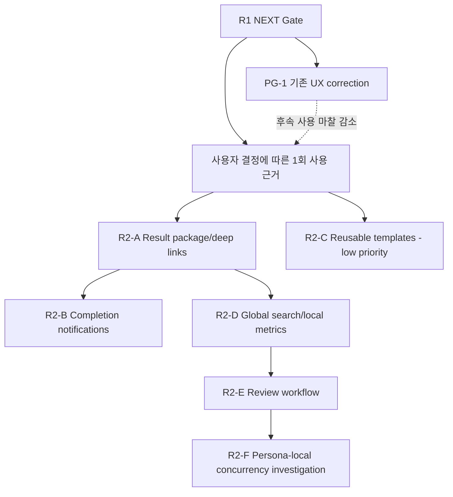
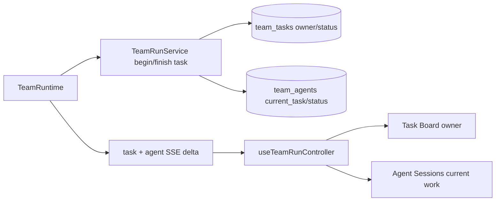

# Personal Agent Gateway R2 제품 확장 실행 플랜

작성일: 2026-07-15
상태: paused — `PG-1`, `R2-B` SUCCESS; 나머지 R2 묶음은 실제 사용 근거와 개별 결정 전까지 `LOCK`

## 배경

[통합 서비스 개선 로드맵](2026-07-15-service-improvement-roadmap.md)의 LATER 단계는 사용자가 안정된 실행을 반복하고 결과를 더 빨리 판단하게 만드는 단계다. R0는 실행 신뢰를, R1은 운영·복구 가능성을 만든다. R2는 그 위에서만 다음 제품 약속을 추가한다.

- 한 Run의 결과를 한 곳에서 판단한다.
- 장시간 실행을 계속 보고 있지 않아도 완료를 안다.
- 성공한 구성을 다시 사용할 수 있다.
- Session, Run, Task, Document, Artifact를 함께 찾는다.
- 실제 검토 대상을 선택해 Review 결과를 재현한다.
- 필요한 경우에만 비용과 충돌을 통제하며 병렬 실행한다.

구현 순서는 기술 난이도가 아니라 사용자 가치와 실패 반경을 기준으로 한다. Result package와 알림은 기존 terminal event를 읽는 낮은 위험 변경이고, Review와 concurrency는 runtime 의미와 workspace write 충돌을 바꾸는 높은 위험 변경이므로 마지막에 둔다.

2026-07-15 실제 사용 검증 1회차에서 결과 위치는 바로 찾았지만 Documents preview, 최신순 탐색, roster/Task 담당자/현재 업무 가시성, 브라우저 알림, 개별 Run 종료에 마찰이 확인됐다. 이 중 기존 화면/API 약속을 완성하는 정렬·preview·assignment 표시·취소 UI는 `PG-1` pre-gate correction으로 분리하고, 새 제품 약속인 알림·검색·병렬성은 G2-1을 유지한다. 반복 설정은 불편하지 않았으므로 Template은 후순위로 내린다.

## 목표

- Run별 summary, task 결과, changed files, verification, document/artifact를 하나의 result index로 제공한다.
- terminal 상태별 민감 정보 없는 완료 알림과 action link를 제공한다.
- Team, run mode, goal prompt, output checklist를 versioned template으로 저장·복제한다.
- 여러 도메인의 metadata를 source/type/status/date/agent 기준으로 검색한다.
- content 없이 local-only 성공·복구·신뢰성 지표를 계산한다.
- Review target과 finding/verification 계약을 명시해 실제 review-only flow를 구현한다.
- Team Task 순서는 유지하고, 공식 capability가 있는 경우에만 Persona 내부 독립 업무 병렬성을 workspace 충돌·취소·비용 상한 안에서 제공한다.

범위 외:

- Hosted analytics와 prompt/command/file content 외부 전송
- Multi-tenant, 조직 권한, cloud sync
- 외부 distributed queue와 multi-instance scheduling
- Template DSL, marketplace, plugin framework
- 자유로운 임의 webhook payload 또는 secret 자동 포함
- 검증되지 않은 자동 merge/commit/push

## RULES

상태는 `TODO`, `LOCK`, `FAIL`, `SUCCESS`만 사용한다.

- `TODO`: Gate와 결정이 충족돼 실행 가능하다.
- `LOCK`: 제품 근거, 정책 결정, 선행 구현이 부족하다.
- `FAIL`: 검증에 실패했고 재현·다음 조치가 기록됐다.
- `SUCCESS`: 사용자 완료 기준과 기술 Gate가 모두 통과했다.

추가 규칙:

- R1 NEXT Release Gate와 G2-1 실제 사용 근거가 없으면 R2를 시작하지 않는다.
- 한 기능은 source of truth, lifecycle, error surface, delete/retention, test를 함께 정의한다.
- Result package는 원본 파일을 복제하는 저장소가 아니라 기존 source를 연결하는 read model로 시작한다.
- 알림 payload에는 prompt, command, raw output, local absolute path, secret을 넣지 않는다.
- Template은 현재 Team/Persona/Rules를 강제로 덮어쓰지 않고 새 snapshot을 만든다.
- 병렬 실행은 Review flow가 순차 실행으로 먼저 검증된 뒤에만 활성화한다.
- 현재 생성된 Team Run과 실제 사용자 workspace는 자동화 test fixture로 사용하지 않는다.
- G2-1은 2026-07-16 사용자 결정에 따라 실제 사용 1회로 판정한다. 이 성공은 모든 R2 묶음을 자동 승인하지 않으며, 해당 1회에서 직접 관찰된 가설만 개별 결정으로 해제한다.

## 진입 Gate와 실행 전 결정

### 진입 Gate

| ID | 상태 | 조건 | 해제 증거 |
| --- | --- | --- | --- |
| G2-0 | SUCCESS | R1 NEXT Release Gate 전체 통과 | R1 구현 보고서와 full gate |
| G2-1 | SUCCESS | 사용자 결정에 따른 실제 사용 1회로 제품 가설 검토 | 1/1 기록 완료. 결과 확인 시간, 알림 필요, 반복 구성, 검색 대상, concurrency 필요 기록표 |

G2-1은 수동 기록 1회로 닫혔다. 관찰 근거가 없는 R2 기능은 각 결정 항목의 `LOCK`을 유지한다.

### G2-1 중간 제품 가설 재평가 (2026-07-16)

PG-1 완료 뒤 실제 사용 #1을 다시 검토했고, 사용자의 명시적 결정으로 이 1회를 G2-1 최종 근거로 삼는다. 결과 위치는 바로 찾았고, 당시 결과 탐색 마찰이었던 preview·최신순 정렬·담당자·개별 종료는 PG-1이 해결했다. 데이터 source가 구조적으로 흩어져 있다는 사실만으로 Result package를 추가하면 사용자 문제보다 구현 구조가 먼저 생긴다.

| 묶음 | 현재 근거 | 판단 |
| --- | --- | --- |
| R2-A Result package | 결과 위치를 바로 찾았고 cross-source 판단 또는 삭제 영향 불확실성은 관찰되지 않음 | `LOCK` 유지. 남은 사용에서 같은 Run의 task/document/artifact를 반복 왕복하거나 삭제 범위를 판단하지 못한 사례가 확인될 때 재검토 |
| R2-B Browser notification | 완료까지 화면을 지켜봤고 browser notification 선호 1회 확인 | 첫 slice 승인. 열린 Gateway 탭, opt-in, 민감정보 없는 terminal 알림만 구현 |
| R2-C Template | 반복 입력이 불편하지 않았음 | 후순위 유지 |
| R2-D Search/Metrics | global search 요구는 없었고 최신순 문제는 PG-1에서 해결 | `LOCK` 유지 |
| R2-E Review workflow | Review target/finding 계약의 실제 요구가 관찰되지 않음 | `LOCK` 유지 |
| R2-F Persona-local concurrency | Team Task 순차 실행 선호, Persona 내부 독립 업무 병렬성 선호 1회 | capability 조사 전 구현 금지 |

#### Finding: R2-A는 현재 사용자 근거보다 구조적 가능성이 앞선다

**Evidence**
- 실제 사용 #1은 결과 위치를 바로 찾았다고 기록했다.
- 관찰된 결과 탐색 문제는 PG-1의 preview, 정렬, assignment와 Stop 보정으로 닫혔다.
- 삭제 영향 preview, stale source, cross-source verification 누락은 아직 실제 사례가 없다.

**Principle**
- SRP와 단순성: 기존 Team detail이 사용자 판단을 충족하는 동안 별도 `RunResultService`를 추가하지 않는다.

**Recommendation**
- D2-1과 R2-A를 `LOCK`으로 유지한다.
- 남은 실제 사용에서 cross-source 왕복 또는 삭제 영향 불확실성이 반복될 때만 read model과 delete preview 계약을 승인한다.

**Refutation**
- Team, Task, Document, Artifact source가 분산된 것은 사실이지만 현재 consumer가 하나의 package를 요구했다는 증거는 없다. 구조적 분산만으로 새 service를 만드는 비용이 더 크므로 현 단계에서는 구현하지 않는다.

**Plan Impact**
- R2-A 파일과 code task는 변경하지 않는다.
- 후속 실제 사용에서 unlock evidence가 생기면 D2-1부터 다시 검토한다.

### 결정 항목

| ID | 상태 | 결정 | 권고안 | 산출물/해제 조건 |
| --- | --- | --- | --- | --- |
| D2-1 | LOCK | Result package source와 삭제 의미 | 기존 Team/Task/Document/Artifact를 참조하는 read model, Run 삭제 전 workspace/result 영향 preview | Result/delete contract 승인 |
| D2-2 | SUCCESS | 알림 provider와 privacy | 열린 gateway 탭의 opt-in Browser Notification, webhook/service worker 제외, generic status와 opaque run id만 사용 | 2026-07-16 사용자 범위 결정과 component analysis 승인 |
| D2-3 | LOCK | Template snapshot/version | 사용 시 새 Run config snapshot 생성, 원본 Team 변경과 독립, schema version 포함 | Template data contract 승인 |
| D2-4 | LOCK | Search index/retention | SQLite metadata index 우선, content indexing은 명시적 opt-in과 rebuild 가능 구조 | Search/privacy ADR 승인 |
| D2-5 | LOCK | Review target/result 계약 | target path/artifact/diff 중 하나 필수, severity와 evidence/verification 포함 | Review UX/API contract 승인 |
| D2-6 | LOCK | Persona-local concurrency 정책 | Team Task 순서는 유지하고, CLI가 공식 지원하는 Persona 내부 독립 하위 업무만 제한적으로 병렬; 같은 workspace writer는 serialize | Capability 조사와 Concurrency safety ADR 승인 |

## Architecture Review

### Current Structural Risks

| 위험 | 근거 | R2 대응 |
| --- | --- | --- |
| 결과가 여러 source에 흩어짐 | Team summary, task result, workspace documents, global artifacts가 별도 API/UI에 있다. | R2-A는 원본을 복제하지 않는 result read model과 source link를 만든다. |
| 화면 상태 기반 navigation | frontend가 단일 active view 중심이라 알림/deep link 복귀 계약이 약하다. | R2-A에서 안정된 target descriptor와 최소 URL route를 먼저 고정한다. |
| 실행 mode 의미가 불완전 | `review_only`가 planning 후 종료되고 `max_workers`가 실행에 쓰이지 않는다. | R2-E에서 실제 Review Strategy를 만들고, R2-F는 Team 병렬화가 아닌 Persona-local capability를 먼저 조사한다. |
| 검색 대상의 저장 방식이 다름 | Transcript JSONL, Team/Job SQLite, Document/Artifact file metadata가 분산돼 있다. | R2-D는 원본을 직접 매번 scan하지 않는 rebuild 가능한 metadata projection을 사용한다. |
| 알림이 로컬 민감 정보를 노출할 수 있음 | 실행에는 prompt, command, path, output이 포함된다. | R2-B frontend adapter에서 terminal event를 safe browser payload로 제한한다. |
| Document 목록과 preview 계약이 불일치 | API는 `is_file()`만 확인해 unsupported binary까지 목록에 포함하고 image는 `binary`, HTML은 `code`로 취급한다. | PG-1에서 지원 kind allowlist와 image 전용 response, sandbox HTML preview를 고정한다. |
| 표시 순서와 domain 순서가 결합됨 | `list_messages()`는 handoff 조합을 위해 오래된 순으로 반환하고 Results/Live Activity/Shared Handoffs가 배열 순서를 그대로 따른다. | Domain 반환 순서는 유지하고 Results/Activity는 item, Handoffs는 pairing 이후 group 단위 최신순 projection을 사용한다. |
| Run 취소 backend가 UI에 연결되지 않음 | `POST /cancel`과 process tree 종료 test는 있지만 frontend client/controller/detail action이 없다. | 새 service 없이 기존 endpoint를 UI까지 연결한다. |
| Task assignment field가 runtime에 연결되지 않음 | `owner_agent_id`와 `current_task_id` schema/UI가 있지만 `_execute()`는 status만 변경하고 두 field를 기록하지 않는다. | Task 시작·종료를 Task/Agent 일관 상태 전이로 만들고 SSE delta로 전달한다. |
| Team Run roster read model이 비대칭 | enriched Run은 `leader_name`만 제공하고 member만 avatar/name snapshot을 제공한다. | 기존 field를 보존하면서 leader snapshot object를 추가하고 양쪽 모두 avatar+name chip으로 표시한다. |

### SOLID Review

#### Finding: Result package는 새 저장소가 아니라 read model이어야 한다

**Evidence**
- 결과 원본은 이미 TeamRunService, workspace document, ArtifactStore가 소유한다.
- 파일을 result package에 복제하면 삭제·수정·보관 상태가 쉽게 어긋난다.

**Principle**
- SRP와 DIP: package builder는 source별 조회 port를 조합하고 원본 lifecycle은 각 domain이 유지한다.

**Recommendation**
- `RunResultService` 또는 동등한 query service가 summary, task, file, verification, artifact reference를 하나의 read model로 만든다.
- materialized metadata가 필요해도 원본 ID와 stale/rebuild 규칙을 유지한다.

**Refutation**
- 독립 bundle은 export에 유리하지만 R2 첫 단계의 핵심은 검사 시간 단축이지 보관 포맷 제작이 아니다. Export는 실제 수요가 확인될 때 추가한다.

**Plan Impact**
- R2-A에서 새 파일 저장과 archive format을 만들지 않는다.

#### Finding: 최신순 표시는 domain query가 아니라 view projection이어야 한다

**Evidence**
- `TeamRunService.list_messages()`는 `created_at asc, id asc`이며 `buildHandoffs()`와 task report grouping이 같은 배열의 시간 순서를 사용한다.
- `TeamRunDetail`의 Results와 Live Activity만 사용자에게 오래된 항목부터 그대로 렌더링한다.

**Principle**
- SRP: 메시지의 대화·handoff 순서와 화면의 탐색 순서는 서로 다른 책임이다.

**Recommendation**
- service/API의 기존 오름차순 계약은 유지한다.
- `TeamRunDetail`에서 Results와 Live Activity는 `(created_at, id)` 내림차순 파생 배열을 사용한다.
- Handoff는 원본 오름차순 배열로 query/answer를 먼저 묶은 뒤 `(answer.created_at || query.created_at, answer.id || query.id)` 기준으로 pair group만 최신순 정렬한다.

**Refutation**
- SQL을 내림차순으로 바꾸면 코드량은 적지만 handoff pairing과 기존 API consumer 의미까지 바뀐다. Handoff 배열 자체를 먼저 reverse해도 query/answer index pairing이 깨질 수 있으므로 pairing 후 projection이 더 작은 변경이다.

**Plan Impact**
- PG-1 frontend와 component regression test에 반영한다.

#### Finding: Task 담당자와 Agent 현재 업무는 하나의 runtime 상태 전이어야 한다

**Evidence**
- `team_tasks.owner_agent_id`와 `team_agents.current_task_id`가 schema/API/UI에 존재한다.
- `_execute()`는 worker를 선택해 Task/Agent status만 갱신하고 owner/current task를 기록하지 않는다.
- `TeamTaskCard`는 owner prop을 받지만 이름을 표시하지 않고, Agent Sessions는 `current_task_id`가 비어 `No active task`를 표시한다.
- SSE delta는 run/task만 병합하므로 Agent 상태를 backend에서 고쳐도 실행 중 카드가 자동 갱신되지 않는다.

**Principle**
- SRP와 일관성: Task assignment는 Task row와 Agent row를 함께 바꾸는 하나의 domain action이며 UI가 두 상태를 추론해 복원하면 안 된다.

**Recommendation**
- service에 Task 시작/종료 command를 추가해 owner, Task status/timestamp, Agent status/current task를 한 transaction에서 변경한다. 별도 Command class는 만들지 않는다.
- Task 시작 직후와 종료 직후 task+agent delta를 publish하고 frontend controller가 agent delta도 병합한다.
- Task Board는 snapshot avatar와 name을 함께 표시하고, Agent Sessions는 current Task title을 한두 줄로 표시한다. Leader는 Task가 없을 때 Run phase로 Planning/Coordinating/Summarizing을 표시한다.

**Refutation**
- frontend가 `in_progress` Task를 검색해 담당자를 추론하는 방법은 backend 변경이 적지만 owner 자체가 비어 있고 agent status도 SSE에서 stale하다. polling은 즉시성을 낮추고 기존 delta 경계를 우회하므로 runtime 상태 전이가 필요하다.

**Plan Impact**
- PG-1 backend service/runtime, SSE delta, TeamTaskCard, TeamRunDetail과 회귀 test에 반영한다.

#### Finding: Team Run roster는 기존 enriched read model을 확장하면 충분하다

**Evidence**
- `list_team_runs_enriched()`는 이미 한 query 묶음에서 Run별 Agent snapshot을 읽는다.
- member payload에는 name/avatar/initials가 있지만 leader는 `leader_name` string만 반환하고 TeamRunCard도 이를 그대로 표시한다.

**Principle**
- ISP: 목록 카드가 필요한 snapshot identity만 기존 aggregate에 포함하고 상세 endpoint 전체를 요구하지 않는다.

**Recommendation**
- 하위 호환을 위해 `leader_name`을 유지하면서 member와 같은 shape의 `leader` object를 추가한다.
- TeamRunCard는 leader/member 모두 avatar 또는 initials와 visible name을 가진 동일한 roster chip으로 렌더링한다.

**Refutation**
- 각 카드가 detail API를 추가 호출하면 backend payload 변경은 피할 수 있지만 Run 수만큼 N+1 요청이 생기고 이미 aggregate가 동일 Agent rows를 읽고 있다. 기존 read model 확장이 더 작다.

**Plan Impact**
- PG-1 enriched service/API contract와 TeamRunCard test에 반영한다.

#### Finding: Document metadata와 안전한 preview byte 전달을 분리해야 한다

**Evidence**
- Document 목록은 모든 file을 반환하지만 content endpoint는 image를 `binary`로 거부하고 HTML을 code text로 반환한다.
- Artifact API에는 인증된 `FileResponse` 경계가 이미 있으며, DocumentPreview는 JSON/Markdown 외 모든 kind를 `<pre>`로 표시한다.

**Principle**
- ISP와 DIP: 목록 consumer는 file body를 받지 않고 preview UI는 kind별 최소 전달 방식에만 의존해야 한다.

**Recommendation**
- 목록은 `md/json/text/code/html/image`처럼 실제 지원하는 kind만 반환한다.
- text/HTML은 기존 JSON content endpoint를 사용하고, 허용된 raster image는 path 검증·MIME 고정·`nosniff`가 적용된 image-only endpoint로 전달한다.
- HTML은 `iframe sandbox`와 restrictive CSP를 적용한 `srcDoc`으로 렌더링하며 script, navigation, remote network를 허용하지 않는다.

**Refutation**
- 모든 binary를 base64 JSON으로 보내면 endpoint 하나로 끝나지만 payload가 커지고 content type 경계가 사라진다. 임의 file raw endpoint는 HTML/SVG 실행 위험을 넓히므로 image allowlist가 더 작고 안전하다.

**Plan Impact**
- PG-1 API, DocumentPreview, client contract와 security/component test에 반영한다.

#### Finding: 개별 Run 강제 종료는 새 backend 기능이 아니라 누락된 UI 연결이다

**Evidence**
- `POST /api/team-runs/{id}/cancel`은 active registry task를 cancel하고 terminal Run을 덮어쓰지 않는다.
- Codex/Claude model client는 `CancelledError`에서 process tree를 종료하며 backend API test가 blocked Run의 `canceled` 정착을 검증한다.
- frontend client와 `useTeamRunController`, `TeamRunDetail`에는 cancel action이 없다.

**Principle**
- SRP와 단순성: 종료 lifecycle은 기존 backend가 소유하고 frontend는 확인·호출·상태 갱신만 담당한다.

**Recommendation**
- 기존 endpoint에 client method와 controller action을 연결하고 active Run에서만 destructive `Stop run`을 노출한다.
- 확인 dialog에는 완료된 Task/문서가 보존되고 현재 process가 종료된다는 결과를 설명한다.

**Refutation**
- 별도 force-kill endpoint는 이름은 명확하지만 현재 cancel 경로가 이미 process tree까지 종료한다. 새 endpoint는 중복 상태 전이만 만든다.

**Plan Impact**
- PG-1은 frontend 위주로 수행하고 backend는 기존 cancel regression만 유지한다.

#### Finding: 첫 Browser Notification에는 backend provider 계층이 필요하지 않다

**Evidence**
- 1회차 사용 근거는 열린 화면을 계속 지켜봐야 했다는 점과 Browser Notification 선호뿐이다.
- frontend는 이미 Team terminal SSE event를 수신하고, webhook 수요는 아직 확인되지 않았다.

**Principle**
- DIP: browser permission/Notification API는 작은 frontend boundary 뒤에 두되 존재하지 않는 server provider 변형을 미리 추상화하지 않는다.

**Recommendation**
- page가 열린 상태에서 opt-in Browser Notification만 지원하고 terminal event의 safe field로 생성한다.
- webhook 또는 background push가 실제 두 번째 provider로 승인될 때만 backend adapter를 도입한다.

**Refutation**
- provider interface를 미리 만들면 webhook 추가가 쉬울 수 있지만 현재 두 번째 consumer도 delivery 요구도 없다. frontend API wrapper 하나가 현 요구를 충분히 격리한다.

**Plan Impact**
- R2-B의 초기 backend `notifications.py`/API와 service worker를 범위에서 제거한다.

#### Finding: 실제 실행 variant가 생기는 시점에 Strategy를 도입한다

**Evidence**
- R0/R1에서는 plan-and-execute만 실제 실행 variant이며 Review는 숨긴다.
- R2에서는 target 기반 Review가 별도 입력·결과·완료 조건을 가진다.

**Principle**
- OCP: mode별 흐름을 하나의 큰 조건문에 누적하지 않고 동일 lifecycle contract 아래 격리한다.

**Recommendation**
- Planning, Plan-and-Execute, Review executor가 동일 terminal/cancel/audit contract를 구현한다.
- Strategy registry나 plugin loading은 만들지 않고 명시적 mode map으로 충분하다.

**Refutation**
- 현재 mode 조건문을 유지하는 것이 더 작지만 Review는 target, finding, verification이라는 별도 입출력과 완료 조건을 가진 실제 두 번째 실행 variant다. 이 시점에는 명시적 mode map이 분기 누적보다 작다.

**Plan Impact**
- R2-E에서 두 번째 실제 variant가 생길 때만 추출한다.

#### Finding: Team Task 병렬화와 Persona 내부 병렬화는 같은 기능이 아니다

**Evidence**
- 현재 `_execute()`는 pending Team Task 하나를 골라 Persona의 `model.complete()` 한 번으로 처리한다.
- 1회차 사용자는 Team Task 순차 실행을 선호하고, 한 Persona가 맡은 Task 내부의 독립 업무만 병렬 처리하기를 원했다.
- gateway에는 Persona 하위 업무 entity나 Codex/Claude subagent capability 계약이 없다.

**Principle**
- SRP: Team scheduler의 Task 순서와 CLI 내부 sub-work orchestration을 하나의 `max_workers` 의미로 합치지 않는다.

**Recommendation**
- Team Task executor는 기본 순차 실행을 유지한다.
- R2-F는 먼저 local CLI가 공식적으로 제공하는 subagent/parallel capability와 cancel 전파를 조사한다.
- 지원 계약이 없으면 gateway가 임의 child process를 만들지 않고 capability를 비활성 상태로 유지한다.

**Refutation**
- 기존 `max_workers`를 Team Task semaphore에 연결하는 편이 구현은 쉽지만 확인된 사용자 요구와 반대이며 동일 workspace 충돌을 늘린다. 내부 병렬성은 별도 모델이 없으므로 조사 Gate가 필요하다.

**Plan Impact**
- R2-F를 최종 capability investigation/제한 구현 묶음으로 유지하고 `max_workers=1`을 바꾸지 않는다.

### Design Pattern Decisions

| 압력 | 선택 | 보류/기각 |
| --- | --- | --- |
| 여러 결과 source 조합 | Query/read-model service | 원본 파일 복제, 범용 Repository |
| Browser Notification API 격리 | 작은 frontend adapter | backend provider framework, service worker push |
| Document preview kind 차이 | 명시적 kind dispatch + image-only response | 범용 raw file server, base64 binary JSON |
| Task와 Agent의 assignment 동시 전이 | domain service command + delta | UI 추론, polling, 별도 Command class |
| Team Run roster identity | 기존 aggregate read model 확장 | 카드별 detail N+1 fetch |
| 실제 Team run mode 변형 | 명시적 Strategy map | 동적 registry/DSL |
| Persona 내부 병렬 capability | 조사 Gate 후 CLI-native capability 우선 | Team Task `gather`, gateway 임의 child process |
| 검색 | rebuild 가능한 metadata projection | 매 요청 전체 file scan |
| 지표 | terminal/audit event의 local projection | 외부 analytics SDK |

### Dependency Direction



PG-1 assignment 상태는 다음 한 방향으로 흐른다.



### Test Strategy Alignment

- Unit: document kind/정렬 cursor, safe notification payload, result mapping, template version upgrade, search document mapping, metric aggregation.
- Service: Task/Agent assignment transaction, enriched leader snapshot, source 삭제/stale result, template clone, index rebuild, Review findings, cancel propagation.
- API: Documents 지원 kind와 image-only response, 안정된 최신순 cursor, leader/member roster shape, task/agent delta, 기존 Run cancel, result/detail/delete preview, templates, global search filters, metrics, Review terminal state.
- Runtime: Task 시작·완료·실패에서 owner/current task가 일치하고 기존 cancel이 Codex/Claude process tree를 종료하는 회귀를 유지한다. Team Task 순차 실행을 baseline으로 검증하고 Persona-local concurrency는 capability가 확인된 뒤 cancel/writer isolation을 fake executor로 검증한다.
- Frontend: Results/Activity/Handoffs/Documents 최신순, Task 담당 Persona, Agent current work, Team Run roster avatar+name, image/HTML preview, active Run Stop, deep link 복귀, browser notification opt-in, template preview, search filter, Review form/결과.
- Product validation: 결과 확인 시간, 알림 확인 지연, template 재사용 시간, 검색 성공 시간, Review finding 수용률을 local-only로 비교한다.
- Regression: R0/R1 auth, lifecycle, stop, audit, retry, backup, error contract가 모두 유지돼야 한다.

### Plan Changes Applied

- 사용자 결정에 따라 G2-1 1회차를 1/1 최종 근거로 기록하고 기존 UX correction과 신규 제품 확장을 분리했다.
- Documents/Results/Live Activity/Shared Handoffs 최신순, 지원 document filtering, image/HTML preview, Task/Agent assignment 가시성, Team Run roster avatar+name, 개별 Run Stop을 `PG-1`로 추가했다.
- PG-1 완료 뒤 제품 가설을 재평가했으며 Result package 문제는 아직 관찰되지 않아 D2-1/R2-A `LOCK`을 유지했다. Browser notification은 열린 탭의 opt-in slice만 승인했다.
- Browser Notification 첫 slice에서 backend provider framework와 service worker를 제거했다.
- 한 번의 실제 사용으로 승인된 열린 탭 Browser Notification slice를 구현하고 privacy/delivery/navigation test와 전체 frontend gate를 통과했다.
- Template을 후순위로 내리고 Global Search의 Template 선행 의존성을 제거했다.
- Team Task 병렬 실행 계획을 Persona-local capability 조사로 축소하고 `max_workers=1` baseline을 유지했다.

## 변경 묶음

| 순서 | ID | 상태 | 변경 묶음 | 선행 조건 | 종료 검증 |
| --- | --- | --- | --- | --- | --- |
| 0 | PG-1 | SUCCESS | 기존 Run 탐색·assignment·preview·개별 종료 correction | G2-0, 실제 사용 #1 | backend 454 / frontend 210 / build / 8787 smoke |
| 1 | R2-A | LOCK | Run result package, deep link, delete preview | G2-0, G2-1, D2-1 | result/delete/frontend test |
| 2 | R2-B | SUCCESS | Completion notification | G2-1, D2-2 | frontend 217 tests / production build |
| 3 | R2-D | LOCK | Global search와 local-only metrics | R2-A, D2-4 | rebuild/filter/privacy/metric test |
| 4 | R2-E | LOCK | 실제 Review workflow | R2-D, D2-5 | sequential review E2E |
| 5 | R2-F | LOCK | Persona-local concurrency capability | R2-E, D2-6 | capability/conflict/cancel E2E |
| 6 | R2-C | LOCK | Reusable work template | G2-0, G2-1, D2-3, 추가 사용 근거 | clone/version/preview test |

## PG-1. 기존 Run 탐색·assignment·preview·개별 종료 correction

상태: SUCCESS (2026-07-15)

G2-1을 우회하는 제품 확장이 아니라, 실제 사용 중 확인된 기존 화면/API의 표시·연결 결함을 고친다. 현재 사용자 Team Run과 workspace는 자동화 fixture로 사용하지 않는다.

### 가정과 범위

- `Documents에 폴더가 보인다`는 피드백은 실제 directory row가 아니라 recursive file path와 unsupported file이 한 목록에 섞여 보이는 현상으로 본다. API는 이미 `is_file()`을 검사하므로 directory row 재현 시 이 가정을 수정한다.
- `볼 수 있는 문서`는 이번 slice에서 `md`, `json`, UTF-8 text/code, `html`, raster image(`png`, `jpeg`, `gif`, `webp`)로 제한한다. PDF, SVG, video, archive preview는 추가하지 않는다.
- Documents는 workspace file explorer가 아니다. VCS/dependency/cache directory(`.git`, `node_modules`, `.venv`, `__pycache__` 등)와 `.env` 계열 민감 파일은 목록과 preview에서 제외한다.
- HTML preview는 외부 network, script, form, popup, top navigation을 허용하지 않는다. 완전한 웹앱 실행이 아니라 정적 결과 검토가 목표다.
- `Stop run`은 새 kill API가 아니라 기존 `/cancel` 계약을 사용한다.
- roster와 담당자 identity는 Run 생성 시 고정된 Persona snapshot의 avatar/name을 사용한다. 이후 Persona Library 변경으로 과거 Run 표시를 바꾸지 않는다.
- `어떤 업무중인지`는 raw prompt/output이 아니라 current Task title과 leader phase의 짧은 label을 의미한다.

### 수정 범위

- `src/personal_agent_gateway/api/team_runs.py`
- `src/personal_agent_gateway/teams.py`, `src/personal_agent_gateway/team_runtime.py`
- `tests/test_teams.py`, `tests/test_team_runtime.py`, `tests/test_api_team_runs.py`
- `frontend/src/api/client.js`, `frontend/src/api/client.test.js`
- `frontend/src/hooks/useTeamRunController.js`
- `frontend/src/components/molecules/TeamRunCard/index.jsx`와 test
- `frontend/src/components/molecules/TeamTaskCard/index.jsx`와 새 test
- `frontend/src/components/organisms/TeamRunDetail/index.jsx`와 test
- `frontend/src/components/organisms/DocumentPreview/index.jsx`와 test
- `frontend/src/components/containers/GatewayApp/index.jsx`와 test
- `src/personal_agent_gateway/static/styles.css`

### 수정 계획

1. RED API test로 directory/ignored directory/민감 파일/unsupported binary 제외, 지원 kind 분류, `(modified_at, path)` 내림차순과 stable cursor를 고정한다.
2. Document list를 지원 kind allowlist로 제한하고 HTML과 raster image를 `html`/`image`로 분리한다. nested file은 basename을 주 label, relative parent를 보조 정보로 표시한다.
3. image에 한해서 `_safe_child` 검증, 허용 확장자와 server-side MIME 고정, `X-Content-Type-Options: nosniff`를 적용한 authenticated preview endpoint를 추가한다. 임의 raw file endpoint는 만들지 않는다.
4. `DocumentPreview`는 image를 ``로, HTML을 restrictive CSP가 포함된 `srcDoc`과 빈 `sandbox` iframe으로 표시한다. Markdown/JSON/text/code 기존 preview는 유지한다.
5. API의 message 오름차순은 유지한다. Results와 Live Activity는 `(created_at, id)` 최신순, Shared / Handoffs는 query/answer pairing 후 pair의 마지막 활동 시각 최신순으로 렌더링한다. Documents는 server 순서를 그대로 사용한다.
6. TeamRunService에 Task 시작/종료 transaction을 추가해 `owner_agent_id`, Task status/timestamp, Agent status/`current_task_id`를 함께 갱신한다. 완료·실패·취소 뒤 current task는 비우되 Task owner는 이력으로 보존하고 `_settle_canceled()`도 같은 lifecycle 경계를 사용한다.
7. runtime은 model 호출 전 started task+agent delta를 publish하고 완료/실패 뒤 terminal task+agent delta를 publish한다. `applyTeamRunDelta`는 agent delta를 id 기준으로 병합한다.
8. Task Board 카드에 담당 Persona의 snapshot avatar/initials와 이름을 함께 표시한다. 아직 할당되지 않은 pending Task는 `UNASSIGNED`로 명시한다.
9. Agent Sessions 카드는 current Task title을 한두 줄로 표시하고, current Task가 없는 leader는 Run phase에 따라 `Planning tasks`, `Coordinating agents`, `Summarizing results`를 표시한다.
10. enriched Team Run payload에 기존 `leader_name`을 유지하면서 member와 동일 shape의 `leader` snapshot object를 추가한다. TeamRunCard는 leader와 members 모두 avatar/initials+name chip으로 렌더링한다.
11. frontend client에 기존 cancel endpoint method를 추가하고 controller에 확인 dialog, pending state, detail/list refresh, success/error toast를 연결한다.
12. `TeamRunDetail`은 `planning`, `running`, `summarizing`에서만 destructive `Stop run`을 표시한다. terminal/interrupted/draft에는 숨기고, 확인 문구에 완료 Task와 문서 보존을 명시한다.
13. 별도 임시 Team/Workspace의 active Run으로 수동 smoke를 수행해 Task 담당자/current work 실시간 표시와 취소 후 process 종료, `canceled` 정착, 기존 결과 보존을 확인한다.

### 완료 기준

- Documents에 directory, dependency/cache file, `.env` 계열, unsupported binary row가 보이지 않고 지원 파일만 열린다.
- image preview가 원본 비율로 보이고 허용되지 않은 path/type은 거부된다.
- HTML은 raw code 대신 sandbox preview로 보이며 script, remote request, navigation이 실행되지 않는다.
- Documents, Results, Live Activity, Shared / Handoffs가 최신순이며 동률은 path/id로 안정적으로 정렬된다.
- handoff query/answer pairing과 task별 report 연결은 유지되고 pair 내부 query가 answer보다 먼저 보인다.
- in-progress/completed/failed Task는 담당 Persona의 avatar와 이름을 표시하고 pending 미할당 Task는 `UNASSIGNED`로 구분된다.
- worker가 Task를 시작하면 Agent Sessions에 Task title이 즉시 보이고 완료·실패·취소 뒤 active task가 사라진다.
- leader Agent Sessions는 planning/running/summarizing phase의 조정 업무를 짧은 label로 표시한다.
- Team Runs 목록의 leader와 members가 모두 snapshot avatar/initials와 visible name을 표시한다.
- active Run에서 Stop을 누르면 확인 후 child process tree가 종료되고 Run은 `canceled`가 된다.
- Stop 중 중복 클릭이 차단되고 완료/실패/중단 Run에는 Stop action이 없다.
- 완료 Task, messages, Documents와 workspace는 Stop 뒤에도 보존된다.

### 검증

```powershell
python -m pytest tests/test_teams.py tests/test_team_runtime.py tests/test_api_team_runs.py -q
npm --prefix frontend test -- client.test.js TeamRunCard.test.jsx TeamTaskCard.test.jsx TeamRunDetail.test.jsx DocumentPreview.test.jsx GatewayApp.test.jsx
python -m pytest -q
python -m ruff check src tests
npm --prefix frontend test
npm --prefix frontend run build
```

구현 결과:

- 지원 문서 allowlist, ignored/sensitive 경로 제외, `(modified_at, path)` 최신순 cursor와 image-only preview route를 적용했다.
- HTML은 restrictive CSP와 빈 iframe sandbox로, raster image는 authenticated endpoint로 preview한다.
- Task 시작/종료가 owner와 Agent current task를 같은 transaction에서 갱신하고 SSE agent delta를 발행한다.
- Results, Live Activity, Handoff pair group을 최신순으로 표시하며 Task owner, leader phase, Run roster를 snapshot identity로 표시한다.
- active Run Stop은 기존 cancel을 await해 `canceled` 정착 후 응답하고 detail/list를 갱신한다.
- 검증: backend 전체 `454 passed`, frontend 전체 `210 passed`, Ruff 통과, production build 통과, 8787에서 새 bundle과 image route 노출 확인. 추가 cancel await 변경 뒤 관련 backend 3개와 frontend 55개를 재검증했다.

### 롤백 기준

- image endpoint가 allowlist 밖 content를 반환하거나 HTML sandbox에서 script/network/navigation이 가능하면 새 preview를 비활성화하고 기존 text/unavailable 표시로 되돌린다.
- 최신순 projection이 handoff/task 연결을 바꾸면 message source는 건드리지 않고 해당 view sort만 롤백한다.
- Task/Agent assignment transaction이 restart/cancel recovery와 충돌하면 새 UI를 숨기고 기존 status methods로 되돌린 뒤 상태 전이 fixture를 보완한다.
- enriched roster shape가 기존 consumer를 깨뜨리면 새 `leader` object만 제거하고 `leader_name`/members 계약은 유지한다.
- Stop이 process leak 또는 terminal 상태 덮어쓰기를 만들면 frontend action을 숨기고 기존 Operations recovery만 유지한다.

## R2-A. Run result package, deep link, delete preview

### 수정 범위

- 새 `src/personal_agent_gateway/run_results.py`
- `src/personal_agent_gateway/api/team_runs.py`
- `src/personal_agent_gateway/artifacts.py`
- Team document 조회 경계
- `frontend/src/api/client.js`
- `frontend/src/components/organisms/TeamRunDetail/index.jsx`
- `frontend/src/components/organisms/DocumentPreview/index.jsx`
- `frontend/src/components/organisms/ArtifactsView/index.jsx`
- `frontend/src/components/containers/GatewayApp/index.jsx`
- 새 result service/API/frontend test

### 수정 계획

1. Result read model에 run status/summary, task 결과, changed file reference, verification, document, artifact, unresolved warning을 정의한다.
2. 각 item은 source type/id, 생성 agent/task, 존재 여부, preview/deep-link target을 유지한다.
3. Team Run terminal 시점과 조회 시점에 result를 조합하되 원본 파일을 복제하지 않는다.
4. stable route 또는 target descriptor로 알림·검색에서 같은 result item으로 복귀하게 한다.
5. Run 삭제 API에 workspace, document, artifact reference, result 영향 preview를 추가하고 확인 뒤 삭제한다.
6. 원본이 사라진 reference는 숨기지 않고 `missing/stale`로 표시한다.

### 완료 기준

- 한 화면에서 완료, 부분 실패, 미검증, 사용자 확인 필요를 구분한다.
- 각 task와 document/artifact/changed file의 출처를 추적할 수 있다.
- 새로고침과 직접 URL/target 복귀 뒤 같은 item을 연다.
- Delete preview가 실제 삭제 범위와 일치한다.
- Result package를 위해 원본 파일 duplicate copy를 만들지 않는다.

### 검증

```powershell
python -m pytest tests/test_team_runtime.py tests/test_team_documents.py tests/test_artifacts.py tests/test_api_team_runs.py -q
npm --prefix frontend test -- TeamRunDetail.test.jsx DocumentPreview.test.jsx ArtifactsView.test.jsx GatewayApp.test.jsx
```

### 롤백 기준

- Source와 result가 반복적으로 불일치하면 materialization을 중단하고 요청 시 read model로 되돌린다.
- Delete preview와 실제 범위가 다르면 destructive delete를 비활성화한다.

## R2-B. Completion notification

상태: SUCCESS (2026-07-16)

### 수정 범위

- 새 `frontend/src/lib/browserNotification.js`
- Team terminal SSE callback을 조합하는 `frontend/src/components/containers/GatewayApp/index.jsx`
- Settings의 browser permission/preference/test UI
- `frontend/src/components/containers/GatewayApp/index.jsx`
- 관련 frontend test

첫 slice에서는 backend notification service/API, webhook, service worker/background push를 만들지 않는다. Gateway page가 열린 상태에서 background tab notification까지만 지원한다.

### 수정 계획

1. Browser Notification API의 support/permission/request/send를 작은 frontend adapter로 격리한다.
2. 사용자가 Settings에서 명시적으로 opt-in한 경우에만 권한을 요청하고 `default`, `granted`, `denied`, `unsupported`를 구분한다.
3. 현재 실제 발행되는 `team.run.completed`/`team.run.failed` SSE를 generic completed/failed safe payload로 변환한다. canceled/interrupted 알림은 대응 event 계약이 생기기 전 광고하지 않는다.
4. Payload는 terminal 상태와 generic 안내만 표시하고 prompt, command, output, summary, error, absolute path, secret을 포함하지 않는다. opaque run id는 notification tag와 내부 navigation에만 사용한다.
5. event id 또는 `(run id, terminal status, finished_at)` key로 현재 page lifetime의 duplicate delivery를 억제한다.
6. 클릭 시 열린 gateway window에 focus하고 기존 Teams 화면에서 해당 Run을 선택한다. R2-A stable route는 요구하지 않는다.
7. Webhook과 page가 닫힌 뒤의 background push는 추가 사용 근거와 별도 privacy/delivery 결정 전까지 범위 밖으로 둔다.

### 완료 기준

- 사용자가 opt-in하지 않으면 권한 prompt나 browser notification이 없다.
- 알림에 prompt, command, output, absolute path, secret이 포함되지 않는다.
- 알림 click이 열린 Gateway 창에 focus하고 해당 Team Run 상세를 선택한다.
- duplicate terminal event가 동일 알림을 반복 생성하지 않는다.
- denied/unsupported/API 예외가 Run terminal 상태나 SSE 갱신을 바꾸지 않는다.
- page가 닫힌 상태의 알림을 지원한다고 UI가 광고하지 않는다.

### 검증

```powershell
npm --prefix frontend test -- SettingsView.test.jsx GatewayApp.test.jsx
npm --prefix frontend test
npm --prefix frontend run build
```

구현 결과:

- versioned localStorage opt-in과 `unsupported/default/granted/denied` 상태를 작은 browser adapter에 격리했다.
- 기존 단일 Team SSE callback에서 completed/failed만 처리하며, generic title/body에 summary, error, prompt, path, opaque Run id를 노출하지 않는다.
- `(run id, terminal type, finished_at)` page-lifetime key로 중복을 막고 click 시 열린 창에 focus한 뒤 기존 Teams 상세를 선택한다.
- targeted 50 tests와 frontend 전체 217 tests가 통과했고 production build가 성공했다.

### 롤백 기준

- 민감 정보 노출이나 중복 폭주가 발생하면 notification preference를 강제로 off하고 terminal event/result 기능은 유지한다.

## R2-C. Reusable work template

1회차 실제 사용에서 반복 입력이 불편하지 않았으므로 실행 순위는 마지막이다. 남은 G2-1 기록에서 반복 구성 마찰이 추가로 확인되지 않으면 구현하지 않고 `LOCK`을 유지한다.

### 수정 범위

- 새 `src/personal_agent_gateway/work_templates.py`
- 새 `src/personal_agent_gateway/api/work_templates.py`
- versioned migration
- Team/Team Run 생성 service와 API
- `frontend/src/api/client.js`
- Team Run form과 template library/preview UI
- 새 service/API/frontend test

### 수정 계획

1. 최소 template schema를 Team id 또는 Team snapshot, run mode, goal prompt, output checklist, schema version으로 제한한다.
2. 성공한 Run에서 template draft를 만들되 사용자 확인 후 저장한다.
3. Template 사용 시 원본 Team/Persona/Rules를 수정하지 않고 새 Run config snapshot을 생성한다.
4. Missing/deleted dependency를 preview에서 표시하고 자동 대체하지 않는다.
5. 개발·기획·QA·리뷰 starter는 system 강제가 아닌 editable seed로 제공한다.
6. Template update/delete가 이미 생성된 Run snapshot에 영향을 주지 않는지 검증한다.

### 완료 기준

- 반복 Run 생성 시간이 수동 baseline보다 줄어든다.
- Template preview와 생성된 Run snapshot이 일치한다.
- 원본 Team 변경/삭제 뒤 기존 Run 재현 정보는 유지된다.
- 미지원 Review mode template은 R2-E 전까지 실행할 수 없다.
- Template DSL이나 provider-specific prompt framework를 만들지 않는다.

### 검증

```powershell
python -m pytest tests/test_work_templates.py tests/test_teams.py tests/test_api_teams.py tests/test_api_team_runs.py -q
npm --prefix frontend test -- TeamRunForm.test.jsx TeamsView.test.jsx
```

### 롤백 기준

- Template 적용이 사용자 Team/Rules를 변경하면 create path를 비활성화하고 read-only export만 유지한다.

## R2-D. Global search와 local-only metrics

### 수정 범위

- 새 `src/personal_agent_gateway/search.py`
- 새 `src/personal_agent_gateway/metrics.py`
- 새 `src/personal_agent_gateway/api/search.py`
- 새 `src/personal_agent_gateway/api/metrics.py`
- versioned migration과 index rebuild command/API
- Transcript, Team, Task, Document, Artifact, Job terminal event 연결
- 새 Search UI와 운영/제품 metric summary UI
- 대응 test

### 수정 계획

1. Search document는 source type/id, title/label, status, date, agent, route target과 opt-in content excerpt만 가진다.
2. Existing source를 scan해 metadata index를 재구축할 수 있게 하고 index 자체를 source of truth로 취급하지 않는다.
3. Incremental update 실패를 감지하고 rebuild 상태/오류를 diagnostics에 표시한다.
4. Search API는 query, source, status, date, agent, cursor filter와 stable ranking tie-break를 제공한다.
5. Metrics는 ID, status, duration, recovery, schedule delay, inspection event/count만 집계한다.
6. Work success, recovery success, schedule reliability, result inspection time을 local view로 제공한다.
7. Retention, export, delete를 owner가 제어하고 prompt/command/file content는 metric table에 저장하지 않는다.

### 완료 기준

- Session/Run/Task/Document/Artifact 검색 결과가 원래 화면의 정확한 item으로 이동한다.
- Index 삭제 후 rebuild하면 동일 fixture의 검색 가능 source가 복구된다.
- Deleted source는 검색 결과에서 제거되거나 stale로 명확히 표시된다.
- Metric row에 prompt, command, output, path content가 없다.
- 외부 network 없이 지표가 계산되고 owner가 export/delete할 수 있다.

### 검증

```powershell
python -m pytest tests/test_search.py tests/test_metrics.py tests/test_transcript.py tests/test_team_documents.py tests/test_artifacts.py -q
npm --prefix frontend test
npm --prefix frontend run build
```

### 롤백 기준

- Index가 원본 삭제를 반영하지 못하면 검색 write hook을 중단하고 rebuild-only mode로 축소한다.
- 개인정보/민감 content가 metric에 들어가면 metric collection과 export를 즉시 비활성화한다.

## R2-E. 실제 Review workflow

### 수정 범위

- `src/personal_agent_gateway/team_runtime.py`
- `src/personal_agent_gateway/teams.py`
- `src/personal_agent_gateway/api/team_runs.py`
- 필요 시 새 `src/personal_agent_gateway/team_run_modes.py`
- versioned migration
- `frontend/src/components/organisms/TeamRunForm/index.jsx`
- `frontend/src/components/organisms/TeamRunDetail/index.jsx`
- Review target/finding UI
- runtime/service/API/frontend E2E test

### 수정 계획

1. Review 생성 시 target type(path/artifact/diff), target id/path, reviewer personas, checklist를 필수 contract로 받는다.
2. Finding은 severity, title, evidence reference, recommendation, verification status를 가진다.
3. 기존 planning/plan-and-execute와 Review executor를 명시적 mode map으로 분리하되 terminal/cancel/audit contract는 공유한다.
4. Review는 먼저 순차 실행하고 result package에 finding과 verification을 연결한다.
5. Target snapshot/hash를 보존해 나중에 무엇을 검토했는지 재현한다.
6. Target이 바뀌거나 사라지면 stale 상태를 표시하고 자동으로 다른 대상을 검토하지 않는다.

### 완료 기준

- `review_only`가 planning 후 종료되지 않고 실제 target review를 수행한다.
- 같은 target snapshot과 reviewer 구성으로 결과 근거를 재현할 수 있다.
- Finding severity/evidence/verification이 result package에 보인다.
- Cancel/timeout/partial failure가 R0/R1 terminal/audit/error 계약을 따른다.
- Review를 선택하지 않은 기존 mode의 동작은 유지된다.

### 검증

```powershell
python -m pytest tests/test_team_runtime.py tests/test_teams.py tests/test_api_team_runs.py -q
npm --prefix frontend test -- TeamRunForm.test.jsx TeamRunDetail.test.jsx
```

### 롤백 기준

- Target snapshot이 보존되지 않거나 Review가 workspace를 예상 밖으로 수정하면 Review mode를 다시 숨기고 기존 mode만 유지한다.

## R2-F. Persona-local concurrency capability

이 묶음의 목표는 Team Task를 동시에 실행하는 것이 아니다. Team Task 순서는 유지하고, Persona가 맡은 단일 Task 안에서 CLI가 공식 지원하는 독립 하위 업무 병렬성만 검토한다.

### 수정 범위

- `src/personal_agent_gateway/team_runtime.py`
- Codex/Claude local capability probe와 agent option descriptor
- `src/personal_agent_gateway/model_client.py`, `runtime_factory.py`는 capability가 확인된 경우에만 수정
- Persona/Team Run detail의 capability/effective policy 표시
- capability/runtime/cancel test

### 수정 계획

1. `team_runtime._execute()`의 Team Task 순차 실행과 `max_workers=1`을 baseline test로 고정한다.
2. local Codex/Claude capability probe에서 subagent/parallel option, child cancel, usage/cost reporting을 공식적으로 식별할 수 있는지 조사한다.
3. capability가 없거나 backend별 의미가 다르면 구현을 중단하고 UI에 `Sequential team tasks · persona-managed internals`로 표시한다.
4. capability가 확인되면 Persona runtime option으로 opt-in하며 gateway가 임의로 같은 Persona process를 여러 개 만들지 않는다.
5. 같은 workspace path를 쓰는 하위 업무의 conflict/cancel 계약을 CLI가 보장하지 못하면 write Task에서는 비활성화하고 read-only 분석에만 허용한다.
6. User cancel, timeout, Stop run을 child work에 전파하고 process leak과 비용 상한 초과가 없는지 fake workspace에서 검증한다.
7. UI는 Team Task 순차성과 Persona-local capability 상태를 별도 label로 표시하고 `max_workers`가 Team Task 병렬 수처럼 보이지 않게 한다.

### 완료 기준

- Team Task는 계획 순서대로 하나씩 시작한다.
- capability가 없는 backend에서는 병렬 실행을 광고하거나 추정하지 않는다.
- 지원 backend의 독립 read-only fixture에서만 Persona-local parallel work가 실제 경과 시간을 줄인다.
- 같은 workspace writer 충돌 가능성이 있으면 순차 처리된다.
- Partial failure, cancel, timeout, Stop run 뒤 child process/task가 남지 않는다.
- UI가 Team Task 순차성과 Persona-local effective capability를 구분한다.

### 검증

```powershell
node scripts/detect_local_agent_capabilities.mjs --pretty
python -m pytest tests/test_team_runtime.py tests/test_model_client.py tests/test_api_team_runs.py tests/test_app_lifecycle.py tests/test_emergency_stop.py -q
python -m pytest -q
python -m ruff check src tests
npm --prefix frontend test
npm --prefix frontend run build
```

### 롤백 기준

- Workspace conflict, duplicate execution, 비용 상한 초과, cancel leak 중 하나라도 재현되면 Persona-local capability를 즉시 disable한다.
- Schema의 `max_workers` 값은 유지하되 Team Task 실행은 1로 고정하고 병렬 실행을 광고하지 않는다.

## LATER Release Gate

- [x] Documents/Results/Live Activity/Shared Handoffs가 최신순이고 지원 image/HTML preview와 개별 Run Stop이 기존 lifecycle 계약을 지킨다.
- [x] Task Board와 Agent Sessions가 담당 Persona/current Task를 runtime source of truth와 일치하게 표시한다.
- [x] Team Runs roster가 leader/member snapshot avatar와 이름을 함께 표시한다.
- [ ] Result package에서 완료/부분 실패/미검증과 모든 source를 한 번에 판단한다.
- [x] 알림은 opt-in이며 민감 정보를 포함하지 않고 해당 Team Run 상세로 이동한다.
- [ ] Template이 원본 설정을 변경하지 않고 재현 가능한 Run snapshot을 만든다.
- [ ] Global search가 source filter와 stable deep link를 제공하고 rebuild 가능하다.
- [ ] Local metrics가 content 없이 성공·복구·신뢰성 지표를 계산한다.
- [ ] Review가 명시적 target과 finding/verification 계약으로 실제 실행된다.
- [ ] Team Task 순차성을 유지하며 지원되는 Persona-local concurrency만 workspace 충돌·cancel·비용 정책을 지킨다.
- [ ] R0/R1 전체 release gate가 계속 통과한다.

## 통합 체크리스트

| 상태 | 작업 | 잠금/실패 사유 | 검증 |
| --- | --- | --- | --- |
| SUCCESS | G2-0 R1 NEXT Release Gate |  | R1 full gate |
| SUCCESS | PG-1 기존 UX correction |  | Backend/frontend full gate + 8787 smoke |
| SUCCESS | G2-1 실제 사용 근거 | 사용자 결정으로 1/1 기록 완료 | Product hypothesis review |
| LOCK | D2-1 Result/delete 계약 | G2-0, G2-1 | Contract review |
| SUCCESS | D2-2 Notification/privacy | 열린 탭 opt-in/generic payload로 범위 제한 | Privacy review + component analysis |
| LOCK | D2-3 Template snapshot/version | G2-0, G2-1 | Data contract review |
| LOCK | D2-4 Search/privacy/retention | G2-0, G2-1 | ADR review |
| LOCK | D2-5 Review target/result | G2-0, G2-1 | UX/API contract review |
| LOCK | D2-6 Persona-local concurrency safety | R2-E 전, CLI capability 미확인 | Capability/Safety ADR review |
| LOCK | R2-A Result package | G2-0, G2-1, D2-1 | Service/API/Vitest |
| SUCCESS | R2-B Completion notification |  | Frontend 217 tests + production build |
| LOCK | R2-C Work template | G2-0, G2-1, D2-3, 반복 구성 마찰 근거 부족 | Clone/version test |
| LOCK | R2-D Search/Metrics | R2-A, D2-4 | Rebuild/privacy test |
| LOCK | R2-E Review workflow | R2-D, D2-5 | Sequential Review E2E |
| LOCK | R2-F Persona-local concurrency | R2-E, D2-6, CLI capability 미확인 | Capability/conflict/cancel E2E |

## Docs 승격

- [x] 장기 보존 가치 있음
- [x] ADR로 승격 필요
- [x] Flow로 승격 필요
- [x] Report로 승격 필요
- [x] Knowledge로 승격 필요

승격 후보 경로:

- `docs/adr/<결정일>-run-result-and-delete-contract.md`
- `docs/adr/<결정일>-notification-privacy.md`
- `docs/adr/<결정일>-team-workspace-concurrency.md`
- `docs/flows/review-team-run.md`
- `docs/flows/result-inspection-and-notification.md`
- `docs/knowledge/work-template-guide.md`
- `docs/reports/<완료일>-r2-product-expansion-implementation-report.md`

## 관련 문서

- [G2-1 실제 사용 검증 기록](../reports/2026-07-15-r2-g2-user-validation.md)
- [통합 서비스 개선 로드맵](2026-07-15-service-improvement-roadmap.md)
- [R0 신뢰 기반 실행 플랜](2026-07-15-r0-trust-foundation-execution-plan.md)
- [R1 운영 가능성 실행 플랜](2026-07-15-r1-operability-execution-plan.md)
- [서비스 도메인 지도](../knowledge/2026-07-15-service-domain-map.md)
- [개발 PM 유지보수성 진단](../reports/2026-07-15-development-pm-maintainability-assessment.md)
- [기획 PM 사용성·기능 진단](../reports/2026-07-15-product-pm-usability-opportunities.md)
- [Persona and Agent Teams Spec](../specs/2026-07-08-persona-agent-teams-spec.md)
