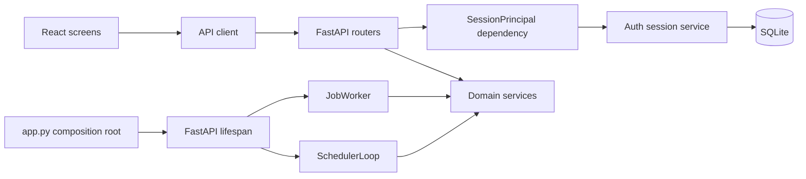
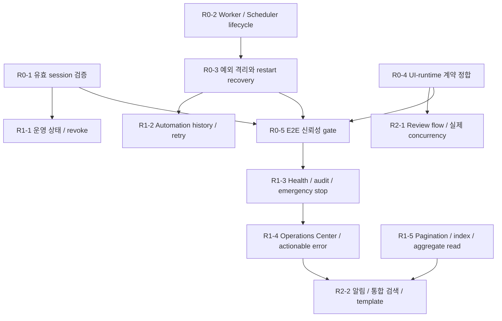

# Personal Agent Gateway 통합 서비스 개선 로드맵

## 현재 상태

- **SUCCESS**: 서비스 도메인, 사용자 여정, 유지보수·성능·보안 위험을 코드와 기존 문서 기준으로 정리했다.
- **SUCCESS**: R0 신뢰 기반 구현과 NOW Release Gate를 완료했다.
- **SUCCESS**: R1 운영 가능성 구현과 NEXT Release Gate를 완료했다.
- **SUCCESS**: 실제 사용 1회에서 확인된 PG-1 사용성 보정과 열린 탭 Browser Notification으로 R2 범위를 축소해 완료했다.
- Result package, Template, Search/Metrics, Review, Persona-local concurrency는 구현 근거가 없어 [R2 후속 제품 가설 backlog](2026-07-16-r2-deferred-product-backlog.md)로 분리했다.
- 이 문서는 신규 기능 wishlist가 아니라 **개발 PM과 기획 PM이 같은 순서로 의사결정하기 위한 실행 기준**이다.

## 목표

1. 외부에서 로컬 Agent를 실행해도 인증·중단·복구를 신뢰할 수 있다.
2. UI가 제공한다고 말하는 기능은 실제 runtime에서 동작한다.
3. 사용자가 실행 상태, 실패 원인, 결과 파일, 다음 행동을 한 흐름에서 이해한다.
4. 데이터가 늘어도 session/team/job/artifact 화면이 예측 가능한 시간에 응답한다.
5. 새 기능은 lifecycle, observability, test, recovery를 포함해 출시한다.

## 실행 플랜 문서

이 문서는 전체 우선순위와 Gate만 소유한다. 실제 파일 수정 순서와 검증 명령은 단계별 실행 플랜에서 관리한다.

| 단계 | 실행 플랜 | 현재 상태 | 시작 조건 |
| --- | --- | --- | --- |
| R0 | [신뢰 기반 실행 플랜](2026-07-15-r0-trust-foundation-execution-plan.md) | completed | 2026-07-15 NOW Release Gate 통과 |
| R1 | [운영 가능성 실행 플랜](2026-07-15-r1-operability-execution-plan.md) | completed | 2026-07-15 NEXT Release Gate 통과 |
| R2 | [제품 확장 실행 플랜](2026-07-15-r2-product-expansion-execution-plan.md) | completed (scoped) | 실제 사용 1회와 notification 수동 확인 |

## Architecture Review

### Current Structural Risks

| 위험 | 코드 근거 | 계획에 미치는 영향 |
| --- | --- | --- |
| 인증 정책 중복 | `app.py`와 Jobs, Teams, Personas, Rules, Team Runs API가 cookie 존재 검사 함수를 각각 가진다. | R0-1은 모든 router가 하나의 principal dependency를 사용하기 전 완료할 수 없다. |
| background lifecycle 무소유 | `app.py`는 `JobWorker`를 state에 저장하지만 시작하지 않고 `SchedulerLoop`는 만들지 않는다. | R0-2는 FastAPI lifespan과 app composition test를 함께 수정해야 한다. |
| Chat 승인과 Job 승인 소유권 분리 | Chat runtime은 `ApprovalStore`로 shell을 직접 실행하고 별도 Job row를 만들며, Job API는 `JobService` 승인 후 worker에 enqueue한다. | Worker 시작 전 Chat Job을 실행 queue로 볼지 이력 mirror로 볼지 결정해야 한다. |
| 제품 계약과 runtime 불일치 | `review_only`는 planning 후 종료되고 `_execute()`는 pending task 첫 항목만 순차 처리한다. | R0-4에서는 미구현 동작을 숨기고, 실제 Review/Concurrency는 R2까지 잠근다. |
| 대형 composition/container | `app.py`는 627줄, `GatewayApp`은 1,168줄이며 후자는 auth, fetch, SSE, 화면 명령을 함께 가진다. | 구조 분리는 R0 contract/E2E 이후 R1-6에서 점진 수행한다. |

### SOLID Review

#### Finding: 인증 principal이 하나의 정책 소유자를 가져야 한다

**Evidence**
- 로그인은 random cookie를 발급하지만 protected dependency는 값의 존재만 검사한다.
- 같은 검사가 여섯 위치에 중복돼 expiry와 revoke 정책을 일관되게 적용할 경계가 없다.

**Principle**
- SRP와 DIP: HTTP router는 session 검증 정책이나 저장 방식을 소유하지 않고 유효한 principal에 의존해야 한다.

**Recommendation**
- TOTP secret과 recovery code를 관리하는 기존 `AuthStore`는 유지한다.
- SQLite 기반 auth session service가 raw token의 hash, 발급·최근 사용·만료·폐기를 소유하고 공통 dependency는 `SessionPrincipal`을 반환한다.

**Refutation**
- Signed cookie만으로 더 작게 끝낼 수 있지만 idle expiry와 revoke all을 제공하려면 결국 server state가 필요하다. 이미 SQLite가 application state의 source of truth이므로 별도 서명+revocation 조합보다 hash session row가 작다.

**Plan Impact**
- R0 결정 D0-1과 실행 R0-A/R0-B, 모든 protected API test에 반영한다.

#### Finding: lifecycle은 새 manager가 아니라 composition root가 소유한다

**Evidence**
- Worker와 Scheduler는 이미 `start()`/`stop()`과 주입 가능한 service/runner를 가진다.
- 빠진 것은 클래스가 아니라 app startup, recovery, enqueue, shutdown의 연결이다.

**Principle**
- SRP: `app.py`는 composition root로서 component 수명주기를 조립하고, Worker/Scheduler는 실행 loop만 소유한다.

**Recommendation**
- FastAPI lifespan에서 DB recovery → queued enqueue → worker/scheduler start → graceful stop을 관리한다.
- 별도 `LifecycleManager`나 외부 queue는 추가하지 않는다.

**Refutation**
- Manager 추출은 이름상 깔끔하지만 현재 lifecycle consumer는 하나뿐이고 기존 start/stop API가 충분하다. app composition test가 복잡해질 때만 후속 추출을 검토한다.

**Plan Impact**
- R0-C/R0-D와 `tests/test_app_lifecycle.py`에 반영한다.

#### Finding: 구조 분리는 계약 안정화 뒤에 수행한다

**Evidence**
- 현재 가장 큰 실패는 파일 크기보다 forged session, 미기동 loop, UI-runtime 불일치다.
- 기존 unit/component test는 많지만 실제 app lifecycle을 보장하는 E2E가 빠져 있다.

**Principle**
- SRP 개선은 필요하지만, 보호할 계약 없이 먼저 추출하면 회귀 범위만 커진다.

**Recommendation**
- R0에서는 공통 principal, lifespan, capability response처럼 작업에 직접 필요한 경계만 만든다.
- Chat router와 frontend controller hook 추출은 R0-5 이후 R1-6에서 수행한다.

**Refutation**
- 선제 리팩터링이 이후 변경을 편하게 할 수 있지만, 현재 동작 자체가 잘못된 영역에서는 잘못된 계약을 고정할 위험이 더 크다.

**Plan Impact**
- R1-6 전까지 ORM, 외부 queue, global state library, 대규모 router 재배치를 금지한다.

### Design Pattern Candidates

| 압력 | 선택 | 보류/기각 이유 |
| --- | --- | --- |
| 모든 router의 동일 session 검증 | 공통 dependency + auth session service | 범용 Repository 계층은 기존 service-owned SQL과 중복된다. |
| Worker/Scheduler 수명주기 | FastAPI lifespan | Facade/LifecycleManager는 현재 consumer 하나에 과도하다. |
| HTTP 오류가 UI에서 `null`/`[]`로 소실 | R1의 `ApiError` adapter | R0에서는 backend 계약과 critical UI만 먼저 고친다. |
| Review/Execute mode 변형 | R2의 run-mode Strategy 후보 | 현재 실제 실행 variant가 하나이므로 R0에서 도입하지 않는다. |
| Browser/Webhook 알림 변형 | R2의 notification adapter 후보 | terminal event 계약이 안정되기 전에는 구현하지 않는다. |

### Dependency Direction

UI는 저장 방식이나 worker task를 직접 추론하지 않고 API가 제공한 principal, capability, health 계약만 사용한다.

### Test Strategy Alignment

- 기존 pytest service test는 상태 전이와 순수 domain 규칙을 계속 담당한다.
- `tests/test_app_lifecycle.py`는 `with TestClient(app)` 경계에서 startup/shutdown, recovery, queue 소비를 검증한다.
- Auth API test는 실제 login으로 발급한 cookie를 사용하고, 임의 문자열 cookie fixture를 단계적으로 제거한다.
- Frontend Vitest는 400/401/409/500 구분, capability 기반 disabled state, recovery CTA를 검증한다.
- R0-5에서 fake CLI/runner 기반 핵심 여정 E2E를 만들고 이후 구조 분리의 회귀 Gate로 사용한다.

### Plan Changes Applied

- R0/R1/R2를 별도 실행 플랜으로 분리하되 이 문서의 `TODO/LOCK/SUCCESS/FAIL` 상태와 Release Gate를 유지한다.
- R0 시작 전 세 가지 정책 결정과 Chat Job 소유권 확인을 추가했다.
- 구현 항목마다 파일 범위, 테스트, rollback 기준을 단계별 플랜에 고정했다.
- R1/R2는 선행 Release Gate가 열리기 전 `LOCK`으로 유지한다.
- R0는 SQLite session, FastAPI lifespan, sequential Team capability, Chat Job history mirror 계약으로 구현하고 전체 gate를 통과했다.
- 후속 실행 지시로 R1을 완료했고, R2는 사용자 결정에 따른 실제 사용 1회에서 확인된 PG-1과 R2-B 범위로 축소해 완료했다. 나머지 가설은 별도 backlog에 유지한다.

## 우선순위 원칙

- **Now**: 보안 또는 핵심 기능 계약이 깨진 항목. 다른 기능보다 먼저 완료한다.
- **Next**: 실행을 안정적으로 운영하고 결과를 판단하게 만드는 항목.
- **Later**: 반복 사용, 확장성, 고급 협업을 강화하는 항목.
- 일정은 코드 조사 전 확정하지 않고 `S/M/L` 상대 크기로만 관리한다.
- `Next`는 Now의 Release Gate를 모두 통과한 뒤 시작한다.

## 의존성 지도

## NOW — 신뢰 기반 복구

### R0-1. Server-validated session

| 항목 | 내용 |
| --- | --- |
| 문제 | 모든 protected API가 non-empty `agent_session` cookie를 유효 session으로 처리한다. |
| 사용자 가치 | OTP를 통과한 session만 로컬 실행 권한을 가진다. |
| 개발 범위 | session store 또는 signed session, absolute/idle expiry, logout, revoke all, login rate limit, 공통 auth dependency |
| 제품 범위 | 만료 안내, 재로그인 복귀, Settings의 session 상태와 revoke action |
| 크기 | M |
| 선행 조건 | 인증 방식 결정 ADR |

완료 기준:

- 임의 cookie와 만료/revoked cookie는 모든 protected API에서 `401`이다.
- 로그인 성공 session은 새로 발급되고 logout 즉시 무효화된다.
- idle/absolute 만료가 설정 가능하며 UI가 재로그인을 안내한다.
- login 실패 rate limit/backoff test가 있다.
- state-changing API의 Origin/CSRF 정책을 결정하고 검증한다.

### R0-2. JobWorker와 SchedulerLoop app lifecycle 연결

| 항목 | 내용 |
| --- | --- |
| 문제 | Job과 Schedule은 생성되지만 실제 worker/scheduler가 시작되지 않는다. |
| 사용자 가치 | Run now와 예약 작업이 실제로 실행된다. |
| 개발 범위 | FastAPI lifespan, worker/scheduler start-stop, queued recovery, due schedule claim, configured concurrency 처리 |
| 제품 범위 | 준비 전 생성 차단, worker/scheduler health 표시 |
| 크기 | M |
| 선행 조건 | single-process 실행 정책 확정 |

완료 기준:

- app lifespan 안에서 worker와 scheduler가 alive이고 shutdown 뒤 종료된다.
- manual/run-now queued job이 `running → succeeded/failed`로 전이한다.
- due schedule이 허용 지연 안에 정확히 한 Job을 만든다.
- restart 후 기존 queued/running Job 처리 정책이 test로 고정된다.
- `AGENT_JOB_WORKER_CONCURRENCY`가 실제 worker 수 또는 명시적 미지원 상태와 일치한다.

### R0-3. Background failure isolation

| 항목 | 내용 |
| --- | --- |
| 문제 | runner 예외가 JobWorker loop를 끝낼 수 있고 원인 log가 남지 않는다. |
| 사용자 가치 | 한 작업 실패가 뒤 작업을 멈추지 않으며 실패 원인을 확인할 수 있다. |
| 개발 범위 | per-job try/except, failed event, loop liveness, cancellation, structured error |
| 제품 범위 | Job detail의 원인·Retry·관련 설정 CTA |
| 크기 | S |
| 선행 조건 | R0-2 |

완료 기준:

- runner 예외 Job은 failed terminal 상태와 error event를 가진다.
- 다음 queued Job은 정상 실행된다.
- cancel/shutdown과 genuine failure가 서로 다른 상태로 기록된다.
- error message는 secret redaction을 통과한다.

### R0-4. 제품 문구와 runtime 계약 정합

| 항목 | 내용 |
| --- | --- |
| 문제 | Review Only, concurrent Max workers, Schedule 실행, Tunnel 상태가 실제와 다르다. |
| 사용자 가치 | 시작 전 결과·시간·권한을 정확히 예상한다. |
| 개발 범위 | 현재 runtime capability flag/API, validation, contract test |
| 제품 범위 | 미지원 기능 hide/disable, 정확한 label과 설명 |
| 크기 | S |
| 선행 조건 | review/concurrency 단기 정책 결정 |

완료 기준:

- 미구현 Review mode를 선택할 수 없거나 실제 review가 실행된다.
- worker UI가 `Sequential` 또는 실제 concurrency를 정확히 표시한다.
- Schedule은 worker/scheduler unhealthy 상태에서 실행 가능하다고 보이지 않는다.
- Settings는 실제 bind/cookie/worker/scheduler/CLI 상태를 표시한다.
- 위 계약을 backend/frontend test가 함께 검증한다.

### R0-5. 핵심 여정 E2E reliability gate

| 항목 | 내용 |
| --- | --- |
| 문제 | service 단위 test는 많지만 composition/lifecycle 단절을 탐지하지 못했다. |
| 사용자 가치 | 화면에서 시작한 핵심 작업이 실제 결과까지 도달한다. |
| 개발 범위 | tmp data와 fake CLI/runner 기반 app lifespan E2E |
| 제품 범위 | release checklist의 사용자 여정 정의 |
| 크기 | M |
| 선행 조건 | R0-1~R0-4 |

필수 시나리오:

- OTP login → Chat 실행 → SSE → terminal result.
- Team 생성/선택 → Run → task → summary → document 확인.
- Schedule due/run-now → Job → runner → artifact.
- gateway restart → Team interrupted → Resume.
- invalid/expired auth, model timeout, runner failure에서 actionable error.

## NOW Release Gate

- [x] 임의 session cookie 접근 차단
- [x] worker와 scheduler 실제 기동
- [x] background exception 후 다음 작업 실행
- [x] UI와 runtime mode/concurrency 계약 일치
- [x] 핵심 세 여정 E2E 통과
- [x] backend/frontend/lint/build CI 필수화

## NEXT — 운영 가능성과 결과 판단

### R1-1. Security operations

- Session 목록, 현재 기기/시각, revoke all.
- Secure cookie와 tunnel/HTTPS 상태 진단.
- Restricted/Full Access Mode의 명시적 선택과 외부 path/artifact 정책.
- gateway 전용 OS 사용자와 Cloudflare Access setup check.

크기: M, 의존: R0-1.

### R1-2. Automation history와 Retry

- Schedule detail에 실행 Job history와 success rate를 연결한다.
- Job input을 보존한 Retry와 실패 분류를 제공한다.
- 다음 3회 실행 시각과 timezone preview를 표시한다.
- duplicate claim과 delayed run을 로컬 지표로 기록한다.

크기: M, 의존: R0-2, R0-3.

### R1-3. Health, audit, emergency stop, backup

- `/health/live`, `/health/ready`에서 DB, worker, scheduler, CLI를 구분한다.
- 기존 Observability spec을 기준으로 append-only audit와 correlation ID를 구현한다.
- Chat, Team, Job queue/process를 한 번에 중단하는 emergency stop을 제공한다.
- SQLite/auth/session/artifact manifest backup과 restore dry-run을 제공한다.
- 오류를 삼키는 global handler 대신 local structured log를 남긴다.

크기: L, 의존: R0-5.

### R1-4. Operations Center와 actionable errors

- running, waiting approval, interrupted, failed 상태를 도메인 통합 목록으로 보여준다.
- 각 row에서 Stop, Resume, Retry, 관련 화면 이동을 제공한다.
- API client가 status/detail/retryability를 보존한다.
- 오류 문구는 원인, 다음 행동, 데이터 보존 여부를 포함한다.

크기: L, 의존: R1-3.

### R1-5. Read performance baseline과 개선

- session/history/activity/jobs/team/artifacts에 기본 limit과 cursor를 둔다.
- transcript session metadata index를 추가한다.
- Team detail aggregate read model과 SSE delta 적용을 검토한다.
- `team_run_id`, `status`, `created_at`, `next_run_at` query plan을 기준으로 index를 추가한다.
- activity/job event retention 또는 archive 정책을 정한다.

크기: L, 의존: 성능 fixture와 budget 합의.

### R1-6. 점진적 구조 분리

- 공통 auth principal dependency를 먼저 추출한다.
- `app.py`에서 Chat session router를 이동한다.
- `GatewayApp`에서 bootstrap/session/team controller hook을 순서대로 추출한다.
- 화면별 fetch error/cancel/retry 규칙을 통일한다.

크기: L, 의존: R0 contract test.

## NEXT Release Gate

- [x] 소유자가 worker/scheduler/CLI/DB 준비 상태를 한 화면에서 확인
- [x] 실패한 실행에 원인과 복구 action 존재
- [x] 모든 위험 실행이 audit actor/session/run/task와 연결
- [x] emergency stop과 backup/restore 검증
- [x] 합의된 fixture에서 list/detail 성능 budget 통과
- [x] 대형 container 분리 전후 행동 회귀 없음

## LATER — 반복 사용과 확장

### R2-1. 실제 Review flow와 bounded concurrency

- Review target을 path, artifact, diff 중 하나로 명시한다.
- finding severity와 verification checklist를 결과 계약으로 둔다.
- `max_workers`를 semaphore 기반 bounded concurrency에 연결한다.
- 같은 workspace를 수정하는 task의 충돌 정책을 정한다.
- 비용/부하 상한과 cancel propagation을 검증한다.

### R2-2. 완료 알림 — SUCCESS (축소 범위)

- 열린 Gateway 탭의 opt-in Browser Notification을 제공한다.
- Prompt, command, output, summary, error, local path 등 민감 내용을 표시하지 않는다.
- 현재 실제 event인 completed/failed만 알리고 해당 Team Run으로 이동한다.
- Webhook, service worker, 닫힌 페이지 delivery는 후속 실제 근거 전까지 backlog에 둔다.

### R2-3. Reusable work template

- Team, run mode, goal prompt, output checklist를 template으로 저장한다.
- 최근 성공 Run에서 template을 만들 수 있게 한다.
- starter template은 사용자 확인 후 복제하며 system default를 강제하지 않는다.

### R2-4. Result package와 global search

- Run별 summary, tasks, changed files, verification, artifacts/documents를 index로 묶는다.
- session/run/task/document/artifact를 source/status/date/agent로 검색한다.
- Run 삭제가 result와 workspace에 미치는 영향을 preview한다.

### R2-5. Local-only product metrics

- content 없이 ID, status, duration, recovery, count만 집계한다.
- Work success, recovery success, schedule reliability, inspection time을 표시한다.
- retention과 export/delete를 사용자가 제어한다.

## 통합 체크리스트

| 상태 | 작업 | 주 책임 | 검증 |
| --- | --- | --- | --- |
| SUCCESS | 서비스 도메인 및 위험 baseline 작성 | 개발 PM + 기획 PM | 도메인 지도와 역할별 진단 연결 |
| SUCCESS | R0-1 session 신뢰 경계 구현 | Backend | forged/expired/revoked session test |
| SUCCESS | R0-2 worker/scheduler lifecycle | Backend | app lifespan composition test |
| SUCCESS | R0-3 background exception 격리 | Backend | worker/scheduler resilience test |
| SUCCESS | R0-4 UI-runtime 계약 정합 | Product + Frontend + Backend | contract test와 UI copy review |
| SUCCESS | R0-5 핵심 E2E gate | QA + Development | full backend/frontend gate |
| SUCCESS | R1 운영·관측·성능 | Development + Product | NEXT full gate |
| SUCCESS | R2 실제 사용 기반 slice | Product + Development | PG-1 + R2-B + 수동 알림 확인 |
| LOCK | R2 후속 제품 가설 | Product + Development | 항목별 실제 사용 근거와 결정 필요 |

## PM 운영 방식

### 주간 backlog review

1. Critical/High 운영 incident와 contract gap을 먼저 확인한다.
2. local-only 지표와 실제 사용 기록으로 사용자 마찰을 확인한다.
3. 한 항목에 개발 완료 기준과 사용자 성공 기준을 함께 적는다.
4. 실행하지 않는 UI 기능과 사용하지 않는 config가 생기지 않았는지 확인한다.
5. 완료된 항목은 관련 knowledge/flow/ADR 문서로 승격한다.

### 항목별 Definition of Ready

- 사용자 문제와 영향 도메인이 명확하다.
- source of truth와 lifecycle owner가 정해졌다.
- 실패, cancel, restart 동작이 정의됐다.
- 보안·데이터 경계와 UI 문구가 합의됐다.
- fake 기반 검증과 실제 smoke 검증 방법이 있다.

### 항목별 Definition of Done

- API, runtime, UI 설명이 같은 계약을 사용한다.
- 정상·오류·중단·재시작 test가 있다.
- observability와 user-facing recovery action이 있다.
- 성능 상한 또는 pagination/retention 정책이 있다.
- 운영 문서와 registry가 갱신됐다.

## 재검토 조건

- gateway가 둘 이상의 사용자 또는 PC를 지원한다.
- 둘 이상의 process/worker가 같은 SQLite를 사용한다.
- Team task가 서로 같은 파일을 실제로 병렬 수정한다.
- 외부 webhook, hosted tunnel, cloud storage가 기본 기능이 된다.
- local data가 합의한 성능 fixture를 넘는다.

이 조건에서는 single-user, single-process, local-first 전제를 다시 검토하고 별도 ADR을 작성한다.

## 관련 문서

- [서비스 도메인 지도](../knowledge/2026-07-15-service-domain-map.md)
- [개발 PM 유지보수성 진단](../reports/2026-07-15-development-pm-maintainability-assessment.md)
- [기획 PM 사용성·기능 기회](../reports/2026-07-15-product-pm-usability-opportunities.md)
- [R1 운영 가능성 구현 보고서](../reports/2026-07-15-r1-operability-implementation.md)
- [Operations 진단 가이드](../knowledge/2026-07-15-operations-diagnostics-guide.md)
- [Full Access Mode Security Operating Model](../knowledge/2026-07-08-full-access-security-operating-model.md)
- [Observability and Audit Log Spec](../specs/2026-07-08-observability-audit-log-spec.md)
