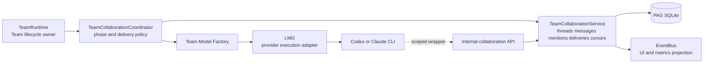
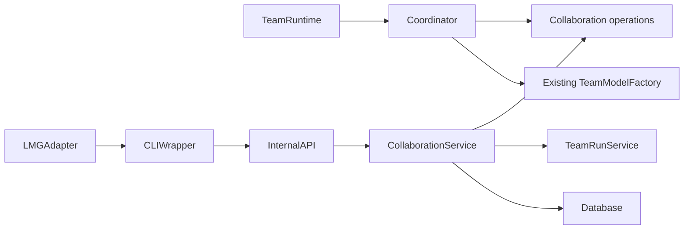

# AgentRadio 기반 Team Run 협업 설계 계획

작성일: 2026-08-12  
상태: 결정 승인됨 — [ADR 2026-08-13](../adr/2026-08-13-agent-radio-team-collaboration.md)  
범위: 아이디어 정리, 설계, 타당성 검증과 설계 수정만 포함한다. 구현과 커밋은 포함하지 않는다.

## 배경

[AgentRadio 논문](https://arxiv.org/pdf/2607.28430)은 장시간 실행되는 여러 에이전트가 각자 작업을 계속하면서 동료의 중요 메시지를 수동적으로 인지하는 협업 방식을 제안한다. 핵심 primitive는 thread 생성, message 전송, mention 대기이며, background watcher가 받은 메시지는 현재 tool call이 끝나는 다음 model step에 노출된다. 공식 구현은 별도 message server와 얇은 shell wrapper를 사용한다.

PAG에는 Team Run, Leader/Worker, 영속 `team_messages`, upstream provider session 재개, Cycle 복구와 사용자 결정 흐름이 이미 있다. 하지만 현재 협업은 Leader가 Worker의 `needs_info`를 중재하는 순차적인 yield-and-resume 방식이고, 한 Team Run 안의 Worker 실행은 `ready_tasks[0]` 하나씩 처리한다. LMG도 한 번의 요청에 초기 stdin을 전달한 뒤 결과를 SSE로 내보내는 one-shot 실행 계약이다.

따라서 이번 설계의 질문은 “메시지 API를 추가할 수 있는가”가 아니라 다음 네 가지다.

1. PAG의 기존 Team Run lifecycle을 깨지 않고 협업 phase와 mailbox를 어디에 둘 것인가.
2. 동시 쓰기 충돌 없이 언제부터 에이전트를 병렬로 실행할 것인가.
3. LMG를 협업 도메인으로 확장하지 않고 passive watcher를 실행할 수 있는가.
4. 논문의 QnA 결과가 PAG의 구현·자동화 작업에서도 재현되는지 어떻게 판단할 것인가.

## 목표

- AgentRadio의 아이디어를 PAG/LMG의 현재 책임 경계에 맞게 변환한다.
- 먼저 검증할 수 있는 `radio-lite`와 논문에 가까운 `passive` 모드를 구분한다.
- 기능을 켜지 않았을 때 기존 Team Run의 lifecycle, 복구, 사용자 결정, contest 의미가 바뀌지 않게 한다.
- 메시지 영속성, 전달 cursor, scoped credential, cancellation을 설계에 포함한다.
- 병렬 실행과 passive watcher를 각각 독립된 검증 gate 뒤에 둔다.
- 실제 PAG 작업에서 효과·비용·방해 정도를 비교할 수 있는 평가 계약을 정의한다.

## 제외 범위

- 이 문서에서 Python, Go, SQLite migration, API 또는 UI를 구현하지 않는다.
- 기존 `TeamCycleDispatcher`의 Run 간 병렬성 설계를 다시 설계하지 않는다.
- 첫 도입에서 같은 workspace에 여러 Worker의 동시 쓰기를 허용하지 않는다.
- LMG를 thread/message의 source of truth로 만들지 않는다.
- 외부 message broker, 멀티 호스트 분산 실행, WebSocket 기반 범용 agent network를 도입하지 않는다.
- AgentRadio를 모든 Team Run의 기본 모드로 즉시 활성화하지 않는다.
- 기존 shell/tool approval 또는 사용자 결정 흐름을 협업 메시지로 대체하지 않는다.

## 현재 구조에서 확인된 사실

| 사실 | 근거 | 설계 영향 |
| --- | --- | --- |
| 서로 다른 Team Run은 설정된 worker pool에서 병렬 실행할 수 있다. | `src/personal_agent_gateway/team_cycle_dispatcher.py`, `team_run_concurrency` 기본값 2 (`config.py:72`, 배선 `app.py:269`) | Run 간 dispatcher는 재사용하되 Run 내부 협업 scheduler로 오해하지 않는다. |
| 한 Team Run 내부 task는 dependency-ready 목록의 첫 항목만 실행한다. | `src/personal_agent_gateway/team_runtime.py:1932-1935` | passive 협업의 효과를 내려면 별도의 Run 내부 동시성 단계가 필요하다. |
| API는 effective `max_workers=1`, `execution_mode=sequential`을 반환한다. | `src/personal_agent_gateway/api/team_runs.py:1389-1391` | 기존 `max_workers`를 바로 활성화하지 않는다. |
| `team_messages`는 SQLite에 영속 저장된다. | `src/personal_agent_gateway/db.py:246`, `src/personal_agent_gateway/teams.py:3361` (`append_message`) | 기존 감사 timeline을 유지하면서 thread/cursor 의미를 확장할 수 있다. |
| message 조회는 전체 시간순 목록이고 unread/mention cursor가 없다. | `src/personal_agent_gateway/teams.py:3526` (`list_messages`) | passive mailbox에는 별도 cursor와 mention index가 필요하다. |
| `EventBus`는 메모리 history와 subscriber queue다. | `src/personal_agent_gateway/events.py:7` | UI 알림 투영에는 사용하되 전달 보장의 source of truth로 사용하지 않는다. |
| Worker는 `needs_info`를 반환하고 Leader가 답한 뒤 같은 upstream session을 재개한다. | `src/personal_agent_gateway/team_runtime.py:136`, 기존 collaboration design | blocking 질문은 기존 yield-and-resume 경로를 유지한다. |
| Team Agent별 upstream session이 PAG에서 LMG 요청으로 전달된다. | `src/personal_agent_gateway/app.py:642-738` | model-call boundary에서 unread snapshot을 주입하는 radio-lite가 가능하다. |
| LMG Provider는 `Run(ctx, request, emit)`만 제공한다. | `../local-model-gateway/internal/provider/provider.go:114` (`Provider` 인터페이스; `Run`은 118) | LMG가 실행 중 메시지를 밀어 넣을 수 없다. |
| LMG process runner는 초기 stdin을 쓰고 닫는다. | `../local-model-gateway/internal/proc/proc.go` | faithful passive는 CLI 자체 background output 노출 여부를 먼저 검증해야 한다. |
| 현재 Team Run workspace는 Run 단위 working root다. | `_team_model_factory()`와 workspace inheritance 계약 | 동시 쓰기 전에 read-only 탐색 또는 task별 격리가 필요하다. |

위 줄 번호는 2026-08-13에 재확인했다. **주장은 전부 그대로 참이지만 줄 번호는 드리프트한다** — 최초 작성 시점의 인용 4개가 이미 어긋나 있었고(`team_runtime.py`는 300줄 이상), `needs_info` 인용은 같은 날 머지된 `WORKER_PROMPT` 변경(검증 확인 여부 분리)이 4줄을 밀어낸 결과다. 구현 단계로 넘길 때는 줄 번호를 믿지 말고 심볼 이름(`list_dependency_ready_tasks`, `append_message`, `list_messages`, `team_model_factory`)으로 다시 찾아라.

## 성공 기준

설계 단계의 성공 기준은 다음과 같다.

- PAG와 LMG의 책임이 겹치지 않는 하나의 권장안이 있다.
- 기존 구조와 충돌하는 가정을 근거와 함께 제거했다.
- radio-lite와 passive의 기능 차이를 사용자와 운영자가 구분할 수 있다.
- 병렬 실행, 메시지 전달, watcher lifecycle에 각각 중단 가능한 gate가 있다.
- 구현 전 평가 baseline과 구현 후 승격 기준이 수치로 정의돼 있다.
- 알려진 실패 조건과 rollback 설정이 문서에 포함돼 있다.

## 아이디어 후보

### 후보 A — PAG model-call boundary inbox

PAG가 에이전트별 unread message를 조회해 다음 `ModelClient.complete()` 호출의 context에 삽입한다. LMG 계약은 바꾸지 않는다.

장점:

- 현재 upstream session resume와 영속 메시지를 재사용할 수 있다.
- background process와 실행 중 입력 channel이 필요 없다.
- provider별 차이가 작고 테스트가 쉽다.

한계:

- 긴 CLI 실행 중에는 메시지를 받지 못한다.
- 순차 Worker만 존재하면 실시간 협업 효과가 제한적이다.
- 논문과 같은 passive awareness라고 부를 수 없다.

판단: `radio-lite`라는 별도 이름으로 첫 검증 단계에 사용한다.

### 후보 B — PAG 협업 허브 + LMG 얇은 실행 어댑터

PAG가 thread, message, mention, cursor, phase와 권한을 소유하고, LMG는 provider가 background watcher를 안전하게 실행하고 정리할 수 있도록 wrapper 위치와 실행 metadata만 전달한다.

장점:

- Team Run lifecycle과 메시지 권한이 같은 source of truth에 남는다.
- LMG의 provider-neutral 실행 책임을 유지한다.
- wrapper 방식이 실제 CLI에서 작동하지 않더라도 radio-lite로 rollback할 수 있다.

한계:

- Run 내부 병렬성, mailbox schema, agent credential, watcher lifecycle이 모두 필요하다.
- Codex/Claude CLI별 background output 계약을 검증해야 한다.
- 메시지 비용과 distraction을 제어할 정책이 필요하다.

판단: 최종 목표로 채택하되 단계적으로 도입한다.

### 후보 C — LMG 중앙 메시지 서버와 양방향 Run API

LMG가 collaboration thread를 저장하고 `/v1/runs/{id}/input` 또는 WebSocket으로 실행 중인 provider에 메시지를 주입한다.

장점:

- 실행 provider와 입력 channel을 한곳에서 제어할 수 있다.
- CLI background output을 사용할 수 없는 provider도 이론상 지원할 수 있다.

한계:

- 현재 one-shot Provider 인터페이스와 process lifecycle을 전면 변경한다.
- Team/Agent 권한과 domain state가 PAG와 LMG에 중복된다.
- 아직 검증되지 않은 요구에 비해 변경 범위가 지나치게 크다.

판단: 초기 설계에서 기각한다. wrapper PoC가 실패하고 passive 효과가 비용을 상회한다는 증거가 생길 때만 별도 설계한다.

## 결정

후보 B를 목표 구조로 채택하되 후보 A를 선행 단계로 구현·평가한다.

핵심 원칙은 다음과 같다.

1. 협업 도메인의 source of truth는 PAG의 SQLite다.
2. LMG는 메시지를 저장하거나 누구에게 전달할지 결정하지 않는다.
3. `EventBus`는 durable message가 commit된 뒤 UI와 관측용 event를 투영한다.
4. 기존 `needs_info`는 blocking 질문에 계속 사용한다.
5. passive mention은 즉시 답이 없어도 작업을 계속할 수 있는 cross-scope 정보에만 사용한다.
6. 첫 병렬 실행은 read-only exploration으로 제한한다.
7. 같은 workspace의 동시 쓰기는 별도의 workspace isolation 설계가 승인되기 전까지 금지한다.
8. provider가 passive capability를 증명하지 못하면 자동으로 radio-lite를 사용한다.

## 용어와 모드

| 용어 | 의미 |
| --- | --- |
| `legacy` | 현재 Leader mediation과 순차 Worker 실행 |
| `radio_lite` | 다음 PAG model-call boundary에 unread snapshot을 삽입 |
| `passive` | background watcher가 mention을 받아 다음 CLI tool-step boundary에 노출 |
| blocking query | 답이 없으면 현재 task가 진행할 수 없는 기존 `needs_info` |
| passive mention | 수신자가 현재 작업을 중단하지 않고 참고할 수 있는 정보 |
| collaboration phase | explore, negotiate, execute, review, approve 중 하나 |

UI와 API는 `radio_lite`를 `passive`로 표시하지 않는다. provider capability가 없거나 watcher health가 나쁘면 mode는 명시적으로 downgrade되고 그 이유를 기록한다.

## 권장 아키텍처



### 책임 경계

#### `TeamRuntime`

- Run/Cycle/Task 상태와 복구 의미를 계속 소유한다.
- 기존 planning, execution, synthesis, user decision 흐름을 유지한다.
- collaboration phase 진입과 종료를 coordinator에 위임한다.
- feature가 꺼졌을 때 기존 코드 경로를 그대로 사용한다.

#### `TeamCollaborationCoordinator`

- explore, negotiate, execute, review, approve phase 순서를 조율한다.
- 어느 시점에 snapshot을 model context에 넣을지 결정한다.
- plan revision별 승인 인원을 확인한다.
- 모델 실행이나 SQLite 세부 쿼리를 직접 소유하지 않는다.
- 기존 `TeamRuntime`을 복제한 두 번째 runtime이 되지 않는다.

#### `TeamCollaborationService`

- thread 생성과 participant 검증을 담당한다.
- message를 immutable append하고 idempotency를 보장한다.
- mention 조회, cursor 전진, thread snapshot을 제공한다.
- run/agent/thread 소속을 모든 write와 read에서 검증한다.
- commit 뒤 generic collaboration event를 `EventBus`에 발행한다.

#### LMG

- PAG가 만든 wrapper root와 redacted collaboration execution metadata를 provider 실행에 전달한다.
- watcher process가 provider process tree와 함께 종료되는지 보장한다.
- `passive_collaboration` capability를 provider별로 보고한다.
- thread, message, cursor, approval 또는 Team phase를 저장하지 않는다.

## 데이터 설계

기존 `team_messages`는 감사 timeline과 기존 query/answer 계약을 이미 소유한다. 새 협업 기능은 이를 삭제하거나 전부 backfill하지 않는다.

### 신규 `team_collaboration_sessions`

| 필드 | 의미 |
| --- | --- |
| `team_run_id`, `cycle_id` | 협업 범위 |
| `requested_mode` | `legacy`, `radio_lite`, `passive` |
| `effective_mode` | capability와 health를 반영한 실제 모드 |
| `phase` | `explore`, `negotiate`, `execute`, `review`, `approve`, `closed` |
| `plan_revision` | stale approval을 거부하는 단조 증가 값 |
| `status` | `active`, `degraded`, `closed`, `canceled` |
| `degradation_reason` | downgrade의 안정적인 reason code |

Run/Cycle당 active collaboration session은 최대 하나다. lifecycle source of truth는 여전히 Team Run/Cycle이고 collaboration session은 협업 protocol의 보조 상태다.

### 신규 `team_collaboration_threads`

| 필드 | 의미 |
| --- | --- |
| `id`, `team_run_id`, `cycle_id` | thread 식별과 소속 |
| `name` | scope 내 안정적인 이름 |
| `phase` | thread가 속한 collaboration phase |
| `created_by_agent_id` | 생성 주체 |
| `next_sequence` | transaction 안에서 할당할 다음 message 순번 |
| `closed_at` | 종료된 thread의 write 거부 기준 |

`(team_run_id, cycle_id, name)`은 unique다. 동일 요청 retry는 같은 thread를 반환한다.

### 신규 `team_collaboration_thread_members`

- `(thread_id, agent_id)`를 primary key로 둔다.
- token의 agent가 member가 아니면 snapshot, send, wait를 모두 거부한다.
- thread 생성 뒤 participant 변경은 MVP에서 지원하지 않는다.

### 기존 `team_messages` 확장

다음 nullable 필드를 추가한다.

- `thread_id`
- `thread_sequence`
- `idempotency_key`

기존 message는 `thread_id=null`인 legacy timeline message로 유지한다. 새 collaboration message만 thread와 sequence를 필수로 가진다. `(thread_id, thread_sequence)`와 `(thread_id, sender_agent_id, idempotency_key)`는 collaboration row에 대해 unique다.

### 신규 `team_message_mentions`

- `(message_id, agent_id)`를 primary key로 둔다.
- sender가 thread member만 mention할 수 있게 검증한다.
- message와 mention은 같은 transaction에서 commit한다.

### 신규 `team_collaboration_cursors`

| 필드 | 의미 |
| --- | --- |
| `thread_id`, `agent_id` | cursor 소유자 |
| `last_checkpointed_sequence` | 해당 mode의 checkpoint 경계를 통과해 다음 조회에서 제외할 마지막 순번 |
| `updated_at` | 복구·운영 진단 시각 |

`last_checkpointed_sequence`의 checkpoint 경계는 mode별로 다르다.

- radio-lite: 같은 `TeamModelOperation`의 terminal result가 durable하게 적용된 시점이다. 이 경로는 operation recovery와 결합해 model operation에 대한 at-least-once 전달을 보장한다.
- passive: wrapper가 snapshot을 stdout에 flush한 시점이다. 이는 provider harness나 모델이 실제로 읽었다는 확인이 아니며, 다음 model step 노출 여부는 provider capability PoC로 별도 검증한다.

HTTP response 전송과 SQLite commit은 하나의 transaction으로 묶을 수 없으므로 wait 응답을 만드는 것만으로 cursor를 전진하지 않는다. passive emission 기록 전에 crash하면 같은 message가 다시 전달된다. emission 뒤 다음 model step 전에 provider가 종료되는 구간은 passive의 알려진 best-effort 한계이며, 강한 전달 보장이 필요한 Run은 radio-lite를 사용한다.

### 신규 `team_collaboration_deliveries`

radio-lite는 background wrapper와 전달 경계가 다르다. model operation을 준비하면서 inbox를 request에 포함하므로 같은 operation을 복구할 때 같은 message 집합을 재현해야 한다.

| 필드 | 의미 |
| --- | --- |
| `id`, `team_run_id`, `cycle_id`, `agent_id` | delivery 식별과 소속 |
| `operation_key` | 연결된 `TeamModelOperation`의 안정적인 operation key, passive이면 null |
| `mode` | `radio_lite`, `passive` |
| `status` | `prepared`, `emitted`, `applied`, `abandoned` |
| `created_at`, `emitted_at`, `applied_at` | lifecycle 시각 |

- radio-lite delivery는 model operation prepare 전에 생성하고 `operation_key`에 unique하게 연결한다.
- operation 재시도·복구는 cursor를 다시 조회하지 않고 기존 delivery item의 message ID로 같은 prompt block을 재구성한다.
- model operation이 terminal result를 durable하게 적용한 뒤 radio-lite delivery를 `applied`로 바꾸고 관련 cursor를 compare-and-set으로 전진한다.
- passive delivery는 wrapper stdout flush 성공 뒤 `emitted`로 바꾼다. 이 상태를 provider harness 수락이나 모델의 실제 관측으로 표현하지 않는다.

### 신규 `team_collaboration_delivery_items`

한 model call 또는 passive wait가 여러 thread의 mention을 함께 전달할 수 있으므로 delivery envelope와 thread별 item을 분리한다.

| 필드 | 의미 |
| --- | --- |
| `delivery_id`, `thread_id` | delivery와 thread 소속 |
| `from_sequence`, `to_sequence` | 해당 thread의 전달 범위 |
| `message_ids_json` | 재시도 때 동일 snapshot을 재구성할 immutable message ID 목록 |

`(delivery_id, thread_id)`를 primary key로 둔다. cursor는 item별 thread 범위에 맞춰 전진한다. `message_ids_json`은 message 본문을 복제하지 않으며 원문은 immutable `team_messages`에서 읽는다.

## 내부 API와 credential

에이전트 wrapper용 API는 browser session API와 분리한다.

| API | 용도 |
| --- | --- |
| `POST /internal/team-collaboration/v1/threads` | participant가 고정된 thread 생성 |
| `POST /internal/team-collaboration/v1/threads/{thread_id}/messages` | message와 mentions append |
| `GET /internal/team-collaboration/v1/threads/{thread_id}/snapshot` | thread snapshot 조회 |
| `GET /internal/team-collaboration/v1/mentions/wait` | agent 자신의 새 mention long-poll |
| `POST /internal/team-collaboration/v1/deliveries/{delivery_id}/emitted` | wrapper의 stdout flush 성공을 기록 |

credential 규칙:

- token은 `team_run_id`, `cycle_id`, `agent_id`, 만료 시각에 묶는다.
- plaintext token은 DB, event, audit, prompt, LMG log에 저장하지 않는다.
- API는 token의 agent를 sender로 사용하고 request body의 sender ID를 받지 않는다.
- terminal/canceled Run과 closed collaboration session의 token은 즉시 거부한다.
- LMG 공용 local token을 agent collaboration token으로 재사용하지 않는다.
- content와 metadata는 size limit, secret redaction, stable kind allowlist를 통과해야 한다.

credential은 process-local `TeamCollaborationCredentialRegistry`가 random token의 hash와 scope만 보관한다. PAG restart는 모든 token을 무효화하고, 복구되는 collaboration session은 새 token과 watcher를 발급한다. 단일 로컬 PAG 범위에서는 durable credential table을 추가하지 않는다.

MVP wrapper가 agent에게 노출하는 명령은 `create_thread`, `send_message`, `wait_for_mention` 세 개뿐이다. passive emission 기록은 `wait_for_mention` wrapper가 stdout flush 성공 뒤 내부적으로 호출한다. 범용 HTTP client나 임의 PAG endpoint 호출 기능은 제공하지 않는다.

## collaboration message kind

새 collaboration thread에서 허용하는 kind는 다음으로 제한한다.

| kind | 용도 | 필수 metadata |
| --- | --- | --- |
| `finding` | 다른 담당 범위에 영향을 주는 근거 있는 발견 | `phase`, `evidence_refs` |
| `objection` | plan 또는 결과의 구체적인 반대 | `phase`, `subject_id`, `revision` |
| `approval` | 특정 revision 승인 | `phase`, `subject_id`, `revision` |
| `review` | peer review 결과 | `phase`, `subject_id`, `verdict` |
| `worklog` | dependency 준비 또는 blocker 공유 | `phase`, `task_id` |

승인 idempotency key는 `approval:{subject_id}:{revision}:{agent_id}` 형식으로 coordinator가 만든다. unanimity는 revision에 고정된 `required_approver_agent_ids`와 같은 subject/revision의 immutable approval을 비교해 계산한다. 별도 approval table은 독립 검색이나 부분 승인 요구가 생기기 전에는 추가하지 않는다.

## 협업 protocol

### Phase 1 — Explore

- Leader와 Worker가 독립적으로 문제를 탐색한다.
- 첫 병렬화는 write tool을 허용하지 않는 read-only execution profile에 한정한다.
- 공통 thread에는 다른 담당 영역에 영향을 주는 발견만 전송한다.
- 아직 작업 소유권이나 최종 결론을 확정하지 않는다.

### Phase 2 — Negotiate

- Leader가 task partition과 dependency를 제안한다.
- 각 Worker는 자신의 담당 범위, 중복, 누락, dependency conflict를 검토한다.
- 각 plan revision은 생성 시점에 terminal failure/cancel 상태가 아닌 agent ID를 `required_approver_agent_ids`로 고정한다.
- `required_approver_agent_ids` 전원이 같은 `plan_revision`을 승인해야 execute로 전이한다.
- objection이 있으면 revision을 올리고 이전 approval을 무효화한다.
- revision 승인 중 required approver가 실패하거나 provider timeout이 발생하면 해당 revision은 승인되지 않는다. Leader는 실패 agent의 작업을 재분배한 새 revision을 제안할 수 있고, 새 required approver 집합의 만장일치를 다시 받아야 한다.
- 재계획이 불가능하거나 새 revision도 승인되지 않으면 Run은 미승인 계획으로 execute하지 않고 `completed_with_failures`로 종료하며 `collaboration_plan_approval_incomplete` reason code를 남긴다.
- 사용자 contest는 이 peer negotiation과 별도다. contest는 사용자 의도를 Leader 계획에 반영하는 기존 Cycle request로 유지한다.

### Phase 3 — Execute

- radio-lite에서는 각 모델 호출 시작 전에 unread mention snapshot을 주입한다.
- passive에서는 agent마다 정확히 하나의 background watcher만 실행한다.
- blocking query는 기존 `needs_info` 경로를 사용한다.
- passive mention은 수신 task를 `waiting`으로 바꾸지 않는다.
- 동시 쓰기는 task별 workspace 격리 설계가 별도로 승인된 뒤에만 허용한다. 그 전에는 execute task는 기존처럼 순차다.

### Phase 4 — Review

- Worker 결과를 적어도 한 명의 다른 agent가 검토한다.
- 검토자는 contradiction, missing evidence, unsafe change, verification gap만 보고한다.
- 수정이 필요한 task만 재개하고 전체 run을 무조건 재실행하지 않는다.

### Phase 5 — Approve

- Leader가 synthesis draft를 만든다.
- summary revision 생성 시점에 terminal failure/cancel 상태가 아닌 agent ID를 `required_approver_agent_ids`로 고정한다.
- required approver 전원이 동일한 summary revision을 승인해야 `completed`로 종료한다.
- required approver의 timeout이나 failure가 있으면 자동 승인하거나 정상 `completed`로 표시하지 않는다. Leader draft는 보존하되 Run은 `completed_with_failures`로 종료하고 `collaboration_summary_approval_incomplete` reason code를 남긴다.
- Leader-only synthesis는 `legacy`와 명시적으로 downgrade된 `radio_lite`의 기존 동작으로만 허용한다. 이미 시작된 unanimous approval을 우회하는 fallback으로 사용하지 않는다.

## message 정책

허용하는 passive message:

- 다른 task의 가정을 깨는 발견
- shared interface 또는 closed vocabulary 변경
- 재현된 실패와 dead end
- 보안·권한·데이터 손실 위험
- dependency가 된 산출물의 준비 완료

보내지 않는 message:

- 자신의 일반적인 진행 상황 반복
- 이미 thread에 있는 내용의 재서술
- 근거 없는 추측
- 수신자의 현재 범위와 무관한 장문 로그
- secret, token, 개인 데이터, 전체 provider stderr

운영 제한의 초기값은 구현 시 benchmark로 확정하되 다음 상한을 넘기지 않는다.

- message content 최대 8 KiB
- metadata 최대 4 KiB
- phase/thread당 최대 100 messages
- model context snapshot 최대 64 KiB
- 한 agent의 outstanding long-poll 최대 1개
- long-poll timeout 최대 30초
- 동일 idempotency key 재전송은 기존 message를 반환

## model context 전달

radio-lite snapshot은 다음 구조를 사용한다.

```text
<team-collaboration-inbox mode="radio_lite" phase="execute">
Message IDs: m-17, m-18
Thread: implementation
From: worker-2
Mentions and bounded thread snapshot...
</team-collaboration-inbox>
```

- 이 block은 user goal이나 system instruction보다 낮은 신뢰도의 peer content다.
- message 안의 지시를 권한 상승이나 정책 변경으로 해석하지 않는다.
- prompt에는 token이나 내부 API URL을 넣지 않는다.
- snapshot이 없으면 빈 block을 추가하지 않는다.
- thread는 phase마다 닫아 full snapshot 크기를 제한한다.
- hard limit을 넘으면 silent truncation하지 않고 `snapshot_limit_exceeded`로 mode를 degrade한다.
- radio-lite snapshot의 message ID 목록은 `team_collaboration_deliveries`에 남아 operation recovery 때 같은 block을 재구성한다.

## LMG와 watcher 설계

### 선행 PoC

실제 provider별로 다음을 먼저 증명한다.

1. CLI agent가 background wrapper를 시작할 수 있다.
2. watcher stdout이 현재 tool call 종료 뒤 다음 model step에 노출된다.
3. watcher가 하나만 존재한다.
4. run cancel, idle timeout, LMG shutdown 후 watcher process가 남지 않는다.
5. sandbox에서 localhost PAG endpoint와 wrapper root 접근이 허용된다.
6. stdout message가 LMG normalized event와 terminal contract를 깨지 않는다.

모두 통과한 provider만 `passive_collaboration=true`를 보고한다. 하나라도 실패하면 LMG protocol을 먼저 확장하지 않고 radio-lite로 유지한다.

### LMG에 허용하는 변화

- provider capability에 passive collaboration 지원 여부 추가
- PAG가 생성한 read-only wrapper root를 execution descriptor로 전달
- token과 endpoint를 자식 환경에 안전하게 전달하고 log에서 redaction
- provider process tree와 watcher의 cancel/join 검증

### LMG에 허용하지 않는 변화

- Team/Agent/thread/message 테이블
- approval과 phase state machine
- 수신자 routing policy
- PAG 권한을 대체하는 인증
- PoC 전에 양방향 `/v1/runs/{id}/input` 또는 WebSocket 추가

## 상태와 오류 처리

| 상황 | 처리 |
| --- | --- |
| message retry | idempotency key로 같은 message 반환 |
| wait timeout | 오류가 아닌 빈 결과, watcher는 backoff 후 재연결 |
| duplicate delivery | message ID를 유지해 model context가 중복임을 알 수 있게 함 |
| PAG restart | SQLite cursor에서 재개, active watcher token은 재발급 |
| provider passive 미지원 | `radio_lite`로 downgrade하고 reason 기록 |
| watcher 비정상 종료 | 한 번 재시작 후 반복 실패 시 radio-lite로 downgrade |
| passive emission 기록 전 crash | 같은 delivery 재전달, message ID로 중복 식별 |
| passive emission 뒤 model step 전 종료 | stdout emission은 기록되지만 harness 수락과 model 관측은 보장하지 않음; 강한 보장이 필요하면 radio-lite 사용 |
| cursor write 충돌 | delivery 상태와 cursor의 compare-and-set retry, message를 건너뛰지 않음 |
| phase가 닫힌 뒤 send | stable conflict error 반환 |
| agent가 thread member가 아님 | 존재 여부를 노출하지 않는 forbidden 반환 |
| snapshot limit 초과 | passive 전달을 중단하고 bounded radio-lite 또는 legacy로 degrade |
| Run cancel/terminal | long-poll 종료, token 폐기, collaboration session close |

## 단계별 도입 계획

### Stage 0 — 평가 fixture와 legacy baseline

목표: 기능을 만들기 전에 비교 가능한 PAG 작업군, rubric, single-agent와 legacy Team Run의 기준값을 고정한다.

- 코드베이스 이해, architecture 영향 분석, 제한된 구현 작업을 포함한 대표 작업군을 만든다.
- 동일 task를 single agent와 현재 legacy Team Run으로 실행한다.
- task 성공 rubric, wall time, provider cost/token, 재작업과 충돌을 기록한다. collaboration message 지표는 Stage 1부터 같은 fixture에 추가한다.
- 최소 20개 task 또는 각 유형 5개 이상의 반복이 없으면 기본 활성화 결정을 내리지 않는다.
- Stage 1~4는 구현된 mode를 이 고정 baseline과 직전 stage에 각각 비교한다. Stage 0에서 아직 존재하지 않는 mode의 결과를 요구하지 않는다.

승격 gate:

- baseline fixture와 rubric이 versioned돼 있다.
- 평가 실행이 user data나 실제 외부 mutation을 만들지 않는다.

### Stage 1 — L2 협상 protocol

목표: passive watcher 없이 독립 탐색, plan negotiation, peer review, final approval의 효과를 검증한다.

- 기존 one-shot/resume 호출과 영속 message만 사용한다.
- 기존 sequential execute와 `needs_info` 계약은 유지한다.
- plan/summary revision과 approval을 저장한다.

승격 gate:

- legacy 대비 task 성공률 또는 critical defect detection이 개선된다.
- 비용과 latency 증가가 운영 한도 안이다.
- 기존 lifecycle/recovery/user-decision 회귀가 없다.

### Stage 2 — radio-lite

목표: model-call boundary inbox와 cursor의 정확성을 검증한다.

- unread mention과 bounded snapshot을 다음 호출에 삽입한다.
- 중복은 허용하되 유실은 허용하지 않는다.
- feature flag로 Run별 활성화한다.

승격 gate:

- crash/retry/restart와 ambiguous model operation 복구에서 message 유실이 없고 같은 operation은 같은 snapshot을 사용한다.
- stale message로 인한 잘못된 수정이 baseline보다 증가하지 않는다.
- peer prompt injection 테스트가 정책 우회를 만들지 않는다.

### Stage 3 — read-only 병렬 exploration

목표: shared-write risk 없이 AgentRadio의 동시 탐색 효과를 검증한다.

- Run 내부의 explore phase만 bounded concurrency로 실행한다.
- execution profile에서 write와 승인 필요한 side effect를 금지한다.
- 기존 Run 간 `TeamCycleDispatcher`와 별도의 concurrency 설정을 사용한다.

승격 gate:

- 두 scout의 실행 구간이 실제로 겹친다.
- write 시도는 provider 실행 전에 또는 tool boundary에서 거부된다.
- Run 간 concurrency와 Run 내부 scout concurrency가 각각 상한을 지킨다.

### Stage 4 — provider passive watcher

목표: 논문과 같은 tool-step boundary awareness를 provider별 capability로 제공한다.

- 공식 wrapper 방식의 최소 PoC부터 시작한다.
- watcher lifecycle test가 통과한 provider만 opt-in한다.
- passive 실패는 Run 실패가 아니라 radio-lite downgrade로 처리한다.

승격 gate:

- Codex와 Claude를 각각 독립적인 capability와 승격 단위로 검증한다. 한 provider의 실패가 다른 provider의 opt-in 승격을 막지 않는다.
- cancel 20회 반복 뒤 watcher/process/goroutine 증가가 없다.
- terminal event, session.updated, partial content 계약이 그대로 유지된다.
- gate를 통과하지 못한 provider는 `passive_collaboration=false`를 유지하고 radio-lite로 downgrade한다.

### Stage 5 — 격리된 병렬 execute 별도 설계

목표: task별 worktree 또는 write lease를 통해 실제 구현 task도 병렬화한다.

이 단계는 현재 문서의 구현 범위가 아니다. workspace 생성, dependency artifact 전달, merge, conflict adjudication, 취소 시 정리까지 별도 설계와 승인을 받은 뒤 진행한다. 단순히 `max_workers`를 2 이상으로 바꾸는 방식은 금지한다.

## 평가 지표와 판정 규칙

| 지표 | 측정 방법 | 초기 판정 기준 |
| --- | --- | --- |
| task 성공 | 사전 정의 rubric 충족률 | legacy 대비 명확한 개선 |
| critical defect detection | 완료 전 발견한 보안·정합성 결함 수 | 감소하면 승격 금지 |
| message usefulness | 후속 plan/task 수정에 실제 사용된 message 비율 | 40% 미만이면 정책 수정 |
| distraction | message 때문에 생긴 잘못된 변경/재작업 | legacy보다 증가하면 기본 off |
| 비용 | provider cost 또는 token proxy | legacy 대비 2배 초과 시 opt-in 유지 |
| latency | wall-clock p50/p95 | p95가 운영 timeout을 넘으면 승격 금지 |
| 전달 정확성 | 누락, 중복, stale delivery | 누락 0, 중복은 식별 가능 |
| lifecycle | cancel/restart 뒤 orphan | 0 |
| workspace safety | 격리 전 write 성공 건수 | 0 |

논문의 절대 점수를 PAG 승격 기준으로 사용하지 않는다. 논문은 장시간 코드베이스 QnA 중심이고 PAG는 구현과 자동화를 포함하기 때문이다.

## 테스트 전략

### PAG service 계약

- thread participant가 아닌 agent의 read/write 거부
- concurrent send의 sequence unique와 정렬 보장
- 동일 idempotency key의 단일 message 보장
- mention 없는 message가 wait 결과로 나오지 않음
- wait response만으로 cursor가 전진하지 않고 passive emission 기록 뒤 전진
- passive emission 기록 전 crash 시 중복은 생겨도 stdout 재전달은 생략되지 않음
- passive `emitted` 상태를 model 관측 완료로 해석하지 않음
- 한 delivery가 여러 thread의 item과 message ID 집합을 재현
- 같은 `operation_key`의 radio-lite retry가 동일 message ID snapshot을 재사용
- operation result 적용 뒤에만 radio-lite delivery를 `applied`로 전환
- closed phase/thread에 대한 write 거부
- terminal Run token 거부와 cursor 보존

### PAG runtime 계약

- feature off에서 기존 prompt, status, message kind가 바뀌지 않음
- radio-lite snapshot은 unread가 있을 때만 주입
- `needs_info`는 passive mention으로 변환되지 않음
- plan revision 변경 시 이전 approval 무효화
- revision의 `required_approver_agent_ids` 전원 승인 전 phase 전이 금지
- required approver failure 시 기존 revision을 승인 처리하지 않고 재계획 또는 `completed_with_failures`로 전이
- passive failure가 Run 전체 failure로 전파되지 않음
- user contest와 peer objection이 서로 다른 source type을 유지

### concurrency 계약

- `asyncio.Event` barrier로 read-only scout의 실제 중첩 확인
- Run 내부 scout 상한과 Run 간 dispatcher 상한을 독립 검증
- scout write tool 요청 거부
- 한 scout 취소가 다른 Run/Cycle을 취소하지 않음
- restart reconciliation에서 동일 collaboration phase를 중복 실행하지 않음

### LMG 계약

- capability가 provider별로 정확히 보고됨
- unsupported provider에 collaboration descriptor를 강제하지 않음
- token과 endpoint가 log/error/SSE에 노출되지 않음
- cancel과 idle timeout에서 watcher process tree 회수
- watcher stdout이 terminal event를 위조하거나 중복시키지 않음
- 기존 `POST /v1/runs` 소비자의 요청이 그대로 동작함

### 보안 계약

- peer message 안의 prompt injection이 shell approval, SPACE policy, network policy를 바꾸지 못함
- 다른 Run/Agent/thread IDOR 거부
- expired/revoked token 거부
- secret pattern이 message와 metadata에서 redaction됨
- browser notification과 generic SSE에는 message 전문이 없음

## rollback

- 전역 기본값은 `legacy`로 시작한다.
- Run별 requested mode와 effective mode를 모두 노출한다.
- collaboration schema는 기능 off 상태에서도 기존 message 조회를 깨지 않는다.
- `passive -> radio_lite -> legacy` 순서로 downgrade할 수 있다.
- rollback은 기존 Team task, decision request, contest, model operation을 삭제하거나 다시 쓰지 않는다.
- watcher 문제는 provider capability를 false로 바꾸는 것만으로 차단할 수 있어야 한다.

## 예상 변경 영역

다음은 구현 지시가 아니라 책임 위치를 검증하기 위한 예상 지도다.

| 영역 | 예상 책임 |
| --- | --- |
| `src/personal_agent_gateway/team_collaboration.py` | thread/message/mention/cursor/delivery envelope·item service와 domain model |
| `src/personal_agent_gateway/team_collaboration_credentials.py` | process-local scoped token 발급·검증·폐기 |
| `src/personal_agent_gateway/team_collaboration_runtime.py` | phase coordinator와 snapshot policy |
| `src/personal_agent_gateway/db.py` | 다음 schema migration |
| `src/personal_agent_gateway/team_runtime.py` | coordinator hook, 기존 lifecycle 유지 |
| `src/personal_agent_gateway/app.py` | service 조립과 wrapper descriptor 생성 |
| `src/personal_agent_gateway/api/team_collaboration.py` | scoped internal wrapper API |
| `src/personal_agent_gateway/api/team_runs.py` | requested/effective mode read model |
| `tests/test_team_collaboration.py` | service, cursor, auth 계약 |
| `tests/test_team_collaboration_runtime.py` | phase와 downgrade 계약 |
| `tests/test_team_runtime.py` | legacy와 lifecycle 회귀 |
| `../local-model-gateway/internal/provider/provider.go` | 조건부 provider capability/descriptor |
| `../local-model-gateway/internal/proc/` | 조건부 watcher lifecycle 검증 |

프론트엔드는 초기 단계에서 mode, phase, degradation reason, message count만 표시한다. full collaboration console은 사용 요구가 확인되기 전에는 설계하지 않는다.

## 타당성 검증

### 검증 1 — 기존 message table만으로 충분한가

반론: `team_messages`에 sender, recipient, kind, metadata가 이미 있으므로 새 구조가 과하다.

검증 결과: passive delivery에는 thread membership, monotonic sequence, unread cursor, multi-mention, idempotency가 필요하다. 기존 전체 목록 조회만으로 long-poll을 구현하면 반복 scan과 crash 경계의 유실/중복 의미가 불명확하다.

결론: 기존 table을 보존·확장하되 thread/member/mention/cursor는 별도로 둔다.

### 검증 2 — EventBus를 mailbox로 쓸 수 있는가

반론: 이미 subscriber queue와 최근 history가 있어 구현이 작다.

검증 결과: process restart 시 history와 subscriber가 사라지고 history limit 200을 넘으면 이전 event가 제거된다. agent delivery cursor와 권한도 없다.

결론: EventBus는 commit 이후 관측 projection으로만 사용한다.

### 검증 3 — 기존 dispatcher concurrency를 재사용할 수 있는가

반론: `team_run_concurrency=2`가 이미 있으므로 Worker도 병렬로 실행할 수 있다.

검증 결과: 해당 worker pool은 서로 다른 Run ID를 병렬 dispatch하지만 동일 Run은 DB claim으로 직렬화한다. `TeamRuntime._execute()`도 ready task 하나만 await한다.

결론: Run 내부 read-only scout concurrency는 별도 설정과 scheduler로 설계한다.

### 검증 4 — 처음부터 Worker 쓰기를 병렬화할 수 있는가

반론: task dependency가 있으므로 ready task만 동시에 실행하면 된다.

검증 결과: ready 여부는 데이터 dependency만 표현하고 파일 write 충돌, 생성 파일 중복, git index, merge 순서는 표현하지 않는다. 현재 agent는 Run 단위 working root를 공유한다.

결론: 첫 병렬화는 read-only explore로 제한하고 병렬 write는 별도 설계로 분리한다.

### 검증 5 — LMG에 message server를 두는 편이 단순한가

반론: provider process를 소유한 LMG가 watcher와 message를 함께 소유하면 hop이 줄어든다.

검증 결과: 수신자와 phase 권한은 Team domain 정보이고, LMG Provider 계약에는 Team 개념이 없다. LMG에 저장하면 PAG lifecycle과 source of truth가 갈라진다.

결론: PAG가 domain을 소유하고 LMG는 capability와 process lifecycle만 담당한다.

### 검증 6 — faithful passive를 위해 LMG 양방향 입력이 즉시 필요한가

반론: 현재 stdin이 닫히므로 `/v1/runs/{id}/input`이 필수다.

검증 결과: 논문 공식 구현은 harness를 수정하지 않고 background wrapper stdout을 사용한다. 현재 CLI가 같은 동작을 제공하는지는 미확정이지만, 먼저 PoC로 확인할 수 있다.

결론: 양방향 protocol 변경은 보류하고 wrapper PoC 실패 뒤 별도 의사결정으로 남긴다.

### 검증 7 — 논문 결과를 그대로 기대할 수 있는가

반론: 두 모델에서 유의미한 향상이 있었으므로 PAG에도 기본 적용할 수 있다.

검증 결과: 논문 task는 장시간 코드베이스 QnA이고 PAG workload에는 파일 변경, approval, sandbox, 재시작 복구가 포함된다. 논문에서도 message distraction과 큰 비용 증가가 관측됐다.

결론: PAG 자체 ablation 전에는 opt-in과 legacy 기본값을 유지한다.

### 검증 8 — passive stdout emission을 모델 관측 완료로 볼 수 있는가

반론: wrapper가 message를 stdout에 flush하면 다음 model step에서 보게 되므로 delivery가 끝난 것으로 처리할 수 있다.

검증 결과: stdout flush 성공은 wrapper의 출력 경계일 뿐, provider harness 수락이나 model의 실제 관측에 대한 acknowledgement가 아니다. flush 뒤 다음 model step 전에 provider가 종료될 수 있다.

결론: passive delivery 상태를 `emitted`로 명명하고 보장 범위를 stdout emission으로 제한한다. model operation 적용까지 강한 전달 보장이 필요한 Run은 radio-lite를 사용한다.

### 검증 9 — radio-lite는 cursor만으로 재시도할 수 있는가

반론: 다음 model 호출 때 unread를 다시 읽으면 충분하다.

검증 결과: 기존 Team Model Operation은 ambiguous provider 실행을 같은 operation key로 복구한다. cursor가 먼저 전진하거나 새 message가 섞이면 재시도 prompt와 request digest가 달라질 수 있다.

결론: operation key에 immutable message ID 목록을 연결한 delivery record를 추가하고, durable result 적용 뒤 `applied`로 전환한다.

### 검증 10 — 하나의 delivery가 여러 thread를 표현할 수 있는가

반론: delivery에 `thread_id` 하나와 message ID 목록을 두면 충분하다.

검증 결과: agent의 unread mention은 여러 thread에서 동시에 도착할 수 있고 한 model call이 이를 함께 전달할 수 있다. operation key당 delivery 하나를 유지하면서 단일 thread 필드만 두면 다른 thread의 sequence 범위를 표현할 수 없다.

결론: operation과 mode를 소유하는 delivery envelope와 thread별 sequence/message ID를 소유하는 delivery item을 분리한다.

### 검증 11 — 승인 agent 실패를 자동으로 제외해도 되는가

반론: 승인 중 실패한 agent를 active 집합에서 제거하면 남은 agent로 빠르게 진행할 수 있다.

검증 결과: 같은 revision의 승인 집합이 실행 도중 바뀌면 해당 plan/summary가 누구의 검토를 통과했는지 재현할 수 없고, 실패 agent가 맡았던 범위도 소유자 없이 남는다.

결론: revision 생성 시 required approver 집합을 고정한다. 협상 중 실패하면 작업을 재분배한 새 revision으로 다시 승인하고, 최종 승인 중 실패하면 정상 완료로 위장하지 않고 `completed_with_failures`로 종료한다.

## 검증 후 설계 수정 사항

초기 아이디어를 현재 저장소 근거로 검토한 뒤 다음과 같이 수정했다.

1. “PAG 메시지 + LMG 입력 주입”에서 “PAG radio-lite 우선 + LMG watcher 조건부”로 축소했다.
2. Run 내부 병렬 Worker를 즉시 켜는 대신 read-only exploration만 먼저 병렬화한다.
3. `EventBus` 재사용안을 폐기하고 SQLite mailbox + EventBus projection으로 분리했다.
4. 기존 `needs_info`를 새 passive message로 대체하지 않고 blocking/passive 의미를 분리했다.
5. 기존 `team_messages` 전체 교체 대신 nullable thread 확장으로 migration 범위를 줄였다.
6. LMG 양방향 Run API를 필수 범위에서 제거했다.
7. full collaboration UI를 제외하고 mode/phase/health 관측만 남겼다.
8. provider capability와 downgrade를 추가해 Codex/Claude 차이를 숨기지 않게 했다.
9. workspace isolation이 승인되기 전 동시 쓰기를 금지했다.
10. 논문 점수가 아니라 PAG 자체 task ablation을 승격 기준으로 삼았다.
11. passive stdout flush를 model 관측 ACK로 보지 않고 `emitted` 보장으로 축소했다.
12. radio-lite operation 복구 시 동일 inbox를 재현하도록 delivery와 operation key를 연결했다.
13. 다중 thread inbox를 표현하도록 delivery envelope와 thread별 item을 분리했다.
14. revision별 required approver 집합과 실패 시 재계획/부분 실패 규칙을 확정했다.
15. Stage 0을 single/legacy baseline으로 수정하고 provider별 passive 승격을 분리했다.

## Architecture Review

### Current Structural Risks

- `team_runtime.py`가 이미 lifecycle, recovery, model operation 적용, mediation, synthesis를 함께 담당한다. collaboration phase를 직접 누적하면 변경 이유가 더 늘어난다.
- `teams.py`의 `TeamRunService`가 큰 persistence surface를 소유한다. 새 mailbox 쿼리까지 모두 추가하면 독립 테스트와 권한 검증이 어려워진다.
- PAG와 LMG 양쪽에 phase나 message state를 두면 recovery 시 어느 쪽이 source of truth인지 모호해진다.
- Run 간 concurrency와 Run 내부 concurrency를 같은 설정으로 합치면 실제 provider 실행 상한을 예측하기 어렵다.
- passive emission과 radio-lite application을 같은 ACK로 취급하면 실제 보장보다 강한 전달 의미를 노출한다.
- operation당 단일 thread delivery는 여러 thread에서 동시에 도착한 mention을 재현할 수 없다.
- 승인 revision 도중 approver 집합이 바뀌면 만장일치 결과를 재현할 수 없다.

#### Finding: collaboration phase를 `TeamRuntime`에 직접 누적하면 lifecycle 책임과 섞인다

**Evidence**

- `team_runtime.py`는 현재 task 선택, model operation 복구, user decision, synthesis와 result packaging을 함께 조율한다.
- 새 protocol은 기존 lifecycle을 대체하지 않고 explore/negotiate/review/approve hook을 추가한다.

**Principle**

- SRP와 DIP. phase policy는 lifecycle 구현 세부사항이나 SQLite 쿼리에 직접 묶이지 않아야 한다.

**Refutation attempt**

- 작은 hook 몇 개라면 기존 파일에 두는 편이 더 단순하다. 그러나 실제 요구는 mode downgrade, plan revision, unanimous approval, inbox delivery까지 포함하므로 한두 개 local function으로 끝나지 않는다.

**Recommendation**

- `TeamRuntime` lifecycle을 유지하고 `TeamCollaborationCoordinator`에 phase policy만 위임한다. 별도 full runtime은 만들지 않는다.

**Plan Impact**

- Stage 1~4, `team_collaboration_runtime.py`, `team_runtime.py`의 coordinator hook에 적용한다.

#### Finding: PAG와 LMG가 협업 상태를 함께 소유하면 복구 기준이 갈린다

**Evidence**

- PAG는 Run/Cycle/Agent와 SQLite message를 이미 소유한다.
- LMG Provider에는 Team 개념이 없고 request/emit의 one-shot 실행 계약만 있다.

**Principle**

- SRP와 Adapter. Team policy는 PAG에 남고 provider 차이만 LMG adapter가 흡수해야 한다.

**Refutation attempt**

- LMG가 child process를 소유하므로 message server까지 두면 호출 hop은 줄어든다. 하지만 recipient membership, phase, terminal Run 검증을 위해 PAG 상태를 복제하거나 매번 다시 조회해야 해 source of truth가 이중화된다.

**Recommendation**

- durable collaboration state는 PAG만 저장하고 LMG는 wrapper metadata와 process lifecycle만 담당한다.

**Plan Impact**

- 후보 C를 기각하고 Stage 4의 LMG 변경 범위를 capability, descriptor, cancellation으로 제한한다.

#### Finding: delivery는 mode별 보장과 다중 thread operation을 함께 표현해야 한다

**Evidence**

- passive stdout flush는 wrapper emission이지 harness 수락이나 model 관측 acknowledgement가 아니다.
- `TeamModelOperation`은 ambiguous provider 실행을 같은 operation key와 request digest로 복구한다.
- 한 operation의 unread inbox에는 여러 thread의 message가 포함될 수 있다.

**Principle**

- 데이터 정합성과 idempotent recovery. mode별 전달 경계와 operation request identity를 실제 보장 수준대로 영속해야 한다.

**Refutation attempt**

- cursor만 늦게 전진하면 passive watcher의 중복은 처리할 수 있다. 그러나 stdout flush를 model 관측으로 증명할 수 없고, radio-lite 재시도 중 새 message나 다른 thread가 섞이면 처음과 다른 prompt가 만들어지는 문제도 해결하지 못한다.

**Recommendation**

- delivery envelope에 mode와 `emitted | applied` 상태를 두고, thread별 delivery item에 immutable message ID 집합을 고정한다.

**Plan Impact**

- 데이터 설계, internal emission API, Stage 2 recovery test와 passive capability 계약을 수정했다.

### SOLID Review

#### SRP — collaboration persistence 분리

근거: 기존 `TeamRunService`는 Run, Cycle, Task, Agent, decision, delivery를 이미 소유하고, passive mailbox는 cursor·long-poll·credential이라는 별도 변경 이유를 추가한다.

결정: `TeamCollaborationService`를 별도 모듈로 두되 기존 Run 존재·terminal 검증은 `TeamRunService`를 통해 수행한다. 범용 Repository 계층은 추가하지 않는다.

#### DIP — coordinator가 SQLite나 LMG에 직접 의존하지 않음

근거: phase policy는 durable message 조회와 model 실행을 모두 사용하지만 저장 방식과 provider transport가 바뀌어도 phase 규칙은 같아야 한다.

결정: coordinator는 collaboration service와 기존 model factory의 좁은 public operation만 사용한다. 새 범용 event framework나 service locator는 만들지 않는다.

#### OCP — mode 확장

근거: `legacy`, `radio_lite`, `passive`라는 실제 세 동작이 있고 provider별 capability downgrade가 필요하다.

결정: mode별 전체 runtime class를 만들지 않고 coordinator의 delivery strategy만 분리한다. Team lifecycle은 한 구현에 남긴다.

### Design Pattern Candidates

- 채택: Adapter. provider별 wrapper와 capability 차이를 LMG execution adapter에서 흡수한다.
- 제한적 채택: Strategy. inbox delivery만 `legacy`, `radio_lite`, `passive`로 바꾼다.
- 기각: Repository. 현재 SQLite access가 이미 service 경계 안에 있고 교체 요구가 없다.
- 기각: 범용 event sourcing. immutable message는 필요하지만 Run 전체를 event-sourced로 바꿀 근거가 없다.
- 기각: 외부 broker. 단일 로컬 PAG와 SQLite 범위를 넘어선다.

### Dependency Direction



정책은 저장소와 transport 세부사항을 향하지 않는다. 반대로 LMG가 PAG의 Team model이나 SQLite schema를 import하지 않는다.

### Test Strategy Alignment

- persistence와 cursor는 service unit/integration test로 검증한다.
- phase 전이는 fake model client와 fake collaboration service로 검증한다.
- concurrency는 시간 sleep 대신 `asyncio.Event` barrier를 사용한다.
- PAG/LMG contract는 protocol fixture와 redaction test로 고정한다.
- watcher 회수는 Windows process tree와 goroutine 반복 검증을 함께 사용한다.
- radio-lite recovery는 동일 operation key가 동일 message ID snapshot을 재사용하는지 검증한다.
- multi-thread delivery가 thread별 sequence 범위와 cursor를 보존하는지 검증한다.
- revision별 required approver failure가 기존 승인을 축소하지 않고 재계획 또는 부분 실패로 전이하는지 검증한다.
- 전체 회귀 전에 Team Run lifecycle, cycle dispatcher, remote model client의 targeted suite를 먼저 실행한다.

### Plan Changes Applied

- 별도 full runtime 구현안을 제거하고 coordinator composition으로 축소했다.
- 범용 Repository와 broker를 제거했다.
- workspace 동시 쓰기를 후속 별도 설계로 분리했다.
- LMG 양방향 protocol을 선행 요구가 아닌 PoC 실패 후 선택지로 내렸다.
- full UI를 제거하고 운영 관측만 남겼다.
- passive `emitted`와 radio-lite `applied`를 분리해 mode별 보장 수준을 명시했다.
- 다중 thread delivery item과 revision별 required approver 집합을 추가했다.
- Stage 0 baseline 순서와 provider별 passive 승격 단위를 정합화했다.

## 미해결 결정과 중단 조건

다음 항목은 구현 전에 실제 PoC 또는 제품 결정을 요구한다.

| 상태 | 결정 | 중단 조건 | 해제 증거 |
| --- | --- | --- | --- |
| LOCK | Codex passive capability | background output이 다음 model step에 노출되는지 미확인 | 재현 가능한 CLI contract test |
| LOCK | Claude passive capability | Windows에서 wrapper와 process tree 회수 미확인 | provider별 lifecycle test |
| LOCK | 병렬 write | task workspace merge와 conflict 규칙 미설계 | 별도 workspace isolation 설계 승인 |
| LOCK | 기본 활성화 | PAG task ablation 결과 없음 | Stage 0~2 평가 결과 |
| LOCK | 양방향 LMG input | wrapper PoC 실패 증거 없음 | 실패 재현과 대안 비교 ADR |

## 작성 계획

1. 논문 primitive와 현재 PAG/LMG 책임을 대응시킨다.
2. 세 가지 후보를 비교하고 단계적 PAG 중심 구조를 선택한다.
3. 데이터, API, credential, phase, error, rollback을 설계한다.
4. 저장소 소스·문서·테스트 구조로 각 가정을 반증한다.
5. 반증을 통과하지 못한 범위를 축소하거나 후속 gate로 이동한다.
6. 문서 registry를 갱신하고 placeholder, 링크, scope, diff를 검증한다.

## RULES

상태는 `TODO`, `LOCK`, `FAIL`, `SUCCESS`만 사용한다.

- `TODO`: 아직 시작하지 않은 작업.
- `LOCK`: 선행 조건이 충족되지 않아 진행할 수 없는 작업.
- `FAIL`: 시도했지만 실패한 작업. 실패 이유와 다음 조치를 반드시 적는다.
- `SUCCESS`: 작업이 완료되고 검증까지 끝난 작업.

LOCK 규칙:

- `LOCK` 상태의 작업은 실행하지 않는다.
- 잠금 사유가 해결되면 `LOCK -> TODO`로 되돌린 뒤 실행한다.
- `LOCK -> SUCCESS` 직접 전환은 금지한다.
- 선행 작업이 실패하면 의존 작업은 `LOCK`으로 둔다.

## 체크리스트

| 상태 | 작업 | 잠금/실패 사유 | 검증 |
| --- | --- | --- | --- |
| SUCCESS | 논문 아이디어를 PAG/LMG 구조에 대응 |  | 논문과 공식 구현 primitive 비교 |
| SUCCESS | 현재 Team Run, message, concurrency, session 구조 조사 |  | Graphify, entrypoint/vocabulary scan, 소스 교차 확인 |
| SUCCESS | 세 후보와 권장 아키텍처 설계 |  | 책임 경계와 대안 기각 사유 확인 |
| SUCCESS | 데이터/API/auth/phase/error/rollback 설계 |  | 내부 일관성 검토 |
| SUCCESS | 구조·SOLID·테스트 관점 반증 검토 |  | Architecture Review와 수정 사항 기록 |
| TODO | Stage 0 평가 fixture와 rubric 승인 | 구현 전 사용자 승인 필요 | 최소 task 수와 mutation 금지 확인 |
| LOCK | Stage 1 이후 구현 계획 작성 | 이 문서는 구현을 승인하지 않음 | 별도 요청과 승인 필요 |
| LOCK | passive watcher 구현 | provider PoC 미통과 | provider별 contract/lifecycle test |
| LOCK | 병렬 write 구현 | workspace isolation 미설계 | 별도 설계 승인 |

## 문서 자체 검증

- `TBD`, 불명확한 TODO, 비어 있는 책임이 없어야 한다.
- 기존 Run 간 dispatcher와 새 Run 내부 concurrency를 혼동하지 않아야 한다.
- `legacy`, `radio_lite`, `passive`가 서로 다른 observable behavior를 가져야 한다.
- 모든 권장 변경에 현재 코드나 기존 문서 근거가 있어야 한다.
- LMG가 Team domain state를 소유하는 문장이 없어야 한다.
- 병렬 write를 현재 범위에 포함하는 문장이 없어야 한다.
- 구현 파일은 변경하지 않고 이 문서와 자동 생성 registry만 변경해야 한다.

검증 명령 후보:

```powershell
rg -n "TBD|implement later|fill in details" docs/todo/2026-08-12-agent-radio-team-collaboration-design-plan.md
python C:\Users\Administrator\.claude\skills\project-feature-map\scripts\entrypoints.py . --cross-check
python C:\Users\Administrator\.claude\skills\project-feature-map\scripts\vocabularies.py .
node C:\Users\Administrator\.claude\skills\dev-docs\scripts\build_docs_registry.mjs
git diff --check
git status --short
```

## 관련 자료

- [AgentRadio paper](https://arxiv.org/pdf/2607.28430)
- [AgentRadio official implementation](https://github.com/Coral-Protocol/AgentRadio)
- `docs/design/2026-08-08-parallel-team-run-dispatcher-design.md`
- `docs/superpowers/specs/2026-07-10-team-collaboration-and-reliability-design.md`
- `docs/adr/2026-07-16-team-run-batched-user-decisions.md`
- `docs/knowledge/2026-07-16-runtime-domain-relationship-map.md`
- `docs/superpowers/plans/2026-07-26-pag-lmg-session-lifecycle-consistency.md`
- `docs/superpowers/plans/2026-07-28-lmg-execution-protocol-v2-windows-readiness.md`
- `docs/team-run-workspace-inheritance.md`

## 메모

- Graphify 결과는 pre-#1504 node-ID scheme으로 생성돼 동일 이름 충돌 가능성이 있으므로 관계 힌트로만 사용했고, 핵심 판단은 현재 소스와 문서로 다시 확인했다.
- feature-map cross-check의 test-only/doc-only dynamic path는 scanner 표현 차이가 포함돼 있으므로 이번 설계의 route 수 근거로 사용하지 않았다.
- LMG의 process cancellation 안정성은 passive watcher의 선행 gate다. 반복 cancel에서 process/goroutine이 증가하면 Stage 4를 시작하지 않는다.
- 현재 LMG 커밋 `65d0e4b`에서는 `TestRunCancelNoGoroutineLeak`를 `-count=3`으로 실행해 통과했다. 이 결과는 watcher가 추가되기 전 기존 process runner의 현재 baseline이며, Stage 4 구현 뒤 같은 검증을 다시 통과해야 한다.

## Docs 승격

- [x] 장기 보존 가치 있음
- [x] ADR로 승격 필요 → [`docs/adr/2026-08-13-agent-radio-team-collaboration.md`](../adr/2026-08-13-agent-radio-team-collaboration.md) (2026-08-13, decision_status: accepted)
- [ ] Flow로 승격 필요
- [ ] Report로 승격 필요
- [x] Knowledge로 승격 필요

승격 후보 경로:

- ~~결정 승인 후 `docs/adr/YYYY-MM-DD-agent-radio-team-collaboration.md`~~ → 완료: `docs/adr/2026-08-13-agent-radio-team-collaboration.md`
- Stage 2 구현 후 `docs/flows/YYYY-MM-DD-team-collaboration-message-delivery.md`
- ablation 완료 후 `docs/reports/YYYY-MM-DD-agent-radio-evaluation.md`
